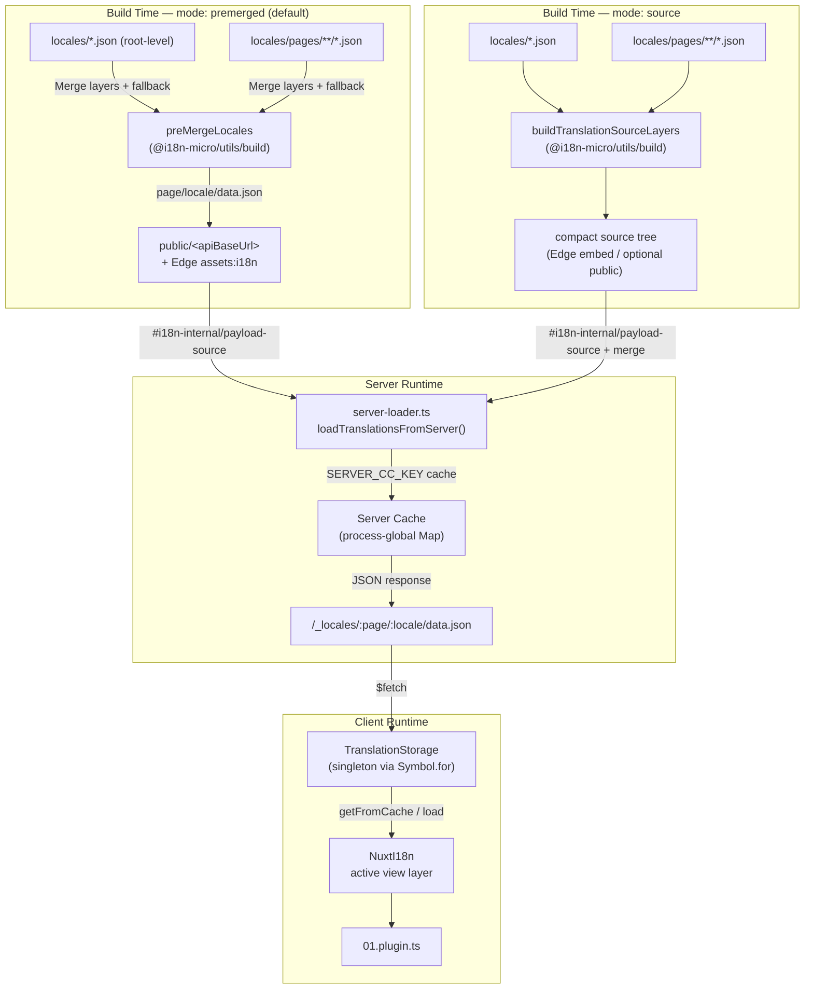

# 🗄️ Translation Cache & Storage Architecture

## 📖 Overview

Nuxt I18n Micro v3 uses a multi-layer caching architecture for translations. Payload loading depends on `translationPayloads.mode`:

* **`premerged`** (default) — root, page, fallback, and layer files are merged at build time via `@i18n-micro/utils/build` into `{page}/{locale}/data.json`
* **`source`** — compact source files are kept for runtime merge via `@i18n-micro/utils/source-loader` and `@i18n-micro/utils/merge-source` (Edge embeds them in Nitro `serverAssets`; Node reads them from `public/` when copied)

This page describes how the built-in cache works and how to extend it for custom use cases (admin tools, external APIs, cache invalidation).

## 📊 Architecture Overview

### Data Flow



## 🧱 Core Components

### 1. `TranslationStorage` (Client + Server)

**File**: `src/runtime/utils/storage.ts`

A singleton class that provides unified translation storage for both client and server. Uses `Symbol.for('__NUXT_I18N_STORAGE_CACHE__')` on `globalThis` to ensure only one instance exists, even when multiple bundles are loaded.

**Key methods:**

| Method                              | Description                                                            |
| ----------------------------------- | ---------------------------------------------------------------------- |
| `getFromCache(locale, routeName?)`  | Synchronous check: returns cached in-memory data, or `null`            |
| `load(locale, routeName?, options)` | Async load with caching: checks cache first, then fetches via `$fetch` |
| `clear()`                           | Clears the entire cache                                                |

**Cache key format**: `{locale}:{routeName}` (e.g., `en:index`, `fr:about`)

```typescript
import { translationStorage } from '../utils/storage'

// Synchronous cache check
const cached = translationStorage.getFromCache('en', 'index')

// Async load (with automatic caching)
const result = await translationStorage.load('en', 'index', {
  apiBaseUrl: '_locales',
  baseURL: '/',
  dateBuild: '2024-01-01',
})
// result.data — merged translations
// result.cacheKey — cache key used
```

### ⚙️ Deterministic Cache Busting (`i18n.dateBuild`)

By default, this module generates `dateBuild` during build time using `Date.now()`. It is then embedded into the generated `#build/i18n.strategy.mjs` and used as a query parameter (`?v=...`) to invalidate translation fetch caches after rebuilds.

If you need reproducible builds (for example, to improve chunk cache hit rates in rolling deployments), set a stable value in `nuxt.config`:

```ts
export default defineNuxtConfig({
  i18n: {
    // Any stable string/number (git SHA, CI build number, release tag, etc.)
    dateBuild: process.env.GIT_SHA ?? 'local-dev',
  },
})
```

### 2. `loadTranslationsFromServer()` (Server Only)

**File**: `src/runtime/server/utils/server-loader.ts`

Loads translations for a locale/page and caches the merged result in a process-global `CacheControl` map keyed by `@i18n-micro/hmr/cache-keys` (`SERVER_CC_KEY`).

Behavior: SSR loads from `#i18n-internal/payload-source` — **Node** `readFile` under `public/<apiBaseUrl>` (`{page}/{locale}/data.json` in premerged mode), **Edge** `assets:i18n`. `premerged` reads one file; `source` merges root/page/fallback via `@i18n-micro/utils/source-loader`.

```typescript
import { loadTranslationsFromServer } from '../server/utils/server-loader'

// Returns { data: Translations, json: string }
const { data, json } = await loadTranslationsFromServer('en', 'index')
```

### 3. Client load (no HTML embed)

Dictionaries are **not** written into `nuxtApp.payload`. The server keeps them in memory for SSR
render; the client plugin `await`s `switchContext`, which loads `/{apiBaseUrl}/:page/:locale/data.json`
(same default posture as `@nuxtjs/i18n` with `experimental.preload: false`).

`NuxtI18n` holds the active view-layer dictionary used by `$t()` and `$has()`. `NuxtTranslationLoader` switches locale/route context and merges chunks into that layer.

### 4. Server API Route

**Route**: `/_locales/{page}/{locale}/data.json`

**File**: `src/runtime/server/routes/i18n.ts`

This Nitro route serves merged translations for the active payload mode. It calls `loadTranslationsFromServer()` and returns the result as JSON.

In production it also sets:

```http
Cache-Control: public, max-age={httpCacheDuration}, immutable
```

Default `httpCacheDuration` is `31536000` (1 year). This is safe because clients request payloads with `?v={dateBuild}` cache-busting. Set `httpCacheDuration: 0` to omit the header. The header is not applied in development.

## 📥 Extending: Custom Translation Loading

### Read from cache (server route)

```ts
// server/api/i18n/load-cache.[post].ts
import { defineEventHandler, readBody } from 'h3'
import { loadTranslationsFromServer } from '#imports'

export default defineEventHandler(async (event) => {
  const { page, locale } = await readBody<{ page: string; locale: string }>(event)
  const { data } = await loadTranslationsFromServer(locale, page)
  return { locale, page, data }
})
```

### Update translations (file + invalidate cache)

```ts
// server/api/i18n/update.[post].ts
import { defineEventHandler, readBody, createError } from 'h3'
import { join } from 'node:path'
import { readFile, writeFile } from 'node:fs/promises'
import { deepMergeTranslations } from '@i18n-micro/utils/deep-merge'

export default defineEventHandler(async (event) => {
  const { path, updates } = await readBody<{ path: string; updates: Record<string, unknown> }>(event)

  if (!path || !updates) {
    throw createError({ statusCode: 400, statusMessage: 'Missing path or updates' })
  }

  const fullPath = join('locales', path)
  let existing: Record<string, unknown> = {}

  try {
    const content = await readFile(fullPath, 'utf-8')
    existing = JSON.parse(content) as Record<string, unknown>
  } catch {
    // File does not exist — create new
  }

  const merged = deepMergeTranslations(existing, updates)
  await writeFile(fullPath, JSON.stringify(merged, null, 2), 'utf-8')

  return { success: true, path, updated: merged }
})
```

::: tip
After updating translation files, the server cache is only invalidated on restart or new deployment (detected via `dateBuild`). In development, HMR (`hmr: true`) handles automatic cache invalidation when files change.
:::

## 🧹 Clearing Cache

### Programmatic cache clearing (client)

Use the built-in `$clearCache` method:

```vue
<script setup>
const { $clearCache } = useNuxtApp()

// Clears both TranslationStorage and plugin-level cache
$clearCache()
</script>
```

### Server cache behavior

The server-side cache (`loadTranslationsFromServer`) is process-global and persists until:

* The server process restarts
* A new deployment is detected (different `dateBuild` value)

For serverless environments, each cold start has a fresh cache.

## ⚙️ Serverless Configuration

For serverless environments (Cloudflare Workers, AWS Lambda), the built-in cache uses in-memory `Map` objects. No external storage configuration is needed for the translation cache itself.

However, Nitro storage for source translation files may need configuration:

```ts
export default defineNuxtConfig({
  nitro: {
    storage: {
      // Only needed if default file-system storage is unavailable
      'assets:server': {
        driver: 'cloudflare-kv-binding',
        binding: 'MY_KV_NAMESPACE',
      },
    },
  },
})
```

## 💡 Key Differences from v2

| Aspect           | v2                            | v3                                                                       |
| ---------------- | ----------------------------- | ------------------------------------------------------------------------ |
| Client cache     | `useStorage('cache')`         | `TranslationStorage` singleton (Symbol.for on globalThis)                |
| SSR transfer     | Runtime config                | Full chunks via `payload.data` (v3.0 used `useState`)                    |
| Server cache     | Nitro cache storage           | Process-global `Map` via `Symbol.for`                                    |
| Merge logic      | Client-side                   | Build-time (`premerged`) or runtime (`source`) via `@i18n-micro/utils/*` |
| Cache key format | `i18n:merged:{page}:{locale}` | `{locale}:{routeName}`                                                   |

## 📚 Related

* [Performance Guide](/guide/performance) — How caching impacts performance
* [Server-Side Translations](/guide/server-side-translations) — Using translations in server routes
* [Firebase Deployment](/guide/firebase) — Deployment-specific cache considerations
