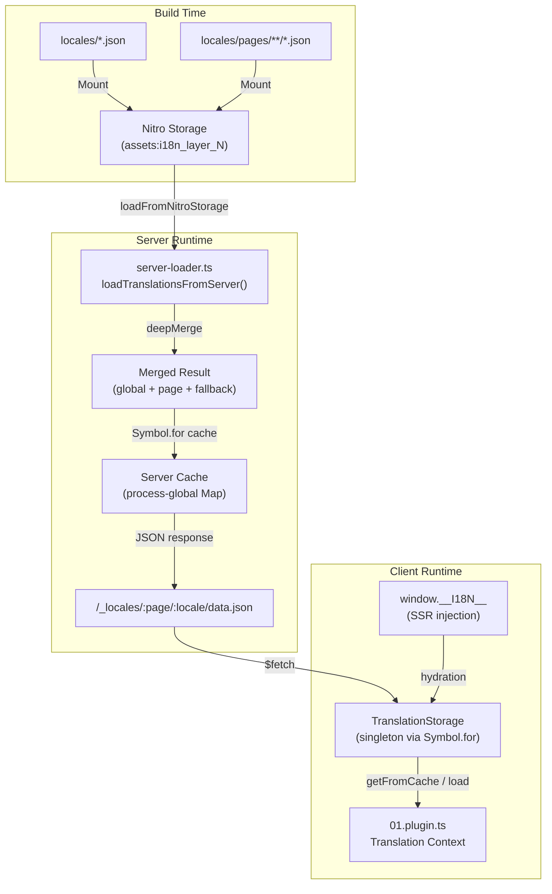

# 🗄️ Translation Cache & Storage Architecture

## 📖 Overview

Nuxt I18n Micro v3 uses a multi-layer caching architecture for translations. This page describes how the built-in cache works and how to extend it for custom use cases (admin tools, external APIs, cache invalidation).

## 📊 Architecture Overview

### Data Flow



## 🧱 Core Components

### 1. `TranslationStorage` (Client + Server)

**File**: `src/runtime/utils/storage.ts`

A singleton class that provides unified translation storage for both client and server. Uses `Symbol.for('__NUXT_I18N_STORAGE_CACHE__')` on `globalThis` to ensure only one instance exists, even when multiple bundles are loaded.

**Key methods:**

| Method | Description |
|--------|-------------|
| `getFromCache(locale, routeName?)` | Synchronous check: returns cached data or checks `window.__I18N__` (client) |
| `load(locale, routeName?, options)` | Async load with caching: checks cache first, then fetches via `$fetch` |
| `clear()` | Clears the entire cache |

**Cache key format**: `{locale}:{routeName}` (e.g., `en:index`, `fr:general`)

```typescript
import { translationStorage } from '../utils/storage'

// Synchronous cache check
const cached = translationStorage.getFromCache('en', 'index')

// Async load (with automatic caching)
const result = await translationStorage.load('en', 'index', {
  apiBaseUrl: '_locales',
  baseURL: '/',
  dateBuild: '2024-01-01'
})
// result.data — merged translations
// result.cacheKey — cache key used
// result.json — JSON string (server only, for client injection)
```

### 2. `loadTranslationsFromServer()` (Server Only)

**File**: `src/runtime/server/utils/server-loader.ts`

Loads translations from Nitro storage (read-only `assets:i18n_layer_N`), merges global + page-specific + fallback locale data, and caches the result in a process-global `Map` via `Symbol.for('__NUXT_I18N_SERVER_RESULT_CACHE__')`.

**Merge order** (last wins):
1. Global fallback locale translations (`locales/{fallbackLocale}.json`)
2. Per-locale fallback translations (if `locale.fallbackLocale` is set)
3. Target locale translations (`locales/{locale}.json`)
4. Page-specific translations for each of the above

```typescript
import { loadTranslationsFromServer } from '../server/utils/server-loader'

// Returns { data: Translations, json: string }
const { data, json } = await loadTranslationsFromServer('en', 'index')
```

### 3. SSR Injection (`window.__I18N__`)

During server-side rendering, the main plugin (`01.plugin.ts`) collects all loaded translations and injects them into the HTML as:

```html
<script>
window.__I18N__={};
window.__I18N__["en:index"]={...};
window.__I18N__["en:general"]={...};
</script>
```

On the client, `TranslationStorage.getFromCache()` checks `window.__I18N__` for SSR-injected data before making any fetch requests. This ensures **zero additional HTTP requests** on first page load.

### 4. Server API Route

**Route**: `/_locales/{page}/{locale}/data.json`

**File**: `src/runtime/server/routes/i18n.ts`

This Nitro route serves pre-merged translations. It calls `loadTranslationsFromServer()` and returns the result as JSON. Cache headers are controlled by `dateBuild` version parameter.

## 📥 Extending: Custom Translation Loading

### Read from cache (server route)

```ts
// server/api/i18n/load-cache.[post].ts
import { defineEventHandler, readBody } from 'h3'
import { loadTranslationsFromServer } from '#imports'

export default defineEventHandler(async (event) => {
  const { page, locale } = await readBody<{ page: string; locale: string }>(event)
  const { data } = await loadTranslationsFromServer(locale, page)
  return { locale, page, data }
})
```

### Update translations (file + invalidate cache)

```ts
// server/api/i18n/update.[post].ts
import { defineEventHandler, readBody, createError } from 'h3'
import { join } from 'node:path'
import { readFile, writeFile } from 'node:fs/promises'

function deepMerge(target: any, source: any): any {
  for (const key in source) {
    if (key === '__proto__' || key === 'constructor') continue
    if (Array.isArray(source[key])) {
      target[key] = source[key]
    } else if (typeof source[key] === 'object' && source[key]) {
      target[key] = deepMerge(target[key] || {}, source[key])
    } else {
      target[key] = source[key]
    }
  }
  return target
}

export default defineEventHandler(async (event) => {
  const { path, updates } = await readBody<{ path: string; updates: Record<string, any> }>(event)

  if (!path || !updates) {
    throw createError({ statusCode: 400, statusMessage: 'Missing path or updates' })
  }

  const fullPath = join('locales', path)
  let existing = {}

  try {
    const content = await readFile(fullPath, 'utf-8')
    existing = JSON.parse(content)
  } catch {
    // File does not exist — create new
  }

  const merged = deepMerge(existing, updates)
  await writeFile(fullPath, JSON.stringify(merged, null, 2), 'utf-8')

  return { success: true, path, updated: merged }
})
```

::: tip
After updating translation files, the server cache is only invalidated on restart or new deployment (detected via `dateBuild`). In development, HMR (`hmr: true`) handles automatic cache invalidation when files change.
:::

## 🧹 Clearing Cache

### Programmatic cache clearing (client)

Use the built-in `$clearCache` method:

```vue
<script setup>
const { $clearCache } = useNuxtApp()

// Clears both TranslationStorage and plugin-level cache
$clearCache()
</script>
```

### Server cache behavior

The server-side cache (`loadTranslationsFromServer`) is process-global and persists until:
- The server process restarts
- A new deployment is detected (different `dateBuild` value)

For serverless environments, each cold start has a fresh cache.

## ⚙️ Serverless Configuration

For serverless environments (Cloudflare Workers, AWS Lambda), the built-in cache uses in-memory `Map` objects. No external storage configuration is needed for the translation cache itself.

However, Nitro storage for source translation files may need configuration:

```ts
export default defineNuxtConfig({
  nitro: {
    storage: {
      // Only needed if default file-system storage is unavailable
      'assets:server': {
        driver: 'cloudflare-kv-binding',
        binding: 'MY_KV_NAMESPACE'
      }
    }
  }
})
```

## 💡 Key Differences from v2

| Aspect | v2 | v3 |
|--------|----|----|
| Client cache | `useStorage('cache')` | `TranslationStorage` singleton (Symbol.for on globalThis) |
| SSR transfer | Runtime config | `window.__I18N__` script injection |
| Server cache | Nitro cache storage | Process-global `Map` via `Symbol.for` |
| Merge logic | Client-side | Server-side (`loadTranslationsFromServer`) |
| Cache key format | `i18n:merged:{page}:{locale}` | `{locale}:{routeName}` |

## 📚 Related

- [Performance Guide](/guide/performance) — How caching impacts performance
- [Server-Side Translations](/guide/server-side-translations) — Using translations in server routes
- [Firebase Deployment](/guide/firebase) — Deployment-specific cache considerations
