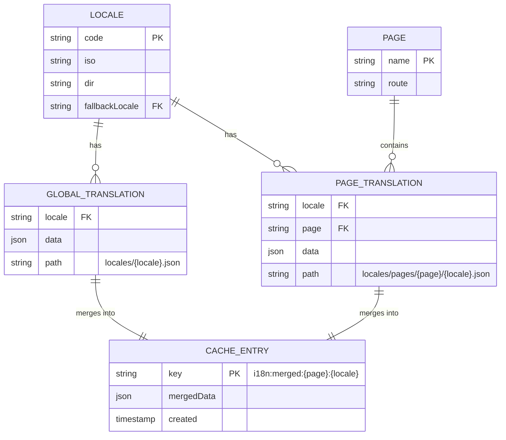
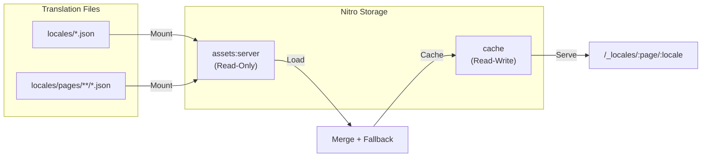

# Working with Translations and Cache

This guide is for developers who want to customize or extend how translations are loaded, stored, cached, and updated in the i18n system. All translation data is stored in JSON files, and server-side logic is used to manage them with cache support.

## 📊 Cache Architecture Overview

### Storage Relationships



### Data Flow



## 📦 Cache Structure

Translation cache is stored using `useStorage('cache')` (read-write storage), separate from the read-only `assets:server` storage where source translation files are mounted.

**Important**: For serverless environments (like Cloudflare Workers), you need to configure the `cache` storage in your `nuxt.config.ts`:

```ts
export default defineNuxtConfig({
  nitro: {
    storage: {
      // 'assets:server' is automatically configured by the module as read-only
      
      // Configure cache storage for read-write operations
      'cache': {
        driver: 'cloudflare-kv-binding',
        binding: 'MY_KV_NAMESPACE' // Your KV namespace binding name
      }
    }
  }
})
```

Each cache entry stores merged translations for a specific page and locale. The cache keys follow this pattern:

```
i18n:merged:{page}:{locale}
```

For example:
```
i18n:merged:home:en
i18n:merged:contact:ru
i18n:merged:general:fr
```

### Example of cached data:

```json
{
  "title": "Page Title",
  "description": "Localized description",
  "button": {
    "text": "Click me",
    "tooltip": "Click to continue"
  }
}
```

The structure is the same as the content of the JSON files.

## 📥 Load translation from cache

### Server route

```ts
// server/api/i18n/load-cache.[post].ts
import { defineEventHandler, readBody } from 'h3'
import { useStorage } from '#imports'

export default defineEventHandler(async (event) => {
  const { page, locale } = await readBody<{ page: string, locale: string }>(event)
  const cacheStorage = useStorage('cache')
  
  // Cache key format: i18n:merged:{page}:{locale}
  const cacheKey = `i18n:merged:${page}:${locale}`

  const data = await cacheStorage.getItem(cacheKey)
  return {
    from: 'cache',
    key: cacheKey,
    data
  }
})
```

### Example usage

```ts
await $fetch('/api/i18n/load-cache', {
  method: 'POST',
  body: {
    page: 'home',
    locale: 'en'
  }
})
```

## 📂 Load translation from file

### Server route

```ts
// server/api/i18n/load-file.[post].ts
import { defineEventHandler, readBody, createError } from 'h3'
import { readFile } from 'node:fs/promises'
import { join } from 'node:path'

export default defineEventHandler(async (event) => {
  const { path } = await readBody<{ path: string }>(event)

  try {
    const fileContent = await readFile(join('locales', path), 'utf-8')
    return {
      from: 'file',
      path,
      data: JSON.parse(fileContent)
    }
  } catch (err) {
    throw createError({
      statusCode: 404,
      statusMessage: `File not found: ${path}`
    })
  }
})
```

### Example usage

```ts
await $fetch('/api/i18n/load-file', {
  method: 'POST',
  body: {
    path: 'pages/home/en.json'
  }
})
```

## 🛠 Update translations (file + cache)

### Server route

```ts
// server/api/i18n/update.[post].ts
import { defineEventHandler, readBody, createError } from 'h3'
import { join } from 'node:path'
import { readFile, writeFile } from 'node:fs/promises'
import { useStorage } from '#imports'

function deepMerge(target: any, source: any): any {
  for (const key in source) {
    if (key === '__proto__' || key === 'constructor') continue
    if (Array.isArray(source[key])) {
      target[key] = source[key]
    } else if (typeof source[key] === 'object' && source[key]) {
      target[key] = deepMerge(target[key] || {}, source[key])
    } else {
      target[key] = source[key]
    }
  }
  return target
}

export default defineEventHandler(async (event) => {
  const { path, updates } = await readBody<{ path: string, updates: Record<string, any> }>(event)

  if (!path || !updates) {
    throw createError({ statusCode: 400, statusMessage: 'Missing path or updates' })
  }

  const fullPath = join('locales', path)
  let existing = {}

  try {
    const content = await readFile(fullPath, 'utf-8')
    existing = JSON.parse(content)
  } catch {
    // File does not exist — create new
  }

  const merged = deepMerge(existing, updates)

  await writeFile(fullPath, JSON.stringify(merged, null, 2), 'utf-8')

  // Invalidate cache for affected pages/locales
  // Note: The actual cache is managed by the i18n module's /_locales/{page}/{locale} route
  // This example shows how you might clear specific cache entries after updating files
  const cacheStorage = useStorage('cache')
  
  // Extract page name and locale from path (e.g., 'pages/home/en.json' -> page: 'home', locale: 'en')
  const pathMatch = path.match(/^pages\/([^/]+)\/(.+)\.json$/)
  if (pathMatch) {
    const [, pageName, locale] = pathMatch
    const cacheKey = `i18n:merged:${pageName}:${locale}`
    await cacheStorage.removeItem(cacheKey)
  } else {
    // Global translation file changed - clear all caches for this locale
    const localeMatch = path.match(/^(.+)\.json$/)
    if (localeMatch) {
      const locale = localeMatch[1]
      const allKeys = await cacheStorage.getKeys('i18n:merged:')
      const keysToRemove = allKeys.filter((key: string) => key.endsWith(`:${locale}`))
      await Promise.all(keysToRemove.map((key: string) => cacheStorage.removeItem(key)))
    }
  }

  return {
    success: true,
    path,
    updated: merged
  }
})
```

### Example usage

```ts
await $fetch('/api/i18n/update', {
  method: 'POST',
  body: {
    path: 'pages/home/en.json',
    updates: {
      header: 'New header',
      footer: {
        text: 'Updated Footer'
      }
    }
  }
})
```

## 🧪 Optional Extensions

### Delete translation keys

You can allow deleting keys by checking for a `__delete` array in the request:

```ts
if ('__delete' in body) {
  const keysToDelete = body.__delete
  for (const key of keysToDelete) {
    delete existing[key]
  }
}
```

### Replace arrays instead of merging

If you don’t want to merge arrays and just replace them:

```ts
if (Array.isArray(source[key])) {
  target[key] = [...source[key]]
}
```

## 💡 Tips for Developers

- **Cache storage is separate from assets storage**: Source translation files are read-only in `assets:server`, while merged translations cache is stored in `cache` storage (read-write).
- **Cache keys format**: `i18n:merged:{page}:{locale}` (e.g., `i18n:merged:home:en`)
- **Serverless configuration**: Always configure `nitro.storage.cache` for serverless environments (Cloudflare KV, AWS DynamoDB, etc.)
- Cached data contains merged translations (global + page-specific + fallbacks) for optimal performance.
- If you are building a translation editor, combine `load-cache` and `update` for read/write access.
- You can extract helpers like `deepMerge()` or key/path generators into a separate utility file.

## 🧹 Clearing All Server Cache

The i18n system uses `useStorage('cache')` to store merged translations cache. This cache is automatically populated when translations are loaded and cleared when a new build is detected (via `dateBuild` version check).

If you need to reset this cache (e.g. after editing translation files), you can call the `clearCache` method.

### 🔁 Example: programmatic cache clearing from the client

You can create a simple internal page that clears the cache when opened:

```vue
<template>
  <div class="container">
    <p>Clearing translation cache...</p>
  </div>
</template>

<script setup>
import { useNuxtApp } from '#imports'

const { $clearCache } = useNuxtApp()

$clearCache()
</script>
```

You can use this page manually, call it after deployment, or trigger it from an admin panel.

---

You now have full control over reading, updating and caching translations in your i18n system. You can adjust these routes to fit your needs, build admin tools, or integrate external translation APIs.
