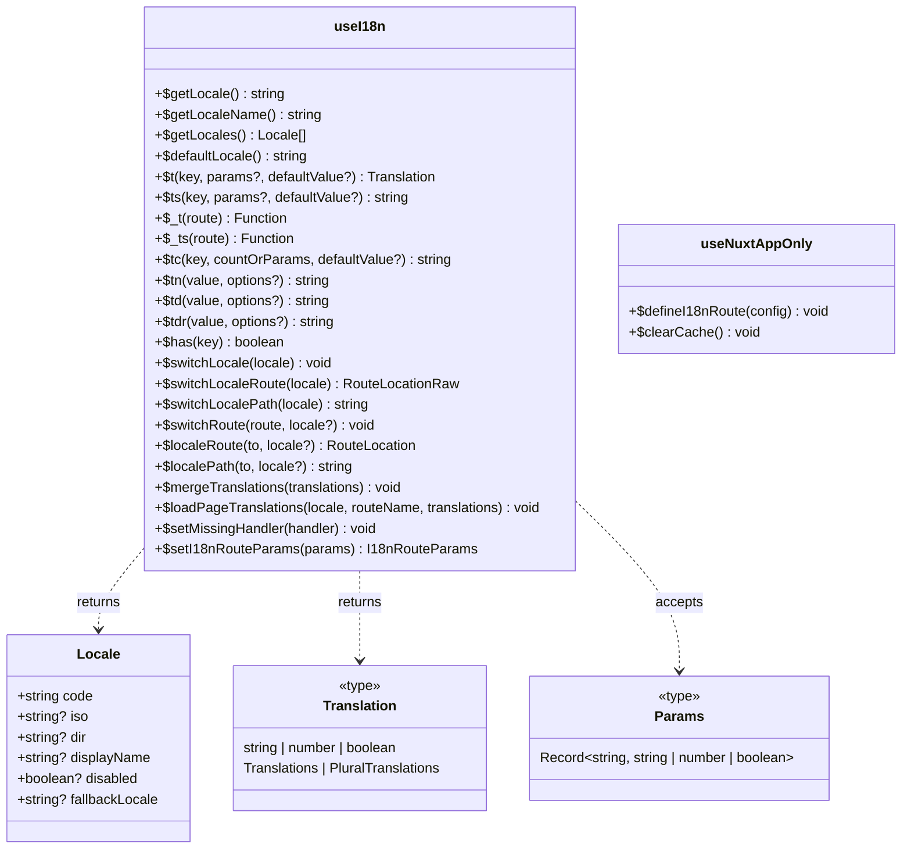

# 🛠️ Methods

This page documents all available methods provided by nuxt-i18n-micro. Methods are organized by functionality for easier navigation.

## 📊 API Overview



::: info `useNuxtApp()`-only injections
`$defineI18nRoute` and `$clearCache` are provided by the main i18n plugin on `useNuxtApp()` but are **not** returned by the `useI18n()` composable. See sections below.
:::


## 🌍 Locale Management

Methods for getting and managing locale information.

### `$getLocale`

- **Type**: `() => string`
- **Description**: Returns the current locale code.

```typescript
const locale = $getLocale()
// Output: 'en' (assuming the current locale is English)
```

### `$getLocaleName`

- **Type**: `() => string | null`
- **Description**: Returns the current locale name from displayName config.

```typescript
const locale = $getLocaleName()
// Output: 'English'
```

### `$getLocales`

- **Type**: `() => Array<{ code: string; iso?: string; dir?: string }>`
- **Description**: Returns an array of all available locales configured in the module.

```typescript
const locales = $getLocales()
// Output: [{ code: 'en', iso: 'en-US', dir: 'ltr' }, { code: 'fr', iso: 'fr-FR', dir: 'ltr' }]
```

### `$defaultLocale`

- **Type**: `() => string`
- **Description**: Returns the default locale code from configuration.

```typescript
const defaultLocale = $defaultLocale()
// Output: 'en'
```

## 🔍 Translation Methods

Core methods for retrieving and managing translations.

### `$t`

- **Type**: `(key: string, params?: Record<string, any>, defaultValue?: string) => CleanTranslation`
- **Description**: Fetches a translation for the given key. Optionally interpolates parameters.

**Parameters**:
- **key**: `string` — The translation key
- **params**: `Record<string, any> | undefined` — Optional. A record of key-value pairs to interpolate into the translation
- **defaultValue**: `string | undefined` — Optional. The default value to return if the translation is not found
- **route**: `RouteLocationNormalizedLoaded | undefined` — Optional. The route from which to determine the locale and resolve the translation context

```typescript
const welcomeMessage = $t('welcome', { username: 'Alice', unreadCount: 5 })
// Output: "Welcome, Alice! You have 5 unread messages."
```

::: warning Return type includes objects
`$t` returns `CleanTranslation` which is `string | number | boolean | Translations | PluralTranslations | null`. If the key points to a **nested object** in your JSON (e.g. `$t('header')` when the JSON contains `{ "header": { "title": "Hi" } }`), the return value will be that **object**, not a string. Using it directly in a Vue template (<code v-pre>{{ $t('header') }}</code>) will render as `[object Object]`.

**How to avoid this:**
- Use a more specific key: `$t('header.title')` → `"Hi"`
- Use `$ts()` which always returns a string (calls `.toString()` on non-strings)
- Use `$t` with a nested key to intentionally access sub-objects for programmatic use
:::

### `$ts`

- **Type**: `(key: string, params?: Record<string, any>, defaultValue?: string) => string`
- **Description**: A **string-safe** variant of `$t` that always returns a `string`. If the resolved value is not a string (e.g. an object or number), it is converted via `.toString()`. **Use `$ts` in templates** when you are not 100% sure the key resolves to a string.

**Parameters**:
- **key**: `string` — The translation key
- **params**: `Record<string, any> | undefined` — Optional. A record of key-value pairs to interpolate into the translation
- **defaultValue**: `string | undefined` — Optional. The default value to return if the translation is not found
- **route**: `RouteLocationNormalizedLoaded | undefined` — Optional. The route from which to determine the locale and resolve the translation context

```typescript
const welcomeMessage = $ts('welcome', { username: 'Alice', unreadCount: 5 })
// Output: "Welcome, Alice! You have 5 unread messages."
```

### `$_t` and `$_ts`

Route-bound variants of `$t` and `$ts`. They take a **route** first and return a translation function locked to that route's locale and page context.

- **Type**: `(route: RouteLocationNormalizedLoaded) => (key, params?, defaultValue?) => …`
- **Access**: `useNuxtApp()` (also re-exported by `useI18n()` as `$_t` / `$_ts`)

Use these when the active route during SSR or transitions differs from `router.currentRoute` — for example inside `<i18n-t>`, `<i18n-group>`, or when rendering content for a specific `route` object.

```typescript
import { useRoute, useNuxtApp } from '#imports'

const route = useRoute()
const { $_t, $_ts } = useNuxtApp()

const $t = $_t(route)
const title = $t('page.title')

// String-safe variant
const label = $_ts(route)('page.label')
```

::: tip
Prefer `$t` / `$ts` in most components. Reach for `$_t` / `$_ts` when you already have an explicit route and need translations for **that** route, not the currently active one.
:::

### `$tc`

- **Type**: `(key: string, countOrParams: number | Params, defaultValue?: string) => string`
- **Description**: Fetches a pluralized translation for the given key based on `count`. Extra placeholders use the same `Params` object as `$t`. Internally calls the `plural` function configured in `nuxt.config.ts` (see [Configuration → plural](/guide/configuration#plural)).

**Parameters**:
- **key**: `string` — The translation key whose value contains `|`-separated plural forms
- **countOrParams**: `number` **or** `Params` — Either the count alone, or an object with **`count`** plus any other interpolation values (e.g. `{ count: 10, name: 'Alice' }`)
- **defaultValue**: `string | undefined` — Optional fallback if the translation is not found (third argument only — not for extra params)

**Translation format**: forms separated by `|`. Put placeholders in **each** form:

```json
{
  "apples": "no apples | one apple | {count} apples",
  "cart": "no items for {name} | one item for {name} | {count} items for {name}"
}
```

```typescript
$tc('apples', 0)  // "no apples"
$tc('apples', 1)  // "one apple"
$tc('apples', 10) // "10 apples"

// count + other params (second argument must be an object)
$tc('cart', { count: 10, name: 'Alice' }) // "10 items for Alice"
```

::: warning
Do not pass extra params as a third argument — `$tc('cart', 10, { name: 'Alice' })` treats `{ name: 'Alice' }` as `defaultValue`, not interpolation params.
:::

**Component alternative** — `<i18n-t keypath="cart" :plural="count" :params="{ name }" />` (merges `count` with `params` internally).

::: tip
The form selection logic depends on the `plural` function in your config. The default selects by index (0 → first form, 1 → second, etc.). For languages like Russian, Arabic, or Polish, configure a custom `plural` function. See [Configuration → plural](/guide/configuration#plural).
:::

### `$mergeTranslations`

- **Type**: `(newTranslations: Record<string, string>) => void`
- **Description**: Merges new translations into the existing translation cache for the current route and locale.

**Parameters**:
- **newTranslations**: `Record<string, string>` — The new translations to merge

```typescript
$mergeTranslations({
  welcome: 'Bienvenue, {username}!'
})
// Output: Updates the translation cache with the new French translation
```

### `$setMissingHandler`

- **Type**: `(handler: MissingHandler | null) => void`
- **Description**: Sets a custom handler function that will be called when a translation key is not found. This is useful for logging missing translations to error tracking services like Sentry.

**Parameters**:
- **handler**: `MissingHandler | null` — A function that receives `(locale: string, key: string, routeName: string)` or `null` to remove the handler

**Type Definition**:
```typescript
type MissingHandler = (
  locale: string,
  key: string,
  routeName: string,
  instance?: unknown,
  type?: string
) => void
```

```typescript
// Set a custom handler
$setMissingHandler((locale, key, routeName) => {
  console.error(`Missing translation: ${key} in ${locale} for route ${routeName}`)
  // Send to Sentry or other error tracking service
  // Sentry.captureMessage(`Missing translation: ${key}`)
})

// Remove the handler
$setMissingHandler(null)
```

**Use Cases**:
- Logging missing translations to error tracking services (Sentry, LogRocket, etc.)
- Collecting analytics on missing translations
- Custom error handling for missing translation keys

## 🔢 Number & Date Formatting

Methods for formatting numbers and dates according to locale conventions.

### `$tn`

- **Type**: `(value: number | string, options?: Intl.NumberFormatOptions) => string`
- **Description**: Formats a number according to the current locale using `Intl.NumberFormat`.

**Parameters**:
- **value**: `number | string` — The number to format
- **options**: `Intl.NumberFormatOptions | undefined` — Optional. `Intl.NumberFormatOptions` to customize the formatting

```typescript
const formattedNumber = $tn(1234567.89, { style: 'currency', currency: 'USD' })
// Output: "$1,234,567.89" in the 'en-US' locale
```

**Use Cases**:
- Formatting numbers as currency, percentages, or decimals in the appropriate locale format
- Customizing the number format using `Intl.NumberFormatOptions` such as currency, minimum fraction digits, etc.

### `$td`

- **Type**: `(value: Date | number | string, options?: Intl.DateTimeFormatOptions) => string`
- **Description**: Formats a date according to the current locale using `Intl.DateTimeFormat`.

**Parameters**:
- **value**: `Date | number | string` — The date to format
- **options**: `Intl.DateTimeFormatOptions | undefined` — Optional. `Intl.DateTimeFormatOptions` to customize the formatting

```typescript
const formattedDate = $td(new Date(), { weekday: 'long', year: 'numeric', month: 'long', day: 'numeric' })
// Output: "Friday, September 1, 2023" in the 'en-US' locale
```

**Use Cases**:
- Displaying dates in a format that aligns with the user's locale
- Customizing date output using options like weekday names, time formats, and timezone settings

### `$tdr`

- **Type**: `(value: Date | number | string, options?: Intl.RelativeTimeFormatOptions) => string`
- **Description**: Formats a date as a relative time (e.g., "5 minutes ago") according to the current locale using `Intl.RelativeTimeFormat`.

**Parameters**:
- **value**: `Date | number | string` — The date to compare against the current time
- **options**: `Intl.RelativeTimeFormatOptions | undefined` — Optional. `Intl.RelativeTimeFormatOptions` to customize the relative time formatting

```typescript
const relativeDate = $tdr(new Date(Date.now() - 1000 * 60 * 5))
// Output: "5 minutes ago" in the 'en-US' locale
```

## 🔄 Route & Locale Switching

Methods for switching between locales and routes.

### `$switchLocale`

- **Type**: `(locale: string) => void`
- **Description**: Switches to the given locale and redirects the user to the appropriate localized route.

**Parameters**:
- **locale**: `string` — The locale to switch to

```typescript
$switchLocale('fr')
// Output: Redirects the user to the French version of the route
```

### `$switchLocaleRoute`

- **Type**: `(locale: string) => RouteLocationRaw`
- **Description**: Return current route with the given locale

**Parameters**:
- **locale**: `string` — Target locale

```typescript
// on /en/news
const routeFr = $switchLocaleRoute('fr')
// Output: A route object with the new locale applied, e.g., { name: 'localized-news', params: { locale: 'fr' } }
```

### `$switchLocalePath`

- **Type**: `(locale: string) => string`
- **Description**: Return url of current route with the given locale

**Parameters**:
- **locale**: `string` — Target locale

```typescript
// on /en/news
const routeFr = $switchLocalePath('fr')
window.location.href = routeFr
// Output: url with new locale applied, e.g., '/fr/nouvelles'
```

### `$switchRoute`

- **Type**: `(route: RouteLocationNormalizedLoaded | RouteLocationResolvedGeneric | string, toLocale?: string) => void`
- **Description**: Switches the route to a new specified destination and changes the locale if needed, redirecting the user to the appropriate localized route.

**Parameters**:
- **route**: `RouteLocationNormalizedLoaded | RouteLocationResolvedGeneric | string` — The route to which you want to switch
- **toLocale** (optional): `string` — The locale to switch to for the target route

**Examples**:

::: code-group

```typescript [String Path]
// Switches to the given path with the current locale
$switchRoute('/about')
```

```typescript [String Path with Locale]
// Switches to the given path with French locale
$switchRoute('/about', 'fr')
```

```typescript [Named Route]
// Switches to a named route with the current locale
$switchRoute({ name: 'page' })
```

```typescript [Named Route with Locale]
// Switches to a named route and changes the locale to Spanish
$switchRoute({ name: 'page' }, 'es')
```

:::

## 🌐 Route Generation

Methods for generating localized routes and paths.

### `$localeRoute`

- **Type**: `(to: RouteLocationRaw, locale?: string) => RouteLocationResolved`
- **Description**: Generates a localized route object based on the target route.

**Parameters**:
- **to**: `RouteLocationRaw` — The target route object
- **locale**: `string | undefined` — Optional. The locale for the generated route

```typescript
const localizedRoute = $localeRoute({ name: 'index' })
// Output: A route object with the current locale applied, e.g., { name: 'index', params: { locale: 'fr' } }
```

### `$localePath`

- **Type**: `(to: RouteLocationRaw, locale?: string) => string`
- **Description**: Return url based on the target route

**Parameters**:
- **to**: `RouteLocationRaw` — The target route object
- **locale**: `string | undefined` — Optional. The locale for the generated route

```typescript
const localizedPath = $localePath({ name: 'news' })
// Output: path with current (or specified) locale applied, e.g., '/en/nouvelles'
```

## 🔍 Route Information

Methods for getting route information and names.

### `$getRouteName`

- **Type**: `(route?: RouteLocationNormalizedLoaded | RouteLocationResolvedGeneric, locale?: string) => string`
- **Description**: Retrieves the base route name without any locale-specific prefixes or suffixes.

**Parameters**:
- **route**: `RouteLocationNormalizedLoaded | RouteLocationResolvedGeneric | undefined` — Optional. The route object from which to extract the name
- **locale**: `string | undefined` — Optional. The locale code to consider when extracting the route name

```typescript
const routeName = $getRouteName(routeObject, 'fr')
// Output: 'index' (assuming the base route name is 'index')
```

## 🚦 Route Configuration

Methods for configuring route behavior and access control.

### `$defineI18nRoute`

- **Type**: `(routeDefinition: DefineI18nRouteConfig) => void`
- **Description**: Defines route behavior based on the current locale. Controls access to routes, provides translations, and sets custom routes for different locales.

> [!IMPORTANT]
> `$defineI18nRoute` is provided by the **define plugin** and is available on `useNuxtApp()` only — it is **not** part of the `useI18n()` return object.
> Always destructure it from `useNuxtApp()` inside `script setup`. Calling `$defineI18nRoute(...)` as a bare global throws `"$defineI18nRoute is not defined"` during SSR/prerender.

**Parameters**:
- **locales**: `string[] | Record<string, Record<string, string>>` — Available locales for the route
- **localeRoutes**: `Record<string, string>` — Optional. Custom routes for specific locales
- **disableMeta**: `boolean | string[]` — Optional. Disables i18n meta tags for all or specific locales

**Basic Example**:
```typescript
import { useNuxtApp } from "#imports";

const { $defineI18nRoute } = useNuxtApp();

$defineI18nRoute({
  locales: ['en', 'fr', 'de'],
  localeRoutes: {
    en: '/welcome',
    fr: '/bienvenue',
    de: '/willkommen'
  },
  disableMeta: false
})
```

> 📖 **For detailed usage examples, configuration formats, and best practices, see the [Per-Component Translations Guide](/guide/per-component-translations.md).**

### `$setI18nRouteParams`

- **Type**: `(value: Record<LocaleCode, Record<string, string>> | null) => Record<LocaleCode, Record<string, string>> | null`
- **Description**: Set localized versions of params for all switchLocale* methods and returns passed value. MUST be called inside useAsyncData

**Parameters**:
- **value**: `Record<LocaleCode, Record<string, string>> | null` — params of current route for other locale

```typescript
// in pages/news/[id].vue
// for en/news/1-first-article
const { $switchLocaleRoute, $setI18nRouteParams, $defineI18nRoute } = useNuxtApp()
$defineI18nRoute({
  localeRoutes: {
    en: '/news/:id()',
    fr: '/nouvelles/:id()',
    de: '/Nachricht/:id()',
  },
})
const { data: news } = await useAsyncData(`news-${params.id}`, async () => {
  let response = await $fetch("/api/getNews", {
    query: {
      id: params.id,
    },
  });
  if (response?.localeSlugs) {
    response.localeSlugs = {
      en: {
        id: '1-first-article'
      }
      fr: {
        id: '1-premier-article'
      }
      de: {
        id: '1-erster-Artikel'
      }
    }
    $setI18nRouteParams(response?.localeSlugs);
  }
  return response;
});
$switchLocalePath('fr') // === 'fr/nouvelles/1-premier-article'
$switchLocalePath('de') // === 'de/Nachricht/1-erster-Artikel'
```

## 💻 Usage Examples

### Basic Component Usage

```vue
<template>
  <div>
    <p>{{ $t('key2.key2.key2.key2.key2') }}</p>
    <p>Current Locale: {{ $getLocale() }}</p>

    <div>
      {{ $t('welcome', { username: 'Alice', unreadCount: 5 }) }}
    </div>
    <div>
      {{ $tc('apples', 10) }}
    </div>

    <div>
        <button
        v-for="locale in $getLocales()"
        :key="locale.code"
        :disabled="locale.code === $getLocale()"
        @click="() => $switchLocale(locale.code)"
      >
        Switch to {{ locale.code }}
      </button>
    </div>

    <div>
      <NuxtLink :to="$localeRoute({ name: 'index' })">
        Go to Index
      </NuxtLink>
    </div>
  </div>
</template>

<script setup>
import { useI18n } from '#imports'

const { $getLocale, $switchLocale, $getLocales, $localeRoute, $t, $tc } = useI18n()
</script>
```

### Using with useNuxtApp

```typescript
import { useNuxtApp } from '#imports'

const { $getLocale, $switchLocale, $getLocales, $localeRoute, $t } = useNuxtApp()
```

### Using with useI18n Composable

```typescript
import { useI18n } from '#imports'

const { $getLocale, $switchLocale, $getLocales, $localeRoute, $t } = useI18n()
// or
const i18n = useI18n()
```

## 🔧 Cache & Utility Methods

### `$has`

- **Type**: `(key: string) => boolean`
- **Description**: Checks whether a translation key exists in the **active merged dictionary** for the current locale and route (top-level keys and dot paths).

During same-locale page transitions, v3 automatically deep-merges translations from the leaving page into this dictionary until the transition finishes — so keys from the previous page may still return `true` briefly. There is no `previousPageFallback` option; this behavior is built in. See [FAQ — page transitions](/guide/faq#-why-do-translations-break-during-page-transitions-especially-with-defineasynccomponent).

```typescript
if ($has('welcome')) {
  console.log($t('welcome'))
} else {
  console.log('Key not found')
}
```

### `$clearCache`

- **Type**: `() => void`
- **Description**: Clears the in-memory `TranslationStorage` cache, plugin-level loaded chunks, and reactive translation context. The next render re-loads translations from payloads or the network.

**Access**: `useNuxtApp().$clearCache` — exposed at runtime by the main i18n plugin but **not** included in the `PluginsInjections` TypeScript interface or the `useI18n()` helper object. Use a type assertion if needed:

```typescript
const { $clearCache } = useNuxtApp()
// All cached translations are removed; next render will re-fetch them
$clearCache()
```

### `$loadPageTranslations`

- **Type**: `(locale: string, routeName: string, translations: Record<string, string>) => Promise<void>`
- **Description**: Manually loads translations for a specific locale and route into the cache. Triggers a re-render if the loaded translations match the current context.

```typescript
await $loadPageTranslations('en', 'about', {
  title: 'About Us',
  description: 'Learn more about our company'
})
```

## 🧭 `useI18nLocale` Composable

The centralized composable for locale state management. Use this instead of directly manipulating `useState('i18n-locale')` or `useCookie('user-locale')`.

```typescript
const {
  setLocale,              // (locale: string) => void — updates state + cookie
  getLocale,              // () => string | null — from state or cookie
  getPreferredLocale,     // () => string | null — validated against locales list
  getEffectiveLocale,     // (route, getLocaleFromRoute) => string
  resolveInitialLocale,   // (options) => string
  isValidLocale,          // (locale) => boolean
  locale,                 // Ref<string | null> — reactive state
  localeCookie,           // CookieRef — reactive cookie
  syncLocale,             // (locale) => void — sync to cookie only
  validLocales,           // string[] — list of valid locale codes
} = useI18nLocale()
```

### Key Methods

| Method | Description |
|--------|-------------|
| `setLocale(locale)` | Sets locale in both `useState` and cookie atomically |
| `getLocale()` | Returns current locale from state or cookie |
| `getPreferredLocale()` | Returns locale validated against `locales` list, or `null` |
| `isValidLocale(locale)` | Checks if a locale code is in the configured `locales` list |

### Usage in Custom Plugins

```typescript
// plugins/i18n-loader.server.ts
export default defineNuxtPlugin({
  name: 'i18n-custom-loader',
  enforce: 'pre',
  order: -10,
  setup() {
    const { setLocale } = useI18nLocale()
    // Detect locale from headers, domain, etc.
    setLocale('de')
  }
})
```

See [Custom Language Detection](/guide/custom-auto-detect) for detailed examples.
