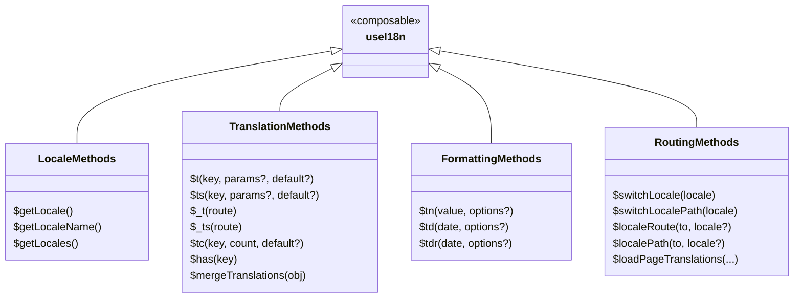

# 🛠️ `useI18n` Composable

The `useI18n` composable in `Nuxt I18n Micro` provides access to most runtime i18n helpers in components and scripts. Methods are available **with and without the `$` prefix** (for example `$t` and `t`).

Some injections — `$defineI18nRoute` and `$clearCache` — are available on `useNuxtApp()` only. See [Methods — `$defineI18nRoute`](/api/methods#definei18nroute) and [`$clearCache`](/api/methods#clearcache).

## 📊 Methods Overview



## ⚙️ Return Values

The `useI18n` composable returns an object containing several key methods and properties for managing internationalization:

### `$getLocale`

- **Type**: `() => string`
- **Description**: Returns the current locale of the application.
- **Example**:
  ```js
  const { $getLocale } = useI18n()
  const locale = $getLocale()
  console.log(locale) // e.g., 'en'
  ```

## 🌍 `$getLocaleName`

- **Type**: `() => string | null`
- **Description**: Returns the current locale name from displayName config.
- **Example**:

```typescript
const locale = $getLocaleName()
// Output: 'English'
```

### `$getLocales`

- **Type**: `() => Locale[]`
- **Description**: Returns an array of all available locales in the application.
- **Example**:
  ```js
  const { $getLocales } = useI18n()
  const locales = $getLocales()
  console.log(locales) // e.g., [{ code: 'en', iso: 'en-US' }, { code: 'fr', iso: 'fr-FR' }]
  ```

### `$t`

- **Type**: `<T extends Record<string, string | number | boolean>>(key: string, params?: T, defaultValue?: string) => string | number | boolean | Translations | PluralTranslations | null`
- **Description**: Translates a given key to the corresponding localized string, optionally replacing placeholders with provided parameters and falling back to a default value if the key is not found.
- **Example**:
  ```js
  const { $t } = useI18n()
  const greeting = $t('hello', { name: 'John' }, 'Hello!')
  console.log(greeting) // e.g., 'Hello, John'
  ```

### `$tc`

- **Type**: `(key: string, countOrParams: number | Params, defaultValue?: string) => string`
- **Description**: Pluralized translation. Pass a number, or a `Params` object with **`count`** and other placeholders (same as `$t`).
- **Example**:
  ```js
  const { $tc } = useI18n()
  $tc('apples', 3)
  $tc('cart', { count: 3, name: 'Alice' }) // not $tc('cart', 3, { name: 'Alice' })
  ```

### `$ts`

- **Type**: `(key: string, params?: Record<string, unknown>, defaultValue?: string) => string`
- **Description**: String-safe variant of `$t` — always returns a string (use in templates when the key might resolve to a non-string value).
- **Example**:
  ```js
  const { $ts } = useI18n()
  const label = $ts('page.title')
  ```

### `$_t` and `$_ts`

Route-bound variants of `$t` and `$ts`. Pass a route object first; the returned function uses that route's locale and page context.

- **Type**: `(route) => (key, params?, defaultValue?) => …`
- **Use when**: SSR, transitions, or components like `<i18n-t>` where `router.currentRoute` is not the route you need.

```typescript
import { useRoute, useI18n } from '#imports'

const route = useRoute()
const { $_t, $_ts } = useI18n()

const $t = $_t(route)
const title = $t('page.title')
const label = $_ts(route)('page.label')
```

### `$has`

- **Type**: `(key: string) => boolean`
- **Description**: Checks whether a key exists in the active merged dictionary for the current locale and route. During same-locale transitions, keys from the previous page may still match until the transition animation completes (automatic v3 behavior — not a configurable option).
- **Example**:
  ```js
  const { $has } = useI18n()
  const exists = $has('hello')
  console.log(exists) // e.g., true
  ```

### `$mergeTranslations`

- **Type**: `(newTranslations: Translations) => void`
- **Description**: Merges additional translations into the existing ones for the current locale.
- **Example**:
  ```js
  const { $mergeTranslations } = useI18n()
  $mergeTranslations({
    hello: 'Hello World',
  })
  ```

### `$switchLocale`

- **Type**: `(locale: string) => void`
- **Description**: Switches the application's locale to the specified locale.
- **Example**:
  ```js
  const { $switchLocale } = useI18n()
  $switchLocale('fr')
  ```

### `$localeRoute`

- **Type**: `(to: RouteLocationRaw, locale?: string) => RouteLocationRaw`
- **Description**: Generates a localized route based on the specified route and optionally the specified locale.
- **Example**:
  ```js
  const { $localeRoute } = useI18n()
  const route = $localeRoute('/about', 'fr')
  ```

### `$loadPageTranslations`

- **Type**: `(locale: string, routeName: string, translations: Record<string, string>) => Promise<void>`
- **Description**: Manually loads translations for a specific locale and route into the cache. Triggers a re-render when the loaded context matches the active page.
- **Example**:
  ```js
  const { $loadPageTranslations } = useI18n()
  await $loadPageTranslations('en', 'about', {
    title: 'About Us',
    description: 'Learn more about our company',
  })
  ```

### `$setMissingHandler`

- **Type**: `(handler: MissingHandler | null) => void`
- **Description**: Sets a custom handler function that will be called when a translation key is not found. This is useful for logging missing translations to error tracking services like Sentry.
- **Parameters**:
  - `handler`: A function that receives `(locale: string, key: string, routeName: string)` or `null` to remove the handler
- **Example**:
  ```js
  const { $setMissingHandler } = useI18n()
  
  // Set a custom handler
  $setMissingHandler((locale, key, routeName) => {
    console.error(`Missing translation: ${key} in ${locale} for route ${routeName}`)
    // Send to Sentry or other error tracking service
    // Sentry.captureMessage(`Missing translation: ${key}`)
  })
  
  // Remove the handler
  $setMissingHandler(null)
  ```

## `useNuxtApp()`-only APIs

These are **not** returned by `useI18n()`. Import them from `useNuxtApp()`:

| Method | Purpose |
|--------|---------|
| `$defineI18nRoute(config)` | Per-page locale routes, restrictions, and inline translations in `script setup` |
| `$clearCache()` | Clears in-memory translation cache and loaded chunks |

```typescript
import { useNuxtApp } from '#imports'

const { $defineI18nRoute, $clearCache } = useNuxtApp()

$defineI18nRoute({
  locales: ['en', 'fr'],
  localeRoutes: { en: '/about', fr: '/a-propos' },
})
```

See [Methods](/api/methods) for full signatures and examples.

## 🛠️ Example Usages

### Basic Locale Retrieval

Retrieve the current locale of the application.

```js
const { $getLocale } = useI18n()
const locale = $getLocale()
```

### Translation with Parameters

Translate a string with dynamic parameters, with a fallback default value.

```js
const { $t } = useI18n()
const welcomeMessage = $t('welcome', { name: 'Jane' }, 'Welcome!')
```

### Switching Locales

Switch the application to a different locale.

```js
const { $switchLocale } = useI18n()
$switchLocale('de')
```

### Generating a Localized Route

Generate a route localized to the current or specified locale.

```js
const { $localeRoute } = useI18n()
const route = $localeRoute('/about', 'fr')
```
