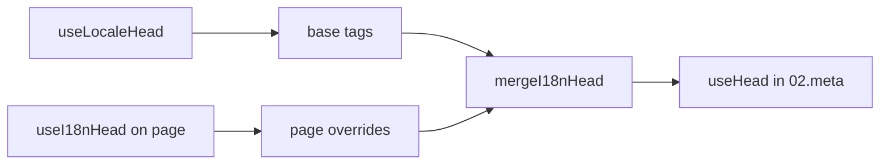

# `useI18nHead` Composable

`useI18nHead` lets you customize i18n SEO tags **per page** without a custom meta plugin. When `meta: true`, the module merges your input on top of [`useLocaleHead`](/composables/useLocaleHead) output.

Typical cases:

- **CMS / blog articles** — only some locales are translated; alternate URLs differ per language (different slugs or paths).
- **Dynamic canonical** — the canonical URL must match the article URL from the API, not `$switchLocalePath`.
- **Extra Open Graph** — `og:title`, `og:description`, `og:image` alongside auto-generated `og:locale` / `og:url`.
- **Partial control** — keep module-generated canonical and `og:url`, but replace only `hreflang` and `og:locale:alternate`.

---

## How it fits in the pipeline



You call `useI18nHead` in a page component. The `02.meta` plugin applies overrides after each `updateMeta()` (route change, `$setI18nRouteParams`, `page:finish` on client).

---

## Example 1 — Article with translations only in some locales

A common pattern: the API returns which locales exist and their absolute or relative URLs.

```ts
interface Article {
  title: string
  slug: string
  /** Locale code → page URL (absolute or site-relative) */
  locales: Record<string, string>
}
```

```vue
<script setup lang="ts">
const route = useRoute()
const { data: article } = await useFetch<Article>(`/api/articles/${route.params.slug}`)

const localeCodes = computed(() => Object.keys(article.value?.locales ?? {}))

useI18nHead(() => {
  if (!article.value) return null

  return {
    meta: [
      { property: 'og:title', content: article.value.title },
      { property: 'og:type', content: 'article' },
    ],
    replace: {
      hreflang: localeCodes.value.map((locale) => ({
        rel: 'alternate',
        hreflang: locale,
        href: article.value!.locales[locale]!,
      })),
      ogAlternates: localeCodes.value,
    },
  }
})
</script>
```

`ogAlternates` takes **locale codes** from your `i18n.locales` config. Values for `og:locale:alternate` are resolved via `locale.og` or `iso` (Open Graph `en_US` format).

---

## Example 2 — Article with per-locale slugs (`$defineI18nRoute` + `$setI18nRouteParams`)

When URLs are built from localized route templates and dynamic params:

```vue
<script setup lang="ts">
const { $defineI18nRoute, $setI18nRouteParams } = useNuxtApp()
const route = useRoute()

const { data: article } = await useFetch(`/api/articles/${route.params.slug}`)

$defineI18nRoute({
  localeRoutes: {
    en: '/blog/[slug]',
    de: '/de/blog/[slug]',
    fr: '/fr/blog/[slug]',
  },
})

if (article.value) {
  $setI18nRouteParams({
    en: { slug: article.value.slugEn },
    de: { slug: article.value.slugDe },
    fr: { slug: article.value.slugFr },
  })

  const availableLocales = article.value.availableLocales as string[]

  useI18nHead({
    meta: [{ property: 'og:title', content: article.value.title }],
    replace: {
      hreflang: availableLocales.map((locale) => ({
        rel: 'alternate',
        hreflang: locale,
        href: article.value!.urls[locale],
      })),
      ogAlternates: availableLocales,
    },
  })
}
</script>
```

Module-generated alternates would list **all** configured locales. `replace.hreflang` limits tags to locales that actually have a translation.

---

## Example 3 — Custom `x-default` for the default locale article URL

By default, `x-default` points to the default locale URL from `$switchLocalePath`. For articles, point it at the default translation URL:

```vue
<script setup lang="ts">
const { $defaultLocale } = useNuxtApp()
const article = await loadArticle()

const defaultLocale = $defaultLocale() ?? 'en'
const defaultHref = article.locales[defaultLocale]

useI18nHead({
  replace: {
    hreflang: Object.entries(article.locales).map(([locale, href]) => ({
      rel: 'alternate',
      hreflang: locale,
      href,
    })),
    xDefault: defaultHref
      ? { rel: 'alternate', hreflang: 'x-default', href: defaultHref }
      : false,
    ogAlternates: Object.keys(article.locales),
  },
})
</script>
```

---

## Example 4 — Replace canonical and `og:url` from API data

When the canonical must match a CMS-provided URL (multi-domain, custom path, or pre-built absolute URL):

```vue
<script setup lang="ts">
const article = await loadArticle()
const canonical = article.canonicalUrl // e.g. https://www.example.com/en/blog/my-post

useI18nHead({
  replace: {
    canonical,
    ogUrl: canonical,
    hreflang: buildAlternateLinks(article),
    ogAlternates: Object.keys(article.locales),
  },
  meta: [
    { property: 'og:title', content: article.title },
    { name: 'description', content: article.excerpt },
  ],
})
</script>
```

---

## Example 5 — Keep auto canonical / `og:url`, replace only alternates

If `$switchLocalePath` + `$setI18nRouteParams` already produce correct canonical and `og:url`, replace only discovery tags:

```vue
<script setup lang="ts">
const article = await loadArticle()

useI18nHead({
  replace: {
    hreflang: buildAlternateLinks(article),
    ogAlternates: Object.keys(article.locales),
  },
})
</script>
```

---

## Example 6 — Full head for a content detail page (meta + links)

Pattern similar to splitting “page meta” and “alternate links” into separate helpers — combined in one call:

```vue
<script setup lang="ts">
const article = await loadArticle()
const alternates = Object.entries(article.locales).map(([locale, href]) => ({
  rel: 'alternate' as const,
  hreflang: locale,
  href: normalizeSeoUrl(href), // strip ?query and #hash if needed
}))

useI18nHead({
  meta: [
    { property: 'og:title', content: article.title },
    { property: 'og:description', content: article.description },
    { property: 'og:image', content: article.imageUrl },
    { name: 'twitter:card', content: 'summary_large_image' },
    { name: 'twitter:title', content: article.title },
  ],
  replace: {
    canonical: article.canonicalUrl,
    ogUrl: article.canonicalUrl,
    hreflang: alternates,
    ogAlternates: Object.keys(article.locales),
  },
})
</script>
```

```ts
/** Remove query and hash — useful when CMS URLs must be clean for SEO */
function normalizeSeoUrl(href: string): string {
  try {
    const url = new URL(href, 'https://placeholder.local')
    url.search = ''
    url.hash = ''
    return href.startsWith('http') ? url.href : `${url.pathname}`
  } catch {
    return href.split(/[?#]/)[0] ?? href
  }
}
```

---

## Example 7 — Two content types, same pattern (news vs guides)

Same API shape, different route names — reuse a small helper:

```ts
// composables/useArticleHead.ts
import type { I18nHeadInput } from '@i18n-micro/types'

interface LocalizedContent {
  title: string
  locales: Record<string, string>
  canonicalUrl?: string
}

export function buildArticleHead(content: LocalizedContent): I18nHeadInput {
  const localeCodes = Object.keys(content.locales)
  const canonical = content.canonicalUrl ?? content.locales.en

  return {
    meta: [{ property: 'og:title', content: content.title }],
    replace: {
      canonical,
      ogUrl: canonical,
      hreflang: localeCodes.map((locale) => ({
        rel: 'alternate',
        hreflang: locale,
        href: content.locales[locale]!,
      })),
      ogAlternates: localeCodes,
    },
  }
}
```

```vue
<!-- pages/blog/[slug].vue -->
<script setup lang="ts">
const article = await loadArticle()
useI18nHead(buildArticleHead(article))
</script>
```

```vue
<!-- pages/guides/[slug].vue -->
<script setup lang="ts">
const guide = await loadGuide()
useI18nHead(buildArticleHead(guide))
</script>
```

---

## Example 8 — Disable built-in alternates, supply your own list

Equivalent to disabling the module’s hreflang generator and passing a custom list (no duplicate alternate sets):

```vue
<script setup lang="ts">
const article = await loadArticle()

useI18nHead({
  disable: ['hreflang', 'x-default', 'og-alternates'],
  link: Object.entries(article.locales).map(([locale, href]) => ({
    rel: 'alternate',
    hreflang: locale,
    href,
  })),
  replace: {
    ogAlternates: Object.keys(article.locales),
  },
})
</script>
```

Or prefer `replace.hreflang` without `disable` — it replaces all `rel="alternate"` links in one step.

---

## Example 9 — Landing page: only extra OG, keep all i18n tags

```vue
<script setup lang="ts">
const { t } = useI18n()

useI18nHead({
  meta: [
    { property: 'og:title', content: t('landing.ogTitle') },
    { property: 'og:description', content: t('landing.ogDescription') },
  ],
})
</script>
```

---

## Example 10 — Product page: disable hreflang for a single locale experiment

```vue
<script setup lang="ts">
useI18nHead({
  disable: ['hreflang', 'x-default'],
  // canonical, og:locale, og:url still generated
})
</script>
```

---

## Example 11 — Reactive updates after client-side fetch

```vue
<script setup lang="ts">
const article = ref<Article | null>(null)

onMounted(async () => {
  article.value = await $fetch('/api/articles/latest')
})

useI18nHead(() => {
  if (!article.value) return null
  return {
    meta: [{ property: 'og:title', content: article.value.title }],
    replace: {
      hreflang: Object.entries(article.value.locales).map(([locale, href]) => ({
        rel: 'alternate',
        hreflang: locale,
        href,
      })),
    },
  }
})
</script>
```

Head refreshes on `page:finish` and when `pageHead` state changes.

---

## Example 12 — HTTPS origin behind a reverse proxy

If you previously resolved a “public origin” composable for canonical / alternate absolute URLs, use module config instead:

```ts
// nuxt.config.ts
export default defineNuxtConfig({
  i18n: {
    meta: true,
    // undefined = origin from current request (multi-domain friendly)
    metaBaseUrl: undefined,
    metaTrustForwardedHost: true,
    metaTrustForwardedProto: true,
  },
})
```

Then pass **paths or full URLs** in `replace.hreflang` / `replace.canonical`. The module uses `useRequestURL` with `X-Forwarded-Host` / `X-Forwarded-Proto` on SSR.

---

## API reference

### `meta`

Extra `<meta>` tags. Deduped by `id`, `property`, or `name`.

### `link`

Extra `<link>` tags. Deduped by `id` or `rel` + `hreflang`.

### `htmlAttrs`

Merged into `<html>` attributes from `useLocaleHead` (`lang`, `dir`).

### `replace`

| Key | Type | Effect |
|-----|------|--------|
| `canonical` | `string \| false` | Replace or remove canonical link |
| `hreflang` | `I18nHeadLink[] \| false` | Replace or remove all `rel="alternate"` links |
| `xDefault` | `I18nHeadLink \| false` | Replace or remove `hreflang="x-default"` |
| `ogLocale` | `string \| false` | Replace or remove `og:locale` |
| `ogUrl` | `string \| false` | Replace or remove `og:url` |
| `ogAlternates` | `string[] \| false` | Rebuild `og:locale:alternate` for locale codes |

### `disable`

| Value | Removes |
|-------|---------|
| `hreflang` | Locale alternate links (not `x-default`) |
| `x-default` | `hreflang="x-default"` link |
| `canonical` | Canonical link |
| `og` | `og:locale` and `og:url` |
| `og-alternates` | `og:locale:alternate` tags |
| `html` | `lang` / `dir` on `<html>` |

---

## `useLocaleHead` vs `useI18nHead`

| Composable | Scope | When to use |
|------------|-------|-------------|
| `useLocaleHead` | Global / manual head | `meta: false`, full custom `useHead` setup |
| `useI18nHead` | Per-page overrides | `meta: true`, customize specific pages |

When `meta: true`, you do **not** need `useLocaleHead` on pages that only use `useI18nHead`.

---

## Migrating from a custom i18n head plugin

Many projects maintain a custom plugin that:

- merges page-specific alternate links from shared state;
- filters duplicate regional `hreflang` entries;
- normalizes `og:locale` values;
- strips query strings from SEO URLs.

You can replace that with `useI18nHead` on each content page and module defaults.

| Previous approach | With `useI18nHead` |
|-------------------|-------------------|
| Shared state + “which locales exist for this article” | `replace: { ogAlternates: localeCodes }` |
| Separate helper building `rel="alternate"` links | `replace: { hreflang: links }` |
| Custom plugin merging page state into head | Built-in merge in `02.meta` |
| Custom “public origin” for absolute URLs | `metaBaseUrl` + forwarded headers (see Example 12) |
| Short `og:locale` (`en` instead of `en_US`) | Set `locale.og` or use `iso` → `en_US` (OG protocol) |

**Regional `hreflang` duplicates:** the module may emit both `en` and `en-US` when `iso` differs from `code`. For article pages that need only language codes, use `replace.hreflang` with your own list.

**JSON-LD:** `useI18nHead` does not generate structured data. Keep `useHead({ script: [...] })` or a dedicated JSON-LD helper alongside it.

---

## See also

- [SEO Guide](/guide/seo) — automatic meta generation and page-level overrides
- [`useLocaleHead`](/composables/useLocaleHead) — low-level head API
