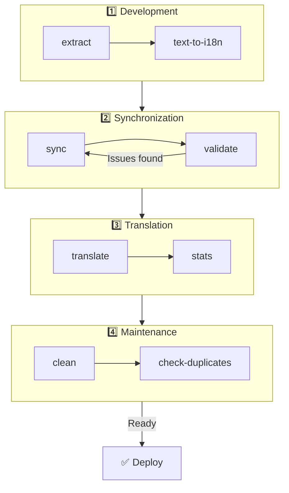

# 🌐 nuxt-i18n-micro-cli Guide

## 📖 Introduction

`nuxt-i18n-micro-cli` is a command-line tool designed to streamline the localization and internationalization process in Nuxt.js projects using the `nuxt-i18n-micro` module (Nuxt I18n Micro). It provides utilities to extract translation keys from your codebase, manage translation files, synchronize translations across locales, and automate the translation process using external translation services.

This guide will walk you through installing, configuring, and using `nuxt-i18n-micro-cli` to effectively manage your project's translations. Package on [npmjs.com](https://www.npmjs.com/package/nuxt-i18n-micro-cli).
## 🔧 Installation and Setup

### 📦 Installing nuxt-i18n-micro-cli

Install globally or as a dev dependency in your Nuxt project (recommended for CI):

```bash
# global
npm install -g nuxt-i18n-micro-cli

# or per project
pnpm add -D nuxt-i18n-micro-cli
pnpm exec i18n-micro text-to-i18n --dryRun
```

Use **`nuxt-i18n-micro-cli` ≥ 2.1.1** if your project uses the Nuxt 4 `app/` directory (`app/pages`, `app/components`, …). Older CLI versions only scanned `pages/` at the project root.

### 🛠 Initializing in Your Project

After installing, you can run `i18n-micro` commands in your Nuxt.js project directory.

Ensure that your project is set up with `nuxt-i18n-micro` and has the necessary configuration in `nuxt.config.ts` (or `nuxt.config.js`).


### 📄 Common Arguments

- `--cwd`: Specify the current working directory (defaults to `.`).
- `--logLevel`: Set the log level (`silent`, `info`, `verbose`).
- `--translationDir`: Directory containing JSON translation files (default: `locales`).

## 📊 CLI Workflow Overview



### Workflow Steps

| Phase | Commands | Purpose |
|-------|----------|---------|
| **Development** | `extract`, `text-to-i18n` | Find and extract translation keys |
| **Sync** | `sync`, `validate` | Ensure all locales have same keys |
| **Translate** | `translate`, `stats` | Auto-translate missing keys |
| **Maintenance** | `clean`, `check-duplicates` | Keep translations tidy |

## 📋 Commands


### 🔄 `text-to-i18n` Command

**Version introduced**: `v1.1.0` (CLI package [`nuxt-i18n-micro-cli`](https://www.npmjs.com/package/nuxt-i18n-micro-cli))


**Description**: Scans Vue/TS/JS files for hardcoded user-facing strings, replaces them with `$t('...')`, and merges new keys into your JSON translation file. Run from the **Nuxt project root** (where `nuxt.config` lives).

**Usage**:

```bash
i18n-micro text-to-i18n [options]
```

**Options**:

| Option | Default | Description |
|--------|---------|-------------|
| `--translationFile` | `locales/en.json` | JSON file for new keys (relative to project root). |
| `--path` | — | Process one file or directory only (e.g. `app/pages/about.vue`). |
| `--context` | — | Key prefix (e.g. `auth` → `auth.*`). |
| `--dryRun` | `false` | Preview without writing files. |
| `--verbose` | `false` | Extra logging. |
| `--interactive` | `false` | Confirm or edit each key before applying. |
| `--extractOnlyDirs` | `plugins` | Dirs where keys are extracted but source files are **not** rewritten. |
| `--extractOnlyPatterns` | — | Glob-like extract-only patterns (e.g. `**/*.plugin.ts`). |

**Example**:

```bash
i18n-micro text-to-i18n --translationFile locales/en.json --context auth --dryRun
```

#### Which folders are scanned?

::: info Nuxt 4
Since CLI **v2.1.1**, `text-to-i18n` scans both classic root folders and `app/*` equivalents. Run the command from the **project root** — do not `cd app`.
:::

Collects `*.vue`, `*.js`, and `*.ts` under:

| Nuxt 3 (project root) | Nuxt 4 (`app/` directory) |
|----------------------|---------------------------|
| `pages/` | `app/pages/` |
| `components/` | `app/components/` |
| `plugins/` | `app/plugins/` |
| `layouts/` | `app/layouts/` |

Other folders (`server/`, `composables/`, `middleware/`, …) are skipped unless you use `--path`. For Nuxt 4, run from the project root (no need to `cd app`). Match `i18n.translationDir` in `--translationFile` if it is not `locales/`.

```bash
i18n-micro text-to-i18n --path app/pages
```

#### How it works

1. Collect files from the directories above (or from `--path`).
2. Replace literals / template text with `$t('generated.key')` (`plugins/` is extract-only by default).
3. Merge new keys into `--translationFile` without removing existing entries.

**Example Transformations**:

Before:
```vue
<template>
  <div>
    <h1>Welcome to our site</h1>
    <p>Please sign in to continue</p>
  </div>
</template>
```

After:
```vue
<template>
  <div>
    <h1>{{ $t('pages.home.welcome_to_our_site') }}</h1>
    <p>{{ $t('pages.home.please_sign_in') }}</p>
  </div>
</template>
```

**Best practices**: dry run first; commit before a full run; align `--translationFile` with `i18n.translationDir` in `nuxt.config`; keep `--extractOnlyDirs plugins` for bootstrap code.

**Limitations**: separate npm package (not bundled with the module); does not read `nuxt.config` automatically; outputs `$t(...)`; complex dynamic strings may need `extract` / `search` instead.

### 📊 `stats` Command

**Description**: The `stats` command is used to display translation statistics for each locale in your Nuxt.js project. It helps you understand the progress of your translations by showing how many keys are translated compared to the total number of keys available.

**Usage**:

```bash
i18n-micro stats [options]
```

**Options**:

- `--full`: Display combined translations statistics only (default: `false`).

**Example**:

```bash
i18n-micro stats --full
```


### 🌍 `translate` Command

**Description**: The `translate` command automatically translates missing keys using external translation services. This command simplifies the translation process by leveraging APIs from services like Google Translate, DeepL, and others to fill in missing translations.

**Usage**:

```bash
i18n-micro translate [options]
```

**Options**:

- `--service`: Translation service to use (e.g., `google`, `deepl`, `yandex`). If not specified, the command will prompt you to select one.
- `--token`: API key corresponding to the chosen translation service. If not provided, you will be prompted to enter it.
- `--options`: Additional options for the translation service, provided as key:value pairs, separated by commas (e.g., `model:gpt-3.5-turbo,max_tokens:1000`).
- `--replace`: Translate all keys, replacing existing translations (default: `false`).

**Example**:

```bash
i18n-micro translate --service deepl --token YOUR_DEEPL_API_KEY
```

#### 🌐 Supported Translation Services

The `translate` command supports multiple translation services. Some of the supported services are:

- **Google Translate** (`google`)
- **DeepL** (`deepl`)
- **Yandex Translate** (`yandex`)
- **OpenAI** (`openai`)
- **Azure Translator** (`azure`)
- **IBM Watson** (`ibm`)
- **Baidu Translate** (`baidu`)
- **LibreTranslate** (`libretranslate`)
- **MyMemory** (`mymemory`)
- **Lingva Translate** (`lingvatranslate`)
- **Papago** (`papago`)
- **Tencent Translate** (`tencent`)
- **Systran Translate** (`systran`)
- **Yandex Cloud Translate** (`yandexcloud`)
- **ModernMT** (`modernmt`)
- **Lilt** (`lilt`)
- **Unbabel** (`unbabel`)
- **Reverso Translate** (`reverso`)

#### ⚙️ Service Configuration

Some services require specific configurations or API keys. When using the `translate` command, you can specify the service and provide the required `--token` (API key) and additional `--options` if needed.

For example:

```bash
i18n-micro translate --service openai --token YOUR_OPENAI_API_KEY --options openaiModel:gpt-3.5-turbo,max_tokens:1000
```

### 🛠️ `extract` Command

**Description**: Extracts translation keys from your codebase and organizes them by scope.

**Usage**:

```bash
i18n-micro extract [options]
```

**Options**:

- `--prod, -p`: Run in production mode.

**Example**:

```bash
i18n-micro extract
```

### 🔄 `sync` Command

**Description**: Synchronizes translation files across locales, ensuring all locales have the same keys.

**Usage**:

```bash
i18n-micro sync [options]
```

**Example**:

```bash
i18n-micro sync
```

### ✅ `validate` Command

**Description**: Validates translation files for missing or extra keys compared to the reference locale.

**Usage**:

```bash
i18n-micro validate [options]
```

**Example**:

```bash
i18n-micro validate
```

### 🧹 `clean` Command

**Description**: Removes unused translation keys from translation files.

**Usage**:

```bash
i18n-micro clean [options]
```

**Example**:

```bash
i18n-micro clean
```

### 📤 `import` Command

**Description**: Converts PO files back to JSON format and saves them in the translation directory.

**Usage**:

```bash
i18n-micro import [options]
```

**Options**:

- `--potsDir`: Directory containing PO files (default: `pots`).

**Example**:

```bash
i18n-micro import --potsDir pots
```

### 📥 `export` Command

**Description**: Exports translations to PO files for external translation management.

**Usage**:

```bash
i18n-micro export [options]
```

**Options**:

- `--potsDir`: Directory to save PO files (default: `pots`).

**Example**:

```bash
i18n-micro export --potsDir pots
```

### 🗂️ `export-csv` Command

**Description**: The `export-csv` command exports translation keys and values from JSON files, including their file paths, into a CSV format. This command is useful for teams who prefer working with translation data in spreadsheet software.

**Usage**:

```bash
i18n-micro export-csv [options]
```

**Options**:

- `--csvDir`: Directory where the exported CSV files will be saved.
- `--delimiter`: Specify a delimiter for the CSV file (default: `,`).

**Example**:

```bash
i18n-micro export-csv --csvDir csv_files
```

### 📑 `import-csv` Command

**Description**: The `import-csv` command imports translation data from CSV files, updating the corresponding JSON files. This is useful for applying bulk translation updates from spreadsheets.

**Usage**:

```bash
i18n-micro import-csv [options]
```

**Options**:

- `--csvDir`: Directory containing the CSV files to be imported.
- `--delimiter`: Specify a delimiter used in the CSV file (default: `,`).

**Example**:

```bash
i18n-micro import-csv --csvDir csv_files
```

### 🧾 `diff` Command

**Description**: Compares translation files between the default locale and other locales within the same directory (including subdirectories). The command identifies missing keys and their values in the default locale compared to other locales, making it easier to track translation progress or discrepancies.

**Usage**:

```bash
i18n-micro diff [options]
```

**Example**:

```bash
i18n-micro diff
```

### 🔍 `check-duplicates` Command

**Description**: The `check-duplicates` command checks for duplicate translation values within each locale across all translation files, including both root-level and page-specific translations. It ensures that different keys within the same language do not share identical translation values, helping maintain clarity and consistency in your translations.

**Usage**:

```bash
i18n-micro check-duplicates [options]
```

**Example**:

```bash
i18n-micro check-duplicates
```

**How it works**:
- The command checks both root-level and page-specific translation files for each locale.
- If a translation value appears in multiple locations (either within root-level translations or across different pages), it reports the duplicate values along with the file and key where they are found.
- If no duplicates are found, the command confirms that the locale is free of duplicated translation values.

This command helps ensure that translation keys maintain unique values, preventing accidental repetition within the same locale.


### 🔄 `replace-values` Command

**Description**: The `replace-values` command allows you to perform bulk replacements of translation values across all locales. It supports both simple text replacements and advanced replacements using regular expressions (regex). You can also use capturing groups in regex patterns and reference them in the replacement string, making it ideal for more complex replacement scenarios.

**Usage**:

```bash
i18n-micro replace-values [options]
```

**Options**:

- `--search`: The text or regex pattern to search for in translations. This is a required option.
- `--replace`: The replacement text to be used for the found translations. This is a required option.
- `--useRegex`: Enable search using a regular expression pattern (default: `false`).

**Example 1**: Simple replacement

Replace the string "Hello" with "Hi" across all locales:

```bash
i18n-micro replace-values --search "Hello" --replace "Hi"
```

**Example 2**: Regex replacement

Enable regex search and replace any string starting with "Hello" followed by numbers (e.g., "Hello123") with "Hi" across all locales:

```bash
i18n-micro replace-values --search "Hello\\d+" --replace "Hi" --useRegex
```

**Example 3**: Using regex capturing groups

Use capturing groups to dynamically insert part of the matched string into the replacement. For example, replace "Hello [name]" with "Hi [name]" while keeping the name intact:

```bash
i18n-micro replace-values --search "Hello (\\w+)" --replace "Hi $1" --useRegex
```

In this case, `$1` refers to the first capturing group, which matches the `[name]` part after "Hello". The replacement will keep the name from the original string.

**How it works**:
- The command scans through all translation files (both global and page-specific).
- When a match is found based on the search string or regex pattern, it replaces the matched text with the provided replacement.
- When using regex, capturing groups can be used in the replacement string by referencing them with `$1`, `$2`, etc.
- All changes are logged, showing the file path, translation key, and the before/after state of the translation value.

**Logging**:
For each replacement, the command logs details including:
- Locale and file path
- The translation key being modified
- The old value and the new value after replacement
- If using regex with capturing groups, the logs will show the group matches and how they were replaced.

This allows you to track exactly where and what changes were made during the replacement operation, providing a clear history of modifications across your translation files.

## 🛠 Examples

- **Extracting translations**:

  ```bash
  i18n-micro extract
  ```

- **Translating missing keys using Google Translate**:

  ```bash
  i18n-micro translate --service google --token YOUR_GOOGLE_API_KEY
  ```

- **Translating all keys, replacing existing translations**:

  ```bash
  i18n-micro translate --service deepl --token YOUR_DEEPL_API_KEY --replace
  ```

- **Validating translation files**:

  ```bash
  i18n-micro validate
  ```

- **Cleaning unused translation keys**:

  ```bash
  i18n-micro clean
  ```

- **Synchronizing translation files**:

  ```bash
  i18n-micro sync
  ```

## ⚙️ Configuration Guide

`nuxt-i18n-micro-cli` relies on your Nuxt.js i18n configuration in `nuxt.config.ts` (or `nuxt.config.js`). Ensure you have the `nuxt-i18n-micro` module installed and configured.

### 🔑 nuxt.config.js Example

```ts
export default defineNuxtConfig({
  modules: ['nuxt-i18n-micro'],
  i18n: {
    locales: [
      { code: 'en', iso: 'en-US' },
      { code: 'fr', iso: 'fr-FR' },
    ],
    defaultLocale: 'en',
    fallbackLocale: 'en',
    translationDir: 'locales', // or 'app/locales' for Nuxt 4 colocation
  },
})
```

Ensure that the `translationDir` matches the directory used by `nuxt-i18n-micro-cli` (default is `locales`).


## 📝 Best Practices

### 🔑 Consistent Key Naming

Ensure translation keys are consistent and descriptive to avoid confusion and duplication.

### 🧹 Regular Maintenance

Use the `clean` command regularly to remove unused translation keys and keep your translation files clean.

### 🛠 Automate Translation Workflow

Integrate `nuxt-i18n-micro-cli` commands into your development workflow or CI/CD pipeline to automate extraction, translation, validation, and synchronization of translation files.

### 🛡️ Secure API Keys

When using translation services that require API keys, ensure your keys are kept secure and not committed to version control systems. Consider using environment variables or secure key management solutions.

## 📞 Support and Contributions

If you encounter issues or have suggestions for improvements, feel free to contribute to the project or open an issue on the project's repository.

---

By following this guide, you'll be able to effectively manage translations in your Nuxt.js project using `nuxt-i18n-micro-cli`, streamlining your internationalization efforts and ensuring a smooth experience for users in different locales.
