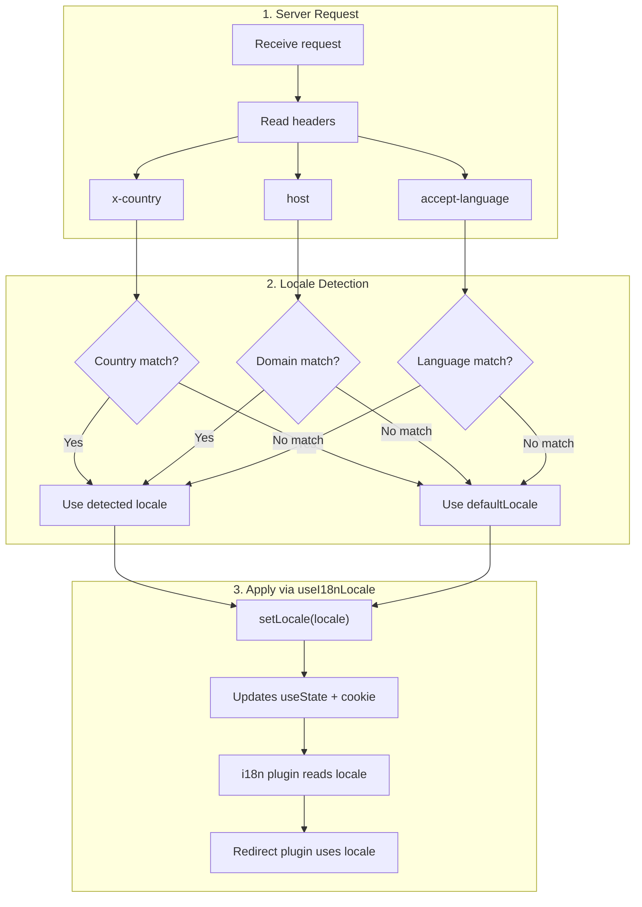

# 🔧 Custom Language Detection in Nuxt I18n Micro

## 📖 Overview

Nuxt I18n Micro v3 provides a centralized composable — `useI18nLocale()` — for all locale management. This replaces the manual `useState`/`useCookie` patterns from v2. By using `useI18nLocale().setLocale()` in a server plugin, you can implement any custom detection logic while keeping full compatibility with the module's redirect and cookie systems.

## 🏗️ Architecture

```mermaid
flowchart TB
    subgraph Plugins["Plugin Execution Order"]
        A["Your plugin<br/>order: -10"] -->|setLocale()| B["01.plugin.ts<br/>order: -5"]
        B --> C["06.redirect.ts<br/>order: 10"]
    end

    subgraph State["Locale State"]
        D["useState('i18n-locale')"]
        E["localeCookie"]
    end

    A -->|"setLocale() updates both"| D
    A -->|"setLocale() updates both"| E
    B -->|reads| D
    C -->|reads| D
    C -->|reads| E
```

**Key principle**: Call `useI18nLocale().setLocale()` in a server plugin with `order: -10`. This updates both `useState('i18n-locale')` and the locale cookie atomically, so the i18n plugin (`order: -5`) and redirect plugin (`order: 10`) see the correct locale immediately.

## 🛠️ Disabling Built-In Auto-Detection

If you want full control over locale detection, disable the built-in mechanism:

```ts
export default defineNuxtConfig({
  i18n: {
    autoDetectLanguage: false
  }
})
```

## ✨ Example: Server-Side Detection with `useI18nLocale`

This is the **recommended approach** for all strategies.

### Step 1: Configure `nuxt.config.ts`

```ts
export default defineNuxtConfig({
  modules: ['nuxt-i18n-micro'],
  i18n: {
    strategy: 'no_prefix', // Works with ANY strategy
    defaultLocale: 'en',
    localeCookie: 'user-locale',
    autoDetectLanguage: false,
    locales: [
      { code: 'en', iso: 'en-US' },
      { code: 'de', iso: 'de-DE' },
      { code: 'ja', iso: 'ja-JP' }
    ]
  }
})
```

### Step 2: Create `plugins/i18n-loader.server.ts`

```ts
import { defineNuxtPlugin, useRequestHeaders } from '#imports'

export default defineNuxtPlugin({
  name: 'i18n-custom-loader',
  enforce: 'pre',
  order: -10, // Execute BEFORE the i18n plugin (which has order -5)

  setup() {
    const { setLocale } = useI18nLocale()
    const headers = useRequestHeaders(['host', 'x-country', 'accept-language'])
    let detectedLocale = 'en'

    // --- YOUR DETECTION LOGIC ---

    // Example 1: By domain
    const host = headers['host']
    if (host?.includes('example.de')) {
      detectedLocale = 'de'
    }
    // Example 2: By custom header
    else if (headers['x-country'] === 'JP') {
      detectedLocale = 'ja'
    }
    // Example 3: By Accept-Language header
    else if (headers['accept-language']?.includes('de')) {
      detectedLocale = 'de'
    }

    // --- APPLY THE LOCALE ---
    setLocale(detectedLocale)
  }
})
```

### How It Works



1. **Plugin runs first** (`order: -10`) — detects locale from headers, domain, or other sources
2. **`setLocale()` updates both** `useState('i18n-locale')` and cookie — ensures immediate visibility to all subsequent plugins
3. **i18n plugin** (`order: -5`) reads the locale and loads correct translations
4. **Redirect plugin** (`order: 10`) uses the locale for redirect decisions

## 🌐 Strategy-Specific Behavior

`useI18nLocale().setLocale()` works with **all strategies**. The redirect behavior depends on the strategy:

::: tip Redirect behavior
| Strategy | Effect of `setLocale('de')` |
|----------|---------------------------|
| `no_prefix` | Renders in German, no URL change |
| `prefix` | 302 → `/de/` (server-side redirect) |
| `prefix_except_default` | 302 → `/de/` if `de` ≠ default; no redirect if `de` = default |
| `prefix_and_default` | No redirect (both `/` and `/de/` are valid) |
:::

**Important notes:**
- Cookie-based locale detection is disabled by default (`localeCookie: null`)
- Set `localeCookie: 'user-locale'` to enable cookie persistence
- If the cookie/state value is not in the `locales` list, it falls back to `defaultLocale`

## 🏢 Advanced: Domain-Based Detection

For multi-domain setups where each domain serves a different locale:

```ts
import { defineNuxtPlugin, useRequestHeaders } from '#imports'

export default defineNuxtPlugin({
  name: 'i18n-domain-loader',
  enforce: 'pre',
  order: -10,

  setup() {
    const { setLocale } = useI18nLocale()
    const headers = useRequestHeaders(['host'])
    const host = headers['host'] || ''

    let detectedLocale = 'en'

    if (host.endsWith('.de') || host.includes('german.')) {
      detectedLocale = 'de'
    } else if (host.endsWith('.fr') || host.includes('french.')) {
      detectedLocale = 'fr'
    } else if (host.endsWith('.jp') || host.includes('japanese.')) {
      detectedLocale = 'ja'
    }

    setLocale(detectedLocale)
  }
})
```

## 🔄 Advanced: Respecting User Preference

If users can manually switch language, respect their choice over auto-detection:

```ts
import { defineNuxtPlugin, useRequestHeaders } from '#imports'

export default defineNuxtPlugin({
  name: 'i18n-smart-loader',
  enforce: 'pre',
  order: -10,

  setup() {
    const { getLocale, setLocale } = useI18nLocale()

    // If user already has a preference (from cookie), respect it
    if (getLocale()) {
      return
    }

    // Otherwise, detect locale from headers
    const headers = useRequestHeaders(['accept-language'])
    let detectedLocale = 'en'

    const acceptLanguage = headers['accept-language'] || ''
    if (acceptLanguage.includes('de')) {
      detectedLocale = 'de'
    } else if (acceptLanguage.includes('ja')) {
      detectedLocale = 'ja'
    }

    setLocale(detectedLocale)
  }
})
```

## ⚙️ Server-Only or Client-Only Plugins

Use [Nuxt filename conventions](https://nuxt.com/docs/getting-started/directory-structure#plugins) to control where your plugin runs:

- **Server-Only**: `i18n-loader.server.ts` — runs only during SSR (recommended for header-based detection)
- **Client-Only**: `i18n-loader.client.ts` — runs only in the browser (for `localStorage` or DOM-based detection)

::: tip
For locale detection that relies on server headers (`x-country`, `accept-language`, `host`), always use a **server-only** plugin. Headers are not available on the client.
:::

## ✅ Summary

| Feature | Description |
|---------|-------------|
| `useI18nLocale().setLocale()` | Updates `useState` + cookie atomically; works with all strategies |
| `useI18nLocale().getLocale()` | Returns current locale from state or cookie |
| `useI18nLocale().getPreferredLocale()` | Returns preferred locale (validated against `locales` list) |
| Plugin `order: -10` | Ensures your plugin runs before i18n initialization |
| `enforce: 'pre'` | Runs in the "pre" plugin group |

**Do NOT:**
- Use `useCookie('user-locale')` directly — `useI18nLocale()` manages cookies internally
- Use `useState('i18n-locale')` directly — use `useI18nLocale().setLocale()` instead
- Set `order` >= -5 — your plugin must run before the i18n plugin
