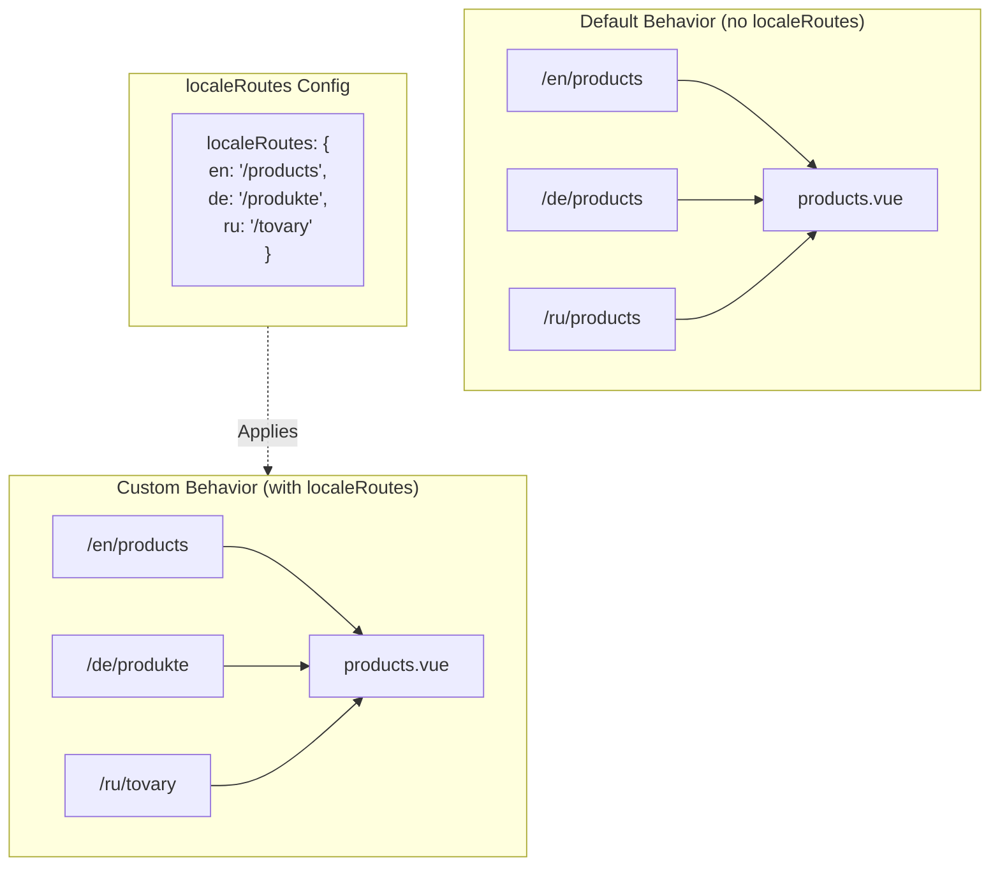

# 🔗 Custom Localized Routes with `localeRoutes` in `Nuxt I18n Micro`

## 📖 Introduction to `localeRoutes`

The `localeRoutes` feature in `Nuxt I18n Micro` allows you to define custom routes for specific locales, offering flexibility and control over the routing structure of your application. This feature is particularly useful when certain locales require different URL structures, tailored paths, or need to follow specific regional or linguistic conventions.

## 🚀 Primary Use Case of `localeRoutes`

The primary use case for `localeRoutes` is to provide distinct routes for different locales, enhancing the user experience by ensuring URLs are intuitive and relevant to the target audience. For example, you might have different paths for English and Russian versions of a page, where the Russian locale follows a localized URL format.

### 📄 Example: Defining `localeRoutes` in `$defineI18nRoute`

Here’s an example of how you might define custom routes for specific locales using `localeRoutes` in your `$defineI18nRoute` function:

```typescript
$defineI18nRoute({
  localeRoutes: {
    ru: '/localesubpage', // Custom route path for the Russian locale
    de: '/lokaleseite',   // Custom route path for the German locale
  },
})
```

### 🔄 How `localeRoutes` Work



- **Default Behavior**: Without `localeRoutes`, all locales use a common route structure defined by the primary path.
- **Custom Behavior**: With `localeRoutes`, specific locales can have their own routes, overriding the default path with locale-specific routes defined in the configuration.

## 🌱 Use Cases for `localeRoutes`

### 📄 Example: Using `localeRoutes` in a Page

Here’s a simple Vue component demonstrating the use of `$defineI18nRoute` with `localeRoutes`:

```vue
<template>
  <div>
    <!-- Display greeting message based on the current locale -->
    <p>{{ $t('greeting') }}</p>

    <!-- Navigation links -->
    <div>
      <NuxtLink :to="$localeRoute({ name: 'index' })">
        Go to Index
      </NuxtLink>
      |
      <NuxtLink :to="$localeRoute({ name: 'about' })">
        Go to About Page
      </NuxtLink>
    </div>
  </div>
</template>

<script setup>
import { useNuxtApp } from '#imports'

const { $getLocale, $switchLocale, $getLocales, $localeRoute, $t, $defineI18nRoute } = useNuxtApp()

// Define translations and custom routes for specific locales
$defineI18nRoute({
  localeRoutes: {
    ru: '/localesubpage', // Custom route path for Russian locale
  },
})
</script>
```

### 🛠️ Using `localeRoutes` in Different Contexts

- **Landing Pages**: Use custom routes to localize URLs for landing pages, ensuring they align with marketing campaigns.
- **Documentation Sites**: Provide distinct routes for each locale to better match the localized content structure.
- **E-commerce Sites**: Tailor product or category URLs per locale for improved SEO and user experience.

## Using Navigation with `localeRoutes`

As localised routes don't directly match filenames in the page directory, you need to reference your navigation by object rather than by name.

```vue
<template>
  /**
   * Exemple page: /pages/about-us.vue
   * EN /about-us
   * ES /sobre-nosotros
   * FR /a-propos
   */
  
  // Using NuxtLink
  <NuxtLink :to="$localeRoute({ name: 'about-us' })">
    Go to About Page
  </NuxtLink>
  
  // Using I18nLink
  <I18nLink :to="{ name: 'about-us' }">
    Go to About Page
  </NuxtLink>
  
  // The string literal navigation wouldn't work for any locale but english
  <I18nLink to="/about-us">
    Go to About Page
  </NuxtLink>
</template>
```

### Nested Page Naming

By default, your pages are named based on their file & path name. Here's what it means:
- `/pages/about-us.vue` can be accessed with `$localeRoute({ name: 'about-us' })`
- `/pages/about-us/physical-stores.vue` can be accessed with `$localeRoute({ name: 'about-us-physical-stores' })`

To override this behaviour, explicitly name your page with `definePageMeta`.

```vue
// /pages/about-us/physical-stores.vue
<script setup>
definePageMeta({
  name: 'our-stores'
})
```


This page can now be referenced with either `$localeRoute` or `I18nLink` by its name `:to='{ name: "our-stores" }'`.

## 🎯 Dynamic Routes with Slugs and `$setI18nRouteParams`

When working with dynamic routes that contain slugs or parameters, you can use `localeRoutes` with dynamic segments and `$setI18nRouteParams` to provide locale-specific slugs for each locale.

### Dynamic Route Parameters in `localeRoutes`

You can define dynamic routes using Nuxt's route parameter syntax (`[...slug]` for catch-all routes, `[param]` for single parameters, or `:param()` for named parameters):

```vue
<script setup lang="ts">
import { useNuxtApp, useRoute, useFetch, createError } from '#imports'

const { $defineI18nRoute, $setI18nRouteParams } = useNuxtApp()

// Define custom routes with dynamic segments
$defineI18nRoute({
  localeRoutes: {
    en: '/our-products/[...slug]',
    es: '/nuestros-productos/[...slug]',
  },
})
</script>
```

### Setting Locale-Specific Route Parameters

The `$setI18nRouteParams` function allows you to set different parameter values (like slugs) for each locale. This is especially useful when your content has locale-specific URLs.

**Important**: `$setI18nRouteParams` should be called after fetching data that contains locale-specific slugs, typically inside `useFetch` or `useAsyncData`.

```vue
<script setup lang="ts">
import { useNuxtApp, useRoute, useFetch, createError } from '#imports'

interface Product {
  title: string
  price: string
  urlEn: string  // English slug
  urlEs: string  // Spanish slug
}

const { $defineI18nRoute, $setI18nRouteParams } = useNuxtApp()

const route = useRoute()
const slug = Array.isArray(route.params.slug) ? route.params.slug[0] : route.params.slug

// Fetch product data that includes locale-specific slugs
const { data: product, error } = await useFetch<Product>(`/api/product/${slug}`)
if (error.value) throw createError({
  statusCode: error.value?.statusCode,
  statusMessage: error.value?.statusMessage,
  fatal: true,
})

// Define custom routes with dynamic segments
$defineI18nRoute({
  localeRoutes: {
    en: '/our-products/[...slug]',
    es: '/nuestros-productos/[...slug]',
  },
})

// Set different slugs for different locales
if (product.value) {
  $setI18nRouteParams({
    en: { slug: product.value.urlEn },
    es: { slug: product.value.urlEs },
  })
}
</script>
```

### Complete Example: Product Pages with Locale-Specific Slugs

Here's a complete example showing how to use `localeRoutes` and `$setI18nRouteParams` together for a product detail page:

```vue
<template>
  <div v-if="product">
    <h1>{{ product.title }}</h1>
    <p>{{ $t('price') }}: {{ product.price }}</p>
    <div class="locale-switcher">
      <a :href="$switchLocalePath('en')">English</a>
      <a :href="$switchLocalePath('es')">Español</a>
    </div>
  </div>
</template>

<script setup lang="ts">
import { useNuxtApp, useRoute, useFetch, createError } from '#imports'

interface Product {
  title: string
  price: string
  urlEn: string
  urlEs: string
}

const { $t, $defineI18nRoute, $setI18nRouteParams, $switchLocalePath } = useNuxtApp()

// Set page name for easier navigation
definePageMeta({ name: 'product-slug' })

const route = useRoute()
const slug = Array.isArray(route.params.slug) ? route.params.slug[0] : route.params.slug

// Fetch product data
const { data: product, error } = await useFetch<Product>(`/api/product/${slug}`)
if (error.value) throw createError({
  statusCode: error.value?.statusCode,
  statusMessage: error.value?.statusMessage,
  fatal: true,
})

// Define locale-specific routes with dynamic segments
$defineI18nRoute({
  localeRoutes: {
    en: '/our-products/[...slug]',
    es: '/nuestros-productos/[...slug]',
  },
})

// Set locale-specific slugs so $switchLocalePath works correctly
if (product.value) {
  $setI18nRouteParams({
    en: { slug: product.value.urlEn },
    es: { slug: product.value.urlEs },
  })
}
</script>
```

### Example: Product List Page

When linking to dynamic routes from a list page, use the route name with parameters:

```vue
<template>
  <div>
    <h1>{{ $t('title') }}</h1>
    <ul>
      <li v-for="product in products?.[$getLocale()] || []" :key="product.id">
        <I18nLink :to="{ name: 'product-slug', params: { slug: product.url } }">
          {{ product.title }} – {{ product.price }}
        </I18nLink>
      </li>
    </ul>
  </div>
</template>

<script setup lang="ts">
import { useNuxtApp, useFetch, createError } from '#imports'

interface Product {
  id: string
  title: string
  price: string
  url: string
}

type ProductsByLocale = Record<string, Product[]>

const { $t, $defineI18nRoute, $getLocale } = useNuxtApp()

const { data: products, error } = await useFetch<ProductsByLocale>('/api/product')
if (error.value) throw createError({
  statusCode: error.value?.statusCode,
  statusMessage: error.value?.statusMessage,
  fatal: true,
})

$defineI18nRoute({
  locales: {
    en: {
      title: 'Our Product Range',
      description: 'Discover our collection of high-quality products.',
    },
    es: {
      title: 'Nuestra Gama de Productos',
      description: 'Descubra nuestra colección de productos de alta calidad.',
    },
  },
  localeRoutes: {
    en: '/our-products',
    es: '/nuestros-productos',
  },
})
</script>
```

### How It Works

1. **Route Definition**: `localeRoutes` defines the base path structure for each locale, including dynamic segments like `[...slug]` or `[id]`.

2. **Parameter Setting**: `$setI18nRouteParams` sets the actual parameter values for each locale. When a user switches locales using `$switchLocalePath`, the module uses these parameters to construct the correct URL.

3. **Parameter Format**: The parameter object should match the structure:
   ```typescript
   {
     [localeCode]: {
       [paramName]: paramValue
     }
   }
   ```

4. **Navigation**: Use `I18nLink` or `$localeRoute` with the route name and parameters to navigate between localized versions of dynamic routes.

### Important Notes

- **Timing**: `$setI18nRouteParams` should be called after fetching data that contains locale-specific slugs, typically inside `useFetch` or `useAsyncData`.

- **Parameter Names**: The parameter names in `$setI18nRouteParams` must match the route parameter names (e.g., `slug` for `[...slug]` or `id` for `[id]`).

- **Route Names**: When using `definePageMeta({ name: 'route-name' })`, use this name when linking to the route with `I18nLink` or `$localeRoute`.

- **Catch-all Routes**: For catch-all routes (`[...slug]`), the slug parameter should be an array or a string that will be converted to an array.

## 📝 Best Practices for Using `localeRoutes`

- **🚀 Use for Relevant Locales**: Apply `localeRoutes` primarily where the URL structure significantly impacts the user experience or SEO. Avoid overuse for minor differences.
- **🔧 Maintain Consistency**: Keep a consistent routing pattern across locales unless there's a strong reason to deviate. This approach helps in maintaining clarity and reducing complexity.
- **📚 Document Custom Routes**: Clearly document any custom routes you define with `localeRoutes`, especially in modular applications, to ensure team members understand the routing logic.
