# 📂 Folder Structure Guide

## 📖 Introduction

Organizing your translation files effectively is essential for maintaining a scalable and efficient internationalization (i18n) system. `Nuxt I18n Micro` simplifies this process by offering a clear approach to managing root-level and page-specific translations. This guide will walk you through the recommended folder structure and explain how `Nuxt I18n Micro` handles these translations.

## 🗂️ Recommended Folder Structure

`Nuxt I18n Micro` organizes translations into root-level files and page-specific files within the `pages` directory. At build time, root-level translations are automatically merged into every page file, so each page has a complete set of translations without runtime merging overhead.

### 🔧 Basic Structure

Here’s a basic example of the folder structure you should follow:

```tree
locales/
├── pages/
│   ├── index/
│   │   ├── en.json
│   │   ├── fr.json
│   │   └── ar.json
│   ├── about/
│   │   ├── en.json
│   │   ├── fr.json
│   │   └── ar.json
├── en.json
├── fr.json
└── ar.json
```

### 📄 Explanation of Structure

#### 1. 🌍 Root-Level Translation Files

- **Path:** `/locales/{locale}.json` (e.g., `/locales/en.json`)
- **Purpose:** These files contain translations shared across the entire application (navigation menus, headers, footers, etc.). At build time, they are automatically merged into every page-specific file, so the server returns a single pre-built file per page — no runtime merging needed.

  **Example Content (`/locales/en.json`):**
  ```json
  {
    "menu": {
      "home": "Home",
      "about": "About Us",
      "contact": "Contact"
    },
    "footer": {
      "copyright": "© 2024 Your Company"
    }
  }
  ```

#### 2. 📄 Page-Specific Translation Files

- **Path:** `/locales/pages/{routeName}/{locale}.json` (e.g., `/locales/pages/index/en.json`)
- **Purpose:** These files contain translations specific to individual pages. At build time, root-level translations are merged in as a base, so each page file becomes self-contained. The server returns a single file per page request.

  **Example Content (`/locales/pages/index/en.json`):**
  ```json
  {
    "title": "Welcome to Our Website",
    "description": "We offer a wide range of products and services to meet your needs."
  }
  ```

  **Example Content (`/locales/pages/about/en.json`):**
  ```json
  {
    "title": "About Us",
    "description": "Learn more about our mission, vision, and values."
  }
  ```

### 📂 Handling Dynamic Routes and Nested Paths

`Nuxt I18n Micro` automatically transforms dynamic segments and nested paths in routes into a flat folder structure using a specific renaming convention. This ensures that all translations are stored in a consistent and easily accessible manner.

#### Dynamic Route Translation Folder Structure

When dealing with dynamic routes, such as `/products/[id]`, the module converts the dynamic segment `[id]` into a static format within the file structure.

**Example Folder Structure for Dynamic Routes:**

For a route like `/products/[id]`, the translation files would be stored in a folder named `products-id`:

```tree
locales/pages/
├── products-id/
│   ├── en.json
│   ├── fr.json
│   └── ar.json
```

**Example Folder Structure for Nested Dynamic Routes:**

For a nested route like `/products/key/[id]`, the translation files would be stored in a folder named `products-key-id`:

```tree
locales/pages/
├── products-key-id/
│   ├── en.json
│   ├── fr.json
│   └── ar.json
```

**Example Folder Structure for Multi-Level Nested Routes:**

For a more complex nested route like `/products/category/[id]/details`, the translation files would be stored in a folder named `products-category-id-details`:

```tree
locales/pages/
├── products-category-id-details/
│   ├── en.json
│   ├── fr.json
│   └── ar.json
```

### 🛠 Customizing the Directory Structure

If you prefer to store translations in a different directory, `Nuxt I18n Micro` allows you to customize the directory where translation files are stored. You can configure this in your `nuxt.config.ts` file.

**Example: Customizing the Translation Directory**

```typescript
export default defineNuxtConfig({
  i18n: {
    translationDir: 'i18n' // Custom directory path
  }
})
```

This will instruct `Nuxt I18n Micro` to look for translation files in the `/i18n` directory instead of the default `/locales` directory.

## ⚙️ How Translations are Loaded

### 🌍 Dynamic Locale Routes

`Nuxt I18n Micro` uses dynamic locale routes to load translations efficiently. When a user visits a page, the module determines the appropriate locale and loads the corresponding translation files based on the current route and locale.

```mermaid
flowchart TB
    A["📥 Request: /fr/about"] --> B["🔍 Detect locale: fr"]
    A --> C["🔍 Detect route: about"]
    
    B --> D["📂 Load pre-built: .nuxt/i18n-merged/pages/about/fr.json"]
    C --> D
    
    D --> E["✅ Translations ready (root + page + fallback already merged at build time)"]
    
    E --> F["Available via $t()"]
```



For example:
- Visiting `/en/index` will load translations from `/locales/pages/index/en.json`.
- Visiting `/fr/about` will load translations from `/locales/pages/about/fr.json`.

This method ensures that only the necessary translations are loaded, optimizing both server load and client-side performance.

### 💾 Caching and Pre-rendering

To further enhance performance, `Nuxt I18n Micro` supports caching and pre-rendering of translation files:
- **Caching**: Once a translation file is loaded, it’s cached for subsequent requests, reducing the need to repeatedly fetch the same data.
- **Pre-rendering**: During the build process, you can pre-render translation files for all configured locales and routes, allowing them to be served directly from the server without runtime delays.

## 📝 Best Practices

### 📂 Use Page-Specific Files Wisely

Leverage page-specific files to keep translations organized. This keeps each page’s translations lean and fast to load, which is especially important for pages with complex or large content.

### 🔑 Keep Translation Keys Consistent

Use consistent naming conventions for your translation keys across files. This helps maintain clarity and prevents issues when managing translations, especially as your application grows.

### 🗂️ Organize Translations by Context

Group related translations together within your files. For example, group all button labels under a `buttons` key and all form-related texts under a `forms` key. This not only improves readability but also makes it easier to manage translations across different locales.

### ⚠️ Nesting Depth Limit (2 Levels Recommended)

During client-side navigation, `Nuxt I18n Micro` uses an optimized 2-level deep merge to combine translations from the leaving and entering pages. This ensures that overlapping nested keys (e.g., both pages have keys under `common.*`) are preserved during transition animations.

**This works correctly for the standard `Section → Key → Value` structure (2 levels):**

```json
// Page A translations
{ "common": { "fromA": "Text A" } }

// Page B translations
{ "common": { "fromB": "Text B" } }

// During transition, both are available:
// { "common": { "fromA": "Text A", "fromB": "Text B" } }
```

**However, if you use 3+ levels of nesting, deeper keys may be overwritten during transitions:**

```json
// Page A translations
{ "auth": { "form": { "login": "Login" } } }

// Page B translations
{ "auth": { "form": { "register": "Register" } } }

// During transition: "login" key is lost
// { "auth": { "form": { "register": "Register" } } }
```

::: tip
For 99% of i18n projects, the `Section → Key → Value` structure is sufficient and performs best. If you need deeper nesting, ensure that different pages don't share the same nested prefix at level 3+, or flatten your keys (e.g., `auth.form.login` → `authFormLogin`).
:::

### 🧹 Regularly Clean Up Unused Translations

Over time, your application might accumulate unused translation keys, especially if features are removed or restructured. Periodically review and clean up your translation files to keep them lean and maintainable.
