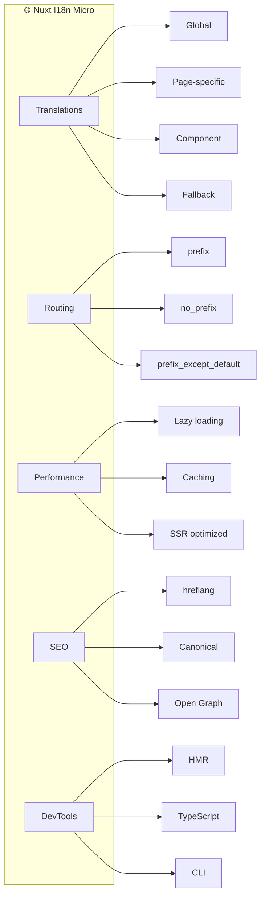

# 🌐 Getting Started with Nuxt I18n Micro

Welcome to Nuxt I18n Micro! This guide will help you get up and running with our high-performance internationalization module for Nuxt.js.

## 📖 Overview

`Nuxt I18n Micro` is a lightweight internationalization module for Nuxt that delivers superior performance compared to traditional solutions. It's designed to reduce build times, memory usage, and server load, making it ideal for high-traffic and large projects.


```mermaid
flowchart LR
    subgraph Core["🌐 Nuxt I18n Micro"]
        direction TB
        T[Translations]
        R[Routing]
        P[Performance]
        S[SEO]
        D[DevTools]
    end

    T --> T1[Global]
    T --> T2[Page-specific]
    T --> T3[Component]
    T --> T4[Fallback]

    R --> R1[prefix]
    R --> R2[no_prefix]
    R --> R3[prefix_except_default]

    P --> P1[Lazy loading]
    P --> P2[Caching]
    P --> P3[SSR optimized]

    S --> S1[hreflang]
    S --> S2[Canonical]
    S --> S3[Open Graph]

    D --> D1[HMR]
    D --> D2[TypeScript]
    D --> D3[CLI]
```

## 🤔 Why Choose Nuxt I18n Micro?

Here are some key benefits of using `Nuxt I18n Micro`:

- 🚀 **High Performance**: Significantly reduces build times and memory consumption
- 📦 **Compact Size**: Has minimal impact on your app's bundle size
- ⚙️ **Efficiency**: Optimized for large-scale applications with a focus on memory consumption and server load
- 🛠️ **Easy Setup**: Simple configuration with sensible defaults
- 🔧 **Flexible**: Extensive customization options for complex use cases
- 📚 **Well Documented**: Comprehensive documentation and examples

## 🚀 Quick Start

### Installation

Install the module in your Nuxt application:

::: code-group

```bash [npm]
npm install nuxt-i18n-micro
```

```bash [yarn]
yarn add nuxt-i18n-micro
```

```bash [pnpm]
pnpm add nuxt-i18n-micro
```

```bash [bun]
bun add nuxt-i18n-micro
```

:::

### Basic Configuration

Add the module to your `nuxt.config.ts`:

```typescript
export default defineNuxtConfig({
  modules: ["nuxt-i18n-micro"],
  i18n: {
    locales: [
      { code: "en", iso: "en-US", dir: "ltr" },
      { code: "fr", iso: "fr-FR", dir: "ltr" },
      { code: "ar", iso: "ar-SA", dir: "rtl" },
    ],
    defaultLocale: "en",
    translationDir: "locales",
  },
});
```

### Folder Structure

Root-level JSON files apply app-wide; page-specific files live under `locales/pages/<route>/`. Missing files are created in dev. See the full layout and dynamic-route naming rules in **[Folder structure](./folder-structure.md)**.

```tree
- name: my-nuxt-app
  description: "Nuxt project with i18n-micro"
  children:
    - name: nuxt.config.ts
      description: "module config"
      highlight: true
      preview: "export default defineNuxtConfig({\n  modules: ['nuxt-i18n-micro'],\n  i18n: {\n    locales: [\n      { code: 'en', iso: 'en-US', dir: 'ltr' },\n      { code: 'fr', iso: 'fr-FR', dir: 'ltr' },\n      { code: 'ar', iso: 'ar-SA', dir: 'rtl' },\n    ],\n    defaultLocale: 'en',\n    translationDir: 'locales',\n    meta: true,\n  },\n})"
    - name: package.json
      preview: "{\n  \"name\": \"my-nuxt-app\",\n  \"private\": true,\n  \"scripts\": {\n    \"dev\": \"nuxt dev\",\n    \"build\": \"nuxt build\",\n    \"generate\": \"nuxt generate\"\n  },\n  \"dependencies\": {\n    \"nuxt\": \"^3.x\",\n    \"nuxt-i18n-micro\": \"^3.x\"\n  }\n}"
    - name: pages
      description: "your Nuxt pages"
      children:
        - name: index.vue
          description: "home page"
          preview: "<template>\n  <div>\n    <h1>{{ $t('welcome') }}</h1>\n    <p>{{ $t('description') }}</p>\n  </div>\n</template>"
        - name: about.vue
          description: "about page"
          preview: "<template>\n  <div>\n    <h1>{{ $t('title') }}</h1>\n    <p>{{ $t('content') }}</p>\n  </div>\n</template>"
        - name: articles
          description: "dynamic route"
          children:
            - name: "[id].vue"
              preview: "<template>\n  <div>\n    <h1>{{ $t('article_title') }}</h1>\n  </div>\n</template>\n\n<script setup>\nconst route = useRoute()\nconst id = route.params.id\n</script>"
    - name: components
      children:
        - name: Header.vue
          preview: "<template>\n  <nav>\n    <i18n-link :to=\"{ name: 'index' }\">\n      {{ $t('menu.home') }}\n    </i18n-link>\n    <i18n-link :to=\"{ name: 'about' }\">\n      {{ $t('menu.about') }}\n    </i18n-link>\n    <i18n-switcher />\n  </nav>\n</template>"
        - name: Footer.vue
          preview: "<template>\n  <footer>\n    <p>{{ $t('footer.copyright') }}</p>\n  </footer>\n</template>"
    - name: locales
      description: "translation files"
      highlight: true
      children:
        - name: en.json
          description: "root-level translations (shared across all pages)"
          preview: "{\n  \"menu\": {\n    \"home\": \"Home\",\n    \"about\": \"About Us\"\n  },\n  \"footer\": {\n    \"copyright\": \"© 2025 My App\"\n  }\n}"
        - name: fr.json
          description: "root-level translations (shared across all pages)"
          preview: "{\n  \"menu\": {\n    \"home\": \"Accueil\",\n    \"about\": \"À propos\"\n  },\n  \"footer\": {\n    \"copyright\": \"© 2025 Mon App\"\n  }\n}"
        - name: ar.json
          description: "root-level translations (shared across all pages)"
          preview: "{\n  \"menu\": {\n    \"home\": \"الرئيسية\",\n    \"about\": \"من نحن\"\n  },\n  \"footer\": {\n    \"copyright\": \"© 2025 تطبيقي\"\n  }\n}"
        - name: pages
          description: "page-specific translations"
          children:
            - name: index
              note: "matches pages/index.vue"
              children:
                - name: en.json
                  preview: "{\n  \"welcome\": \"Welcome to My App\",\n  \"description\": \"A fast Nuxt application with i18n support.\"\n}"
                - name: fr.json
                  preview: "{\n  \"welcome\": \"Bienvenue sur Mon App\",\n  \"description\": \"Une application Nuxt rapide avec support i18n.\"\n}"
                - name: ar.json
                  preview: "{\n  \"welcome\": \"مرحباً بك في تطبيقي\",\n  \"description\": \"تطبيق Nuxt سريع مع دعم الترجمة.\"\n}"
            - name: about
              note: "matches pages/about.vue"
              children:
                - name: en.json
                  preview: "{\n  \"title\": \"About Us\",\n  \"content\": \"Learn more about our mission.\"\n}"
                - name: fr.json
                  preview: "{\n  \"title\": \"À propos\",\n  \"content\": \"En savoir plus sur notre mission.\"\n}"
                - name: ar.json
                  preview: "{\n  \"title\": \"من نحن\",\n  \"content\": \"تعرف على مهمتنا.\"\n}"
            - name: articles-id
              note: "matches pages/articles/[id].vue"
              children:
                - name: en.json
                  preview: "{\n  \"article_title\": \"Article Details\"\n}"
                - name: fr.json
                  preview: "{\n  \"article_title\": \"Détails de l'article\"\n}"
                - name: ar.json
                  preview: "{\n  \"article_title\": \"تفاصيل المقال\"\n}"
    - name: server
      open: false
      children:
        - name: api
          children:
            - name: example.ts
              preview: "export default defineEventHandler((event) => {\n  return { hello: 'world' }\n})"
        - name: tsconfig.json
          preview: "{\n  \"extends\": \"../.nuxt/tsconfig.server.json\"\n}"
```

### Basic Usage

Use translations in your components:

```vue
<template>
  <div>
    <h1>{{ $t("welcome") }}</h1>
    <p>{{ $t("description", { name: "World" }) }}</p>

    <div>
      <button
        v-for="locale in $getLocales()"
        :key="locale.code"
        @click="$switchLocale(locale.code)"
      >
        {{ locale.code }}
      </button>
    </div>
  </div>
</template>

<script setup>
import { useI18n } from "#imports";

const { $t, $getLocales, $switchLocale } = useI18n();
</script>
```

## ⚙️ Configuration Options

The module provides extensive configuration options to customize your internationalization setup.

### 🌍 Core Locale Settings

#### `locales`

Defines the locales available in your application.

**Type**: `Locale[]`

Each locale object supports:

| Property         | Type      | Required | Description                            |
| ---------------- | --------- | -------- | -------------------------------------- |
| `code`           | `string`  | ✅       | Unique identifier (e.g., `'en'`)       |
| `iso`            | `string`  | ❌       | ISO code (e.g., `'en-US'`)             |
| `dir`            | `string`  | ❌       | Text direction (`'ltr'` or `'rtl'`)    |
| `disabled`       | `boolean` | ❌       | Disable in dropdown if `true`          |
| `baseUrl`        | `string`  | ❌       | Base URL for locale-specific domains   |
| `baseDefault`    | `boolean` | ❌       | Remove locale prefix from URLs         |
| `fallbackLocale` | `string`  | ❌       | Per-locale fallback (overrides global) |
| `[key: string]`  | `unknown` | ❌       | Any custom properties (see below)      |

**Example**:

```typescript
locales: [
  { code: "en", iso: "en-US", dir: "ltr" },
  { code: "fr", iso: "fr-FR", dir: "ltr" },
  { code: "ar", iso: "ar-SA", dir: "rtl", disabled: true },
  {
    code: "de",
    iso: "de-DE",
    dir: "ltr",
    baseUrl: "https://de.example.com",
    baseDefault: true,
  },
];
```

::: warning BaseUrl Considerations

Using `baseUrl` can lead to duplication of internal routes as external links, complicating routing and maintenance. Consider creating external links directly for specific locales instead.

:::

#### Custom Locale Properties

You can add any custom properties to locale objects. They are passed through to the runtime and accessible via `$getLocales()`:

```typescript
locales: [
  { code: "en", iso: "en-US", flag: "🇬🇧", currency: "GBP" },
  { code: "de", iso: "de-DE", flag: "🇩🇪", currency: "EUR" },
  { code: "ru", iso: "ru-RU", flag: "🇷🇺", currency: "RUB" },
];
```

Access them in components:

```vue
<template>
  <ul>
    <li v-for="locale in $getLocales()" :key="locale.code">
      {{ locale.flag }} {{ locale.displayName }} ({{ locale.currency }})
    </li>
  </ul>
</template>
```

By default, custom properties are typed as `unknown`. To get full TypeScript support, use **module augmentation**. Create a declaration file (e.g., `app/i18n.d.ts` or any `.d.ts` included in your `tsconfig`):

```typescript
// app/i18n.d.ts
declare module "@i18n-micro/types" {
  interface Locale {
    flag?: string;
    currency?: string;
  }
}
```

After this, all custom properties are fully typed:

```typescript
const locales = $getLocales();
locales[0].flag; // string | undefined ✅
locales[0].currency; // string | undefined ✅
```

::: tip
Module augmentation works because `Locale` is an `interface` (not a `type`), so TypeScript merges your declarations with the original definition. This applies everywhere — `$getLocales()`, `useI18n()`, server middleware, etc.
:::

#### `defaultLocale`

Sets the default locale when no specific locale is selected.

**Type**: `string`  
**Default**: `'en'`

```typescript
defaultLocale: "en";
```

#### `strategy`

Defines how locale prefixes are handled in routes.

**Type**: `string`  
**Default**: `'prefix_except_default'`

::: code-group

```typescript [no_prefix]
strategy: "no_prefix";
// Routes: /about, /contact
// Locale detection via browser/cookies
```

```typescript [prefix_except_default]
strategy: "prefix_except_default";
// Default locale: /about, /contact
// Other locales: /fr/about, /de/contact
```

```typescript [prefix]
strategy: "prefix";
// All locales: /en/about, /fr/about, /de/about
```

```typescript [prefix_and_default]
strategy: "prefix_and_default";
// Both prefixed and non-prefixed versions for default locale
```

:::

### 📂 Translation Management

#### `translationDir`

Specifies the directory for translation files.

**Type**: `string`  
**Default**: `'locales'`

```typescript
translationDir: "i18n"; // Custom directory
```

#### `disablePageLocales`

Disables page-specific translations, using only root-level files.

**Type**: `boolean`  
**Default**: `false`

When enabled, only root-level translation files are used:

```tree
locales/
├── en.json
├── fr.json
└── ar.json
```

#### `fallbackLocale`

Specifies a fallback locale for missing translations.

**Type**: `string | undefined`  
**Default**: `undefined`

```typescript
{
  locales: [
    { code: 'en', iso: 'en-US', dir: 'ltr' },
    { code: 'fr', iso: 'fr-FR', dir: 'ltr', fallbackLocale: 'es' },
    { code: 'es', iso: 'es-ES', dir: 'ltr' }
  ],
  defaultLocale: 'en',
  fallbackLocale: 'en' // Global fallback
}
```

### 🔍 SEO & Meta Tags

#### `meta`

Enables automatic SEO meta tag generation.

**Type**: `boolean`  
**Default**: `true`

```typescript
meta: true; // Generate alternate links, canonical URLs, etc.
```

#### `metaBaseUrl`

Sets the base URL for SEO meta tags (canonical, og:url, hreflang).

**Type**: `string | undefined`  
**Default**: `undefined`

- `undefined` (or omitted) — the base URL is resolved dynamically from the incoming request on the server (`useRequestURL().origin`, respects `X-Forwarded-Host` / `X-Forwarded-Proto` proxy headers) and from `window.location.origin` on the client. Ideal for **multi-domain** deployments where the same application serves multiple hostnames.
- Any other string — used as a static base URL.

```typescript
// Dynamic — automatically uses the current request hostname (recommended for multi-domain)
// Simply omit metaBaseUrl or set it to undefined

// Static — always uses the specified URL
metaBaseUrl: "https://example.com";
```

#### `canonicalQueryWhitelist`

Specifies which query parameters to preserve in canonical URLs.

**Type**: `string[]`  
**Default**: `['page', 'sort', 'filter', 'search', 'q', 'query', 'tag']`

```typescript
canonicalQueryWhitelist: ["page", "sort", "category"];
```

### 🔄 Advanced Features

#### `globalLocaleRoutes`

Defines custom localized routes for specific pages.

**Type**: `Record<string, Record<string, string> | false>`

```typescript
globalLocaleRoutes: {
  'about': {
    en: '/about-us',
    fr: '/a-propos',
    de: '/uber-uns'
  },
  'unlocalized': false // Disable localization entirely
}
```

#### `routesLocaleLinks`

Creates links between pages' locale files to share translations.

**Type**: `Record<string, string>`

```typescript
routesLocaleLinks: {
  'products-id': 'products',
  'about-us': 'about'
}
```

#### `customRegexMatcher`

Improves performance for applications with many locales. Instead of checking each locale code one by one, the module uses a single regex to detect whether the first path segment is a locale. The pattern matches the **entire** first path segment (anchors `^` and `$` are applied automatically).

**Type**: `string | RegExp`  
**Default**: `undefined` (auto-generated from locale codes)

::: danger Must match ALL locale codes
At build time, the module **validates** that every locale code in your `locales` list matches the `customRegexMatcher` pattern. If any locale code does not match, **the build will fail** with the error:

> `Nuxt-i18n-micro: Some locale codes does not match customRegexMatcher`

Always verify your regex against all your locale codes before deploying.
:::

```typescript
// ✅ Correct: matches 'en-us', 'de-de', 'fr-fr'
customRegexMatcher: "[a-z]{2}-[a-z]{2}";

// ✅ Correct: matches 'en', 'de', 'fr', 'zh'
customRegexMatcher: "[a-z]{2}";

// ❌ Wrong: won't match 'zh-Hant' (uppercase letter)
// This will FAIL the build if 'zh-Hant' is in your locales list
customRegexMatcher: "[a-z]{2}-[a-z]{2}";
```

### 🛠️ Development Options

#### `debug`

Enables logging and debugging information.

**Type**: `boolean`  
**Default**: `false`

```typescript
debug: true;
```

#### `disableWatcher`

Disables automatic creation of locale files during development.

**Type**: `boolean`  
**Default**: `false`

```typescript
disableWatcher: true;
```

#### `missingWarn`

Controls whether to show console warnings when translation keys are not found.

**Type**: `boolean`  
**Default**: `true`

```typescript
missingWarn: false; // Disable warnings for missing translations
```

::: tip Custom Missing Handler

You can set a custom handler for missing translations using `setMissingHandler` method. This allows you to send missing translation errors to error tracking services like Sentry.

:::

### 🔧 Plugin Control

#### `define`

Enables the `define` plugin for runtime configuration.

**Type**: `boolean`  
**Default**: `true`

```typescript
define: false; // Disables $defineI18nRoute
```

#### `redirects`

Enables automatic locale-based redirects. When `true`, visitors are redirected to their preferred locale (detected from cookie, `Accept-Language` header, or the default) on the first visit. When `false`, only the redirect logic is disabled — the plugin still handles 404 checks and cookie synchronization.

**Type**: `boolean`  
**Default**: `true`

```typescript
redirects: false; // Disable automatic locale redirection (404 checks and cookie sync remain active)
```

#### `plugin`

Enables the main plugin.

**Type**: `boolean`  
**Default**: `true`

```typescript
plugin: false;
```

#### `hooks`

Enables hooks integration.

**Type**: `boolean`  
**Default**: `true`

```typescript
hooks: false;
```

#### `components`

Registers the built-in i18n components (`<i18n-link>`, `<i18n-switcher>`, `<i18n-t>`, `<i18n-group>`). Set to `false` to disable automatic component registration — useful if you don't use the built-in components and want to reduce the module footprint.

**Type**: `boolean`  
**Default**: `true`

```typescript
components: false; // Disable built-in i18n components
```

### 🌐 Language Detection

#### `autoDetectLanguage`

Automatically detects user's preferred language.

**Type**: `boolean`  
**Default**: `true`

```typescript
autoDetectLanguage: false;
```

#### `autoDetectPath`

Specifies routes where locale detection is active.

**Type**: `string`  
**Default**: `"/"`

```typescript
autoDetectPath: "/"; // Only on home route
autoDetectPath: "*"; // On all routes (use with caution)
```

### 🔢 Customization

#### `plural`

Custom function for handling pluralization, used by `$tc()`.

**Type**: `PluralFunc` — `(key: string, count: number, params: Record<string, string | number | boolean>, locale: string, t: Getter) => string | null`

**Default**: Built-in function that splits the translation value by `|` and picks the form by index.

##### How it works

Translations use `|` to separate plural forms:

```json
{
  "apples": "no apples | one apple | {count} apples"
}
```

The `$tc('apples', count)` call invokes the `plural` function, which:

1. Calls `t(key)` to get the raw translation string (e.g. `"no apples | one apple | {count} apples"`)
2. Splits by `|` to get the forms array
3. Selects a form based on `count`
4. Replaces `{count}` with the actual number

The **default** implementation selects by index: `count < forms.length ? forms[count] : forms[last]`. This works for simple cases (0 → first form, 1 → second, 2+ → last).

##### Custom plural function

For languages with complex pluralization rules (e.g., Russian, Arabic, Polish), override the `plural` option.

::: danger Serialization requirement
The function is serialized via `.toString()` and injected into a virtual module at build time. This means:

- **Must use `function` keyword** — NOT shorthand method syntax, NOT arrow functions with external references
- **No imports or external references** — the function must be fully self-contained
- **No TypeScript-only syntax** that doesn't survive `.toString()` (type annotations are fine in `nuxt.config.ts` because Nuxt strips them)
  :::

**Example: Russian pluralization** (4 forms: zero, one, few, many):

```typescript
// nuxt.config.ts
export default defineNuxtConfig({
  i18n: {
    plural: function (key, count, _params, _locale, t) {
      const translation = t(key);
      if (!translation) return key;

      const forms = translation
        .toString()
        .split("|")
        .map(function (s) {
          return s.trim();
        });
      let idx;

      if (count === 0) {
        idx = 0;
      } else {
        const mod10 = count % 10;
        const mod100 = count % 100;
        if (mod10 === 1 && mod100 !== 11) {
          idx = 1;
        } else if (mod10 >= 2 && mod10 <= 4 && (mod100 < 10 || mod100 >= 20)) {
          idx = 2;
        } else {
          idx = 3;
        }
      }

      if (idx >= forms.length) idx = forms.length - 1;
      return (forms[idx] || "").replace("{count}", String(count));
    },
  },
});
```

With this translation:

```json
{
  "apples": "нет яблок | {count} яблоко | {count} яблока | {count} яблок"
}
```

Results:

- `$tc('apples', 0)` → `"нет яблок"`
- `$tc('apples', 1)` → `"1 яблоко"`
- `$tc('apples', 3)` → `"3 яблока"`
- `$tc('apples', 5)` → `"5 яблок"`
- `$tc('apples', 21)` → `"21 яблоко"`

**Example: Simple English (default behavior)**:

```typescript
// This is the built-in default — you don't need to set it explicitly
plural: function (key, count, params, _locale, t) {
  const translation = t(key, params)
  if (!translation) return null

  const forms = translation.toString().split('|')
  if (forms.length === 0) return null
  const form = count < forms.length ? forms[count] : forms[forms.length - 1]
  if (!form) return null
  return form.trim().replace('{count}', count.toString())
}
```

##### Per-locale pluralization

If different locales need different plural rules, use the `locale` parameter:

```typescript
plural: function (key, count, _params, locale, t) {
  const translation = t(key)
  if (!translation) return key

  const forms = translation.toString().split('|').map(function (s) { return s.trim() })

  // Russian/Ukrainian plural rules
  if (locale === 'ru' || locale === 'uk') {
    let idx
    if (count === 0) {
      idx = 0
    } else {
      const mod10 = count % 10
      const mod100 = count % 100
      if (mod10 === 1 && mod100 !== 11) idx = 1
      else if (mod10 >= 2 && mod10 <= 4 && (mod100 < 10 || mod100 >= 20)) idx = 2
      else idx = 3
    }
    if (idx >= forms.length) idx = forms.length - 1
    return (forms[idx] || '').replace('{count}', String(count))
  }

  // Default: English-like (index-based)
  const idx = count < forms.length ? count : forms.length - 1
  return (forms[idx] || '').replace('{count}', String(count))
}
```

#### `localeCookie`

Specifies the cookie name for storing user's locale. This enables locale persistence across page reloads and browser sessions.

**Type**: `string | null`  
**Default**: `null` (but see note below about `no_prefix`)

::: warning Effective default depends on strategy
While the configured default is `null` (disabled), the module **automatically overrides** this to `'user-locale'` when using `strategy: 'no_prefix'`. This means:

- **`no_prefix`**: Cookie is **always enabled** (`'user-locale'`), even if you don't set it explicitly. This is required because the URL contains no locale information.
- **All other strategies**: Cookie is `null` (disabled) unless you set it explicitly.

If you set `localeCookie` explicitly, your value is always used regardless of strategy.
:::

::: warning Required for redirects with prefix strategies
When using prefix strategies (`prefix`, `prefix_except_default`, `prefix_and_default`) with `redirects: true` (the default), you **must** set `localeCookie` for redirect behavior to work correctly. Without a cookie, the redirect plugin cannot remember the user's locale preference across page reloads, and redirects will only work based on `Accept-Language` header (if `autoDetectLanguage: true`) or `defaultLocale`.
:::

```typescript
// Enable cookie (recommended when using redirects with prefix strategies)
localeCookie: "user-locale";

// Enable cookie with custom name
localeCookie: "my-locale-cookie";

// Disable cookie (default) - locale won't persist across reloads
localeCookie: null;
```

**What `localeCookie` enables:**

- Persists user's locale preference across page reloads
- Remembers locale when user returns to your site
- Required for `no_prefix` strategy to work correctly
- **Required** for redirect behavior in prefix strategies (when `redirects: true`)

#### `apiBaseUrl`

Defines the path prefix for fetching cached translations. This is a path prefix only, not a full URL.

**Type**: `string`  
**Default**: `'_locales'`  
**Environment Variable**: `NUXT_I18N_APP_BASE_URL`

```typescript
apiBaseUrl: "api/_locales";
```

The translations will be fetched from `/{apiBaseUrl}/{routeName}/{locale}/data.json` (e.g., `/api/_locales/index/en/data.json`).

#### `apiBaseClientHost`

Defines the base host URL for fetching translations from a CDN or external server on the client side. Use this when translations are hosted on a different domain and need to be fetched from the browser.

**Type**: `string | undefined`  
**Default**: `undefined`  
**Environment Variable**: `NUXT_I18N_APP_BASE_CLIENT_HOST`

```typescript
apiBaseClientHost: "https://cdn.example.com";
```

When `apiBaseClientHost` is set, client-side translations will be fetched from `{apiBaseClientHost}/{apiBaseUrl}/{routeName}/{locale}/data.json` (e.g., `https://cdn.example.com/_locales/index/en/data.json`).

#### `apiBaseServerHost`

Defines the base host URL for fetching translations from a CDN or external server on the server side (SSR). Use this when translations are hosted on a different domain and need to be fetched during server-side rendering.

**Type**: `string | undefined`  
**Default**: `undefined`  
**Environment Variable**: `NUXT_I18N_APP_BASE_SERVER_HOST`

```typescript
apiBaseServerHost: "https://internal-cdn.example.com";
```

When `apiBaseServerHost` is set, server-side translations will be fetched from `{apiBaseServerHost}/{apiBaseUrl}/{routeName}/{locale}/data.json` (e.g., `https://internal-cdn.example.com/_locales/index/en/data.json`).

::: tip
Use `apiBaseUrl` for path prefixes, `apiBaseClientHost` for client-side CDN/external domain hosting, and `apiBaseServerHost` for server-side CDN/external domain hosting. This allows you to use different CDNs for client and server requests.
:::

### 🔒 Proxy & Security

#### `metaTrustForwardedHost`

Trust the `X-Forwarded-Host` header when resolving the base URL for meta tags. Enable when the app runs behind a reverse proxy (nginx, Cloudflare, AWS ALB, etc.) that sets this header to the real client-facing hostname.

**Type**: `boolean`  
**Default**: `true`

```typescript
metaTrustForwardedHost: false; // Ignore X-Forwarded-Host header
```

#### `metaTrustForwardedProto`

Trust the `X-Forwarded-Proto` header when resolving the protocol for meta tags. Enable when the app runs behind a TLS-terminating proxy so that canonical URLs use `https://` even though the app itself listens on HTTP.

**Type**: `boolean`  
**Default**: `true`

```typescript
metaTrustForwardedProto: false; // Ignore X-Forwarded-Proto header
```

### 🔄 Additional Features

#### `noPrefixRedirect`

When using `no_prefix` strategy, controls whether paths that start with a locale segment (e.g. `/en/about`) are automatically redirected to the unprefixed version (`/about`).

**Type**: `boolean`  
**Default**: `false`

```typescript
noPrefixRedirect: true; // Enable stripping locale prefix in no_prefix strategy
```

#### `excludePatterns`

URL patterns (strings or RegExp) to exclude from i18n processing entirely. Matching routes won't get locale prefixes, redirects, or translation loading. Internal Nuxt paths (`/__nuxt_error`, etc.) are always excluded automatically.

**Type**: `(string | RegExp)[]`  
**Default**: `undefined`

```typescript
excludePatterns: ["/api", "/admin", /^\/internal\/.*/];
```

#### `localizedRouteNamePrefix`

Prefix prepended to localized route names (e.g. `localized-index`). Used internally to distinguish original routes from generated locale variants. You rarely need to change this.

**Type**: `string`  
**Default**: `'localized-'`

```typescript
localizedRouteNamePrefix: "i18n-"; // Custom prefix for localized route names
```

#### `dateBuild`

Value used for cache-busting translation fetch requests (`?v=...`).

By default, the module generates `dateBuild` during build time using `Date.now()` (non-deterministic).
If you need reproducible builds / better CDN cache hit rates (e.g. rolling deployments), set a stable value:

```ts
export default defineNuxtConfig({
  i18n: {
    // Any stable string/number: git SHA, CI build number, release tag, etc.
    dateBuild: process.env.GIT_SHA ?? "local-dev",
  },
});
```

**Type**: `string | number`  
**Default**: `Date.now()` (build time)

#### `hmr`

Enables server-side HMR for translations during development. When enabled, the module watches your translation files and invalidates the in-memory server cache for changed locales/pages so that requests immediately get fresh data without restarting the server.

**Type**: `boolean`  
**Default**: `true` (development only)

```typescript
export default defineNuxtConfig({
  i18n: {
    // Hot updates for translation files in dev mode
    hmr: true,
  },
});
```

#### `cacheMaxSize`

Controls the maximum number of entries in the translation cache. When the limit is reached, the **least recently used** entry is evicted (LRU policy). Set to `0` (default) for unlimited cache.

**Type**: `number`  
**Default**: `0` (unlimited)

#### `cacheTtl`

Time-to-live for server cache entries **in seconds**. When a cached entry is accessed, its expiry is **refreshed** (sliding expiration). Expired entries are evicted on the next cache write. Set to `0` (default) for entries that never expire.

**Type**: `number`  
**Default**: `0` (no expiration)

```typescript
export default defineNuxtConfig({
  i18n: {
    // Limit cache to 1000 entries, each lives 10 minutes (refreshed on access)
    cacheMaxSize: 1000,
    cacheTtl: 600,
  },
});
```

::: tip When to use
For most projects the default (unlimited, no expiration) is fine — translations are small and finite. However, if your project has **thousands of pages** with `disablePageLocales: false` and **many locales**, the server cache can grow significantly. In long-running Node.js servers this may lead to excessive memory usage.

- **`cacheMaxSize`** — caps the number of cached entries. Useful for bounding memory.
- **`cacheTtl`** — ensures stale translations are eventually reloaded from storage. Useful for serverless environments or when translations change at runtime.

**Formula for estimating max entries**: `number_of_locales × (number_of_pages + 1)`. For example, 10 locales × 500 pages = ~5010 entries.
:::

## 🔄 Caching and locale state

Translation caching (client `TranslationStorage`, SSR injection, server-side loading) and options such as `cacheMaxSize` / `cacheTtl` are covered in **[Translations and cache](/api/i18n-cache-api)**.

Use **`useI18nLocale()`** for programmatic locale changes — see **[useI18nLocale](/composables/useI18nLocale)** and **[Custom language detection](./custom-auto-detect.md)**.

## 📚 Next Steps

Now that you have the basics set up, explore these advanced topics:

- **[Routing Strategies](./strategy.md)** - How locale prefixes and redirects work
- **[Per-Component Translations](./per-component-translations.md)** - Learn about `$defineI18nRoute`
- **[Custom Language Detection](./custom-auto-detect.md)** - Programmatic locale management with `useI18nLocale()`
- **[API Reference](../api/methods.md)** - Complete method documentation
- **[Cache & Storage](../api/i18n-cache-api.md)** - Translation cache architecture
- **[Examples](../examples.md)** - Real-world usage examples
- **[Migration Guide](./migration.md)** - Migrating from other i18n solutions or v2
