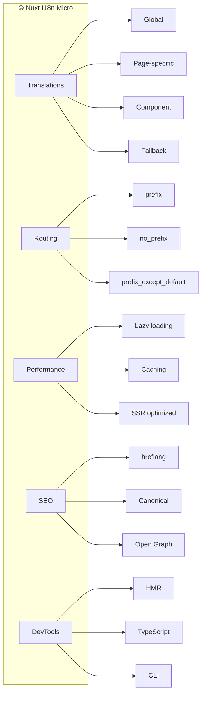
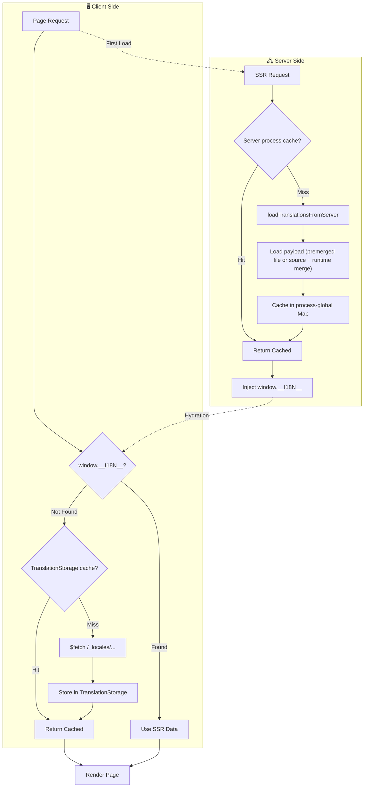

# 🌐 Getting Started with Nuxt I18n Micro

Welcome to Nuxt I18n Micro! This guide will help you get up and running with our high-performance internationalization module for Nuxt.js.


## 📖 Overview

`Nuxt I18n Micro` is a lightweight internationalization module for Nuxt that delivers superior performance compared to traditional solutions. It's designed to reduce build times, memory usage, and server load, making it ideal for high-traffic and large projects.


```mermaid
flowchart LR
    subgraph Core["🌐 Nuxt I18n Micro"]
        direction TB
        T[Translations]
        R[Routing]
        P[Performance]
        S[SEO]
        D[DevTools]
    end
    
    T --> T1[Global]
    T --> T2[Page-specific]
    T --> T3[Component]
    T --> T4[Fallback]
    
    R --> R1[prefix]
    R --> R2[no_prefix]
    R --> R3[prefix_except_default]
    
    P --> P1[Lazy loading]
    P --> P2[Caching]
    P --> P3[SSR optimized]
    
    S --> S1[hreflang]
    S --> S2[Canonical]
    S --> S3[Open Graph]
    
    D --> D1[HMR]
    D --> D2[TypeScript]
    D --> D3[CLI]
```

## 🤔 Why Choose Nuxt I18n Micro?

Here are some key benefits of using `Nuxt I18n Micro`:

- 🚀 **High Performance**: Significantly reduces build times and memory consumption
- 📦 **Compact Size**: Has minimal impact on your app's bundle size
- ⚙️ **Efficiency**: Optimized for large-scale applications with a focus on memory consumption and server load
- 🛠️ **Easy Setup**: Simple configuration with sensible defaults
- 🔧 **Flexible**: Extensive customization options for complex use cases
- 📚 **Well Documented**: Comprehensive documentation and examples

## 🚀 Quick Start

### Installation

Install the module in your Nuxt application:

::: code-group

```bash [npm]
npm install nuxt-i18n-micro
```

```bash [yarn]
yarn add nuxt-i18n-micro
```

```bash [pnpm]
pnpm add nuxt-i18n-micro
```

```bash [bun]
bun add nuxt-i18n-micro
```

:::

### Basic Configuration

Add the module to your `nuxt.config.ts`:

```typescript
export default defineNuxtConfig({
  modules: [
    'nuxt-i18n-micro',
  ],
  i18n: {
    locales: [
      { code: 'en', iso: 'en-US', dir: 'ltr' },
      { code: 'fr', iso: 'fr-FR', dir: 'ltr' },
      { code: 'ar', iso: 'ar-SA', dir: 'rtl' },
    ],
    defaultLocale: 'en',
    translationDir: 'locales',
  },
})
```

### Folder Structure

Your translation files will be automatically generated when you run the application. Here is the full project structure:

```tree
- name: my-nuxt-app
  description: "Nuxt project with i18n-micro"
  children:
    - name: nuxt.config.ts
      description: "module config"
      highlight: true
      preview: "export default defineNuxtConfig({\n  modules: ['nuxt-i18n-micro'],\n  i18n: {\n    locales: [\n      { code: 'en', iso: 'en-US', dir: 'ltr' },\n      { code: 'fr', iso: 'fr-FR', dir: 'ltr' },\n      { code: 'ar', iso: 'ar-SA', dir: 'rtl' },\n    ],\n    defaultLocale: 'en',\n    translationDir: 'locales',\n    meta: true,\n  },\n})"
    - name: package.json
      preview: "{\n  \"name\": \"my-nuxt-app\",\n  \"private\": true,\n  \"scripts\": {\n    \"dev\": \"nuxt dev\",\n    \"build\": \"nuxt build\",\n    \"generate\": \"nuxt generate\"\n  },\n  \"dependencies\": {\n    \"nuxt\": \"^3.x\",\n    \"nuxt-i18n-micro\": \"^3.x\"\n  }\n}"
    - name: pages
      description: "your Nuxt pages"
      children:
        - name: index.vue
          description: "home page"
          preview: "<template>\n  <div>\n    <h1>{{ $t('welcome') }}</h1>\n    <p>{{ $t('description') }}</p>\n  </div>\n</template>"
        - name: about.vue
          description: "about page"
          preview: "<template>\n  <div>\n    <h1>{{ $t('title') }}</h1>\n    <p>{{ $t('content') }}</p>\n  </div>\n</template>"
        - name: articles
          description: "dynamic route"
          children:
            - name: "[id].vue"
              preview: "<template>\n  <div>\n    <h1>{{ $t('article_title') }}</h1>\n  </div>\n</template>\n\n<script setup>\nconst route = useRoute()\nconst id = route.params.id\n</script>"
    - name: components
      children:
        - name: Header.vue
          preview: "<template>\n  <nav>\n    <i18n-link :to=\"{ name: 'index' }\">\n      {{ $t('menu.home') }}\n    </i18n-link>\n    <i18n-link :to=\"{ name: 'about' }\">\n      {{ $t('menu.about') }}\n    </i18n-link>\n    <i18n-switcher />\n  </nav>\n</template>"
        - name: Footer.vue
          preview: "<template>\n  <footer>\n    <p>{{ $t('footer.copyright') }}</p>\n  </footer>\n</template>"
    - name: locales
      description: "translation files"
      highlight: true
      children:
        - name: en.json
          description: "root-level translations (shared across all pages)"
          preview: "{\n  \"menu\": {\n    \"home\": \"Home\",\n    \"about\": \"About Us\"\n  },\n  \"footer\": {\n    \"copyright\": \"© 2025 My App\"\n  }\n}"
        - name: fr.json
          description: "root-level translations (shared across all pages)"
          preview: "{\n  \"menu\": {\n    \"home\": \"Accueil\",\n    \"about\": \"À propos\"\n  },\n  \"footer\": {\n    \"copyright\": \"© 2025 Mon App\"\n  }\n}"
        - name: ar.json
          description: "root-level translations (shared across all pages)"
          preview: "{\n  \"menu\": {\n    \"home\": \"الرئيسية\",\n    \"about\": \"من نحن\"\n  },\n  \"footer\": {\n    \"copyright\": \"© 2025 تطبيقي\"\n  }\n}"
        - name: pages
          description: "page-specific translations"
          children:
            - name: index
              note: "matches pages/index.vue"
              children:
                - name: en.json
                  preview: "{\n  \"welcome\": \"Welcome to My App\",\n  \"description\": \"A fast Nuxt application with i18n support.\"\n}"
                - name: fr.json
                  preview: "{\n  \"welcome\": \"Bienvenue sur Mon App\",\n  \"description\": \"Une application Nuxt rapide avec support i18n.\"\n}"
                - name: ar.json
                  preview: "{\n  \"welcome\": \"مرحباً بك في تطبيقي\",\n  \"description\": \"تطبيق Nuxt سريع مع دعم الترجمة.\"\n}"
            - name: about
              note: "matches pages/about.vue"
              children:
                - name: en.json
                  preview: "{\n  \"title\": \"About Us\",\n  \"content\": \"Learn more about our mission.\"\n}"
                - name: fr.json
                  preview: "{\n  \"title\": \"À propos\",\n  \"content\": \"En savoir plus sur notre mission.\"\n}"
                - name: ar.json
                  preview: "{\n  \"title\": \"من نحن\",\n  \"content\": \"تعرف على مهمتنا.\"\n}"
            - name: articles-id
              note: "matches pages/articles/[id].vue"
              children:
                - name: en.json
                  preview: "{\n  \"article_title\": \"Article Details\"\n}"
                - name: fr.json
                  preview: "{\n  \"article_title\": \"Détails de l'article\"\n}"
                - name: ar.json
                  preview: "{\n  \"article_title\": \"تفاصيل المقال\"\n}"
    - name: server
      open: false
      children:
        - name: api
          children:
            - name: example.ts
              preview: "export default defineEventHandler((event) => {\n  return { hello: 'world' }\n})"
        - name: tsconfig.json
          preview: "{\n  \"extends\": \"../.nuxt/tsconfig.server.json\"\n}"
```

::: tip Folder Structure Explanation

- **Root-Level Files** (`locales/en.json`, etc.) — translations shared across the entire app (menus, footer, common UI). With `translationPayloads.mode: 'premerged'` (default), they are merged into every page at build time.
- **Page-Specific Files** (`locales/pages/<route>/<locale>.json`) — translations unique to specific pages, loaded only when the page is visited
- **Dynamic Routes** — `pages/articles/[id].vue` maps to `locales/pages/articles-id/` (brackets replaced with dashes)
- **Auto-Generation** — all translation files are automatically created when missing during `nuxt dev`

:::

::: info Nuxt 4 (`app/` directory)

The module supports both layouts:

- **Pages**: `pages/**/*.vue` (Nuxt 3) or `app/pages/**/*.vue` (Nuxt 4)
- **Translations**: keep `locales/` at the **project root** by default (recommended convention), not inside `app/`

```tree
my-project/
├── app/
│   └── pages/
│       └── index.vue
├── locales/
│   ├── en.json
│   └── pages/
└── nuxt.config.ts
```

Optional colocation: `i18n: { translationDir: 'app/locales' }` (see [fixture `n3`](https://github.com/s00d/nuxt-i18n-micro/tree/main/test/fixtures/n3)).

For the optional CLI helper `text-to-i18n`, use [`nuxt-i18n-micro-cli` ≥ 2.1.1](/guide/cli#-text-to-i18n-command) so `app/pages` and `app/components` are scanned from the project root.

:::

### Basic Usage

Use translations in your components:

```vue
<template>
  <div>
    <h1>{{ $t('welcome') }}</h1>
    <p>{{ $t('description', { name: 'World' }) }}</p>
    
    <div>
      <button
        v-for="locale in $getLocales()"
        :key="locale.code"
        @click="$switchLocale(locale.code)"
      >
        {{ locale.code }}
      </button>
    </div>
  </div>
</template>

<script setup>
import { useI18n } from '#imports'

const { $t, $getLocales, $switchLocale } = useI18n()
</script>
```

## ⚙️ Configuration Options

The module exposes many options under the `i18n` key in `nuxt.config`. A minimal setup looks like this:

```typescript
export default defineNuxtConfig({
  modules: ['nuxt-i18n-micro'],
  i18n: {
    locales: [
      { code: 'en', iso: 'en-US', displayName: 'English' },
      { code: 'fr', iso: 'fr-FR', displayName: 'Français' },
    ],
    defaultLocale: 'en',
    strategy: 'prefix_except_default',
    translationDir: 'locales',
  },
})
```

For every option, default, and example, see the dedicated [Configuration Reference](./configuration.md).

| Area | Key options |
|------|-------------|
| Locales & routing | `locales`, `defaultLocale`, `strategy`, `globalLocaleRoutes` |
| Translations | `translationDir`, `fallbackLocale`, `disablePageLocales`, `translationPayloads` |
| SEO | `meta`, `metaBaseUrl`, `canonicalQueryWhitelist` |
| Runtime / CDN | `apiBaseUrl`, `apiBaseClientHost`, `apiBaseServerHost`, `cacheMaxSize`, `cacheTtl` |
| Plugins | `plugin`, `define`, `redirects`, `hooks`, `components` |

:::

## 🔄 Caching Mechanism

Nuxt I18n Micro v3 uses a multi-layer caching architecture built around `TranslationStorage` — a singleton class that uses `Symbol.for` on `globalThis` to ensure a single cache instance across bundles.

### Translation Loading Flow


```mermaid
flowchart TB
    subgraph Client["🖥️ Client Side"]
        A[Page Request] --> B{window.__I18N__?}
        B -->|Found| C[Use SSR Data]
        B -->|Not Found| D{TranslationStorage cache?}
        D -->|Hit| E[Return Cached]
        D -->|Miss| F["$fetch /_locales/..."]
        F --> G[Store in TranslationStorage]
        G --> E
    end

    subgraph Server["🖧 Server Side"]
        H[SSR Request] --> I{Server process cache?}
        I -->|Hit| J[Return Cached]
        I -->|Miss| K[loadTranslationsFromServer]
        K --> L["Load payload (premerged file or source + runtime merge)"]
        L --> M[Cache in process-global Map]
        M --> J
        J --> N["Inject window.__I18N__"]
    end

    A -.->|First Load| H
    N -.->|Hydration| B
    E --> O[Render Page]
    C --> O
```

### Key Characteristics

- 🚀 **Zero extra requests on first load**: SSR-injected data in `window.__I18N__` is consumed synchronously on hydration
- 💾 **Process-global server cache**: `loadTranslationsFromServer()` caches merged results via `Symbol.for` — loaded once per locale/page, served from memory for all subsequent requests
- ⚡ **Single request per page**: With `mode: 'premerged'` (default), the API returns a pre-built file (root + page-specific + fallback merged at build time). With `mode: 'source'`, the same route merges compact source files at runtime — see [translationPayloads](./configuration.md#translationpayloads).
- 🔄 **HMR in development**: When `hmr: true`, translation file changes invalidate the server cache automatically

See the [Cache & Storage Architecture](../api/i18n-cache-api.md) for in-depth details.

## 🌍 Locale State Management

In v3, all locale management goes through the centralized `useI18nLocale()` composable:

```ts
const { setLocale, getLocale, getPreferredLocale } = useI18nLocale()

// Set locale (updates useState + cookie atomically)
setLocale('fr')

// Get current locale
const locale = getLocale()
```

**Do not** use `useState('i18n-locale')` or `useCookie('user-locale')` directly. The `useI18nLocale()` composable manages both internally, ensuring consistency between server and client.

See the [Custom Language Detection](./custom-auto-detect.md) guide for advanced usage.

## 📚 Next Steps

Now that you have the basics set up, explore these advanced topics:

- **[Routing Strategies](./strategy.md)** - How locale prefixes and redirects work
- **[Per-Component Translations](./per-component-translations.md)** - Learn about `$defineI18nRoute`
- **[Custom Language Detection](./custom-auto-detect.md)** - Programmatic locale management with `useI18nLocale()`
- **[API Reference](../api/methods.md)** - Complete method documentation
- **[Cache & Storage](../api/i18n-cache-api.md)** - Translation cache architecture
- **[Examples](../examples.md)** - Real-world usage examples
- **[Migration Guide](./migration.md)** - Migrating from other i18n solutions or v2

