# 🌐 Getting Started with Nuxt I18n Micro

Welcome to Nuxt I18n Micro! This guide will help you get up and running with our high-performance internationalization module for Nuxt.js.


## 📖 Overview

`Nuxt I18n Micro` is a lightweight internationalization module for Nuxt that delivers superior performance compared to traditional solutions. It's designed to reduce build times, memory usage, and server load, making it ideal for high-traffic and large projects.

```mermaid
flowchart LR
    subgraph Core["🌐 Nuxt I18n Micro"]
        direction TB
        T[Translations]
        R[Routing]
        P[Performance]
        S[SEO]
        D[DevTools]
    end
    
    T --> T1[Global]
    T --> T2[Page-specific]
    T --> T3[Component]
    T --> T4[Fallback]
    
    R --> R1[prefix]
    R --> R2[no_prefix]
    R --> R3[prefix_except_default]
    
    P --> P1[Lazy loading]
    P --> P2[Caching]
    P --> P3[SSR optimized]
    
    S --> S1[hreflang]
    S --> S2[Canonical]
    S --> S3[Open Graph]
    
    D --> D1[HMR]
    D --> D2[TypeScript]
    D --> D3[CLI]
```



## 🤔 Why Choose Nuxt I18n Micro?

Here are some key benefits of using `Nuxt I18n Micro`:

- 🚀 **High Performance**: Significantly reduces build times and memory consumption
- 📦 **Compact Size**: Has minimal impact on your app's bundle size
- ⚙️ **Efficiency**: Optimized for large-scale applications with a focus on memory consumption and server load
- 🛠️ **Easy Setup**: Simple configuration with sensible defaults
- 🔧 **Flexible**: Extensive customization options for complex use cases
- 📚 **Well Documented**: Comprehensive documentation and examples

## 🚀 Quick Start

### Installation

Install the module in your Nuxt application:

::: code-group

```bash [npm]
npm install nuxt-i18n-micro
```

```bash [yarn]
yarn add nuxt-i18n-micro
```

```bash [pnpm]
pnpm add nuxt-i18n-micro
```

```bash [bun]
bun add nuxt-i18n-micro
```

:::

### Basic Configuration

Add the module to your `nuxt.config.ts`:

```typescript
export default defineNuxtConfig({
  modules: [
    'nuxt-i18n-micro',
  ],
  i18n: {
    locales: [
      { code: 'en', iso: 'en-US', dir: 'ltr' },
      { code: 'fr', iso: 'fr-FR', dir: 'ltr' },
      { code: 'ar', iso: 'ar-SA', dir: 'rtl' },
    ],
    defaultLocale: 'en',
    translationDir: 'locales',
  },
})
```

### Folder Structure

Your translation files will be automatically generated when you run the application:

```
/locales
├── /pages
│   ├── /index
│   │   ├── en.json
│   │   ├── fr.json
│   │   └── ar.json
│   └── /about
│       ├── en.json
│       ├── fr.json
│       └── ar.json
├── en.json
├── fr.json
└── ar.json
```

::: tip Folder Structure Explanation

- **Global Files**: Contain translations shared across the entire app
- **Page-Specific Files**: Contain translations unique to specific pages
- **Auto-Generation**: Files are automatically created when missing during development

:::

### Basic Usage

Use translations in your components:

```vue
<template>
  <div>
    <h1>{{ $t('welcome') }}</h1>
    <p>{{ $t('description', { name: 'World' }) }}</p>
    
    <div>
      <button
        v-for="locale in $getLocales()"
        :key="locale.code"
        @click="$switchLocale(locale.code)"
      >
        {{ locale.code }}
      </button>
    </div>
  </div>
</template>

<script setup>
import { useI18n } from '#imports'

const { $t, $getLocales, $switchLocale } = useI18n()
</script>
```

## ⚙️ Configuration Options

The module provides extensive configuration options to customize your internationalization setup.

### 🌍 Core Locale Settings

#### `locales`

Defines the locales available in your application.

**Type**: `Locale[]`

Each locale object supports:

| Property | Type | Required | Description |
|----------|------|----------|-------------|
| `code` | `string` | ✅ | Unique identifier (e.g., `'en'`) |
| `iso` | `string` | ❌ | ISO code (e.g., `'en-US'`) |
| `dir` | `string` | ❌ | Text direction (`'ltr'` or `'rtl'`) |
| `disabled` | `boolean` | ❌ | Disable in dropdown if `true` |
| `baseUrl` | `string` | ❌ | Base URL for locale-specific domains |
| `baseDefault` | `boolean` | ❌ | Remove locale prefix from URLs |

**Example**:

```typescript
locales: [
  { code: 'en', iso: 'en-US', dir: 'ltr' },
  { code: 'fr', iso: 'fr-FR', dir: 'ltr' },
  { code: 'ar', iso: 'ar-SA', dir: 'rtl', disabled: true },
  { 
    code: 'de', 
    iso: 'de-DE', 
    dir: 'ltr', 
    baseUrl: 'https://de.example.com', 
    baseDefault: true 
  },
]
```

::: warning BaseUrl Considerations

Using `baseUrl` can lead to duplication of internal routes as external links, complicating routing and maintenance. Consider creating external links directly for specific locales instead.

:::

#### `defaultLocale`

Sets the default locale when no specific locale is selected.

**Type**: `string`  
**Default**: `'en'`

```typescript
defaultLocale: 'en'
```

#### `strategy`

Defines how locale prefixes are handled in routes.

**Type**: `string`  
**Default**: `'prefix_except_default'`

::: code-group

```typescript [no_prefix]
strategy: 'no_prefix'
// Routes: /about, /contact
// Locale detection via browser/cookies
```

```typescript [prefix_except_default]
strategy: 'prefix_except_default'
// Default locale: /about, /contact
// Other locales: /fr/about, /de/contact
```

```typescript [prefix]
strategy: 'prefix'
// All locales: /en/about, /fr/about, /de/about
```

```typescript [prefix_and_default]
strategy: 'prefix_and_default'
// Both prefixed and non-prefixed versions for default locale
```

:::

#### `includeDefaultLocaleRoute`

::: danger Deprecated
This option is **deprecated** since v3.0.0. Use `strategy` instead:
- `includeDefaultLocaleRoute: true` → `strategy: 'prefix_and_default'`
- `includeDefaultLocaleRoute: false` → `strategy: 'prefix_except_default'`

If this option is set, a deprecation warning will be logged to the console.
:::

### 📂 Translation Management

#### `translationDir`

Specifies the directory for translation files.

**Type**: `string`  
**Default**: `'locales'`

```typescript
translationDir: 'i18n' // Custom directory
```

#### `disablePageLocales`

Disables page-specific translations, using only global files.

**Type**: `boolean`  
**Default**: `false`

When enabled, only global translation files are used:

```
/locales
├── en.json
├── fr.json
└── ar.json
```

#### `fallbackLocale`

Specifies a fallback locale for missing translations.

**Type**: `string | undefined`  
**Default**: `undefined`

```typescript
{
  locales: [
    { code: 'en', iso: 'en-US', dir: 'ltr' },
    { code: 'fr', iso: 'fr-FR', dir: 'ltr', fallbackLocale: 'es' },
    { code: 'es', iso: 'es-ES', dir: 'ltr' }
  ],
  defaultLocale: 'en',
  fallbackLocale: 'en' // Global fallback
}
```

### 🔍 SEO & Meta Tags

#### `meta`

Enables automatic SEO meta tag generation.

**Type**: `boolean`  
**Default**: `true`

```typescript
meta: true // Generate alternate links, canonical URLs, etc.
```

#### `metaBaseUrl`

Sets the base URL for SEO meta tags.

**Type**: `string`  
**Default**: `'/'`

```typescript
metaBaseUrl: 'https://example.com'
```

#### `canonicalQueryWhitelist`

Specifies which query parameters to preserve in canonical URLs.

**Type**: `string[]`  
**Default**: `['page', 'sort', 'filter', 'search', 'q', 'query', 'tag']`

```typescript
canonicalQueryWhitelist: ['page', 'sort', 'category']
```

### 🔄 Advanced Features

#### `globalLocaleRoutes`

Defines custom localized routes for specific pages.

**Type**: `Record<string, Record<string, string> | false>`

```typescript
globalLocaleRoutes: {
  'about': {
    en: '/about-us',
    fr: '/a-propos',
    de: '/uber-uns'
  },
  'unlocalized': false // Disable localization entirely
}
```

#### `routesLocaleLinks`

Creates links between pages' locale files to share translations.

**Type**: `Record<string, string>`

```typescript
routesLocaleLinks: {
  'products-id': 'products',
  'about-us': 'about'
}
```

#### `customRegexMatcher`

Improves performance for applications with many locales. The pattern matches the **entire** first path segment (anchors `^` and `$` are applied automatically).

**Type**: `string | RegExp`

```typescript
customRegexMatcher: '[a-z]{2}-[a-z]{2}' // Matches locales like 'en-us', 'de-de'
```

### 🛠️ Development Options

#### `debug`

Enables logging and debugging information.

**Type**: `boolean`  
**Default**: `false`

```typescript
debug: true
```

#### `disableWatcher`

Disables automatic creation of locale files during development.

**Type**: `boolean`  
**Default**: `false`

```typescript
disableWatcher: true
```

#### `missingWarn`

Controls whether to show console warnings when translation keys are not found.

**Type**: `boolean`  
**Default**: `true`

```typescript
missingWarn: false // Disable warnings for missing translations
```

::: tip Custom Missing Handler

You can set a custom handler for missing translations using `setMissingHandler` method. This allows you to send missing translation errors to error tracking services like Sentry.

:::

### 🔧 Plugin Control

#### `define`

Enables the `define` plugin for runtime configuration.

**Type**: `boolean`  
**Default**: `true`

```typescript
define: false // Disables $defineI18nRoute
```

#### `redirects`

Enables automatic redirection logic.

**Type**: `boolean`  
**Default**: `true`

```typescript
redirects: false // Disable automatic locale redirection
```

#### `plugin`

Enables the main plugin.

**Type**: `boolean`  
**Default**: `true`

```typescript
plugin: false
```

#### `hooks`

Enables hooks integration.

**Type**: `boolean`  
**Default**: `true`

```typescript
hooks: false
```

### 🌐 Language Detection

#### `autoDetectLanguage`

Automatically detects user's preferred language.

**Type**: `boolean`  
**Default**: `false`

```typescript
autoDetectLanguage: true
```

#### `autoDetectPath`

Specifies routes where locale detection is active.

**Type**: `string`  
**Default**: `"/"`

```typescript
autoDetectPath: "/" // Only on home route
autoDetectPath: "*" // On all routes (use with caution)
```

### 🔢 Customization

#### `plural`

Custom function for handling pluralization.

**Type**: `(key: string, count: number, params: Record<string, string | number | boolean>, locale: string, t: Getter) => string`

```typescript
plural: (key, count, _params, _locale, t) => {
  const translation = t(key)
  if (!translation) return key
  
  const forms = translation.toString().split('|')
  return (count < forms.length ? forms[count].trim() : forms[forms.length - 1].trim())
    .replace('{count}', count.toString())
}
```

#### `localeCookie`

Specifies the cookie name for storing user's locale. This enables locale persistence across page reloads and browser sessions. By default, cookie-based locale persistence is disabled.

**Type**: `string | null`  
**Default**: `null`

::: tip Automatic for `no_prefix` strategy
When using `strategy: 'no_prefix'`, `localeCookie` is automatically set to `'user-locale'` if not specified. This is required to persist the locale between page reloads since there's no locale information in the URL.
:::

::: warning Required for redirects with prefix strategies
When using prefix strategies (`prefix`, `prefix_except_default`, `prefix_and_default`) with `redirects: true` (the default), you **must** set `localeCookie` for redirect behavior to work correctly. Without a cookie, the redirect plugin cannot remember the user's locale preference across page reloads, and redirects will only work based on `Accept-Language` header (if `autoDetectLanguage: true`) or `defaultLocale`.
:::

```typescript
// Enable cookie (recommended when using redirects with prefix strategies)
localeCookie: 'user-locale'

// Enable cookie with custom name
localeCookie: 'my-locale-cookie'

// Disable cookie (default) - locale won't persist across reloads
localeCookie: null
```

**What `localeCookie` enables:**
- Persists user's locale preference across page reloads
- Remembers locale when user returns to your site
- Required for `no_prefix` strategy to work correctly
- **Required** for redirect behavior in prefix strategies (when `redirects: true`)

#### `apiBaseUrl`

Defines the path prefix for fetching cached translations. This is a path prefix only, not a full URL.

**Type**: `string`  
**Default**: `'/_locales'`  
**Environment Variable**: `NUXT_I18N_APP_BASE_URL`

```typescript
apiBaseUrl: 'api/_locales'
```

The translations will be fetched from `/{apiBaseUrl}/{routeName}/{locale}/data.json` (e.g., `/api/_locales/general/en/data.json`).

#### `apiBaseClientHost`

Defines the base host URL for fetching translations from a CDN or external server on the client side. Use this when translations are hosted on a different domain and need to be fetched from the browser.

**Type**: `string | undefined`  
**Default**: `undefined`  
**Environment Variable**: `NUXT_I18N_APP_BASE_CLIENT_HOST`

```typescript
apiBaseClientHost: 'https://cdn.example.com'
```

When `apiBaseClientHost` is set, client-side translations will be fetched from `{apiBaseClientHost}/{apiBaseUrl}/{routeName}/{locale}/data.json` (e.g., `https://cdn.example.com/_locales/general/en/data.json`).

#### `apiBaseServerHost`

Defines the base host URL for fetching translations from a CDN or external server on the server side (SSR). Use this when translations are hosted on a different domain and need to be fetched during server-side rendering.

**Type**: `string | undefined`  
**Default**: `undefined`  
**Environment Variable**: `NUXT_I18N_APP_BASE_SERVER_HOST`

```typescript
apiBaseServerHost: 'https://internal-cdn.example.com'
```

When `apiBaseServerHost` is set, server-side translations will be fetched from `{apiBaseServerHost}/{apiBaseUrl}/{routeName}/{locale}/data.json` (e.g., `https://internal-cdn.example.com/_locales/general/en/data.json`).

::: tip
Use `apiBaseUrl` for path prefixes, `apiBaseClientHost` for client-side CDN/external domain hosting, and `apiBaseServerHost` for server-side CDN/external domain hosting. This allows you to use different CDNs for client and server requests.
:::

### 🔄 Additional Features

#### `previousPageFallback`

Enables fallback to previous page translations during page transitions. When navigating between pages, if a translation key is not found on the new page, the module will look for it in the translations from the previous page.

**Type**: `boolean`  
**Default**: `false`

```typescript
export default defineNuxtConfig({
  i18n: {
    previousPageFallback: true
  }
})
```

:::: tip Use Case

This is especially helpful for pages with asynchronous data loading (`useAsyncData`, `defineAsyncComponent`) that may cause translation keys to be displayed as raw paths during loading.

::::

#### `hmr`

Enables server-side HMR for translations during development. When enabled, the module watches your translation files and invalidates the in-memory server cache for changed locales/pages so that requests immediately get fresh data without restarting the server.

**Type**: `boolean`  
**Default**: `true` (development only)

```typescript
export default defineNuxtConfig({
  i18n: {
    // Hot updates for translation files in dev mode
    hmr: true,
  },
})
```

## 🔄 Caching Mechanism

One of the standout features of `Nuxt I18n Micro` is its **intelligent caching system**. When a translation is requested during server-side rendering (SSR), the result is stored in a cache. This means that subsequent requests for the same translation can retrieve the data from the cache rather than searching through the translation files again.

### Translation Loading Flow


### Benefits

- 🚀 **Faster Response Times**: Cached translations load instantly
- 💾 **Reduced Memory Usage**: Efficient storage of frequently used translations
- ⚡ **Lower Server Load**: Fewer file system operations
- 🔄 **Smart Invalidation**: Cache updates automatically when files change

## 📚 Next Steps

Now that you have the basics set up, explore these advanced topics:

- **[Per-Component Translations](./per-component-translations.md)** - Learn about `$defineI18nRoute`
- **[API Reference](../api/methods.md)** - Complete method documentation
- **[Examples](../examples.md)** - Real-world usage examples
- **[Migration Guide](./migration.md)** - Migrating from other i18n solutions

