# 🌐 Getting Started with Nuxt I18n Micro

Welcome to Nuxt I18n Micro! This guide will help you get up and running with our high-performance internationalization module for Nuxt.js.


## 📖 Overview

`Nuxt I18n Micro` is a lightweight internationalization module for Nuxt that delivers superior performance compared to traditional solutions. It's designed to reduce build times, memory usage, and server load, making it ideal for high-traffic and large projects.

```mermaid
flowchart LR
    subgraph Core["🌐 Nuxt I18n Micro"]
        direction TB
        T[Translations]
        R[Routing]
        P[Performance]
        S[SEO]
        D[DevTools]
    end
    
    T --> T1[Global]
    T --> T2[Page-specific]
    T --> T3[Component]
    T --> T4[Fallback]
    
    R --> R1[prefix]
    R --> R2[no_prefix]
    R --> R3[prefix_except_default]
    
    P --> P1[Lazy loading]
    P --> P2[Caching]
    P --> P3[SSR optimized]
    
    S --> S1[hreflang]
    S --> S2[Canonical]
    S --> S3[Open Graph]
    
    D --> D1[HMR]
    D --> D2[TypeScript]
    D --> D3[CLI]
```



## 🤔 Why Choose Nuxt I18n Micro?

Here are some key benefits of using `Nuxt I18n Micro`:

- 🚀 **High Performance**: Significantly reduces build times and memory consumption
- 📦 **Compact Size**: Has minimal impact on your app's bundle size
- ⚙️ **Efficiency**: Optimized for large-scale applications with a focus on memory consumption and server load
- 🛠️ **Easy Setup**: Simple configuration with sensible defaults
- 🔧 **Flexible**: Extensive customization options for complex use cases
- 📚 **Well Documented**: Comprehensive documentation and examples

## 🚀 Quick Start

### Installation

Install the module in your Nuxt application:

::: code-group

```bash [npm]
npm install nuxt-i18n-micro
```

```bash [yarn]
yarn add nuxt-i18n-micro
```

```bash [pnpm]
pnpm add nuxt-i18n-micro
```

```bash [bun]
bun add nuxt-i18n-micro
```

:::

### Basic Configuration

Add the module to your `nuxt.config.ts`:

```typescript
export default defineNuxtConfig({
  modules: [
    'nuxt-i18n-micro',
  ],
  i18n: {
    locales: [
      { code: 'en', iso: 'en-US', dir: 'ltr' },
      { code: 'fr', iso: 'fr-FR', dir: 'ltr' },
      { code: 'ar', iso: 'ar-SA', dir: 'rtl' },
    ],
    defaultLocale: 'en',
    translationDir: 'locales',
  },
})
```

### Folder Structure

Your translation files will be automatically generated when you run the application. Here is the full project structure:

```tree
- name: my-nuxt-app
  description: "Nuxt project with i18n-micro"
  children:
    - name: nuxt.config.ts
      description: "module config"
      highlight: true
      preview: "export default defineNuxtConfig({\n  modules: ['nuxt-i18n-micro'],\n  i18n: {\n    locales: [\n      { code: 'en', iso: 'en-US', dir: 'ltr' },\n      { code: 'fr', iso: 'fr-FR', dir: 'ltr' },\n      { code: 'ar', iso: 'ar-SA', dir: 'rtl' },\n    ],\n    defaultLocale: 'en',\n    translationDir: 'locales',\n    meta: true,\n  },\n})"
    - name: package.json
      preview: "{\n  \"name\": \"my-nuxt-app\",\n  \"private\": true,\n  \"scripts\": {\n    \"dev\": \"nuxt dev\",\n    \"build\": \"nuxt build\",\n    \"generate\": \"nuxt generate\"\n  },\n  \"dependencies\": {\n    \"nuxt\": \"^3.x\",\n    \"nuxt-i18n-micro\": \"^3.x\"\n  }\n}"
    - name: pages
      description: "your Nuxt pages"
      children:
        - name: index.vue
          description: "home page"
          preview: "<template>\n  <div>\n    <h1>{{ $t('welcome') }}</h1>\n    <p>{{ $t('description') }}</p>\n  </div>\n</template>"
        - name: about.vue
          description: "about page"
          preview: "<template>\n  <div>\n    <h1>{{ $t('title') }}</h1>\n    <p>{{ $t('content') }}</p>\n  </div>\n</template>"
        - name: articles
          description: "dynamic route"
          children:
            - name: "[id].vue"
              preview: "<template>\n  <div>\n    <h1>{{ $t('article_title') }}</h1>\n  </div>\n</template>\n\n<script setup>\nconst route = useRoute()\nconst id = route.params.id\n</script>"
    - name: components
      children:
        - name: Header.vue
          preview: "<template>\n  <nav>\n    <i18n-link :to=\"{ name: 'index' }\">\n      {{ $t('menu.home') }}\n    </i18n-link>\n    <i18n-link :to=\"{ name: 'about' }\">\n      {{ $t('menu.about') }}\n    </i18n-link>\n    <i18n-switcher />\n  </nav>\n</template>"
        - name: Footer.vue
          preview: "<template>\n  <footer>\n    <p>{{ $t('footer.copyright') }}</p>\n  </footer>\n</template>"
    - name: locales
      description: "translation files"
      highlight: true
      children:
        - name: en.json
          description: "root-level translations (shared across all pages)"
          preview: "{\n  \"menu\": {\n    \"home\": \"Home\",\n    \"about\": \"About Us\"\n  },\n  \"footer\": {\n    \"copyright\": \"© 2025 My App\"\n  }\n}"
        - name: fr.json
          description: "root-level translations (shared across all pages)"
          preview: "{\n  \"menu\": {\n    \"home\": \"Accueil\",\n    \"about\": \"À propos\"\n  },\n  \"footer\": {\n    \"copyright\": \"© 2025 Mon App\"\n  }\n}"
        - name: ar.json
          description: "root-level translations (shared across all pages)"
          preview: "{\n  \"menu\": {\n    \"home\": \"الرئيسية\",\n    \"about\": \"من نحن\"\n  },\n  \"footer\": {\n    \"copyright\": \"© 2025 تطبيقي\"\n  }\n}"
        - name: pages
          description: "page-specific translations"
          children:
            - name: index
              note: "matches pages/index.vue"
              children:
                - name: en.json
                  preview: "{\n  \"welcome\": \"Welcome to My App\",\n  \"description\": \"A fast Nuxt application with i18n support.\"\n}"
                - name: fr.json
                  preview: "{\n  \"welcome\": \"Bienvenue sur Mon App\",\n  \"description\": \"Une application Nuxt rapide avec support i18n.\"\n}"
                - name: ar.json
                  preview: "{\n  \"welcome\": \"مرحباً بك في تطبيقي\",\n  \"description\": \"تطبيق Nuxt سريع مع دعم الترجمة.\"\n}"
            - name: about
              note: "matches pages/about.vue"
              children:
                - name: en.json
                  preview: "{\n  \"title\": \"About Us\",\n  \"content\": \"Learn more about our mission.\"\n}"
                - name: fr.json
                  preview: "{\n  \"title\": \"À propos\",\n  \"content\": \"En savoir plus sur notre mission.\"\n}"
                - name: ar.json
                  preview: "{\n  \"title\": \"من نحن\",\n  \"content\": \"تعرف على مهمتنا.\"\n}"
            - name: articles-id
              note: "matches pages/articles/[id].vue"
              children:
                - name: en.json
                  preview: "{\n  \"article_title\": \"Article Details\"\n}"
                - name: fr.json
                  preview: "{\n  \"article_title\": \"Détails de l'article\"\n}"
                - name: ar.json
                  preview: "{\n  \"article_title\": \"تفاصيل المقال\"\n}"
    - name: server
      open: false
      children:
        - name: api
          children:
            - name: example.ts
              preview: "export default defineEventHandler((event) => {\n  return { hello: 'world' }\n})"
        - name: tsconfig.json
          preview: "{\n  \"extends\": \"../.nuxt/tsconfig.server.json\"\n}"
```

::: tip Folder Structure Explanation

- **Root-Level Files** (`locales/en.json`, etc.) — translations shared across the entire app (menus, footer, common UI), merged into every page at build time
- **Page-Specific Files** (`locales/pages/<route>/<locale>.json`) — translations unique to specific pages, loaded only when the page is visited
- **Dynamic Routes** — `pages/articles/[id].vue` maps to `locales/pages/articles-id/` (brackets replaced with dashes)
- **Auto-Generation** — all translation files are automatically created when missing during `nuxt dev`

:::

### Basic Usage

Use translations in your components:

```vue
<template>
  <div>
    <h1>{{ $t('welcome') }}</h1>
    <p>{{ $t('description', { name: 'World' }) }}</p>
    
    <div>
      <button
        v-for="locale in $getLocales()"
        :key="locale.code"
        @click="$switchLocale(locale.code)"
      >
        {{ locale.code }}
      </button>
    </div>
  </div>
</template>

<script setup>
import { useI18n } from '#imports'

const { $t, $getLocales, $switchLocale } = useI18n()
</script>
```

## ⚙️ Configuration Options

The module provides extensive configuration options to customize your internationalization setup.

### 🌍 Core Locale Settings

#### `locales`

Defines the locales available in your application.

**Type**: `Locale[]`

Each locale object supports:

| Property | Type | Required | Description |
|----------|------|----------|-------------|
| `code` | `string` | ✅ | Unique identifier (e.g., `'en'`) |
| `iso` | `string` | ❌ | ISO code (e.g., `'en-US'`) |
| `dir` | `string` | ❌ | Text direction (`'ltr'` or `'rtl'`) |
| `disabled` | `boolean` | ❌ | Disable in dropdown if `true` |
| `baseUrl` | `string` | ❌ | Base URL for locale-specific domains |
| `baseDefault` | `boolean` | ❌ | Remove locale prefix from URLs |
| `fallbackLocale` | `string` | ❌ | Per-locale fallback (overrides global) |
| `[key: string]` | `unknown` | ❌ | Any custom properties (see below) |

**Example**:

```typescript
locales: [
  { code: 'en', iso: 'en-US', dir: 'ltr' },
  { code: 'fr', iso: 'fr-FR', dir: 'ltr' },
  { code: 'ar', iso: 'ar-SA', dir: 'rtl', disabled: true },
  { 
    code: 'de', 
    iso: 'de-DE', 
    dir: 'ltr', 
    baseUrl: 'https://de.example.com', 
    baseDefault: true 
  },
]
```

::: warning BaseUrl Considerations

Using `baseUrl` can lead to duplication of internal routes as external links, complicating routing and maintenance. Consider creating external links directly for specific locales instead.

:::

#### Custom Locale Properties

You can add any custom properties to locale objects. They are passed through to the runtime and accessible via `$getLocales()`:

```typescript
locales: [
  { code: 'en', iso: 'en-US', flag: '🇬🇧', currency: 'GBP' },
  { code: 'de', iso: 'de-DE', flag: '🇩🇪', currency: 'EUR' },
  { code: 'ru', iso: 'ru-RU', flag: '🇷🇺', currency: 'RUB' },
]
```

Access them in components:

```vue
<template>
  <ul>
    <li v-for="locale in $getLocales()" :key="locale.code">
      {{ locale.flag }} {{ locale.displayName }} ({{ locale.currency }})
    </li>
  </ul>
</template>
```

By default, custom properties are typed as `unknown`. To get full TypeScript support, use **module augmentation**. Create a declaration file (e.g., `app/i18n.d.ts` or any `.d.ts` included in your `tsconfig`):

```typescript
// app/i18n.d.ts
declare module '@i18n-micro/types' {
  interface Locale {
    flag?: string
    currency?: string
  }
}
```

After this, all custom properties are fully typed:

```typescript
const locales = $getLocales()
locales[0].flag     // string | undefined ✅
locales[0].currency // string | undefined ✅
```

::: tip
Module augmentation works because `Locale` is an `interface` (not a `type`), so TypeScript merges your declarations with the original definition. This applies everywhere — `$getLocales()`, `useI18n()`, server middleware, etc.
:::

#### `defaultLocale`

Sets the default locale when no specific locale is selected.

**Type**: `string`  
**Default**: `'en'`

```typescript
defaultLocale: 'en'
```

#### `strategy`

Defines how locale prefixes are handled in routes.

**Type**: `string`  
**Default**: `'prefix_except_default'`

::: code-group

```typescript [no_prefix]
strategy: 'no_prefix'
// Routes: /about, /contact
// Locale detection via browser/cookies
```

```typescript [prefix_except_default]
strategy: 'prefix_except_default'
// Default locale: /about, /contact
// Other locales: /fr/about, /de/contact
```

```typescript [prefix]
strategy: 'prefix'
// All locales: /en/about, /fr/about, /de/about
```

```typescript [prefix_and_default]
strategy: 'prefix_and_default'
// Both prefixed and non-prefixed versions for default locale
```

:::

### 📂 Translation Management

#### `translationDir`

Specifies the directory for translation files.

**Type**: `string`  
**Default**: `'locales'`

```typescript
translationDir: 'i18n' // Custom directory
```

#### `disablePageLocales`

Disables page-specific translations, using only root-level files.

**Type**: `boolean`  
**Default**: `false`

When enabled, only root-level translation files are used:

```tree
locales/
├── en.json
├── fr.json
└── ar.json
```

#### `fallbackLocale`

Specifies a fallback locale for missing translations.

**Type**: `string | undefined`  
**Default**: `undefined`

```typescript
{
  locales: [
    { code: 'en', iso: 'en-US', dir: 'ltr' },
    { code: 'fr', iso: 'fr-FR', dir: 'ltr', fallbackLocale: 'es' },
    { code: 'es', iso: 'es-ES', dir: 'ltr' }
  ],
  defaultLocale: 'en',
  fallbackLocale: 'en' // Global fallback
}
```

### 🔍 SEO & Meta Tags

#### `meta`

Enables automatic SEO meta tag generation.

**Type**: `boolean`  
**Default**: `true`

```typescript
meta: true // Generate alternate links, canonical URLs, etc.
```

#### `metaBaseUrl`

Sets the base URL for SEO meta tags (canonical, og:url, hreflang).

**Type**: `string | undefined`  
**Default**: `undefined`

- `undefined` (or omitted) — the base URL is resolved dynamically from the incoming request on the server (`useRequestURL().origin`, respects `X-Forwarded-Host` / `X-Forwarded-Proto` proxy headers) and from `window.location.origin` on the client. Ideal for **multi-domain** deployments where the same application serves multiple hostnames.
- Any other string — used as a static base URL.

```typescript
// Dynamic — automatically uses the current request hostname (recommended for multi-domain)
// Simply omit metaBaseUrl or set it to undefined

// Static — always uses the specified URL
metaBaseUrl: 'https://example.com'
```

#### `canonicalQueryWhitelist`

Specifies which query parameters to preserve in canonical URLs.

**Type**: `string[]`  
**Default**: `['page', 'sort', 'filter', 'search', 'q', 'query', 'tag']`

```typescript
canonicalQueryWhitelist: ['page', 'sort', 'category']
```

### 🔄 Advanced Features

#### `globalLocaleRoutes`

Defines custom localized routes for specific pages.

**Type**: `Record<string, Record<string, string> | false>`

```typescript
globalLocaleRoutes: {
  'about': {
    en: '/about-us',
    fr: '/a-propos',
    de: '/uber-uns'
  },
  'unlocalized': false // Disable localization entirely
}
```

#### `routesLocaleLinks`

Creates links between pages' locale files to share translations.

**Type**: `Record<string, string>`

```typescript
routesLocaleLinks: {
  'products-id': 'products',
  'about-us': 'about'
}
```

#### `customRegexMatcher`

Improves performance for applications with many locales. Instead of checking each locale code one by one, the module uses a single regex to detect whether the first path segment is a locale. The pattern matches the **entire** first path segment (anchors `^` and `$` are applied automatically).

**Type**: `string | RegExp`  
**Default**: `undefined` (auto-generated from locale codes)

::: danger Must match ALL locale codes
At build time, the module **validates** that every locale code in your `locales` list matches the `customRegexMatcher` pattern. If any locale code does not match, **the build will fail** with the error:

> `Nuxt-i18n-micro: Some locale codes does not match customRegexMatcher`

Always verify your regex against all your locale codes before deploying.
:::

```typescript
// ✅ Correct: matches 'en-us', 'de-de', 'fr-fr'
customRegexMatcher: '[a-z]{2}-[a-z]{2}'

// ✅ Correct: matches 'en', 'de', 'fr', 'zh'
customRegexMatcher: '[a-z]{2}'

// ❌ Wrong: won't match 'zh-Hant' (uppercase letter)
// This will FAIL the build if 'zh-Hant' is in your locales list
customRegexMatcher: '[a-z]{2}-[a-z]{2}'
```

### 🛠️ Development Options

#### `debug`

Enables logging and debugging information.

**Type**: `boolean`  
**Default**: `false`

```typescript
debug: true
```

#### `disableWatcher`

Disables automatic creation of locale files during development.

**Type**: `boolean`  
**Default**: `false`

```typescript
disableWatcher: true
```

#### `missingWarn`

Controls whether to show console warnings when translation keys are not found.

**Type**: `boolean`  
**Default**: `true`

```typescript
missingWarn: false // Disable warnings for missing translations
```

::: tip Custom Missing Handler

You can set a custom handler for missing translations using `setMissingHandler` method. This allows you to send missing translation errors to error tracking services like Sentry.

:::

### 🔧 Plugin Control

#### `define`

Enables the `define` plugin for runtime configuration.

**Type**: `boolean`  
**Default**: `true`

```typescript
define: false // Disables $defineI18nRoute
```

#### `redirects`

Enables automatic locale-based redirects. When `true`, visitors are redirected to their preferred locale (detected from cookie, `Accept-Language` header, or the default) on the first visit. When `false`, only the redirect logic is disabled — the plugin still handles 404 checks and cookie synchronization.

**Type**: `boolean`  
**Default**: `true`

```typescript
redirects: false // Disable automatic locale redirection (404 checks and cookie sync remain active)
```

#### `plugin`

Enables the main plugin.

**Type**: `boolean`  
**Default**: `true`

```typescript
plugin: false
```

#### `hooks`

Enables hooks integration.

**Type**: `boolean`  
**Default**: `true`

```typescript
hooks: false
```

#### `components`

Registers the built-in i18n components (`<i18n-link>`, `<i18n-switcher>`, `<i18n-t>`, `<i18n-group>`). Set to `false` to disable automatic component registration — useful if you don't use the built-in components and want to reduce the module footprint.

**Type**: `boolean`  
**Default**: `true`

```typescript
components: false // Disable built-in i18n components
```

### 🌐 Language Detection

#### `autoDetectLanguage`

Automatically detects user's preferred language.

**Type**: `boolean`  
**Default**: `true`

```typescript
autoDetectLanguage: false
```

#### `autoDetectPath`

Specifies routes where locale detection is active.

**Type**: `string`  
**Default**: `"/"`

```typescript
autoDetectPath: "/" // Only on home route
autoDetectPath: "*" // On all routes (use with caution)
```

### 🔢 Customization

#### `plural`

Custom function for handling pluralization.

**Type**: `(key: string, count: number, params: Record<string, string | number | boolean>, locale: string, t: Getter) => string`

```typescript
plural: (key, count, _params, _locale, t) => {
  const translation = t(key)
  if (!translation) return key
  
  const forms = translation.toString().split('|')
  return (count < forms.length ? forms[count].trim() : forms[forms.length - 1].trim())
    .replace('{count}', count.toString())
}
```

#### `localeCookie`

Specifies the cookie name for storing user's locale. This enables locale persistence across page reloads and browser sessions.

**Type**: `string | null`  
**Default**: `null` (but see note below about `no_prefix`)

::: warning Effective default depends on strategy
While the configured default is `null` (disabled), the module **automatically overrides** this to `'user-locale'` when using `strategy: 'no_prefix'`. This means:

- **`no_prefix`**: Cookie is **always enabled** (`'user-locale'`), even if you don't set it explicitly. This is required because the URL contains no locale information.
- **All other strategies**: Cookie is `null` (disabled) unless you set it explicitly.

If you set `localeCookie` explicitly, your value is always used regardless of strategy.
:::

::: warning Required for redirects with prefix strategies
When using prefix strategies (`prefix`, `prefix_except_default`, `prefix_and_default`) with `redirects: true` (the default), you **must** set `localeCookie` for redirect behavior to work correctly. Without a cookie, the redirect plugin cannot remember the user's locale preference across page reloads, and redirects will only work based on `Accept-Language` header (if `autoDetectLanguage: true`) or `defaultLocale`.
:::

```typescript
// Enable cookie (recommended when using redirects with prefix strategies)
localeCookie: 'user-locale'

// Enable cookie with custom name
localeCookie: 'my-locale-cookie'

// Disable cookie (default) - locale won't persist across reloads
localeCookie: null
```

**What `localeCookie` enables:**
- Persists user's locale preference across page reloads
- Remembers locale when user returns to your site
- Required for `no_prefix` strategy to work correctly
- **Required** for redirect behavior in prefix strategies (when `redirects: true`)

#### `apiBaseUrl`

Defines the path prefix for fetching cached translations. This is a path prefix only, not a full URL.

**Type**: `string`  
**Default**: `'_locales'`  
**Environment Variable**: `NUXT_I18N_APP_BASE_URL`

```typescript
apiBaseUrl: 'api/_locales'
```

The translations will be fetched from `/{apiBaseUrl}/{routeName}/{locale}/data.json` (e.g., `/api/_locales/index/en/data.json`).

#### `apiBaseClientHost`

Defines the base host URL for fetching translations from a CDN or external server on the client side. Use this when translations are hosted on a different domain and need to be fetched from the browser.

**Type**: `string | undefined`  
**Default**: `undefined`  
**Environment Variable**: `NUXT_I18N_APP_BASE_CLIENT_HOST`

```typescript
apiBaseClientHost: 'https://cdn.example.com'
```

When `apiBaseClientHost` is set, client-side translations will be fetched from `{apiBaseClientHost}/{apiBaseUrl}/{routeName}/{locale}/data.json` (e.g., `https://cdn.example.com/_locales/index/en/data.json`).

#### `apiBaseServerHost`

Defines the base host URL for fetching translations from a CDN or external server on the server side (SSR). Use this when translations are hosted on a different domain and need to be fetched during server-side rendering.

**Type**: `string | undefined`  
**Default**: `undefined`  
**Environment Variable**: `NUXT_I18N_APP_BASE_SERVER_HOST`

```typescript
apiBaseServerHost: 'https://internal-cdn.example.com'
```

When `apiBaseServerHost` is set, server-side translations will be fetched from `{apiBaseServerHost}/{apiBaseUrl}/{routeName}/{locale}/data.json` (e.g., `https://internal-cdn.example.com/_locales/index/en/data.json`).

::: tip
Use `apiBaseUrl` for path prefixes, `apiBaseClientHost` for client-side CDN/external domain hosting, and `apiBaseServerHost` for server-side CDN/external domain hosting. This allows you to use different CDNs for client and server requests.
:::

### 🔒 Proxy & Security

#### `metaTrustForwardedHost`

Trust the `X-Forwarded-Host` header when resolving the base URL for meta tags. Enable when the app runs behind a reverse proxy (nginx, Cloudflare, AWS ALB, etc.) that sets this header to the real client-facing hostname.

**Type**: `boolean`  
**Default**: `true`

```typescript
metaTrustForwardedHost: false // Ignore X-Forwarded-Host header
```

#### `metaTrustForwardedProto`

Trust the `X-Forwarded-Proto` header when resolving the protocol for meta tags. Enable when the app runs behind a TLS-terminating proxy so that canonical URLs use `https://` even though the app itself listens on HTTP.

**Type**: `boolean`  
**Default**: `true`

```typescript
metaTrustForwardedProto: false // Ignore X-Forwarded-Proto header
```

### 🔄 Additional Features

#### `noPrefixRedirect`

When using `no_prefix` strategy, controls whether paths that start with a locale segment (e.g. `/en/about`) are automatically redirected to the unprefixed version (`/about`).

**Type**: `boolean`  
**Default**: `false`

```typescript
noPrefixRedirect: true // Enable stripping locale prefix in no_prefix strategy
```

#### `excludePatterns`

URL patterns (strings or RegExp) to exclude from i18n processing entirely. Matching routes won't get locale prefixes, redirects, or translation loading. Internal Nuxt paths (`/__nuxt_error`, etc.) are always excluded automatically.

**Type**: `(string | RegExp)[]`  
**Default**: `undefined`

```typescript
excludePatterns: ['/api', '/admin', /^\/internal\/.*/]
```

#### `localizedRouteNamePrefix`

Prefix prepended to localized route names (e.g. `localized-index`). Used internally to distinguish original routes from generated locale variants. You rarely need to change this.

**Type**: `string`  
**Default**: `'localized-'`

```typescript
localizedRouteNamePrefix: 'i18n-' // Custom prefix for localized route names
```

#### `hmr`

Enables server-side HMR for translations during development. When enabled, the module watches your translation files and invalidates the in-memory server cache for changed locales/pages so that requests immediately get fresh data without restarting the server.

**Type**: `boolean`  
**Default**: `true` (development only)

```typescript
export default defineNuxtConfig({
  i18n: {
    // Hot updates for translation files in dev mode
    hmr: true,
  },
})
```

#### `cacheMaxSize`

Controls the maximum number of entries in the translation cache. When the limit is reached, the **least recently used** entry is evicted (LRU policy). Set to `0` (default) for unlimited cache.

**Type**: `number`  
**Default**: `0` (unlimited)

#### `cacheTtl`

Time-to-live for server cache entries **in seconds**. When a cached entry is accessed, its expiry is **refreshed** (sliding expiration). Expired entries are evicted on the next cache write. Set to `0` (default) for entries that never expire.

**Type**: `number`  
**Default**: `0` (no expiration)

```typescript
export default defineNuxtConfig({
  i18n: {
    // Limit cache to 1000 entries, each lives 10 minutes (refreshed on access)
    cacheMaxSize: 1000,
    cacheTtl: 600,
  },
})
```

::: tip When to use
For most projects the default (unlimited, no expiration) is fine — translations are small and finite. However, if your project has **thousands of pages** with `disablePageLocales: false` and **many locales**, the server cache can grow significantly. In long-running Node.js servers this may lead to excessive memory usage.

- **`cacheMaxSize`** — caps the number of cached entries. Useful for bounding memory.
- **`cacheTtl`** — ensures stale translations are eventually reloaded from storage. Useful for serverless environments or when translations change at runtime.

**Formula for estimating max entries**: `number_of_locales × (number_of_pages + 1)`. For example, 10 locales × 500 pages = ~5010 entries.
:::

## 🔄 Caching Mechanism

Nuxt I18n Micro v3 uses a multi-layer caching architecture built around `TranslationStorage` — a singleton class that uses `Symbol.for` on `globalThis` to ensure a single cache instance across bundles.

### Translation Loading Flow

```mermaid
flowchart TB
    subgraph Client["🖥️ Client Side"]
        A[Page Request] --> B{window.__I18N__?}
        B -->|Found| C[Use SSR Data]
        B -->|Not Found| D{TranslationStorage cache?}
        D -->|Hit| E[Return Cached]
        D -->|Miss| F["$fetch /_locales/..."]
        F --> G[Store in TranslationStorage]
        G --> E
    end

    subgraph Server["🖧 Server Side"]
        H[SSR Request] --> I{Server process cache?}
        I -->|Hit| J[Return Cached]
        I -->|Miss| K[loadTranslationsFromServer]
        K --> L["Read pre-built file (root + page + fallback already merged)"]
        L --> M[Cache in process-global Map]
        M --> J
        J --> N["Inject window.__I18N__"]
    end

    A -.->|First Load| H
    N -.->|Hydration| B
    E --> O[Render Page]
    C --> O
```



### Key Characteristics

- 🚀 **Zero extra requests on first load**: SSR-injected data in `window.__I18N__` is consumed synchronously on hydration
- 💾 **Process-global server cache**: `loadTranslationsFromServer()` caches merged results via `Symbol.for` — loaded once per locale/page, served from memory for all subsequent requests
- ⚡ **Single request per page**: The API returns a pre-built file (root + page-specific + fallback merged at build time) — no runtime merging needed
- 🔄 **HMR in development**: When `hmr: true`, translation file changes invalidate the server cache automatically

See the [Cache & Storage Architecture](../api/i18n-cache-api.md) for in-depth details.

## 🌍 Locale State Management

In v3, all locale management goes through the centralized `useI18nLocale()` composable:

```ts
const { setLocale, getLocale, getPreferredLocale } = useI18nLocale()

// Set locale (updates useState + cookie atomically)
setLocale('fr')

// Get current locale
const locale = getLocale()
```

**Do not** use `useState('i18n-locale')` or `useCookie('user-locale')` directly. The `useI18nLocale()` composable manages both internally, ensuring consistency between server and client.

See the [Custom Language Detection](./custom-auto-detect.md) guide for advanced usage.

## 📚 Next Steps

Now that you have the basics set up, explore these advanced topics:

- **[Routing Strategies](./strategy.md)** - How locale prefixes and redirects work
- **[Per-Component Translations](./per-component-translations.md)** - Learn about `$defineI18nRoute`
- **[Custom Language Detection](./custom-auto-detect.md)** - Programmatic locale management with `useI18nLocale()`
- **[API Reference](../api/methods.md)** - Complete method documentation
- **[Cache & Storage](../api/i18n-cache-api.md)** - Translation cache architecture
- **[Examples](../examples.md)** - Real-world usage examples
- **[Migration Guide](./migration.md)** - Migrating from other i18n solutions or v2

