# 🔄 Migration Guide

## 📦 Migrating from v2.x to v3.0.0

v3.0.0 introduces fundamental architectural changes: strategy packages, a new caching system, centralized locale management via `useI18nLocale()`, and a redesigned redirect pipeline. This section covers all breaking changes and how to update your code.

### Migration Steps

```mermaid
flowchart LR
    A["1. Update deps"] --> B["2. Fix config"] --> C["3. Update plugins"] --> D["4. Test"] --> E["✅ Done"]
```



### Breaking Changes Summary

| Change | v2.x | v3.0.0 |
|--------|------|--------|
| Locale state | `useState` / `useCookie` manually | `useI18nLocale()` composable |
| Config access | `useRuntimeConfig().public.i18nConfig` | `getI18nConfig()` from `#build/i18n.strategy.mjs` |
| Redirect component | `fallbackRedirectComponentPath` option | Server middleware + client plugin (automatic) |
| `includeDefaultLocaleRoute` | Supported (deprecated) | Removed — use `strategy` option |
| `experimental.hmr` | Under `experimental` | Root-level `hmr` option |
| `experimental.previousPageFallback` | Under `experimental` | Root-level `previousPageFallback` option |
| Caching | `useStorage('cache')` | `TranslationStorage` singleton (`Symbol.for` on `globalThis`) |
| SSR transfer | Runtime config | `window.__I18N__` script injection |
| Strategy classes | Internal | Separate packages (`@i18n-micro/route-strategy`, `@i18n-micro/path-strategy`) |

### Removed: `fallbackRedirectComponentPath`

The `fallbackRedirectComponentPath` option and the `locale-redirect.vue` fallback component have been removed. Redirect logic is now handled by:

1. **Server middleware** (`i18n.global.ts`) — sets `event.context.i18n.locale`
2. **Redirect plugin** (`06.redirect.ts`) — handles 302 redirects on server (before render) and client (after hydration)

```diff
 i18n: {
   strategy: 'prefix_except_default',
-  fallbackRedirectComponentPath: '~/components/MyRedirect.vue',
 }
```

If you had custom redirect logic in the fallback component, implement it in a server plugin instead:

```ts
// plugins/i18n-loader.server.ts
export default defineNuxtPlugin({
  name: 'i18n-custom-redirect',
  enforce: 'pre',
  order: -10,
  setup() {
    const { setLocale } = useI18nLocale()
    // Your custom detection logic
    setLocale(detectedLocale)
  }
})
```

### Removed: `includeDefaultLocaleRoute`

Use the `strategy` option instead:

- `includeDefaultLocaleRoute: true` → `strategy: 'prefix'`
- `includeDefaultLocaleRoute: false` → `strategy: 'prefix_except_default'` (the default)

```diff
 i18n: {
-  includeDefaultLocaleRoute: true,
+  strategy: 'prefix',
 }
```

### Config Access: `getI18nConfig()` replaces `useRuntimeConfig`

```diff
- const config = useRuntimeConfig()
- const cookieName = config.public.i18nConfig?.localeCookie || 'user-locale'
+ import { getI18nConfig } from '#build/i18n.strategy.mjs'
+ const { localeCookie: configCookie } = getI18nConfig()
+ const cookieName = configCookie ?? 'user-locale'
```

### Locale Management: `useI18nLocale()` replaces manual state

In v2, you may have used `useState('i18n-locale')` or `useCookie('user-locale')` directly. In v3, use the centralized `useI18nLocale()` composable:

```diff
- const locale = useState('i18n-locale')
- const cookie = useCookie('user-locale')
- locale.value = 'fr'
- cookie.value = 'fr'
+ const { setLocale } = useI18nLocale()
+ setLocale('fr') // Updates both state and cookie atomically
```

See [Custom Language Detection](/guide/custom-auto-detect) for detailed examples.

### Experimental Options Moved to Root

Options previously under `experimental` are now root-level:

```diff
 i18n: {
-  experimental: {
-    hmr: true,
-    previousPageFallback: true
-  }
+  hmr: true,
+  previousPageFallback: true
 }
```

### Redirect Architecture (v3)

Redirects are now handled automatically by two components:

1. **Server-side** (`06.redirect.ts`): Runs during SSR, issues 302 redirects before any page rendering — no "error flash"
2. **Client-side** (`06.redirect.ts`): Runs after hydration (`app:mounted`) and on SPA navigation (`router.afterEach`)

Locale priority for redirects:
1. `useState('i18n-locale')` — set via `useI18nLocale().setLocale()`
2. Cookie — if `localeCookie` is configured
3. `Accept-Language` header — if `autoDetectLanguage: true`
4. `defaultLocale` — fallback

No code changes required for standard setups.

::: warning `localeCookie` for prefix strategies
For `prefix` and `prefix_except_default` strategies with `redirects: true`, set `localeCookie: 'user-locale'` to enable locale persistence across page reloads. Without it, redirects only use `Accept-Language` or `defaultLocale`.
:::

---

## 🔄 Migrating from `nuxt-i18n` to `Nuxt I18n Micro`

### Why Migrate?

- **⚡ Improved Performance**: Up to 90% faster build times and 88% less memory
- **🔧 Simplified Configuration**: Streamlined setup with sensible defaults
- **📉 Better Resource Management**: Optimized handling of large translation files

### Key Differences

| Feature | `nuxt-i18n` | `Nuxt I18n Micro` |
|---------|------------|-------------------|
| Translation files | JS/TS/JSON, loaded via `vueI18n` | JSON only, auto-generated in dev |
| Route generation | Runtime | Build-time (`@i18n-micro/route-strategy`) |
| Translation loading | Bundled into JS | Lazy-loaded JSON per page |
| Locale state | `useI18n()` from `vue-i18n` | `useI18nLocale()` composable |
| `detectBrowserLanguage` | Supported | Use `autoDetectLanguage` instead |

### Step-by-Step

#### 1. Install

```bash
npm install nuxt-i18n-micro
```

#### 2. Update Configuration

**Before (nuxt-i18n):**

```typescript
export default defineNuxtConfig({
  modules: ['nuxt-i18n'],
  i18n: {
    locales: [
      { code: 'en', iso: 'en-US' },
      { code: 'fr', iso: 'fr-FR' },
    ],
    defaultLocale: 'en',
    vueI18n: './i18n.config.js',
    detectBrowserLanguage: { useCookie: true },
  },
})
```

**After (Nuxt I18n Micro v3):**

```typescript
export default defineNuxtConfig({
  modules: ['nuxt-i18n-micro'],
  i18n: {
    locales: [
      { code: 'en', iso: 'en-US', dir: 'ltr' },
      { code: 'fr', iso: 'fr-FR', dir: 'ltr' },
    ],
    defaultLocale: 'en',
    translationDir: 'locales',
    meta: true,
    localeCookie: 'user-locale',
    autoDetectLanguage: true,
  },
})
```

#### 3. Reorganize Translation Files

Move translations to the `locales` directory in JSON format:

```plaintext
/locales
├── /pages
│   ├── /index
│   │   ├── en.json
│   │   └── fr.json
│   └── /about
│       ├── en.json
│       └── fr.json
├── en.json
└── fr.json
```

Missing files are auto-generated in development mode.

#### 4. Update Navigation

```diff
- <nuxt-link :to="{ name: 'index' }">Home</nuxt-link>
+ <NuxtLink :to="$localeRoute({ name: 'index' })">Home</NuxtLink>
+ <!-- or use the built-in component -->
+ <i18n-link :to="{ name: 'index' }">Home</i18n-link>
```

#### 5. Update SEO

Remove any manual SEO configurations from `nuxt-i18n`. Nuxt I18n Micro generates `hreflang`, canonical URLs, and Open Graph tags automatically when `meta: true` is set.

#### 6. Test

Thoroughly test translations, locale switching, redirects, and SEO meta tags.

---

## 🛡️ Common Issues and Troubleshooting

### ❌ Translation Files Not Loading

Ensure translation files are in the correct directory and follow JSON format. Verify that `translationDir` matches your file location.

### ⚠️ Route Not Found Errors

Check that all locale codes in `locales` array are correct and that routes are properly set up.

### 🏷️ Missing SEO Tags

Verify that `meta: true` is set and each locale has a valid `iso` code.

### 🔄 Hydration Mismatches

If using `no_prefix` strategy, set the locale in a server plugin with `order: -10` using `useI18nLocale().setLocale()` to ensure server and client agree on the locale. See [Custom Language Detection](/guide/custom-auto-detect).

### 🍪 Redirects Not Working

For prefix strategies, ensure `localeCookie: 'user-locale'` is set. Without a cookie, the redirect plugin has no way to remember the user's preferred locale across page reloads.
