# 🌍 Setting Up Multi-Domain Locales with `Nuxt I18n Micro` Using Layers

## 📝 Introduction

By leveraging layers in `Nuxt I18n Micro`, you can create a flexible and maintainable multi-domain localization setup. This approach not only simplifies domain management by eliminating the need for complex functionalities but also allows for efficient load distribution and reduced project complexity. By running separate projects for different locales, your application can easily scale and adapt to varying locale requirements across multiple domains, offering a robust and scalable solution for global applications.

## 🎯 Objective

To create a setup where different domains serve specific locales by customizing configurations in child layers. This method leverages Nuxt's layering system, allowing you to maintain a base configuration while extending or modifying it for each domain.

### Multi-Domain Architecture

```mermaid
flowchart TB
    subgraph Base["🏠 Base Layer"]
        B1["locales: en, de, es, fr"]
        B2["defaultLocale: en"]
        B3["translationDir: locales"]
    end
    
    subgraph Domains["🌐 Domain Layers"]
        subgraph FR["fr.example.com"]
            F1["extends: base"]
            F2["defaultLocale: fr"]
            F3["disabled: en, de, es"]
        end
        
        subgraph DE["de.example.com"]
            D1["extends: base"]
            D2["defaultLocale: de"]
            D3["disabled: en, fr, es"]
        end
        
        subgraph EN["example.com"]
            E1["extends: base"]
            E2["defaultLocale: en"]
            E3["disabled: fr, de, es"]
        end
    end
    
    Base --> FR
    Base --> DE
    Base --> EN
    
    FR --> FD["Deploy fr.example.com"]
    DE --> DD["Deploy de.example.com"]
    EN --> ED["Deploy example.com"]
```



## 🛠 Steps to Implement Multi-Domain Locales

### 1. **Create the Base Layer**

Start by creating a base configuration layer that includes all the common locale settings for your application. This configuration will serve as the foundation for other domain-specific configurations.

#### **Base Layer Configuration**

Create the base configuration file `base/nuxt.config.ts`:

```typescript
// base/nuxt.config.ts

export default defineNuxtConfig({
  i18n: {
    locales: [
      { code: 'en', iso: 'en-US', dir: 'ltr' },
      { code: 'de', iso: 'de-DE', dir: 'ltr' },
      { code: 'es', iso: 'es-ES', dir: 'ltr' },
    ],
    defaultLocale: 'en',
    translationDir: 'locales',
    meta: true,
    autoDetectLanguage: true,
  },
})
```

### 2. **Create Domain-Specific Child Layers**

For each domain, create a child layer that modifies the base configuration to meet the specific requirements of that domain. You can disable locales that are not needed for a specific domain.

#### **Example: Configuration for the French Domain**

Create a child layer configuration for the French domain in `fr/nuxt.config.ts`:

```typescript
// fr/nuxt.config.ts

export default defineNuxtConfig({
  extends: '../base', // Inherit from the base configuration

  i18n: {
    locales: [
      { code: 'en', iso: 'en-US', dir: 'ltr', disabled: true }, // Disable English
      { code: 'fr', iso: 'fr-FR', dir: 'ltr' }, // Add and enable the French locale
      { code: 'de', iso: 'de-DE', dir: 'ltr', disabled: true }, // Disable German
      { code: 'es', iso: 'es-ES', dir: 'ltr', disabled: true }, // Disable Spanish
    ],
    defaultLocale: 'fr', // Set French as the default locale
    autoDetectLanguage: false, // Disable automatic language detection
  },
})
```

#### **Example: Configuration for the German Domain**

Similarly, create a child layer configuration for the German domain in `de/nuxt.config.ts`:

```typescript
// de/nuxt.config.ts

export default defineNuxtConfig({
  extends: '../base', // Inherit from the base configuration

  i18n: {
    locales: [
      { code: 'en', iso: 'en-US', dir: 'ltr', disabled: true }, // Disable English
      { code: 'fr', iso: 'fr-FR', dir: 'ltr', disabled: true }, // Disable French
      { code: 'de', iso: 'de-DE', dir: 'ltr' }, // Use the German locale
      { code: 'es', iso: 'es-ES', dir: 'ltr', disabled: true }, // Disable Spanish
    ],
    defaultLocale: 'de', // Set German as the default locale
    autoDetectLanguage: false, // Disable automatic language detection
  },
})
```

### 3. **Deploy the Application for Each Domain**

Deploy the application with the appropriate configuration for each domain. For example:
- Deploy the `fr` layer configuration to `fr.example.com`.
- Deploy the `de` layer configuration to `de.example.com`.

### 4. **Set Up Multiple Projects for Different Locales**

For each locale and domain, you'll need to run a separate instance of the application. This ensures that each domain serves the correct locale configuration, optimizing the load distribution and simplifying the project's structure. By running multiple projects tailored to each locale, you can maintain a clean separation between configurations and reduce the complexity of the overall setup.

### 5. **Configure Routing Based on Domain**

Ensure that your routing is configured to direct users to the correct project based on the domain they are accessing. This will ensure that each domain serves the appropriate locale, enhancing user experience and maintaining consistency across different regions.

### 6. **Deploy and Verify**

After configuring the layers and deploying them to their respective domains, ensure each domain is serving the correct locale. Test the application thoroughly to confirm that the correct locale is loaded depending on the domain.

## 📝 Best Practices

- **Keep Base Configuration Generic**: The base configuration should cover general settings applicable to all domains.
- **Isolate Domain-Specific Logic**: Keep domain-specific configurations in their respective layers to maintain clarity and separation of concerns.

## 🎉 Conclusion

By leveraging layers in `Nuxt I18n Micro`, you can create a flexible and maintainable multi-domain localization setup. This approach not only eliminates the need for complex domain management functionalities but also allows you to distribute the load efficiently and reduce project complexity. Running separate projects for different locales ensures that your application can scale easily and adapt to different locale requirements across various domains, providing a robust and scalable solution for global applications.
