# Performance Test Results

## Project Information

- **[plain-nuxt Path](https://github.com/s00d/nuxt-i18n-micro/tree/main/test/fixtures/plain-nuxt)**: ./test/fixtures/plain-nuxt
- **[i18n-micro Path](https://github.com/s00d/nuxt-i18n-micro/tree/main/test/fixtures/i18n-micro)**: ./test/fixtures/i18n-micro
- **[i18n Path](https://github.com/s00d/nuxt-i18n-micro/tree/main/test/fixtures/i18n)**: ./test/fixtures/i18n
- **[Test Script Location](https://github.com/s00d/nuxt-i18n-micro/tree/main/test/performance.test.ts)**: ./test/performance.test.ts

### Description:
This performance test compares **plain Nuxt** (baseline without i18n), **i18n-micro**, and **i18n** (nuxtjs/i18n v10).
The **plain-nuxt** fixture serves as a baseline: it loads data directly from JSON files and displays the same content as i18n fixtures, but without any internationalization module.
The main focus is to evaluate build times, memory usage, CPU usage, and server performance under stress.
Results show the overhead introduced by each i18n solution compared to the baseline.

### Important Note:
The **i18n-micro** example simplifies the translation structure by consolidating translations. However, **i18n-micro** is optimized for per-page translations. The **plain-nuxt** baseline uses the same page structure and data volume for a fair comparison.

---

## Dependency Versions

| Dependency                   | Version   |
|-------------------------------|-----------|
| node                       | v20.19.6 |
| nuxt                       | N/A |
| nuxt-i18n-micro                       | 3.2.4 |
| @nuxtjs/i18n                       | catalog: |
  
## Build Performance for ./test/fixtures/plain-nuxt

- **Build Time**: 5.39 seconds
- **Bundle Size**: 1.93 MB (client: 194.81 KB, server: 1.74 MB)
- **Max CPU Usage**: 216.00%
- **Min CPU Usage**: 106.70%
- **Average CPU Usage**: 168.14%
- **Max Memory Usage**: 639.13 MB
- **Min Memory Usage**: 199.28 MB
- **Average Memory Usage**: 422.58 MB

## Build Performance for ./test/fixtures/i18n

- **Build Time**: 107.86 seconds
- **Bundle Size**: 57.3 MB (client: 17.13 MB, server: 40.17 MB)
- **Max CPU Usage**: 352.10%
- **Min CPU Usage**: 10.60%
- **Average CPU Usage**: 116.73%
- **Max Memory Usage**: 7422.22 MB
- **Min Memory Usage**: 285.94 MB
- **Average Memory Usage**: 3973.19 MB

## Build Performance for ./test/fixtures/i18n-micro

- **Build Time**: 30.56 seconds
- **Bundle Size**: 62.48 MB (client: 28.12 MB, server: 34.36 MB)
- **Max CPU Usage**: 164.40%
- **Min CPU Usage**: 19.90%
- **Average CPU Usage**: 60.81%
- **Max Memory Usage**: 1693.64 MB
- **Min Memory Usage**: 82.98 MB
- **Average Memory Usage**: 665.98 MB

## Build Performance Summary

| Project | Build Time | Bundle Size | Client | Server |
|---------|------------|-------------|--------|--------|
| **plain-nuxt** (baseline) | 5.39s | 1.93 MB | 194.81 KB | 1.74 MB |
| **i18n v10** | 107.86s | 57.3 MB | 17.13 MB | 40.17 MB |
| **i18n-micro** | 30.56s | 62.48 MB | 28.12 MB | 34.36 MB |

### Build Time Comparison

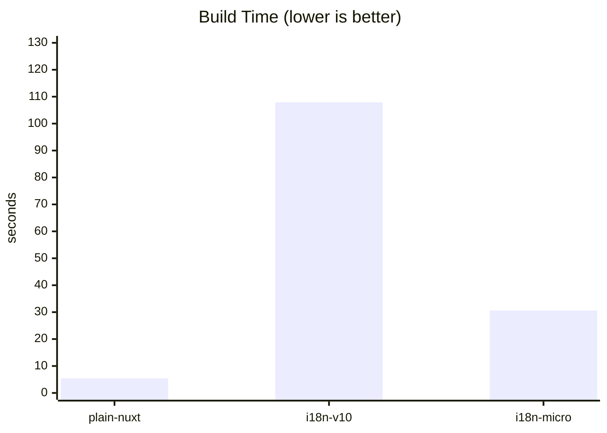

### Bundle Size Comparison

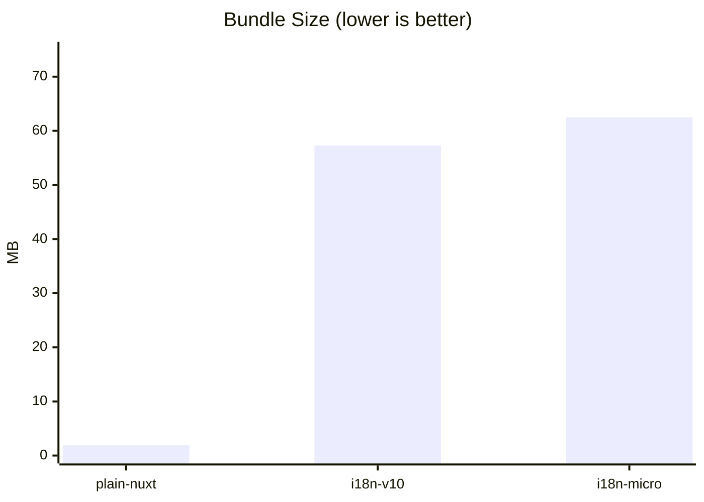

- **i18n v10 vs baseline**: 55.36 MB larger
- **i18n-micro vs baseline**: 60.55 MB larger
- **i18n-micro vs i18n v10**: 5.19 MB larger

## Stress Test Results for plain-nuxt

### Resource Usage
- **Max CPU Usage**: 132.60%
- **Average CPU Usage**: 56.44%
- **Max Memory Usage**: 340.48 MB
- **Average Memory Usage**: 177.58 MB

### Artillery Results
- **Test Duration**: 68.81 seconds
- **Requests per Second**: 228.00
- **Error Rate**: 0.00%

### Latency (Artillery)
| Metric | Value |
|--------|-------|
| Average | 544.40 ms |
| Min | 1.00 ms |
| Max | 7715.00 ms |
| P50 | 40.90 ms |
| P95 | 2725.00 ms |
| P99 | 6312.20 ms |

### Autocannon Results (10 connections, 10s)
| Metric | Value |
|--------|-------|
| Requests/sec (avg) | 69.91 |
| Latency avg | 142.22 ms |
| Latency P50 | 138.00 ms |
| Latency P95 | 333.00 ms |
| Latency P99 | 406.00 ms |
| Latency max | 406.00 ms |
| Throughput | 21.67 MB/s |
| Errors | 0 |

#### 📊 Load Summary - plain-nuxt

| **3,636** | **2,516** completed | **228** | **322** |
|:---:|:---:|:---:|:---:|
| vusers created | 69.20% / 30.80% failed | average req/s | peak req/s |

#### 📈 Request Rate & VUsers Over Time

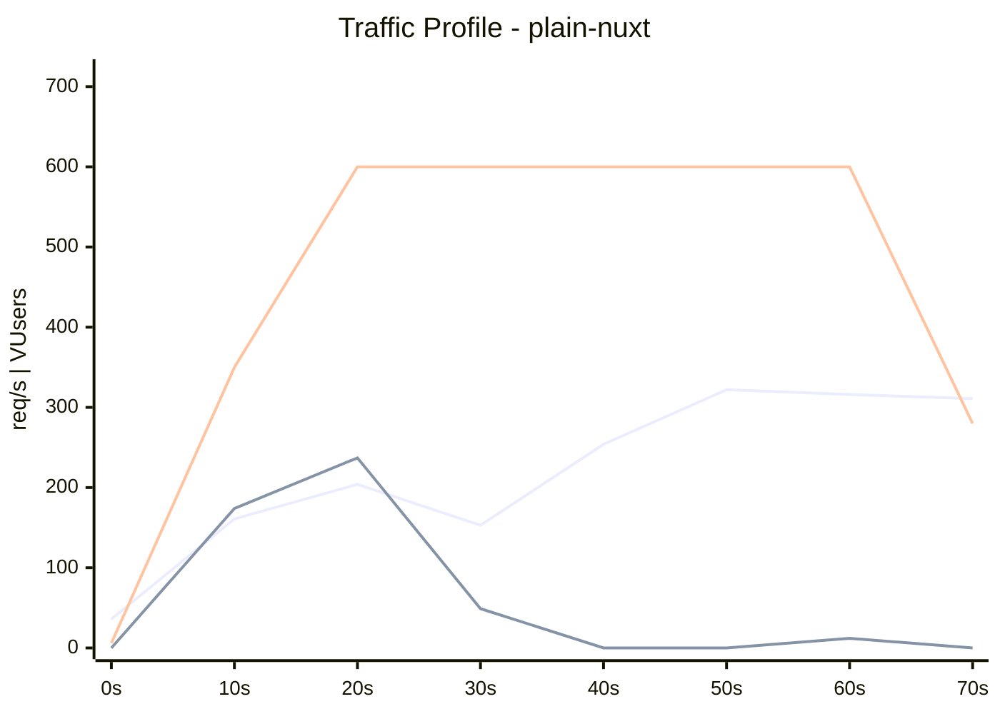

#### ⏱️ Response Time P95 Over Time

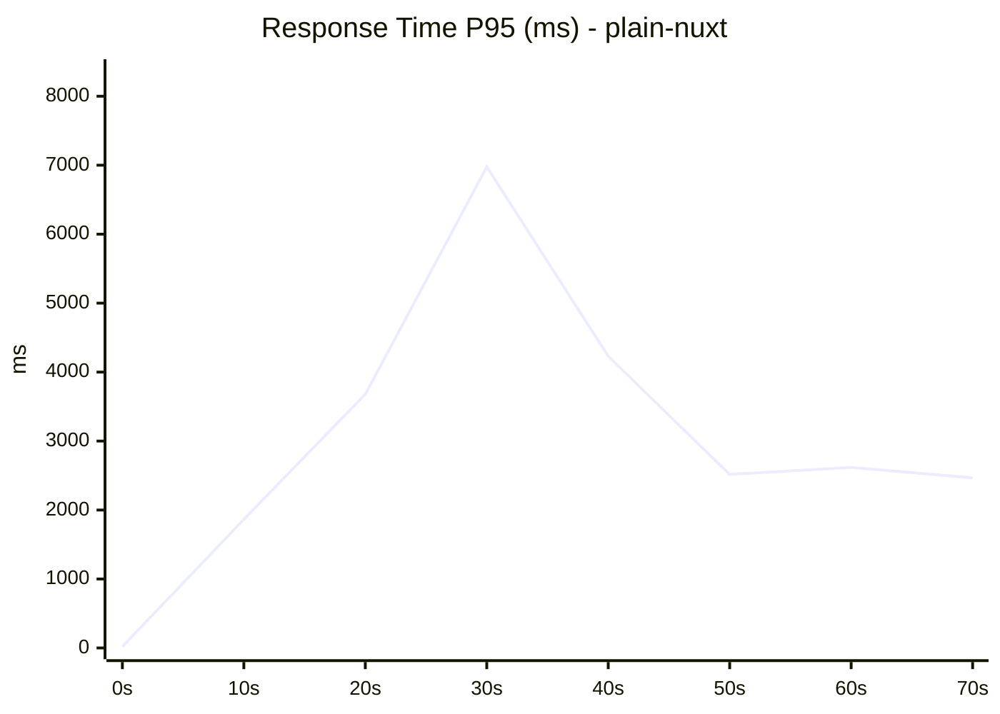

📋 Detailed Time Series Data

| Time | Request Rate | Response P95 | VUsers Active | VUsers Created |
|------|--------------|--------------|---------------|----------------|
| Invalid Date | 36 req/s | 19 ms | 0 | 6 |
| Invalid Date | 161 req/s | 1864 ms | 174 | 350 |
| Invalid Date | 204 req/s | 3678 ms | 237 | 600 |
| Invalid Date | 153 req/s | 6976 ms | 49 | 600 |
| Invalid Date | 254 req/s | 4231 ms | 0 | 600 |
| Invalid Date | 322 req/s | 2516 ms | 0 | 600 |
| Invalid Date | 316 req/s | 2618 ms | 12 | 600 |
| Invalid Date | 311 req/s | 2466 ms | 0 | 280 |

## Stress Test Results for i18n

### Resource Usage
- **Max CPU Usage**: 162.30%
- **Average CPU Usage**: 111.42%
- **Max Memory Usage**: 1243.23 MB
- **Average Memory Usage**: 782.03 MB

### Artillery Results
- **Test Duration**: 75.43 seconds
- **Requests per Second**: 51.00
- **Error Rate**: 0.00%

### Latency (Artillery)
| Metric | Value |
|--------|-------|
| Average | 1363.40 ms |
| Min | 16.00 ms |
| Max | 9901.00 ms |
| P50 | 742.60 ms |
| P95 | 6838.00 ms |
| P99 | 9047.60 ms |

### Autocannon Results (10 connections, 10s)
| Metric | Value |
|--------|-------|
| Requests/sec (avg) | 9.50 |
| Latency avg | 989.23 ms |
| Latency P50 | 925.00 ms |
| Latency P95 | 1601.00 ms |
| Latency P99 | 2314.00 ms |
| Latency max | 2314.00 ms |
| Throughput | 3.01 MB/s |
| Errors | 0 |

#### 📊 Load Summary - i18n

| **3,636** | **39** completed | **51** | **66** |
|:---:|:---:|:---:|:---:|
| vusers created | 1.07% / 98.93% failed | average req/s | peak req/s |

#### 📈 Request Rate & VUsers Over Time

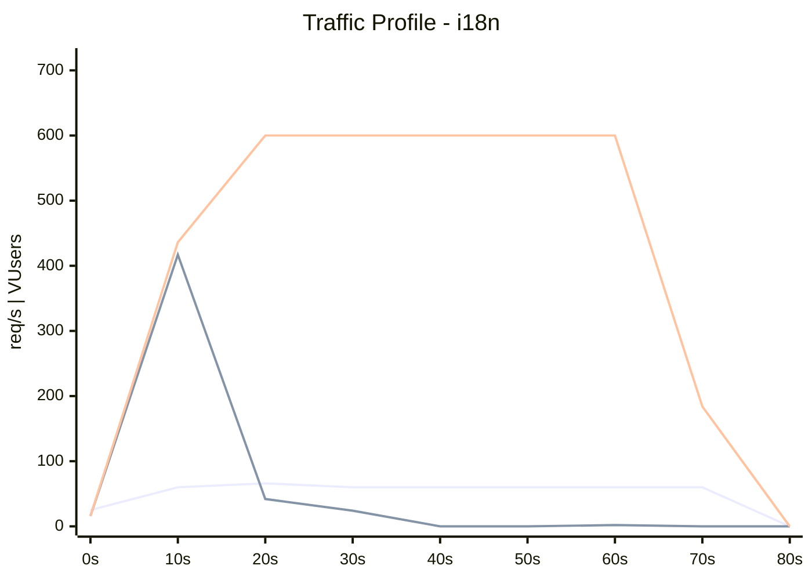

#### ⏱️ Response Time P95 Over Time

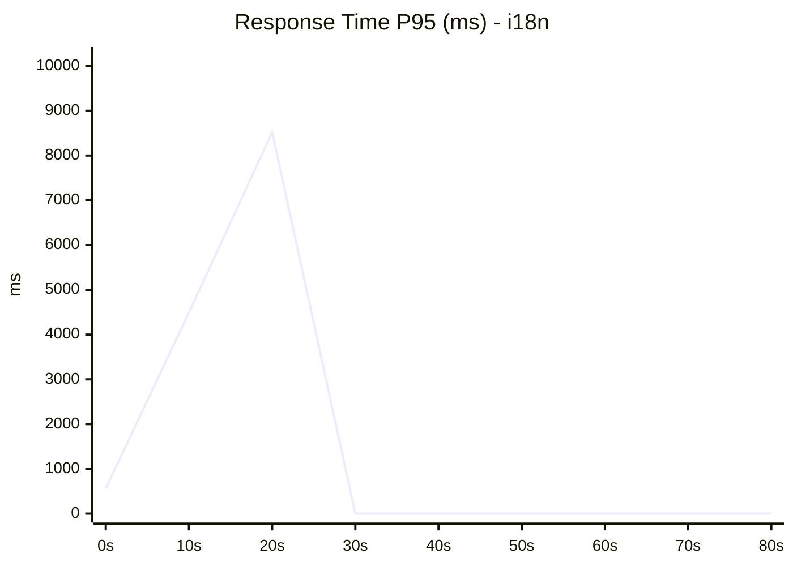

📋 Detailed Time Series Data

| Time | Request Rate | Response P95 | VUsers Active | VUsers Created |
|------|--------------|--------------|---------------|----------------|
| Invalid Date | 25 req/s | 561 ms | 16 | 16 |
| Invalid Date | 60 req/s | 4493 ms | 417 | 436 |
| Invalid Date | 66 req/s | 8521 ms | 42 | 600 |
| Invalid Date | 60 req/s | 0 ms | 24 | 600 |
| Invalid Date | 60 req/s | 0 ms | 0 | 600 |
| Invalid Date | 60 req/s | 0 ms | 0 | 600 |
| Invalid Date | 60 req/s | 0 ms | 2 | 600 |
| Invalid Date | 60 req/s | 0 ms | 0 | 184 |
| Invalid Date | 0 req/s | 0 ms | 0 | 0 |

## Stress Test Results for i18n-micro

### Resource Usage
- **Max CPU Usage**: 127.60%
- **Average CPU Usage**: 88.07%
- **Max Memory Usage**: 346.73 MB
- **Average Memory Usage**: 284.44 MB

### Artillery Results
- **Test Duration**: 69.64 seconds
- **Requests per Second**: 292.00
- **Error Rate**: 0.00%

### Latency (Artillery)
| Metric | Value |
|--------|-------|
| Average | 411.10 ms |
| Min | 1.00 ms |
| Max | 2875.00 ms |
| P50 | 37.70 ms |
| P95 | 2618.10 ms |
| P99 | 2725.00 ms |

### Autocannon Results (10 connections, 10s)
| Metric | Value |
|--------|-------|
| Requests/sec (avg) | 165.70 |
| Latency avg | 59.73 ms |
| Latency P50 | 51.00 ms |
| Latency P95 | 111.00 ms |
| Latency P99 | 125.00 ms |
| Latency max | 219.00 ms |
| Throughput | 52.52 MB/s |
| Errors | 0 |

#### 📊 Load Summary - i18n-micro

| **3,636** | **3,207** completed | **292** | **310** |
|:---:|:---:|:---:|:---:|
| vusers created | 88.20% / 11.80% failed | average req/s | peak req/s |

#### 📈 Request Rate & VUsers Over Time

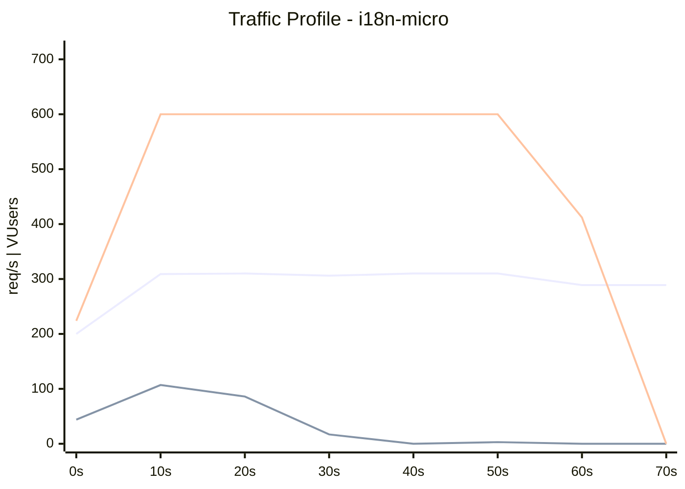

#### ⏱️ Response Time P95 Over Time

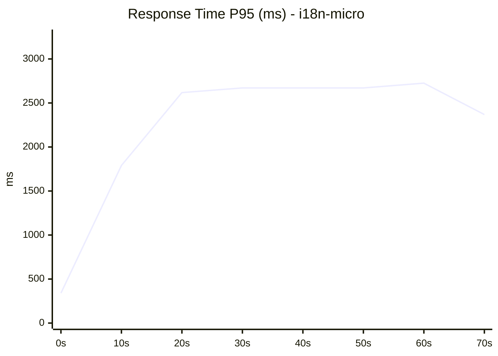

📋 Detailed Time Series Data

| Time | Request Rate | Response P95 | VUsers Active | VUsers Created |
|------|--------------|--------------|---------------|----------------|
| Invalid Date | 200 req/s | 340 ms | 44 | 224 |
| Invalid Date | 309 req/s | 1790 ms | 107 | 600 |
| Invalid Date | 310 req/s | 2618 ms | 86 | 600 |
| Invalid Date | 306 req/s | 2671 ms | 17 | 600 |
| Invalid Date | 310 req/s | 2671 ms | 0 | 600 |
| Invalid Date | 310 req/s | 2671 ms | 3 | 600 |
| Invalid Date | 289 req/s | 2725 ms | 0 | 412 |
| Invalid Date | 289 req/s | 2369 ms | 0 | 0 |

## Stress Test Summary

### Artillery Results
| Project | Avg Response | P95 | P99 | RPS | Error Rate |
|---------|--------------|-----|-----|-----|------------|
| **plain-nuxt** | 544.40 ms | 2725.00 ms | 6312.20 ms | 228.00 | 0.00% |
| **i18n v10** | 1363.40 ms | 6838.00 ms | 9047.60 ms | 51.00 | 0.00% |
| **i18n-micro** | 411.10 ms | 2618.10 ms | 2725.00 ms | 292.00 | 0.00% |

### Autocannon Results (10 connections, 10s)
| Project | Avg Latency | P50 | P95 | P99 | Max | RPS |
|---------|-------------|-----|-----|-----|-----|-----|
| **plain-nuxt** | 142.22 ms | 138.00 ms | 333.00 ms | 406.00 ms | 406.00 ms | 69.91 |
| **i18n v10** | 989.23 ms | 925.00 ms | 1601.00 ms | 2314.00 ms | 2314.00 ms | 9.50 |
| **i18n-micro** | 59.73 ms | 51.00 ms | 111.00 ms | 125.00 ms | 219.00 ms | 165.70 |

## 🏆 Performance Comparison

### Throughput (Requests per Second)

> **Winner: i18n-micro** with 166 RPS

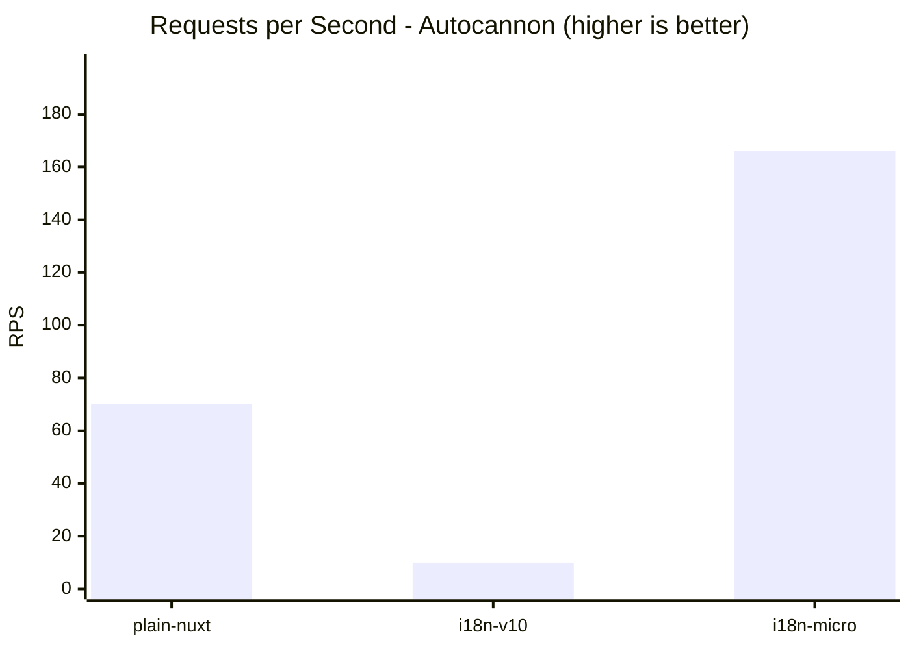

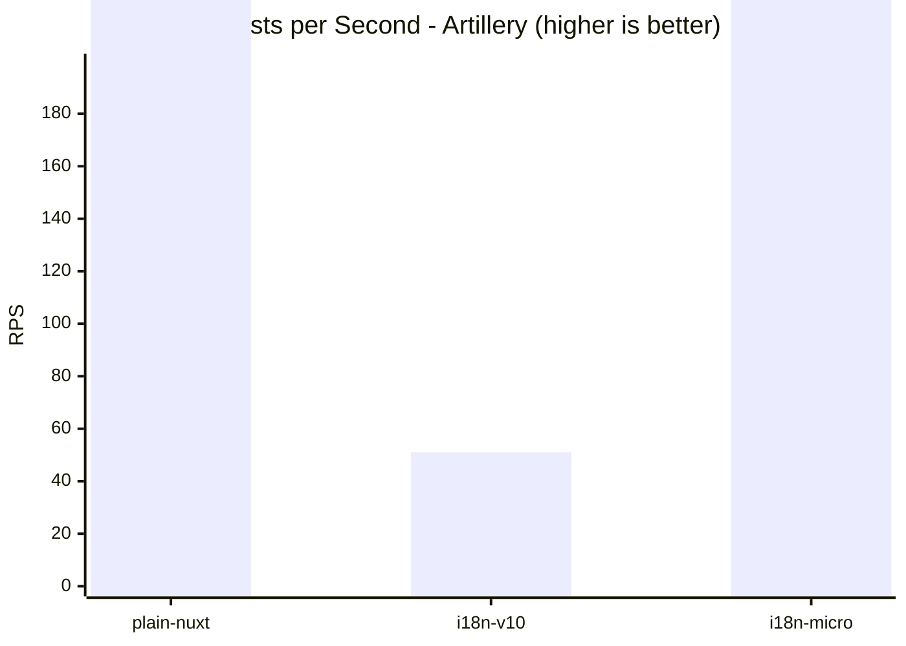

### Latency Distribution

> **Winner: i18n-micro** with 59.73 ms avg latency

```mermaid
xychart-beta
    title "Latency Percentiles (lower is better)"
    x-axis ["plain-nuxt", "i18n-v10", "i18n-micro"]
    y-axis "ms" 0 --> 2777
    bar "Avg" [142, 989, 60]
    bar "P50" [138, 925, 51]
    bar "P95" [333, 1601, 111]
    bar "P99" [406, 2314, 125]
```

### Quick Comparison

| Metric | **plain-nuxt** | **i18n-v10** | **i18n-micro** | Best |
|--------|---|---|---|------|
| RPS (Autocannon) | 70 | 10 | 166 | i18n-micro |
| Avg Latency | 142.22 ms | 989.23 ms | 59.73 ms | i18n-micro |
| P99 Latency | 406.00 ms | 2314.00 ms | 125.00 ms | i18n-micro |
| Errors | 0 | 0 | 0 | - |

## Comparison: plain-nuxt (baseline) vs i18n v10

| Metric | plain-nuxt (baseline) | i18n v10 | Difference |
|--------|----------|----------|------------|
| Max Memory | 340.48 MB | 1243.23 MB | +902.75 MB |
| Avg Memory | 177.58 MB | 782.03 MB | +604.46 MB |
| Response Avg | 544.40 ms | 1363.40 ms | +819.00 ms |
| Response P95 | 2725.00 ms | 6838.00 ms | +4113.00 ms |
| Response P99 | 6312.20 ms | 9047.60 ms | +2735.40 ms |
| RPS (Artillery) | 228.00 | 51.00 | -177.00 |
| RPS (Autocannon) | 69.91 | 9.50 | -60.41 |
| Latency avg (Autocannon) | 142.22 ms | 989.23 ms | +847.01 ms |

## Comparison: plain-nuxt (baseline) vs i18n-micro

| Metric | plain-nuxt (baseline) | i18n-micro | Difference |
|--------|----------|----------|------------|
| Max Memory | 340.48 MB | 346.73 MB | +6.25 MB |
| Avg Memory | 177.58 MB | 284.44 MB | +106.87 MB |
| Response Avg | 544.40 ms | 411.10 ms | -133.30 ms |
| Response P95 | 2725.00 ms | 2618.10 ms | -106.90 ms |
| Response P99 | 6312.20 ms | 2725.00 ms | -3587.20 ms |
| RPS (Artillery) | 228.00 | 292.00 | +64.00 |
| RPS (Autocannon) | 69.91 | 165.70 | +95.79 |
| Latency avg (Autocannon) | 142.22 ms | 59.73 ms | -82.49 ms |

## Comparison: i18n v10 vs i18n-micro

| Metric | i18n v10 | i18n-micro | Difference |
|--------|----------|----------|------------|
| Max Memory | 1243.23 MB | 346.73 MB | -896.50 MB |
| Avg Memory | 782.03 MB | 284.44 MB | -497.59 MB |
| Response Avg | 1363.40 ms | 411.10 ms | -952.30 ms |
| Response P95 | 6838.00 ms | 2618.10 ms | -4219.90 ms |
| Response P99 | 9047.60 ms | 2725.00 ms | -6322.60 ms |
| RPS (Artillery) | 51.00 | 292.00 | +241.00 |
| RPS (Autocannon) | 9.50 | 165.70 | +156.20 |
| Latency avg (Autocannon) | 989.23 ms | 59.73 ms | -929.50 ms |

## 📊 Detailed Performance Analysis

### 🔍 Test Logic Explanation

The performance tests compare **plain-nuxt** (baseline), **Nuxt I18n Micro**, and **nuxt-i18n** v10. The **plain-nuxt** fixture loads data directly from JSON files without any i18n module, providing a baseline for measuring i18n overhead.

1. **Build Time**: Measures the time required to build each project. Plain-nuxt shows the baseline; i18n modules add overhead for translation processing.
2. **Bundle Size**: Measures the total size of client and server bundles.
3. **CPU Usage**: Tracks CPU load during build and stress tests.
4. **Memory Usage**: Monitors memory consumption. Plain-nuxt establishes the baseline; i18n modules increase memory usage.
5. **Stress Testing**: Simulates concurrent traffic using Artillery and Autocannon.
   - **Artillery**: Warm-up phase (6 seconds, 6 users), Main phase (60 seconds, 60 req/s).
   - **Autocannon**: 10 connections for 10 seconds, measuring latency percentiles.

### 🛠 Why This Approach?

By including a **plain-nuxt** baseline, we can quantify the overhead of each i18n solution. **Nuxt I18n Micro** is optimized for:
- **Faster Build Times**: Lower overhead than nuxt-i18n.
- **Lower Resource Consumption**: Closer to plain-nuxt baseline.
- **Better Scalability**: Per-page translations for large applications.
