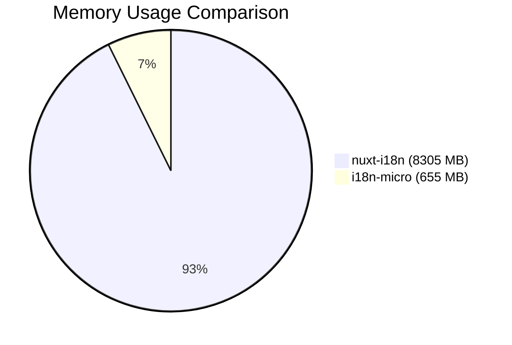
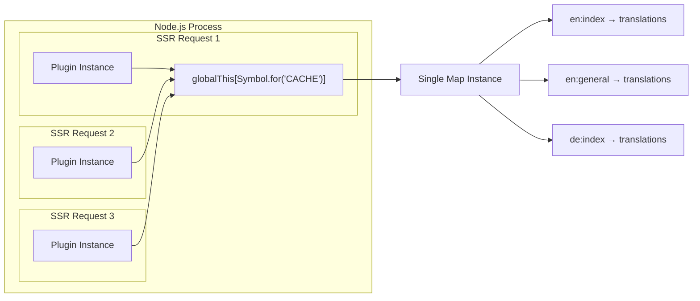
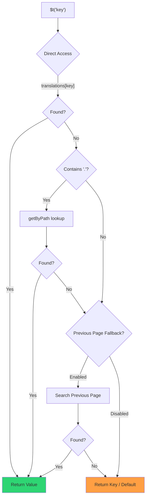

# 🚀 Performance Guide

## 📖 Introduction

`Nuxt I18n Micro` is designed with performance in mind, offering a significant improvement over traditional internationalization (i18n) modules like `nuxt-i18n`. This guide provides an in-depth look at the performance benefits of using `Nuxt I18n Micro`, and how it compares to other solutions.

## 🤔 Why Focus on Performance?

In large-scale projects and high-traffic environments, performance bottlenecks can lead to slow build times, increased memory usage, and poor server response times. These issues become more pronounced with complex i18n setups involving large translation files. `Nuxt I18n Micro` was built to address these challenges head-on by optimizing for speed, memory efficiency, and minimal impact on your application’s bundle size.

## 📊 Performance Comparison

We conducted a series of tests to demonstrate the performance improvements that `Nuxt I18n Micro` brings to the table. Below is a detailed comparison between `Nuxt I18n Micro` and the traditional `nuxt-i18n` module, based on identical conditions with a 10MB translation file on the same hardware.

### ⏱️ Build Time and Resource Consumption

::: details **Nuxt I18n**
- **Total Size**: 54.7 MB (3.31 MB gzip)
- **Max CPU Usage**: 391.4%
- **Max Memory Usage**: 8305 MB
- **Elapsed Time**: 1m 31s
:::

::: tip **Nuxt I18n Micro**
- **Total Size**: 1.93 MB (473 kB gzip) — **96% smaller**
- **Max CPU Usage**: 220.1% — **44% lower**
- **Max Memory Usage**: 655 MB — **92% less memory**
- **Elapsed Time**: 0m 5s — **94% faster**
:::

### 🌐 Server Performance Under Load

We also tested server performance by simulating 10,000 requests to each module.

::: details **Nuxt I18n**
- **Requests per Second**: 49.05 [#/sec] (mean)
- **Time per Request**: 611.599 ms (mean)
- **Max Memory Usage**: 703.73 MB
:::

::: tip **Nuxt I18n Micro**
- **Requests per Second**: 61.18 [#/sec] (mean) — **25% more requests per second**
- **Time per Request**: 490.379 ms (mean) — **20% faster**
- **Max Memory Usage**: 323.00 MB — **54% less memory usage**
:::

### 📈 Visual Comparison



| Metric | nuxt-i18n | i18n-micro | Improvement |
|--------|-----------|------------|-------------|
| Build Time | 91s | 5s | **94% faster** |
| Memory | 8305 MB | 655 MB | **92% less** |
| Bundle Size | 54.7 MB | 1.93 MB | **96% smaller** |
| CPU Usage | 391% | 220% | **44% lower** |

### 🔍 Interpretation of Results

These tests clearly indicate that `Nuxt I18n Micro` offers superior performance across multiple metrics:

- 🗜️ **Smaller Bundle Size**: Reduces the overall size of your application bundle, leading to faster load times and better user experience.
- 🔋 **Lower CPU Usage**: Decreases the load on your server’s CPU, allowing for more efficient processing of requests.
- 🧠 **Reduced Memory Consumption**: Significantly lowers memory usage, minimizing the risk of memory leaks and enabling your application to handle larger workloads.
- 🕒 **Faster Build Times**: Drastically reduces build times, which is particularly beneficial during development and CI/CD processes.

## ⚙️ Key Optimizations

### 🛠️ Minimalist Design

`Nuxt I18n Micro` is built around a minimalist architecture, using only 5 components (1 module and 4 plugins). This reduces overhead and simplifies the internal logic, leading to improved performance.

### 🚦 Efficient Routing

Unlike other i18n modules that generate a separate route for each locale, `Nuxt I18n Micro` uses dynamic regex-based routing. This approach generates only two routes regardless of the number of locales, significantly reducing the complexity of your routing configuration and speeding up route resolution.

### 📂 Streamlined Translation Loading

The module supports only JSON files for translations, with a clear separation between global and page-specific files. This ensures that only the necessary translation data is loaded at any given time, further enhancing performance.

### 🔒 GlobalThis Singleton Cache

Starting from v3.0.0, the module uses a `globalThis` singleton pattern with `Symbol.for` to guarantee a single cache instance across the entire Node.js process. This prevents:

- Cache duplication when the same module is bundled multiple times
- Per-request object recreation that causes garbage collection pressure
- Memory leaks from orphaned cache instances



```typescript
// Internal implementation pattern
const CACHE_KEY = Symbol.for('__NUXT_I18N_STORAGE_CACHE__')
if (!globalThis[CACHE_KEY]) {
  globalThis[CACHE_KEY] = new Map()
}
```

### ⚡ Optimized Translation Function (tFast)

The `$t()` function uses a layered lookup strategy optimized for speed:

1. **Pre-computed context**: Locale and route name are calculated once during navigation, not on every `$t()` call
2. **Layered search**: First searches page-specific translations, then falls back to general translations
3. **Direct property access**: Uses `obj[key]` instead of Map lookups for hot paths
4. **Frozen objects**: Loaded translations are frozen with `Object.freeze()` for V8 optimization



```typescript
// Simplified lookup logic
const page = loadedChunks.get(`${locale}:${routeName}`) || {}
const general = loadedChunks.get(`${locale}:general`) || {}
let val = page[key] ?? general[key]
```

### 💉 Server-Side Injection

During SSR, translations are injected directly into the HTML as a script tag:

```html
<script>window.__I18N__={"en:general":{...},"en:index":{...}};</script>
```

On the client, the plugin reads from `window.__I18N__` on initial hydration, completely avoiding duplicate fetch requests. This approach:

- Eliminates waterfall requests on page load
- Reduces Time to Interactive (TTI)
- Works seamlessly with pre-rendering and SSG

### 💾 Caching and Pre-rendering

To optimize performance, `Nuxt I18n Micro` implements caching and supports pre-rendering of translation files:

- 🗄️ **Caching**: Translations are cached after the initial load, reducing the need for subsequent requests and improving response times.
- 🏁 **Pre-rendering**: During the build process, translation files for all configured locales and routes can be pre-rendered. This eliminates the need for runtime requests, ensuring that translations are served quickly and efficiently.

## 📝 Tips for Maximizing Performance

Here are a few tips to ensure you get the best performance out of `Nuxt I18n Micro`:

- 📉 **Limit Locale Data**: Only include the locales you need in your project to keep the bundle size small.
- 🗂️ **Use Page-Specific Translations**: Organize your translation files by page to avoid loading unnecessary data.
- 💾 **Enable Caching**: Make use of the caching features to reduce server load and improve response times.
- 🏁 **Leverage Pre-rendering**: Pre-render your translations to speed up page loads and reduce runtime overhead.

For detailed results of the performance tests, please refer to the [Performance Test Results](/guide/performance-results).
