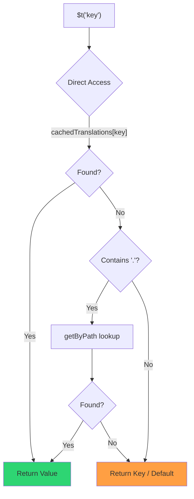

# 🚀 Performance Guide

## 📖 Introduction

`Nuxt I18n Micro` is designed with performance in mind, offering a significant improvement over traditional internationalization (i18n) modules like `nuxt-i18n`. This guide provides an in-depth look at the performance benefits of using `Nuxt I18n Micro`, and how it compares to other solutions.

## 🤔 Why Focus on Performance?

In large-scale projects and high-traffic environments, performance bottlenecks can lead to slow build times, increased memory usage, and poor server response times. These issues become more pronounced with complex i18n setups involving large translation files. `Nuxt I18n Micro` was built to address these challenges head-on by optimizing for speed, memory efficiency, and minimal impact on your application's bundle size.

## 📊 Performance Comparison

We conducted a series of tests to demonstrate the performance improvements that `Nuxt I18n Micro` brings to the table. Below is a detailed comparison between `Nuxt I18n Micro` and the traditional `nuxt-i18n` module, based on identical conditions with a 10MB translation file on the same hardware.

### ⏱️ Build Time and Resource Consumption

::: details **Nuxt I18n v10**
- **Code Bundle**: 19.24 MB
- **Translations**: 38.05 MB (compiled into JS)
- **Max CPU Usage**: 439%
- **Max Memory Usage**: 9,528 MB
- **Elapsed Time**: 84.91s
:::

::: tip **Nuxt I18n Micro**
- **Code Bundle**: 1.5 MB — **92% smaller**
- **Translations**: 60.97 MB (lazy-loaded JSON)
- **Max CPU Usage**: 208% — **53% lower**
- **Max Memory Usage**: 1,658 MB — **83% less memory**
- **Elapsed Time**: 23.47s — **72% faster**
:::

### 🌐 Server Performance Under Load

We also tested server performance using Artillery and Autocannon stress tests.

::: details **Nuxt I18n v10**
- **Requests per Second (Artillery)**: 51 [#/sec]
- **Average Response Time**: 1,363 ms
- **Max Memory Usage**: 1,243 MB
:::

::: tip **Nuxt I18n Micro**
- **Requests per Second (Artillery)**: 292 [#/sec] — **472% more requests per second**
- **Average Response Time**: 411 ms — **70% faster**
- **Max Memory Usage**: 347 MB — **72% less memory usage**
:::

### 📈 Visual Comparison

```chart
type: doughnut
data:
  labels: ["nuxt-i18n v10 (9,528 MB)", "i18n-micro (1,658 MB)"]
  datasets:
    - data: [9528, 1658]
      backgroundColor: ["rgba(255, 99, 132, 0.8)", "rgba(46, 204, 113, 0.8)"]
      borderColor: ["rgb(255, 99, 132)", "rgb(46, 204, 113)"]
      borderWidth: 2
options:
  plugins:
    title:
      display: true
      text: Memory Usage During Build (MB)
      font:
        size: 16
    legend:
      position: bottom
```

```chart
type: bar
data:
  labels: ["Build Time (s)", "Memory (GB)", "Code Bundle (MB)", "CPU Usage (%)"]
  datasets:
    - label: nuxt-i18n v10
      data: [84.9, 9.5, 19.2, 439]
      backgroundColor: "rgba(255, 99, 132, 0.8)"
      borderColor: "rgb(255, 99, 132)"
      borderWidth: 2
    - label: i18n-micro
      data: [23.5, 1.7, 1.5, 208]
      backgroundColor: "rgba(46, 204, 113, 0.8)"
      borderColor: "rgb(46, 204, 113)"
      borderWidth: 2
options:
  plugins:
    title:
      display: true
      text: Performance Metrics Comparison
      font:
        size: 16
    legend:
      position: bottom
  scales:
    y:
      beginAtZero: true
      type: logarithmic
```

| Metric | nuxt-i18n v10 | i18n-micro | Improvement |
|--------|---------------|------------|-------------|
| Build Time | 84.91s | 23.47s | **72% faster** |
| Memory (build) | 9,528 MB | 1,658 MB | **83% less** |
| Code Bundle | 19.24 MB | 1.5 MB | **92% smaller** |
| CPU Usage | 439% | 208% | **53% lower** |
| Response Time | 1,363 ms | 411 ms | **70% faster** |
| RPS (Artillery) | 51 | 292 | **472% more** |

### 🔍 Interpretation of Results

These tests clearly indicate that `Nuxt I18n Micro` offers superior performance across multiple metrics:

- 🗜️ **Smaller Code Bundle**: The code bundle is only 1.5 MB (vs 19.24 MB for i18n v10) — translations are stored as lazy-loaded JSON files.
- 🔋 **Lower CPU Usage**: 53% lower CPU usage during build (208% vs 439%), allowing for more efficient CI/CD pipelines.
- 🧠 **Reduced Memory Consumption**: Uses 83% less memory during build (1.7 GB vs 9.5 GB), making it feasible for resource-constrained environments.
- 🕒 **Faster Build Times**: 72% faster builds (23.47s vs 84.91s), beneficial for development iteration speed.
- ⚡ **Better Runtime Performance**: 70% faster response times (411 ms vs 1,363 ms) and 472% more requests per second under load.

## ⚙️ Key Optimizations

### 🛠️ Minimalist Design

`Nuxt I18n Micro` is built around a minimalist architecture, using only 5 components (1 module and 4 plugins). This reduces overhead and simplifies the internal logic, leading to improved performance.

### 🚦 Efficient Routing

Unlike other i18n modules that generate a separate route for each locale, `Nuxt I18n Micro` uses dynamic regex-based routing. This approach generates only two routes regardless of the number of locales, significantly reducing the complexity of your routing configuration and speeding up route resolution.

### 📂 Streamlined Translation Loading

The module supports only JSON files for translations, with a clear separation between global and page-specific files. This ensures that only the necessary translation data is loaded at any given time, further enhancing performance.

### 🔒 GlobalThis Singleton Cache

Starting from v3.0.0, the module uses a `globalThis` singleton pattern with `Symbol.for` to guarantee a single cache instance across the entire Node.js process. This prevents:

- Cache duplication when the same module is bundled multiple times
- Per-request object recreation that causes garbage collection pressure
- Memory leaks from orphaned cache instances

```mermaid
flowchart LR
    subgraph Process["Node.js Process"]
        G["globalThis[Symbol.for('CACHE')]"]
        
        subgraph R1["SSR Request 1"]
            P1[Plugin Instance] --> G
        end
        
        subgraph R2["SSR Request 2"]
            P2[Plugin Instance] --> G
        end
        
        subgraph R3["SSR Request 3"]
            P3[Plugin Instance] --> G
        end
    end
    
    G --> Cache["Single Map Instance"]
    Cache --> D1["en:index → translations"]
    Cache --> D2["en:about → translations"
```

```typescript
// Internal implementation pattern
const CACHE_KEY = Symbol.for('__NUXT_I18N_STORAGE_CACHE__')
if (!globalThis[CACHE_KEY]) {
  globalThis[CACHE_KEY] = new Map()
}
```

### ⚡ Optimized Translation Function (tFast)

The `$t()` function uses a direct lookup strategy optimized for speed:

1. **Pre-computed context**: Locale and route name are calculated once during navigation, not on every `$t()` call
2. **Single-source lookup**: All translations (root + page-specific + fallback) are pre-merged at build time into a single file per page — no layered search needed
3. **Cumulative deep merge on navigation**: When navigating within the same locale, new page translations are deep-merged (2-level depth) into the active dictionary, so keys from the previous page remain visible during transition animations — even when pages share overlapping nested prefixes (e.g., both pages have keys under `common.*`)
4. **Garbage collection via `page:transition:finish`**: After the transition animation is fully complete, the merged dictionary is replaced with the clean translations for the new page only, freeing memory from old-page keys
5. **Direct property access**: Uses `obj[key]` instead of Map lookups for hot paths



```typescript
// Simplified lookup logic — single active dictionary
let val = cachedTranslations[key]
if (val === undefined && key.includes('.')) {
  val = getByPath(cachedTranslations, key)
}
```

### 💉 Server-Side Injection

During SSR, translations are injected directly into the HTML as a script tag:

```html
<script>window.__I18N__={"en:index":{...},"en:about":{...}};</script>
```

On the client, the plugin reads from `window.__I18N__` on initial hydration, completely avoiding duplicate fetch requests. This approach:

- Eliminates waterfall requests on page load
- Reduces Time to Interactive (TTI)
- Works seamlessly with pre-rendering and SSG

### 💾 Caching and Pre-rendering

To optimize performance, `Nuxt I18n Micro` implements caching and supports pre-rendering of translation files:

- 🗄️ **Caching**: Translations are cached after the initial load, reducing the need for subsequent requests and improving response times.
- 🏁 **Pre-rendering**: During the build process, translation files for all configured locales and routes can be pre-rendered. This eliminates the need for runtime requests, ensuring that translations are served quickly and efficiently.

## 📝 Tips for Maximizing Performance

Here are a few tips to ensure you get the best performance out of `Nuxt I18n Micro`:

- 📉 **Limit Locale Data**: Only include the locales you need in your project to keep the bundle size small.
- 🗂️ **Use Page-Specific Translations**: Organize your translation files by page to avoid loading unnecessary data.
- 💾 **Enable Caching**: Make use of the caching features to reduce server load and improve response times.
- 🏁 **Leverage Pre-rendering**: Pre-render your translations to speed up page loads and reduce runtime overhead.

For detailed results of the performance tests, please refer to the [Performance Test Results](/guide/performance-results).
