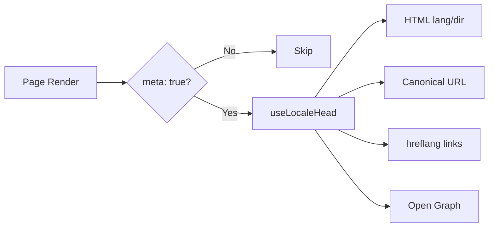

# 🌐 SEO Guide for Nuxt I18n Micro

## 📖 Introduction

Effective SEO (Search Engine Optimization) is essential for ensuring that your multilingual site is accessible and visible to users worldwide through search engines. `Nuxt I18n Micro` simplifies the process of managing SEO for multilingual sites by automatically generating essential meta tags and attributes that inform search engines about the structure and content of your site.

This guide explains how `Nuxt I18n Micro` handles SEO to enhance your site's visibility and user experience without requiring additional configuration.

## ⚙️ Automatic SEO Handling

### SEO Meta Generation Flow



**Generated tags:**

| Tag | Example |
|-----|---------|
| HTML attributes | `<html lang="en" dir="ltr">` |
| Canonical | `<link rel="canonical" href="...">` |
| hreflang | `<link rel="alternate" hreflang="en" href="...">` |
| Open Graph | `<meta property="og:locale" content="en_US">` |

### 🔑 Key SEO Features

When the `meta` option is enabled in `Nuxt I18n Micro`, the module automatically manages the following SEO aspects:

1. **🌍 Language and Direction Attributes**:
   - The module sets the `lang` and `dir` attributes on the `<html>` tag according to the current locale and text direction (e.g., `ltr` for English or `rtl` for Arabic).

2. **🔗 Canonical URLs**:
   - The module generates a canonical link (`<link rel="canonical">`) for each page, ensuring that search engines recognize the primary version of the content.

3. **🌐 Alternate Language Links (`hreflang`)**:
   - The module automatically generates `<link rel="alternate" hreflang="">` tags for all available locales. This helps search engines understand which language versions of your content are available, improving the user experience for global audiences.

4. **🔖 Open Graph Metadata**:
   - The module generates Open Graph meta tags (`og:locale`, `og:url`, etc.) for each locale, which is particularly useful for social media sharing and search engine indexing.

### 🛠️ Configuration

To enable these SEO features, ensure the `meta` option is set to `true` in your `nuxt.config.ts` file:

```typescript
export default defineNuxtConfig({
  modules: ['nuxt-i18n-micro'],
  i18n: {
    locales: [
      { code: 'en', iso: 'en-US', dir: 'ltr' },
      { code: 'fr', iso: 'fr-FR', dir: 'ltr' },
      { code: 'ar', iso: 'ar-SA', dir: 'rtl' },
    ],
    defaultLocale: 'en',
    translationDir: 'locales',
    meta: true, // Enables automatic SEO management
  },
})
```

### 🌍 Dynamic `metaBaseUrl` for Multi-Domain Deployments

By default (`metaBaseUrl` is `undefined`), canonical URLs, `og:url`, and `hreflang` links are generated using the hostname from the current request. This is resolved via `useRequestURL()` on the server and `window.location.origin` on the client.

The module respects reverse-proxy headers (`X-Forwarded-Host`, `X-Forwarded-Proto`), so it works correctly behind nginx, Cloudflare, AWS ALB, and similar proxies.

This means a single application instance can serve **multiple domains** with correct SEO tags for each:

```typescript
export default defineNuxtConfig({
  i18n: {
    meta: true,
    // metaBaseUrl is undefined by default — resolved dynamically from the request
  },
})
```

For example, a request to `https://site-a.com/en/about` will produce:
```html
<link rel="canonical" href="https://site-a.com/en/about">
<meta property="og:url" content="https://site-a.com/en/about">
```

While the same app serving `https://site-b.com/en/about` will produce:
```html
<link rel="canonical" href="https://site-b.com/en/about">
<meta property="og:url" content="https://site-b.com/en/about">
```

If you need a fixed base URL instead, pass a static string:

```typescript
metaBaseUrl: 'https://example.com'
```

### 🎯 Benefits

By enabling the `meta` option, you benefit from:

- **📈 Improved Search Engine Rankings**: Search engines can better index your site, understanding the relationships between different language versions.
- **👥 Better User Experience**: Users are served the correct language version based on their preferences, leading to a more personalized experience.
- **🔧 Reduced Manual Configuration**: The module handles SEO tasks automatically, freeing you from the need to manually add SEO-related meta tags and attributes.
