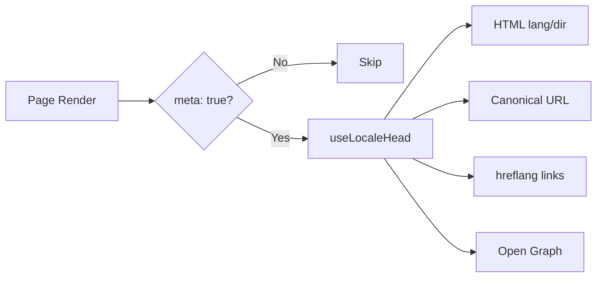

# 🌐 SEO Guide for Nuxt I18n Micro

## 📖 Introduction

Effective SEO (Search Engine Optimization) is essential for ensuring that your multilingual site is accessible and visible to users worldwide through search engines. `Nuxt I18n Micro` simplifies the process of managing SEO for multilingual sites by automatically generating essential meta tags and attributes that inform search engines about the structure and content of your site.

This guide explains how `Nuxt I18n Micro` handles SEO to enhance your site's visibility and user experience without requiring additional configuration.

## ⚙️ Automatic SEO Handling

### SEO Meta Generation Flow


```mermaid
flowchart LR
    A[Page Render] --> B{meta: true?}
    B -->|No| C[Skip]
    B -->|Yes| D[useLocaleHead]
    D --> E[HTML lang/dir]
    D --> F[Canonical URL]
    D --> G[hreflang links]
    D --> H[Open Graph]
```

**Generated tags:**

| Tag             | Example                                                  |
| --------------- | -------------------------------------------------------- |
| HTML attributes | `<html lang="en" dir="ltr">`                             |
| Canonical       | `<link rel="canonical" href="...">`                      |
| hreflang        | `<link rel="alternate" hreflang="en" href="...">`        |
| x-default       | `<link rel="alternate" hreflang="x-default" href="...">` |
| Open Graph      | `<meta property="og:locale" content="en_US">`            |

#### `og` per locale (`og:locale` vs BCP 47)

`<html lang>` and `hreflang` should use **BCP 47** via `locale.iso` (e.g. `ar-AE`).  
Open Graph often uses the classic **`language_TERRITORY`** form with an **underscore** (`ar_AE`).

Set an optional **`og`** string on each locale when the Open Graph value must differ from `iso`. If omitted, **`iso`** is used (then `code`).

```typescript
i18n: {
  meta: true,
  locales: [
    { code: 'ar', iso: 'ar-AE', og: 'ar_AE', dir: 'rtl' },
    { code: 'en', iso: 'en-US' }, // og:locale uses en-US from iso
  ],
}
```

### 🔑 Key SEO Features

When the `meta` option is enabled in `Nuxt I18n Micro`, the module automatically manages the following SEO aspects:

1. **🌍 Language and Direction Attributes**:
   - The module sets the `lang` and `dir` attributes on the `<html>` tag according to the current locale and text direction (e.g., `ltr` for English or `rtl` for Arabic).

2. **🔗 Canonical URLs**:
   - The module generates a canonical link (`<link rel="canonical">`) for each page, ensuring that search engines recognize the primary version of the content.

3. **🌐 Alternate Language Links (`hreflang`)**:
   - The module automatically generates `<link rel="alternate" hreflang="">` tags for all available locales. This helps search engines understand which language versions of your content are available, improving the user experience for global audiences.

4. **🌏 `x-default` Hreflang**:
   - The module automatically generates a `<link rel="alternate" hreflang="x-default">` tag pointing to the default locale's URL. This tells search engines which URL to show users whose language doesn't match any of the defined locales. No additional configuration is required — it works automatically when `meta: true` is set.

5. **🔖 Open Graph Metadata**:
   - The module generates Open Graph meta tags (`og:locale`, `og:url`, etc.) for each locale, which is particularly useful for social media sharing and search engine indexing.

### 🛠️ Configuration

To enable these SEO features, ensure the `meta` option is set to `true` in your `nuxt.config.ts` file:

```typescript
export default defineNuxtConfig({
  modules: ["nuxt-i18n-micro"],
  i18n: {
    locales: [
      { code: "en", iso: "en-US", dir: "ltr" },
      { code: "fr", iso: "fr-FR", dir: "ltr" },
      { code: "ar", iso: "ar-SA", dir: "rtl" },
    ],
    defaultLocale: "en",
    translationDir: "locales",
    meta: true, // Enables automatic SEO management
  },
});
```

### 🌍 Dynamic `metaBaseUrl` for Multi-Domain Deployments

By default (`metaBaseUrl` is `undefined`), canonical URLs, `og:url`, and `hreflang` links are generated using the hostname from the current request. This is resolved via `useRequestURL()` on the server and `window.location.origin` on the client.

The module respects reverse-proxy headers (`X-Forwarded-Host`, `X-Forwarded-Proto`), so it works correctly behind nginx, Cloudflare, AWS ALB, and similar proxies.

This means a single application instance can serve **multiple domains** with correct SEO tags for each:

```typescript
export default defineNuxtConfig({
  i18n: {
    meta: true,
    // metaBaseUrl is undefined by default — resolved dynamically from the request
  },
});
```

For example, a request to `https://site-a.com/en/about` will produce:

```html
<link rel="canonical" href="https://site-a.com/en/about" />
<meta property="og:url" content="https://site-a.com/en/about" />
```

While the same app serving `https://site-b.com/en/about` will produce:

```html
<link rel="canonical" href="https://site-b.com/en/about" />
<meta property="og:url" content="https://site-b.com/en/about" />
```

If you need a fixed base URL instead, pass a static string:

```typescript
metaBaseUrl: "https://example.com";
```

### 🔍 Canonical Query Whitelist

By default, query parameters are stripped from canonical and `og:url` to avoid duplicate content. You can whitelist specific query parameters that should be preserved:

```typescript
i18n: {
  canonicalQueryWhitelist: ["page", "sort", "filter", "search", "q", "query", "tag"];
}
```

Only parameters listed in `canonicalQueryWhitelist` will appear in canonical URLs. All other query parameters (e.g. tracking, session IDs) are removed.

### 🚫 Disabling Meta Tags Per Page

You can disable SEO meta tag generation for specific pages using `defineI18nRoute()`:

```vue
<script setup>
// Disable all SEO meta tags for this page
defineI18nRoute({
  disableMeta: true,
});
</script>
```

You can also disable meta only for specific locales:

```vue
<script setup>
// Disable meta tags only for English locale on this page
defineI18nRoute({
  disableMeta: ["en"],
});
</script>
```

When `disableMeta` is active, no `hreflang`, `canonical`, `og:locale`, `og:url`, or `x-default` tags are generated for the affected page/locale.

### 🔇 Disabled Locales

Locales with `disabled: true` are automatically excluded from all SEO tag generation — no `hreflang`, `og:locale:alternate`, or alternate links are created for them:

```typescript
i18n: {
  locales: [
    { code: "en", iso: "en-US" },
    { code: "fr", iso: "fr-FR", disabled: true }, // excluded from SEO tags
  ];
}
```

### 🙈 Opt-out locales (`seo: false`)

For locales that should remain routable and translated but should not appear in cross-locale discovery tags, set `seo: false`. Those locales are omitted from `hreflang` alternates and `og:locale:alternate`. If your configured **default** locale has `seo: false`, the `x-default` link is not emitted either.

```typescript
i18n: {
  locales: [
    { code: "en", iso: "en-US" },
    { code: "ru", iso: "ru-RU", seo: false }, // internal / non-indexed locale
  ];
}
```

### 📌 Strategy-Specific Behavior

| Strategy                | hreflang links   | x-default             | canonical      | og:url |
| ----------------------- | ---------------- | --------------------- | -------------- | ------ |
| `prefix`                | ✅ All locales   | ✅ Default locale URL | ✅ Current URL | ✅     |
| `prefix_except_default` | ✅ All locales   | ✅ Unprefixed URL     | ✅ Current URL | ✅     |
| `prefix_and_default`    | ✅ All locales   | ✅ Default locale URL | ✅ Current URL | ✅     |
| `no_prefix`             | ❌ Not generated | ❌ Not generated      | ✅ Current URL | ✅     |

For the `no_prefix` strategy, only `canonical`, `og:url`, `og:locale`, and `html` attributes (`lang`, `dir`) are generated. Alternate language links (`hreflang`) and `x-default` are not generated because there are no distinct URLs per locale.

### ⚠️ Trailing Slash

The module generates canonical and `hreflang` URLs based on the actual path from `useRoute().fullPath`. If your application uses trailing slashes (e.g., via Nuxt's `router.options`), the generated URLs will reflect this. However, `$switchLocalePath` may normalize paths and remove trailing slashes. If trailing slash consistency is critical for your SEO, verify the generated URLs match your application's URL structure.

### 🎯 Benefits

By enabling the `meta` option, you benefit from:

- **📈 Improved Search Engine Rankings**: Search engines can better index your site, understanding the relationships between different language versions.
- **👥 Better User Experience**: Users are served the correct language version based on their preferences, leading to a more personalized experience.
- **🔧 Reduced Manual Configuration**: The module handles SEO tasks automatically, freeing you from the need to manually add SEO-related meta tags and attributes.
