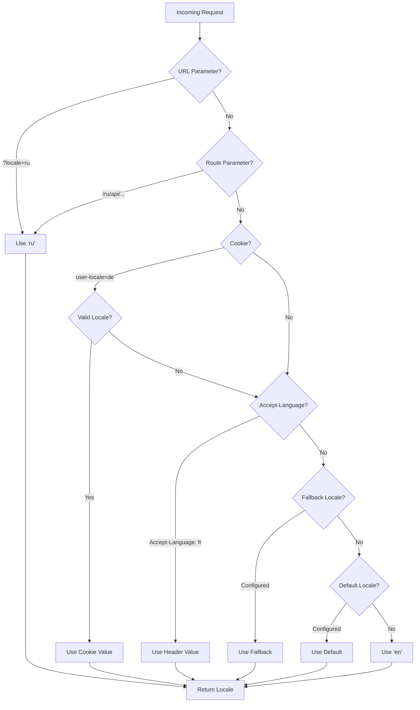

# 🌍 Server-Side Translations and Locale Information in Nuxt I18n Micro

## 📖 Overview

Nuxt I18n Micro supports server-side translations and locale information, allowing you to translate content and access locale details on the server. This is particularly useful for APIs or server-rendered applications where localization is needed before reaching the client.

The translations use locale messages defined in the Nuxt I18n configuration and are dynamically resolved based on the detected locale. 

All translations are pre-merged at build time (root-level files are baked into every page file). The server-side middleware loads the same pre-built files as the client, so all keys (both shared and page-specific) are available in server handlers.

## 🛠️ Setting Up Server-Side Middleware

To enable server-side translations and locale information, use the provided middleware functions:

- `useTranslationServerMiddleware` - for translating content
- `useLocaleServerMiddleware` - for accessing locale information

Both middleware functions are automatically available in all server routes.

The locale detection logic is shared between both middleware functions through the `detectCurrentLocale` utility function to ensure consistency across the module.

## ✨ Using Translations in Server Handlers

You can seamlessly translate content in any `eventHandler` by using the translation middleware.

### Example: Basic Translation Usage
```typescript
import { defineEventHandler } from 'h3'

export default defineEventHandler(async (event) => {
  const t = await useTranslationServerMiddleware(event)
  return {
    message: t('greeting'), // Returns the translated value for the key "greeting"
  }
})
```

In this example:
- The user's locale is detected automatically from query parameters, cookies, or headers.
- The `t` function retrieves the appropriate translation for the detected locale.

## 🌍 Using Locale Information in Server Handlers

### Basic Locale Information Usage

```typescript
import { defineEventHandler } from 'h3'

export default defineEventHandler((event) => {
  const localeInfo = useLocaleServerMiddleware(event)
  
  return {
    success: true,
    data: localeInfo,
    timestamp: new Date().toISOString()
  }
})
```

### Providing Custom Locale Parameters

```typescript
import { defineEventHandler } from 'h3'

export default defineEventHandler((event) => {
  // Force specific locale with custom default
  const localeInfo = useLocaleServerMiddleware(event, 'en', 'ru')
  
  return {
    success: true,
    data: localeInfo,
    timestamp: new Date().toISOString()
  }
})
```

### Response Structure

The locale middleware returns a `LocaleInfo` object with the following properties:

```typescript
interface LocaleInfo {
  current: string        // Current detected locale code
  default: string        // Default locale code
  fallback: string       // Fallback locale code
  available: string[]    // Array of all available locale codes
  locale: Locale | null  // Full locale configuration object
  isDefault: boolean     // Whether current locale is the default
  isFallback: boolean    // Whether current locale is the fallback
}
```

### Example Response

```json
{
  "success": true,
  "data": {
    "current": "ru",
    "default": "en",
    "fallback": "en",
    "available": ["en", "ru", "de"],
    "locale": {
      "code": "ru",
      "iso": "ru-RU",
      "dir": "ltr",
      "displayName": "Русский"
    },
    "isDefault": false,
    "isFallback": false
  },
  "timestamp": "2024-01-15T10:30:00.000Z"
}
```

## 🌐 Providing a Custom Locale

If you need to specify a locale manually (e.g., for testing or certain requests), you can pass it to the translation middleware:

### Example: Custom Locale
```typescript
import { defineEventHandler } from 'h3'

function detectLocale(event): string | null {
  const urlSearchParams = new URLSearchParams(event.node.req.url?.split('?')[1]);
  const localeFromQuery = urlSearchParams.get('locale');
  if (localeFromQuery) return localeFromQuery;

  return 'en';
}

export default defineEventHandler(async (event) => {
  const t = await useTranslationServerMiddleware(event, 'en', detectLocale(event)) // Force French local, en - default locale
  return {
    message: t('welcome'), // Returns the French translation for "welcome"
  }
})
```

## 📋 Locale Detection Logic

Both middleware functions automatically determine the user's locale using the following priority order:



1. **URL Parameters**: `?locale=ru`
2. **Route Parameters**: `/ru/api/endpoint`
3. **Cookies**: `user-locale` cookie
4. **HTTP Headers**: `Accept-Language` header
5. **Fallback Locale**: As configured in module options
6. **Default Locale**: As configured in module options
7. **Hardcoded Fallback**: `'en'`

> **Note**: The locale detection logic is shared between `useLocaleServerMiddleware` and `useTranslationServerMiddleware` to ensure consistency across the module.

## 📋 Advanced Usage Examples

### Conditional Response Based on Locale

```typescript
import { defineEventHandler } from 'h3'

export default defineEventHandler((event) => {
  const { current, isDefault, locale } = useLocaleServerMiddleware(event)
  
  // Return different content based on locale
  if (current === 'ru') {
    return {
      message: 'Привет, мир!',
      locale: current,
      isDefault
    }
  }
  
  if (current === 'de') {
    return {
      message: 'Hallo, Welt!',
      locale: current,
      isDefault
    }
  }
  
  // Default English response
  return {
    message: 'Hello, World!',
    locale: current,
    isDefault
  }
})
```

### Custom Locale Detection

```typescript
import { defineEventHandler } from 'h3'

export default defineEventHandler((event) => {
  // Force German locale with English as fallback
  const { current, isDefault, locale } = useLocaleServerMiddleware(event, 'en', 'de')
  
  return {
    message: 'Hallo, Welt!',
    locale: current,
    isDefault: false // Will be false since we forced German
  }
})
```

### Locale-Aware API with Validation

```typescript
import { defineEventHandler, createError } from 'h3'

export default defineEventHandler((event) => {
  const { current, available, locale } = useLocaleServerMiddleware(event)
  
  // Validate if the detected locale is supported
  if (!available.includes(current)) {
    throw createError({
      statusCode: 400,
      statusMessage: `Unsupported locale: ${current}. Available locales: ${available.join(', ')}`
    })
  }
  
  // Return locale-specific configuration
  return {
    locale: current,
    direction: locale?.dir || 'ltr',
    displayName: locale?.displayName || current,
    availableLocales: available
  }
})
```

### Integration with Translation Middleware

You can combine locale information with translation middleware for comprehensive internationalization:

```typescript
import { defineEventHandler } from 'h3'

export default defineEventHandler(async (event) => {
  const localeInfo = useLocaleServerMiddleware(event)
  const t = await useTranslationServerMiddleware(event)
  
  return {
    locale: localeInfo.current,
    message: t('welcome_message'),
    availableLocales: localeInfo.available,
    isDefault: localeInfo.isDefault
  }
})
```

## 📝 Best Practices

1. **Always validate locales**: Check if the detected locale is in your available locales list
2. **Use fallback logic**: Provide sensible defaults when locale detection fails
3. **Cache locale information**: For performance-critical applications, consider caching locale detection results
4. **Handle edge cases**: Account for unsupported locales and provide appropriate error responses
5. **Combine with translations**: Use locale information alongside translation middleware for complete i18n support

## 🚀 Performance Considerations

- Both middleware functions are lightweight and designed for fast execution
- Locale detection uses efficient fallback chains
- No external API calls are made during locale detection
- Results are computed synchronously for optimal performance
