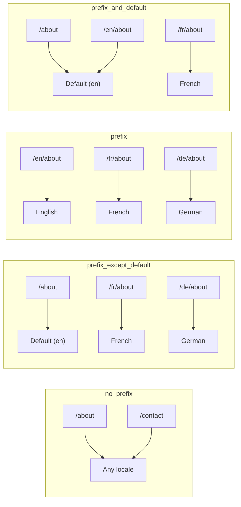
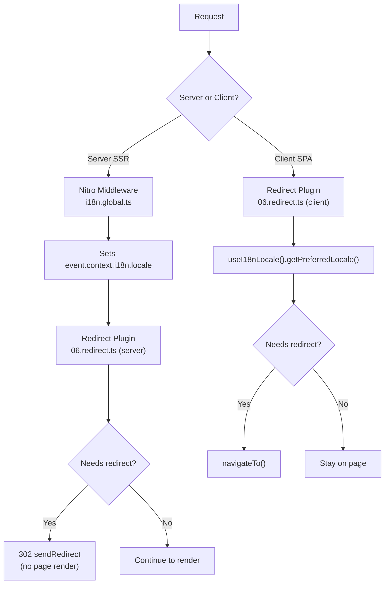

# 🗂️ Routing Strategies in Nuxt I18n Micro

## 📖 Overview

Nuxt I18n Micro controls how locale prefixes appear in URLs through the `strategy` option. Under the hood, two packages implement this:

- **`@i18n-micro/route-strategy`** — build-time route generation (extends Nuxt pages with localized routes)
- **`@i18n-micro/path-strategy`** — runtime path resolution, redirects, SEO attributes, and link generation

The Nuxt module selects the correct strategy class at build time and aliases it via `#i18n-strategy`, so only the chosen implementation is bundled.

## 🚦 Available Strategies

**Type**: `string`
**Default**: `'prefix_except_default'`

### Strategy Comparison



### 🛑 `no_prefix`

URLs have no locale segment. Locale is determined by cookies, `useI18nLocale()` state, or browser detection.

- **Routes**: `/about`, `/contact` — same URL for all locales
- **Locale persistence**: Via `localeCookie` (automatically set to `'user-locale'` if not specified)
- **Restrictions**: Does not support custom paths or route-level locale restrictions

::: tip Automatic `localeCookie`
When using `no_prefix`, `localeCookie` is automatically set to `'user-locale'` if not specified. This is required because the URL contains no locale information.
:::

```typescript
i18n: {
  strategy: 'no_prefix'
  // localeCookie is automatically set to 'user-locale'
}
```

### 🚧 `prefix_except_default`

All routes have a locale prefix **except** the default locale.

- **Default locale**: `/about`, `/contact`
- **Other locales**: `/fr/about`, `/de/contact`
- **Default locale with prefix returns 404**: `/en/about` → 404 (when `en` is default)

```typescript
i18n: {
  strategy: 'prefix_except_default' // This is the default
}
```

### 🌍 `prefix`

Every route has a locale prefix, including the default locale.

- **All locales**: `/en/about`, `/fr/about`, `/de/about`
- **Root `/`**: Redirects to `/{locale}/` based on user preference

```typescript
i18n: {
  strategy: 'prefix'
}
```

### 🔄 `prefix_and_default`

Default locale is available both with and without prefix. Non-default locales always have a prefix.

- **Default locale**: both `/about` and `/en/about` are valid
- **Other locales**: `/fr/about`, `/de/about`
- **No redirect from `/`**: Both `/` and `/en/` serve the default locale

```typescript
i18n: {
  strategy: 'prefix_and_default'
}
```

## 🔀 Redirect Architecture (v3)

In v3, redirect logic is split into two layers for optimal performance:

### How It Works



### Server-Side (No Flash)

1. **Nitro middleware** (`i18n.global.ts`) runs first — detects locale from URL, cookie, or `Accept-Language` header and sets `event.context.i18n.locale`
2. **Redirect plugin** (`06.redirect.ts`, server branch) checks if the current path needs a redirect using `i18nStrategy.getClientRedirect()` and issues a 302 `sendRedirect` **before** any page rendering occurs
3. This prevents the "error flash" where users briefly see a wrong page before redirect

### Client-Side (SPA Navigation)

1. After hydration (`app:mounted`), the redirect plugin reads locale from `useI18nLocale().getPreferredLocale()`
2. Uses `i18nStrategy.getClientRedirect()` to check if redirect is needed
3. On SPA navigation (`router.afterEach`), re-checks for redirects

### Locale Priority Order

The redirect plugin determines the preferred locale in this order:

1. **`useState('i18n-locale')`** — highest priority (set programmatically via `useI18nLocale().setLocale()`)
2. **Cookie** — if `localeCookie` is configured
3. **`Accept-Language` header** — if `autoDetectLanguage: true`
4. **`defaultLocale`** — final fallback

### Redirect Behavior Per Strategy

| Strategy | `GET /` behavior | Cookie required? |
|----------|-----------------|-----------------|
| `no_prefix` | No redirect (locale from cookie/state) | Auto-set |
| `prefix` | 302 → `/{locale}/` | Recommended |
| `prefix_except_default` | 302 → `/{locale}/` if locale ≠ default | Recommended |
| `prefix_and_default` | No redirect (both `/` and `/{locale}/` valid) | Optional |

### Disabling Redirects

```typescript
i18n: {
  redirects: false // Disables automatic locale redirects
}
```

When `redirects: false`, the redirect plugin (`06.redirect`) is still registered but only the redirect logic is disabled. The plugin continues to perform:
- **404 checks** for invalid locale prefixes (e.g. `/xx/about` where `xx` is not a valid locale)
- **Cookie synchronization** from URL prefix (e.g. visiting `/fr/about` syncs the cookie to `fr`)

## 🍪 Cookie-Based Locale Persistence

::: warning Required for prefix strategies with redirects
When using `prefix` or `prefix_except_default` with `redirects: true` (the default), you **must** set `localeCookie` for redirects to work correctly. Without a cookie, the redirect plugin cannot remember the user's locale preference across page reloads.

```typescript
i18n: {
  strategy: 'prefix_except_default',
  localeCookie: 'user-locale' // Required for redirects to work properly
}
```
:::

**How `localeCookie` works in v3:**

- Managed internally by `useI18nLocale()` — **do not set it manually** via `useCookie()`
- When a user visits a prefixed URL (e.g., `/fr/about`), the cookie is automatically synced to `fr`
- On next visit to `/`, the cookie value is used to redirect to `/{locale}/`
- If the cookie contains an invalid locale (not in `locales` list), it falls back to `defaultLocale`

| Strategy | `localeCookie` default | Notes |
|----------|----------------------|-------|
| `no_prefix` | Auto: `'user-locale'` | Required; set automatically |
| `prefix` | `null` (disabled) | Set to `'user-locale'` for redirects |
| `prefix_except_default` | `null` (disabled) | Set to `'user-locale'` for redirects |
| `prefix_and_default` | `null` (disabled) | Optional |

## 🔍 `autoDetectLanguage` and `autoDetectPath`

### `autoDetectLanguage`

When `true`, the server middleware checks the `Accept-Language` header to detect the user's preferred locale. This is used as a fallback when no cookie or state is available.

```typescript
i18n: {
  autoDetectLanguage: true // Default: false
}
```

### `autoDetectPath`

Controls which paths trigger locale detection and redirect:

- `"/"` (default) — only the root path triggers detection/redirect
- `"*"` — **all paths** trigger detection/redirect (use with caution)

```typescript
i18n: {
  autoDetectPath: '/' // Default: only root
  // autoDetectPath: '*' // All paths — redirects even /fr/about to /de/about
}
```

::: warning `autoDetectPath: '*'`
With `autoDetectPath: '*'`, even URLs with an explicit locale prefix (e.g., `/fr/about`) will be redirected if the user's preferred locale differs. This can be useful for domain-based setups but may confuse users who share URLs.
:::

## ⚠️ Known Issues and Best Practices

### 1. Hydration Mismatch in `no_prefix` Strategy

When using `no_prefix`, the locale is determined dynamically. If server and client disagree on the locale, you'll see a hydration mismatch.

**Solution**: Use `useI18nLocale().setLocale()` in a server plugin (with `order: -10`) to set the locale before i18n initialization:

```ts
// plugins/i18n-loader.server.ts
export default defineNuxtPlugin({
  name: 'i18n-custom-loader',
  enforce: 'pre',
  order: -10,
  setup() {
    const { setLocale } = useI18nLocale()
    setLocale('ja') // Your detection logic here
  }
})
```

See [Custom Language Detection](/guide/custom-auto-detect) for detailed examples.

### 2. Use Named Routes with `localeRoute`

Path-based routing can cause issues with route resolution:

```typescript
// May cause issues
$localeRoute('/page')

// Preferred approach
$localeRoute({ name: 'page' })
```

### 3. Using `pages: false` with i18n

When using Nuxt with `pages: false`:

```typescript
export default defineNuxtConfig({
  pages: false,
  i18n: {
    strategy: 'no_prefix', // Recommended
    disablePageLocales: true, // Required
    localeCookie: 'user-locale', // Required for persistence
  },
})
```

**Limitations with `pages: false`:**
- No automatic redirects
- No URL-based locale detection
- Client-side locale switching requires page reload or manual translation loading

### 4. Invalid Cookie Handling

If a cookie contains an invalid locale (not in the `locales` list), the module gracefully falls back to `defaultLocale`. No errors are thrown.

## 📝 Best Practices Summary

| Recommendation | Details |
|---------------|---------|
| **Set `localeCookie`** | Always set for prefix strategies with `redirects: true` |
| **Use `useI18nLocale()`** | The centralized way to manage locale state (replaces manual `useState`/`useCookie`) |
| **Use named routes** | `$localeRoute({ name: 'page' })` over `$localeRoute('/page')` |
| **Programmatic locale** | Use `useI18nLocale().setLocale()` in a server plugin with `order: -10` |
| **Avoid manual cookies** | Don't use `useCookie('user-locale')` directly — `useI18nLocale()` manages this |
