# 🗂️ Strategies for Locale Prefix Handling in Nuxt I18n Micro

## 📖 Introduction to Locale Prefix Strategies

Nuxt I18n Micro manages how locale prefixes appear in URLs through the `strategy` option. This gives you control over how localization is applied to routes: whether the default locale has a prefix, whether all locales use a prefix, or whether no prefix is used at all.

The `strategy` option is implemented by two packages: **@i18n-micro/route-strategy** (build-time route generation) and **@i18n-micro/path-strategy** (runtime path and redirect logic). The Nuxt module passes the strategy into `RouteGenerator`, which extends your Nuxt pages with the appropriate localized routes at build time.

## 🚦 `strategy`

The `strategy` option defines how locale prefixes are applied across your routes. The available values are:

**Type**: `string`  
**Default**: `prefix_except_default`

### Strategy Comparison


## Available Strategies:

### 🛑 **no_prefix**

This strategy ensures that no locale prefix is added to your routes. Instead of modifying the URL, the application will detect and change the locale based on the user's browser settings or cookies.

- **Behavior**: Routes won't have any locale prefix.
- **Locale Detection**: The locale is detected based on the user's browser language or cookies, and it is changed without altering the URL.
- **Restrictions**: This strategy does not support features like Custom paths or Ignore routes.

**Default Locale**: You can set the default locale using an environment variable. For example:
- `DEFAULT_LOCALE=de npm run dev`
- `DEFAULT_LOCALE=de npm run build`

**Use Case**: Ideal when you want a cleaner URL structure and are relying on automatic language detection rather than explicit locale identifiers in the URL.

::: tip Automatic `localeCookie`
When using `no_prefix` strategy, `localeCookie` is automatically set to `'user-locale'` if not specified. This is required to persist the locale between page reloads since there's no locale information in the URL.
:::

::: warning `localeCookie` required for redirects
When using prefix strategies with `redirects: true` (the default), you should explicitly set `localeCookie: 'user-locale'` (or a custom name) for redirect behavior to work correctly. Without a cookie, the redirect plugin cannot remember the user's locale preference across page reloads, making redirects effectively non-functional for returning users.

```typescript
i18n: {
  strategy: 'prefix_except_default',
  localeCookie: 'user-locale' // Required for redirects to work properly
}
```
:::

```typescript
i18n: {
  strategy: 'no_prefix'
  // localeCookie is automatically set to 'user-locale'
}
```

**Example Routes**:
- `/about` (for any language, e.g., `en`, `ru`, `fr`, etc.)
- `/contact` (for any language)
- `/other` (for any language)
- `/other2` (for any language)

### 🚧 **prefix_except_default**

With this strategy, all of your routes will include a locale prefix, except for the default language. For the default language, the route will appear without any prefix.

- **Behavior**: All routes will include a locale prefix, except for the default language.
- **Locale Handling**: This ensures that only the default locale has URLs without a prefix, while all other locales will have a locale-specific prefix.

**Use Case**: Useful when you want all non-default languages to have a distinct URL structure with a locale prefix but prefer the default language to be accessible without the prefix.

```typescript
i18n: {
  strategy: 'prefix_except_default'
}
```

**Example Routes**:
- `/about` (for the default language, e.g., `en`)
- `/ru/about` (for Russian)
- `/fr/about` (for French)

### 🌍 **prefix**

This strategy ensures that every route in your application will include a locale prefix, regardless of the language. It standardizes the URL structure across all languages.

- **Behavior**: All routes will have a locale prefix.
- **Locale Handling**: Every route will follow a consistent pattern, with a locale prefix present in the URL for all languages.

**Use Case**: Ideal for situations where you want a consistent URL structure for all languages, ensuring every route includes the locale prefix.

```typescript
i18n: {
  strategy: 'prefix'
}
```

**Example Routes**:
- `/en/about` (for English)
- `/ru/about` (for Russian)
- `/fr/about` (for French)

### 🔄 **prefix_and_default**

This strategy combines both the `prefix` and `prefix_except_default` behaviors. It ensures that all languages have a locale prefix in their URLs, but the default language also has a non-prefixed URL version available. When `autoDetectLanguage` is enabled, the module will attempt to redirect users to the prefixed route matching their preferred language if it differs from the default locale.

- **Behavior**: Every language gets a URL with a locale prefix, but the default language also has a non-prefixed version.
- **Locale Handling**: The default language has both a prefixed and non-prefixed URL. With `autoDetectLanguage: true`, the module redirects users to the prefixed route of their preferred locale if it is not the default locale.

**Use Case**: Best for applications that want to support both prefixed and non-prefixed URLs for the default language while maintaining a locale prefix for other languages.

```typescript
i18n: {
  strategy: 'prefix_and_default'
}
```

**Example Routes**:
- `/about` (for the default language, e.g., `en`)
- `/en/about` (for English, with prefix)
- `/ru/about` (for Russian)
- `/fr/about` (for French)

## 🔀 Redirect Behavior

When using prefix-based strategies with `redirects: true`, visiting `/` triggers a redirect based on user's locale preference.

### Redirect Flow Diagram

```mermaid
flowchart TB
    A["Request to /"] --> B{Strategy?}
    
    B -->|no_prefix| C["✅ No Redirect"]
    B -->|prefix_and_default| C
    B -->|prefix| D{Cookie exists?}
    B -->|prefix_except_default| D
    
    D -->|Yes| E{Valid locale?}
    D -->|No| F[Render page]
    
    E -->|Yes| G["302 → /{locale}/"]
    E -->|No| H[Use defaultLocale]
    H --> G
    
    F --> I{Client check}
    I --> J["useI18nLocale()"]
    J --> K{Has value?}
    K -->|Yes| L["Redirect → /{locale}/"]
    K -->|No| M{Check cookie}
    M -->|Found| L
    M -->|Not found| N[Use default]
    N --> L
    
    C --> O["✅ Done"]
    G --> O
    L --> O
```



### Server-Side Redirect (No Error Flash)

For the `prefix` strategy, redirects are handled by **server middleware** (`i18n.global.ts`) when a locale cookie is present. This prevents the "error flash" issue where users briefly see an error page before being redirected.

**How it works:**
1. When a request comes to `/` with a valid locale cookie, the Nitro plugin immediately returns a 302 redirect before Nuxt renders
2. No page rendering occurs, so there's no error flash
3. If no cookie is present (e.g. first visit), the **client plugin** (`06.client-redirect.client.ts`) runs after hydration and redirects based on `useI18nLocale()` (locale state) or cookie set by your custom plugins

| Strategy | Redirect from `/` |
|----------|-------------------|
| `prefix` | → `/<locale>/` (uses `useI18nLocale`, cookie, or `defaultLocale`) |
| `prefix_except_default` | → `/<locale>/` only if locale ≠ default |
| `prefix_and_default` | No redirect (both `/` and `/<locale>/` are valid) |

**Locale Priority Order:**
1. `useI18nLocale().locale` (or `useState('i18n-locale')`) — highest priority for programmatic locale setting
2. Cookie value (if `localeCookie` is set)
3. `defaultLocale` — fallback

**Important:** 
- Cookie-based locale persistence is disabled by default (`localeCookie: null`)
- For `no_prefix` strategy, `localeCookie` is **automatically** set to `'user-locale'` (required to persist locale)
- For prefix strategies with `redirects: true`, you **must** explicitly set `localeCookie` for redirects to remember the user's locale preference. Without it, redirects will only work based on `Accept-Language` header or `defaultLocale`
- If the cookie contains an invalid locale (not in the `locales` list), the module falls back to `defaultLocale`

To enable cookie-based locale persistence (recommended for prefix strategies with redirects):
```typescript
i18n: {
  localeCookie: 'user-locale'
}
```

This enables:
- Locale persistence across page reloads
- Locale memory when user returns to your site
- Correct redirect behavior for prefix strategies

## ⚠️ Known Issues and Best Practices

While the `strategy` option provides flexibility, there are some known issues and best practices to keep in mind when using these strategies.

### 1. **Hydration Mismatch in `no_prefix` Strategy**

When using the `no_prefix` strategy, you may encounter a **hydration mismatch** error if the locale is determined dynamically after the page starts rendering. This happens when the server-rendered content uses a different locale than what the client expects.

**Error Example**:
```
Hydration completed but contains mismatches.
```

**Solution**:

Use `useI18nLocale().setLocale()` to set the locale before i18n initialization. This ensures both server and client use the same locale.

```ts
// plugins/i18n-loader.server.ts
import { defineNuxtPlugin } from '#imports'

export default defineNuxtPlugin({
  name: 'i18n-custom-loader',
  enforce: 'pre',
  order: -10,

  setup() {
    const { setLocale } = useI18nLocale()
    const detectedLocale = 'ja' // Your detection logic here
    setLocale(detectedLocale)
  }
})
```

See [Custom Language Detection](/guide/custom-auto-detect#no-prefix-strategy-server-side-locale-detection-without-redirects) for detailed examples.

### 2. **Issues with `localeRoute` and Route Resolution**

When using `localeRoute` to generate links, there can be issues with route resolution, especially if you rely on path-based routing. For example:

```typescript
localeRoute('/page') // May cause issues with route resolution
```

**Best Practice**:
- Always use named routes with `localeRoute` to avoid unnecessary redirects or route resolution problems:

```typescript
localeRoute({ name: 'page' }) // Preferred approach
```

This ensures that the correct route is resolved regardless of the locale strategy.

### 3. **Rendering Issues with Locale-Dependent Content in `no_prefix` Strategy**

In the `no_prefix` strategy, rendering content that depends on the selected locale (e.g., buttons for switching languages) can lead to issues if the locale is not properly synchronized between server and client.

**Best Practice**:

1. Use `useI18nLocale().setLocale()` in a server plugin to ensure locale is set before rendering (see issue #1 above).

2. Use a `<select>` element for locale switching to avoid hydration issues:

```vue
<select @change="(e) => $switchLocale(e.target.value)">
  <option
    v-for="locale in availableLocales"
    :key="locale.code"
    :value="locale.code"
    :selected="locale.isActive"
  >
    {{ locale.code }}
  </option>
</select>
```

This approach avoids hydration issues and ensures that the UI updates correctly when the locale changes.

### 4. **Using `pages: false` with i18n**

When using Nuxt with `pages: false` (disabled file-based routing), the i18n module has some limitations:

**Known Limitations:**
- **No automatic redirects**: Redirect logic depends on file-based routes. With `pages: false`, the router doesn't have page-based routes to redirect to.
- **No route-based locale detection**: URL-based locale detection (prefix strategies) won't work as expected since there are no route definitions.
- **Client-side locale switching**: Requires a page reload because the router doesn't have routes to trigger translation reloading.

**Recommended Configuration for `pages: false`:**

```typescript
export default defineNuxtConfig({
  pages: false,
  modules: ['nuxt-i18n-micro'],
  i18n: {
    strategy: 'no_prefix', // Recommended for pages: false
    defaultLocale: 'en',
    locales: [
      { code: 'en', iso: 'en-US', name: 'English' },
      { code: 'zh', iso: 'zh-CN', name: '简体中文' },
    ],
    disablePageLocales: true, // Required with pages: false
    localeCookie: 'user-locale', // Required for locale persistence
  },
})
```

**Why `no_prefix` is recommended:**
- No dependency on URL-based locale detection
- Locale is determined by cookie or `useI18nLocale()` (locale state)
- Works consistently with custom routing solutions

**Workarounds for client-side locale switching:**

1. **Full page reload after switching locale:**
```vue
<script setup>
const { $switchLocale } = useNuxtApp()

function switchToLocale(locale) {
  $switchLocale(locale)
  // Force page reload to load new translations
  window.location.reload()
}
</script>
```

2. **Manually load translations:**
```vue
<script setup>
const { $switchLocale, $mergeGlobalTranslations } = useNuxtApp()

async function switchToLocale(locale) {
  // Load translations first
  const data = await $fetch(`/locales/${locale}.json`)
  $mergeGlobalTranslations(data)
  $switchLocale(locale)
}
</script>
```

**Invalid Cookie Handling:**

If a cookie contains an invalid locale (not in the `locales` list), the module gracefully falls back to `defaultLocale` instead of throwing an error. This ensures your app remains functional even with corrupted or outdated cookies.

## 📝 Conclusion

The `strategy` option in Nuxt I18n Micro controls how locale prefixes are applied to your routes. Whether you need a clean, non-prefixed URL structure or locale prefixes for all or some languages, the available strategies let you tailor the URL structure to your project.

### 📚 Best Practices:

- **Simplicity for Default Language**: If you don't need locale prefixes for your default language, use `prefix_except_default` or `prefix_and_default`.
- **Consistency**: For a consistent URL structure with locale prefixes across all languages, use `prefix`.
- **User Experience**: Consider using `no_prefix` when you want to rely on browser language detection and avoid cluttering the URL with prefixes.
- **Programmatic Locale Setting**: Use `useI18nLocale().setLocale()` in a server plugin to set locale before i18n initialization. Works with all strategies. See [Custom Language Detection](/guide/custom-auto-detect) for details.
- **Avoid Hydration Issues**: Use named routes with `localeRoute` for better route resolution.
- **Handle Locale-Dependent Content Carefully**: Use `<select>` or other approaches to avoid hydration mismatches when rendering locale-dependent content.

By understanding and applying these strategies and best practices, you can ensure that your application's localization behavior fits your project's requirements while avoiding common pitfalls.
