# 📦 Upgrading from v2.x to v3.x

v3.0.0 introduces fundamental architectural changes: strategy packages, a new caching system, centralized locale management via `useI18nLocale()`, and a redesigned redirect pipeline. This section covers all breaking changes and how to update your code.

## Migration Steps

```mermaid
flowchart LR
    A["1. Update deps"] --> B["2. Fix config"] --> C["3. Update plugins"] --> D["4. Test"] --> E["✅ Done"]
```



## Breaking Changes Summary

- **Locale state** — `useState` / `useCookie` manually → `useI18nLocale()` composable
- **Config access** — `useRuntimeConfig().public.i18nConfig` → `getI18nConfig()` from `#build/i18n.strategy.mjs`
- **Redirect component** — `fallbackRedirectComponentPath` option → Server middleware + client plugin (automatic)
- **`includeDefaultLocaleRoute`** — Supported (deprecated) → Removed, use `strategy` option
- **`experimental.hmr` / `previousPageFallback`** — Under `experimental` → Root-level options
- **Caching** — `useStorage('cache')` → `TranslationStorage` singleton (`Symbol.for` on `globalThis`)
- **SSR transfer** — Runtime config → `window.__I18N__` script injection
- **Strategy classes** — Internal → Separate packages (`@i18n-micro/route-strategy`, `@i18n-micro/path-strategy`)

## Removed: `fallbackRedirectComponentPath`

The `fallbackRedirectComponentPath` option and the `locale-redirect.vue` fallback component have been removed. Redirect logic is now handled by:

1. **Server middleware** (`i18n.global.ts`) — sets `event.context.i18n.locale`
2. **Redirect plugin** (`06.redirect.ts`) — handles 302 redirects on server (before render) and client (after hydration)

```diff
 i18n: {
   strategy: 'prefix_except_default',
-  fallbackRedirectComponentPath: '~/components/MyRedirect.vue',
 }
```

If you had custom redirect logic in the fallback component, implement it in a server plugin instead:

```ts
// plugins/i18n-loader.server.ts
export default defineNuxtPlugin({
  name: 'i18n-custom-redirect',
  enforce: 'pre',
  order: -10,
  setup() {
    const { setLocale } = useI18nLocale()
    // Your custom detection logic
    setLocale(detectedLocale)
  }
})
```

## Removed: `includeDefaultLocaleRoute`

Use the `strategy` option instead:

- `includeDefaultLocaleRoute: true` → `strategy: 'prefix'`
- `includeDefaultLocaleRoute: false` → `strategy: 'prefix_except_default'` (the default)

```diff
 i18n: {
-  includeDefaultLocaleRoute: true,
+  strategy: 'prefix',
 }
```

## Config Access: `getI18nConfig()` replaces `useRuntimeConfig`

```diff
- const config = useRuntimeConfig()
- const cookieName = config.public.i18nConfig?.localeCookie || 'user-locale'
+ import { getI18nConfig } from '#build/i18n.strategy.mjs'
+ const { localeCookie: configCookie } = getI18nConfig()
+ const cookieName = configCookie ?? 'user-locale'
```

## Locale Management: `useI18nLocale()` replaces manual state

In v2, you may have used `useState('i18n-locale')` or `useCookie('user-locale')` directly. In v3, use the centralized `useI18nLocale()` composable:

```diff
- const locale = useState('i18n-locale')
- const cookie = useCookie('user-locale')
- locale.value = 'fr'
- cookie.value = 'fr'
+ const { setLocale } = useI18nLocale()
+ setLocale('fr') // Updates both state and cookie atomically
```

See [Custom Language Detection](/guide/custom-auto-detect) for detailed examples.

## Experimental Options Moved to Root

Options previously under `experimental` are now root-level:

```diff
 i18n: {
-  experimental: {
-    hmr: true,
-    previousPageFallback: true
-  }
+  hmr: true,
+  previousPageFallback: true
 }
```

## Redirect Architecture (v3)

Redirects are now handled automatically by two components:

1. **Server-side** (`06.redirect.ts`): Runs during SSR, issues 302 redirects before any page rendering — no "error flash"
2. **Client-side** (`06.redirect.ts`): Runs after hydration (`app:mounted`) and on SPA navigation (`router.afterEach`)

Locale priority for redirects:
1. `useState('i18n-locale')` — set via `useI18nLocale().setLocale()`
2. Cookie — if `localeCookie` is configured
3. `Accept-Language` header — if `autoDetectLanguage: true`
4. `defaultLocale` — fallback

No code changes required for standard setups.

::: warning `localeCookie` for prefix strategies
For `prefix` and `prefix_except_default` strategies with `redirects: true`, set `localeCookie: 'user-locale'` to enable locale persistence across page reloads. Without it, redirects only use `Accept-Language` or `defaultLocale`.
:::

## TypeScript: Internal Module Types (optional)

If you encounter type errors related to internal imports like `#i18n-internal/plural`, `#i18n-internal/strategy`, or `#i18n-internal/config`, add the `imports` section to your project's `package.json`:

```json
{
  "imports": {
    "#i18n-internal/plural": "nuxt-i18n-micro/internals",
    "#i18n-internal/strategy": "nuxt-i18n-micro/internals",
    "#i18n-internal/config": "nuxt-i18n-micro/internals"
  }
}
```

::: tip
This is **not required** in most cases — Nuxt resolves these automatically at build time. Add this only if your IDE or `vue-tsc` reports unresolved module errors.
:::
