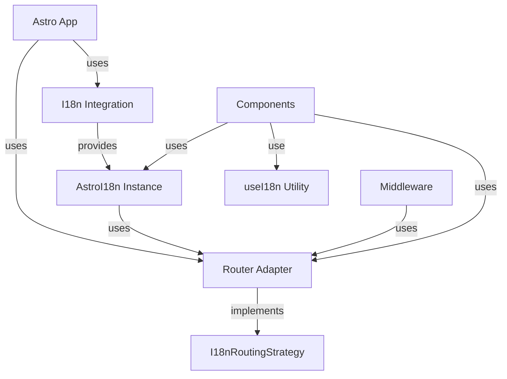

# Astro Package (`@i18n-micro/astro`)

The `@i18n-micro/astro` package provides a lightweight, high-performance internationalization solution for Astro applications. It shares the same core logic as Nuxt I18n Micro, offering SSR support, automatic locale detection, Astro components, and full TypeScript support.

## Overview

`@i18n-micro/astro` is designed for Astro applications that need internationalization with server-side rendering support. It provides:

- **Lightweight** - Uses shared core logic from `@i18n-micro/core`
- **SSR Support** - Full server-side rendering compatibility
- **Automatic Locale Detection** - Detects locale from URL path, cookies, or headers
- **Pluralization** - Built-in plural form support
- **Formatting** - Number, date, and relative time formatting
- **Type-safe** - Full TypeScript support
- **Router-agnostic** - Works with any routing strategy or without routing
- **DevTools Integration** - Optional development tools via Vite plugin
- **SEO Optimized** - Automatic meta tags and hreflang generation

## Installation

Install the package using your preferred package manager:

::: code-group

```bash [npm]
npm install @i18n-micro/astro
```

```bash [yarn]
yarn add @i18n-micro/astro
```

```bash [pnpm]
pnpm add @i18n-micro/astro
```

```bash [bun]
bun add @i18n-micro/astro
```

:::

### Peer Dependencies

The package requires Astro 5:

```json
{
  "peerDependencies": {
    "astro": "^5.0.0"
  }
}
```

## Quick Start

### Basic Setup (Without Router Adapter)

For applications that don't need routing features:

```javascript
import { defineConfig } from 'astro/config'
import { i18nIntegration } from '@i18n-micro/astro'

export default defineConfig({
  integrations: [
    i18nIntegration({
      locale: 'en',
      fallbackLocale: 'en',
      locales: [
        { code: 'en', displayName: 'English', iso: 'en-US' },
        { code: 'fr', displayName: 'Français', iso: 'fr-FR' },
      ],
      translationDir: 'src/locales',
    }),
  ],
})
```

### Setup With Router Adapter

For applications with routing:

```javascript
import { defineConfig } from 'astro/config'
import { i18nIntegration, createAstroRouterAdapter } from '@i18n-micro/astro'

const localesConfig = [
  { code: 'en', displayName: 'English', iso: 'en-US' },
  { code: 'fr', displayName: 'Français', iso: 'fr-FR' },
  { code: 'de', displayName: 'Deutsch', iso: 'de-DE' },
]

const defaultLocale = 'en'

export default defineConfig({
  integrations: [
    i18nIntegration({
      locale: defaultLocale,
      fallbackLocale: defaultLocale,
      locales: localesConfig,
      translationDir: 'src/locales',
      routingStrategy: createAstroRouterAdapter(localesConfig, defaultLocale),
    }),
  ],
})
```

**Note:** The `createAstroRouterAdapter` is now exported from the package, so you don't need to create your own router adapter file. However, you can still create a custom adapter if needed.

### Setup Middleware

Create `src/middleware.ts`:

#### Option 1: Manual Configuration (Works Everywhere)

```typescript
import { createI18nMiddleware, createI18n, createAstroRouterAdapter } from '@i18n-micro/astro'

const localesConfig = [
  { code: 'en', displayName: 'English', iso: 'en-US' },
  { code: 'fr', displayName: 'Français', iso: 'fr-FR' },
]

const defaultLocale = 'en'

// Create global i18n instance with inline messages
const globalI18n = createI18n({
  locale: defaultLocale,
  fallbackLocale: defaultLocale,
  messages: {
    en: {
      welcome: 'Welcome',
      greeting: 'Hello, {name}!',
    },
    fr: {
      welcome: 'Bienvenue',
      greeting: 'Bonjour, {name}!',
    },
  },
})

// Create router adapter
const routingStrategy = createAstroRouterAdapter(localesConfig, defaultLocale)

export const onRequest = createI18nMiddleware({
  i18n: globalI18n,
  defaultLocale,
  locales: ['en', 'fr'],
  localeObjects: localesConfig,
  routingStrategy,
})
```

#### Option 2: Using Integration Config (Node.js Runtime Only)

If you're using the integration with `translationDir`, you can import the config from the virtual module:

```typescript
import { createI18nMiddleware, createI18n, createAstroRouterAdapter, loadTranslationsIntoI18n } from '@i18n-micro/astro'
import { config } from 'virtual:i18n-micro/config'

// Use config from integration to avoid duplication
const globalI18n = createI18n({
  locale: config.defaultLocale,
  fallbackLocale: config.fallbackLocale,
  messages: {}, // Translations will be loaded explicitly below
})

// ⚠️ IMPORTANT: loadTranslationsIntoI18n uses node:fs and only works in Node.js runtime
// For Edge runtime (Cloudflare Workers, Vercel Edge), use import.meta.glob instead (see below)
if (config.translationDir) {
  loadTranslationsIntoI18n(globalI18n, {
    translationDir: config.translationDir,
    rootDir: process.cwd(), // Or use: resolve(dirname(fileURLToPath(import.meta.url)), '../..')
  })
}

const routingStrategy = createAstroRouterAdapter(config.locales, config.defaultLocale)

export const onRequest = createI18nMiddleware({
  i18n: globalI18n,
  defaultLocale: config.defaultLocale,
  locales: config.localeCodes,
  localeObjects: config.locales,
  routingStrategy,
})
```

#### Option 3: Edge Runtime Compatible (Cloudflare Workers, Vercel Edge, etc.)

For Edge runtime environments, use `import.meta.glob` to load translations at build time:

```typescript
import { createI18nMiddleware, createI18n, createAstroRouterAdapter } from '@i18n-micro/astro'
import { config } from 'virtual:i18n-micro/config'

// Load translations using import.meta.glob (Edge-compatible)
const translationModules = import.meta.glob('/src/locales/**/*.json', { eager: true })

const globalI18n = createI18n({
  locale: config.defaultLocale,
  fallbackLocale: config.fallbackLocale,
  messages: {},
})

// Process loaded translations
for (const [path, module] of Object.entries(translationModules)) {
  const translations = (module as { default: Record<string, unknown> }).default
  
  // Extract locale and route from path
  // Example: /src/locales/pages/home/en.json -> locale: 'en', route: 'home'
  const match = path.match(/\/([^/]+)\.json$/)
  if (match) {
    const locale = match[1]
    const isPageTranslation = path.includes('/pages/')
    
    if (isPageTranslation) {
      const routeMatch = path.match(/\/pages\/([^/]+)\//)
      const routeName = routeMatch ? routeMatch[1] : 'index'
      globalI18n.addRouteTranslations(locale, routeName, translations, false)
    }
    else {
      globalI18n.addTranslations(locale, translations, false)
    }
  }
}

const routingStrategy = createAstroRouterAdapter(config.locales, config.defaultLocale)

export const onRequest = createI18nMiddleware({
  i18n: globalI18n,
  defaultLocale: config.defaultLocale,
  locales: config.localeCodes,
  localeObjects: config.locales,
  routingStrategy,
})
```

**⚠️ Runtime Compatibility Notes:**

- **Node.js Runtime** (default): `loadTranslationsIntoI18n` works out of the box
- **Edge Runtime** (Cloudflare Workers, Vercel Edge, Deno Deploy): Use `import.meta.glob` instead of `loadTranslationsIntoI18n`
- The `virtual:i18n-micro/config` module works in all environments (it's generated at build time)

### Usage in Astro Components

```astro
---
import { useI18n } from '@i18n-micro/astro'

const { t, locale } = useI18n(Astro)
---

<html lang={locale}>
  <body>
    <h1>{t('welcome')}</h1>
    <p>{t('greeting', { name: 'World' })}</p>
  </body>
</html>
```

### Using Components

```astro
---
import I18nT from '@i18n-micro/astro/i18n-t'
import I18nLink from '@i18n-micro/astro/i18n-link'
import I18nSwitcher from '@i18n-micro/astro/i18n-switcher'
---

<I18nT keypath="welcome" />
<I18nLink href="/about">About</I18nLink>
<I18nSwitcher />
```

## Core Concepts

### Router Adapter Abstraction

The package uses a router adapter pattern to decouple i18n functionality from specific routing implementations. This allows you to:

- Use any routing strategy (file-based routing, custom routing, or no routing)
- Implement routing logic in your application, not in the i18n package
- Keep the core package lightweight and routing-agnostic

The `I18nRoutingStrategy` interface defines the contract between i18n and your routing:

```typescript
interface I18nRoutingStrategy {
  getCurrentPath: () => string
  resolvePath?: (to: string | { path?: string }, locale: string) => string | { path?: string }
  getRouteName?: (path: string, locales: string[]) => string
  getLocaleFromPath?: (path: string, defaultLocale: string, locales: string[]) => string
  switchLocalePath?: (path: string, newLocale: string, locales: string[], defaultLocale?: string) => string
  localizePath?: (path: string, locale: string, locales: string[], defaultLocale?: string) => string
  removeLocaleFromPath?: (path: string, locales: string[]) => string
  push?: (target: { path: string }) => void
  replace?: (target: { path: string }) => void
  getRoute?: () => { fullPath: string; query: Record<string, unknown> }
}
```

### Architecture



## Setup & Configuration

### Basic Setup Without Router Adapter

For applications that don't need routing features:

```typescript
import { defineConfig } from 'astro/config'
import { i18nIntegration } from '@i18n-micro/astro'

export default defineConfig({
  integrations: [
    i18nIntegration({
      locale: 'en',
      fallbackLocale: 'en',
      locales: [
        { code: 'en', displayName: 'English', iso: 'en-US' },
        { code: 'fr', displayName: 'Français', iso: 'fr-FR' },
      ],
      translationDir: 'src/locales',
    }),
  ],
})
```

### Setup With Router Adapter

For applications with routing:

```typescript
import { defineConfig } from 'astro/config'
import { i18nIntegration, createAstroRouterAdapter } from '@i18n-micro/astro'
import { localesConfig, defaultLocale } from './app-config'

export default defineConfig({
  integrations: [
    i18nIntegration({
      locale: defaultLocale,
      fallbackLocale: defaultLocale,
      locales: localesConfig,
      translationDir: 'src/locales',
      routingStrategy: createAstroRouterAdapter(localesConfig, defaultLocale),
    }),
  ],
})
```

**Note:** The `createAstroRouterAdapter` is now exported from `@i18n-micro/astro`, so you don't need to create your own adapter file for basic use cases.

### Setting Router Adapter in Middleware

You can set the routing strategy in middleware:

```typescript
import { createI18nMiddleware, createI18n, createAstroRouterAdapter } from '@i18n-micro/astro'

const globalI18n = createI18n({
  locale: 'en',
  fallbackLocale: 'en',
  messages: { en: {} },
})

const routingStrategy = createAstroRouterAdapter(localesConfig, defaultLocale)

export const onRequest = createI18nMiddleware({
  i18n: globalI18n,
  defaultLocale: 'en',
  locales: ['en', 'fr'],
  localeObjects: localesConfig,
  routingStrategy, // Set here
})
```

## Router Integration

### I18nRoutingStrategy Interface

The `I18nRoutingStrategy` interface defines how i18n interacts with your routing:

```typescript
interface I18nRoutingStrategy {
  /**
   * Returns current path (without locale prefix if needed, or full path)
   * Used for determining active classes in links
   */
  getCurrentPath: () => string

  /**
   * Generate path for specific locale
   */
  resolvePath?: (to: string | { path?: string }, locale: string) => string | { path?: string }

  /**
   * Get route name from path (e.g., /en/about -> about)
   * Used in middleware to set route name
   */
  getRouteName?: (path: string, locales: string[]) => string

  /**
   * Get locale from path
   * Checks if first segment is a locale code
   */
  getLocaleFromPath?: (path: string, defaultLocale: string, locales: string[]) => string

  /**
   * Switch locale in path
   * Replaces or adds locale prefix to path
   */
  switchLocalePath?: (path: string, newLocale: string, locales: string[], defaultLocale?: string) => string

  /**
   * Localize path with locale prefix
   */
  localizePath?: (path: string, locale: string, locales: string[], defaultLocale?: string) => string

  /**
   * Remove locale from path
   */
  removeLocaleFromPath?: (path: string, locales: string[]) => string

  /**
   * (Optional) Function to navigate to another route/locale
   * Not used in SSR, but can be used in client-side islands
   */
  push?: (target: { path: string }) => void

  /**
   * (Optional) Function to replace current route
   * Not used in SSR, but can be used in client-side islands
   */
  replace?: (target: { path: string }) => void

  /**
   * (Optional) Get current route object for SEO/Meta tags
   */
  getRoute?: () => {
    fullPath: string
    query: Record<string, unknown>
  }
}
```

### Using the Built-in Router Adapter

The package exports `createAstroRouterAdapter` for standard Astro file-based routing:

```typescript
import { createAstroRouterAdapter } from '@i18n-micro/astro'

const routingStrategy = createAstroRouterAdapter(localesConfig, defaultLocale)
```

### Creating a Custom Router Adapter

If you need custom routing logic, here's a complete example:

```typescript
import type { I18nRoutingStrategy } from '@i18n-micro/astro'
import type { Locale } from '@i18n-micro/types'

export function createAstroRouterAdapter(
  locales: Locale[],
  defaultLocale: string,
  getCurrentUrl?: () => URL,
): I18nRoutingStrategy {
  const localeCodes = locales.map(loc => loc.code)

  /**
   * Get route name from Astro path
   * Extracts route name from path (e.g., /en/about -> about)
   */
  const getRouteName = (path: string, locales: string[] = []): string => {
    const cleanPath = path.replace(/^\//, '').replace(/\/$/, '')

    if (!cleanPath) {
      return 'index'
    }

    const segments = cleanPath.split('/').filter(Boolean)

    // Remove locale from path if present
    const firstSegment = segments[0]
    if (firstSegment && locales.includes(firstSegment)) {
      segments.shift()
    }

    if (segments.length === 0) {
      return 'index'
    }

    return segments.join('-')
  }

  /**
   * Get locale from path
   * Checks if first segment is a locale code
   */
  const getLocaleFromPath = (
    path: string,
    defaultLocale: string = 'en',
    locales: string[] = [],
  ): string => {
    const segments = path.split('/').filter(Boolean)
    const firstSegment = segments[0]
    if (firstSegment && locales.includes(firstSegment)) {
      return firstSegment
    }

    return defaultLocale
  }

  /**
   * Switch locale in path
   * Replaces or adds locale prefix to path
   */
  const switchLocalePath = (
    path: string,
    newLocale: string,
    locales: string[] = [],
    defaultLocale?: string,
  ): string => {
    const segments = path.split('/').filter(Boolean)

    // Remove existing locale if present
    const firstSegment = segments[0]
    if (firstSegment && locales.includes(firstSegment)) {
      segments.shift()
    }

    // Add new locale if not default or if default should be included
    if (newLocale !== defaultLocale || defaultLocale === undefined) {
      segments.unshift(newLocale)
    }

    return `/${segments.join('/')}`
  }

  /**
   * Localize path with locale prefix
   */
  const localizePath = (
    path: string,
    locale: string,
    locales: string[] = [],
    defaultLocale?: string,
  ): string => {
    const cleanPath = path.replace(/^\//, '').replace(/\/$/, '') || ''
    const segments = cleanPath.split('/').filter(Boolean)

    // Remove existing locale if present
    const firstSegment = segments[0]
    if (firstSegment && locales.includes(firstSegment)) {
      segments.shift()
    }

    // Add locale if not default or if default should be included
    if (locale !== defaultLocale || defaultLocale === undefined) {
      segments.unshift(locale)
    }

    return `/${segments.join('/')}`
  }

  /**
   * Remove locale from path
   */
  const removeLocaleFromPath = (path: string, locales: string[] = []): string => {
    const segments = path.split('/').filter(Boolean)
    const firstSegment = segments[0]
    if (firstSegment && locales.includes(firstSegment)) {
      segments.shift()
    }
    return `/${segments.join('/')}`
  }

  /**
   * Resolve path for specific locale
   */
  const resolvePath = (to: string | { path?: string }, locale: string): string | { path?: string } => {
    const path = typeof to === 'string' ? to : (to.path || '/')
    return localizePath(path, locale, localeCodes, defaultLocale)
  }

  return {
    getCurrentPath: () => {
      // Use provided URL getter (from Astro.url or context.url)
      if (getCurrentUrl) {
        return getCurrentUrl().pathname
      }
      // Fallback for client-side islands
      if (typeof window !== 'undefined') {
        return window.location.pathname
      }
      return '/'
    },
    getRouteName,
    getLocaleFromPath,
    switchLocalePath,
    localizePath,
    removeLocaleFromPath,
    resolvePath,
    getRoute: () => {
      // Use provided URL getter (from Astro.url or context.url)
      if (getCurrentUrl) {
        const url = getCurrentUrl()
        return {
          fullPath: url.pathname + url.search,
          query: Object.fromEntries(url.searchParams),
        }
      }
      // Fallback for client-side islands
      if (typeof window !== 'undefined') {
        const url = new URL(window.location.href)
        return {
          fullPath: url.pathname + url.search,
          query: Object.fromEntries(url.searchParams),
        }
      }
      return {
        fullPath: '/',
        query: {},
      }
    },
    // Optional: client-side navigation for islands
    push: (target: { path: string }) => {
      if (typeof window !== 'undefined') {
        window.location.assign(target.path)
      }
    },
    replace: (target: { path: string }) => {
      if (typeof window !== 'undefined') {
        window.location.replace(target.path)
      }
    },
  }
}
```

## Creating Custom Router Adapters

### Overview

A router adapter is an implementation of the `I18nRoutingStrategy` interface that defines how i18n interacts with your routing system. This allows you to:

- Support any routing strategy (file-based, programmatic, custom)
- Customize locale detection and path generation
- Integrate with third-party routing libraries
- Implement domain-based or subdomain-based locale routing

### Interface Reference

The `I18nRoutingStrategy` interface defines the following methods:

| Method | Required | Description |
|--------|----------|-------------|
| `getCurrentPath()` | ✅ | Returns the current path (used for active link detection) |
| `getRouteName(path, locales)` | ❌ | Extracts route name from path (e.g., `/en/about` → `about`) |
| `getLocaleFromPath(path, defaultLocale, locales)` | ❌ | Detects locale from path |
| `switchLocalePath(path, newLocale, locales, defaultLocale)` | ❌ | Switches locale in path |
| `localizePath(path, locale, locales, defaultLocale)` | ❌ | Adds locale prefix to path |
| `removeLocaleFromPath(path, locales)` | ❌ | Removes locale from path |
| `resolvePath(to, locale)` | ❌ | Resolves path for specific locale |
| `getRoute()` | ❌ | Returns current route object with query params |
| `push(target)` | ❌ | Client-side navigation (for islands) |
| `replace(target)` | ❌ | Client-side navigation replacement (for islands) |

### Step-by-Step Guide

#### Step 1: Understand Your Routing Strategy

Before creating an adapter, understand how your routing works:

- **Where is the locale in the URL?** (prefix, suffix, subdomain, query param)
- **How are routes named?** (file-based, programmatic, custom)
- **What is the default locale behavior?** (include prefix, hide prefix)

#### Step 2: Implement Required Methods

At minimum, you must implement `getCurrentPath()`. All other methods are optional but recommended for full functionality.

#### Step 3: Handle Edge Cases

Consider:
- Empty paths (`/`)
- Root locale (default locale - should it be in URL?)
- Invalid locales
- Query parameters and hash fragments

### Example 1: Subdomain-Based Locale Routing

This example shows how to implement locale routing using subdomains (e.g., `en.example.com`, `fr.example.com`):

```typescript
// src/router-adapter-subdomain.ts
import type { I18nRoutingStrategy } from '@i18n-micro/astro'
import type { Locale } from '@i18n-micro/types'

export function createSubdomainRouterAdapter(
  locales: Locale[],
  defaultLocale: string,
  getCurrentUrl?: () => URL,
): I18nRoutingStrategy {
  const localeCodes = locales.map(loc => loc.code)
  const domain = 'example.com' // Your domain

  /**
   * Get current path without locale subdomain
   */
  const getCurrentPath = (): string => {
    if (getCurrentUrl) {
      return getCurrentUrl().pathname
    }
    if (typeof window !== 'undefined') {
      return window.location.pathname
    }
    return '/'
  }

  /**
   * Get locale from subdomain
   */
  const getLocaleFromPath = (
    path: string,
    defaultLocale: string,
    locales: string[],
  ): string => {
    let hostname = ''
    if (getCurrentUrl) {
      hostname = getCurrentUrl().hostname
    }
    else if (typeof window !== 'undefined') {
      hostname = window.location.hostname
    }

    // Extract subdomain (e.g., 'en' from 'en.example.com')
    const subdomain = hostname.split('.')[0]
    if (subdomain && locales.includes(subdomain)) {
      return subdomain
    }

    return defaultLocale
  }

  /**
   * Get route name from path (no locale in path for subdomain routing)
   */
  const getRouteName = (path: string, locales: string[] = []): string => {
    const cleanPath = path.replace(/^\//, '').replace(/\/$/, '')
    if (!cleanPath) return 'index'
    return cleanPath.split('/').filter(Boolean).join('-')
  }

  /**
   * Switch locale by changing subdomain
   */
  const switchLocalePath = (
    path: string,
    newLocale: string,
    locales: string[] = [],
    defaultLocale?: string,
  ): string => {
    // For subdomain routing, we need to change the hostname
    // This is typically handled by your hosting/CDN configuration
    // Here we return the path as-is, subdomain switching happens at infrastructure level
    return path
  }

  /**
   * Localize path with subdomain (returns full URL)
   */
  const localizePath = (
    path: string,
    locale: string,
    locales: string[] = [],
    defaultLocale?: string,
  ): string => {
    const protocol = typeof window !== 'undefined' ? window.location.protocol : 'https:'
    const subdomain = locale !== defaultLocale ? `${locale}.` : ''
    return `${protocol}//${subdomain}${domain}${path}`
  }

  /**
   * Remove locale from path (no-op for subdomain routing)
   */
  const removeLocaleFromPath = (path: string, locales: string[] = []): string => {
    return path
  }

  /**
   * Resolve path for specific locale
   */
  const resolvePath = (to: string | { path?: string }, locale: string): string | { path?: string } => {
    const path = typeof to === 'string' ? to : (to.path || '/')
    return localizePath(path, locale, localeCodes, defaultLocale)
  }

  return {
    getCurrentPath,
    getRouteName,
    getLocaleFromPath,
    switchLocalePath,
    localizePath,
    removeLocaleFromPath,
    resolvePath,
    getRoute: () => {
      const url = getCurrentUrl ? getCurrentUrl() : (typeof window !== 'undefined' ? new URL(window.location.href) : new URL('http://localhost/'))
      return {
        fullPath: url.pathname + url.search,
        query: Object.fromEntries(url.searchParams),
      }
    },
  }
}
```

**Usage:**

```typescript
// astro.config.mjs
import { i18nIntegration } from '@i18n-micro/astro'
import { createSubdomainRouterAdapter } from './src/router-adapter-subdomain'

export default defineConfig({
  integrations: [
    i18nIntegration({
      locale: 'en',
      locales: [
        { code: 'en', displayName: 'English', iso: 'en-US' },
        { code: 'fr', displayName: 'Français', iso: 'fr-FR' },
      ],
      routingStrategy: createSubdomainRouterAdapter(
        localesConfig,
        'en',
        () => new URL(Astro.url.href), // In components
      ),
    }),
  ],
})
```

### Example 2: Query Parameter-Based Locale Routing

This example uses query parameters for locale (e.g., `/?locale=fr`):

```typescript
// src/router-adapter-query.ts
import type { I18nRoutingStrategy } from '@i18n-micro/astro'
import type { Locale } from '@i18n-micro/types'

export function createQueryParamRouterAdapter(
  locales: Locale[],
  defaultLocale: string,
  getCurrentUrl?: () => URL,
  paramName: string = 'locale',
): I18nRoutingStrategy {
  const localeCodes = locales.map(loc => loc.code)

  const getCurrentPath = (): string => {
    if (getCurrentUrl) {
      return getCurrentUrl().pathname
    }
    if (typeof window !== 'undefined') {
      return window.location.pathname
    }
    return '/'
  }

  /**
   * Get locale from query parameter
   */
  const getLocaleFromPath = (
    path: string,
    defaultLocale: string,
    locales: string[],
  ): string => {
    let searchParams: URLSearchParams
    if (getCurrentUrl) {
      searchParams = getCurrentUrl().searchParams
    }
    else if (typeof window !== 'undefined') {
      searchParams = new URL(window.location.href).searchParams
    }
    else {
      return defaultLocale
    }

    const locale = searchParams.get(paramName)
    if (locale && locales.includes(locale)) {
      return locale
    }

    return defaultLocale
  }

  /**
   * Get route name from path
   */
  const getRouteName = (path: string, locales: string[] = []): string => {
    const cleanPath = path.replace(/^\//, '').replace(/\/$/, '')
    if (!cleanPath) return 'index'
    return cleanPath.split('/').filter(Boolean).join('-')
  }

  /**
   * Switch locale by adding/updating query parameter
   */
  const switchLocalePath = (
    path: string,
    newLocale: string,
    locales: string[] = [],
    defaultLocale?: string,
  ): string => {
    const url = new URL(path, 'http://localhost')
    if (newLocale === defaultLocale) {
      url.searchParams.delete(paramName)
    }
    else {
      url.searchParams.set(paramName, newLocale)
    }
    return url.pathname + url.search
  }

  /**
   * Localize path with query parameter
   */
  const localizePath = (
    path: string,
    locale: string,
    locales: string[] = [],
    defaultLocale?: string,
  ): string => {
    const url = new URL(path, 'http://localhost')
    if (locale !== defaultLocale) {
      url.searchParams.set(paramName, locale)
    }
    else {
      url.searchParams.delete(paramName)
    }
    return url.pathname + url.search
  }

  /**
   * Remove locale from path (remove query parameter)
   */
  const removeLocaleFromPath = (path: string, locales: string[] = []): string => {
    const url = new URL(path, 'http://localhost')
    url.searchParams.delete(paramName)
    return url.pathname + url.search
  }

  const resolvePath = (to: string | { path?: string }, locale: string): string | { path?: string } => {
    const path = typeof to === 'string' ? to : (to.path || '/')
    return localizePath(path, locale, localeCodes, defaultLocale)
  }

  return {
    getCurrentPath,
    getRouteName,
    getLocaleFromPath,
    switchLocalePath,
    localizePath,
    removeLocaleFromPath,
    resolvePath,
    getRoute: () => {
      const url = getCurrentUrl ? getCurrentUrl() : (typeof window !== 'undefined' ? new URL(window.location.href) : new URL('http://localhost/'))
      return {
        fullPath: url.pathname + url.search,
        query: Object.fromEntries(url.searchParams),
      }
    },
  }
}
```

### Example 3: Suffix-Based Locale Routing

This example uses locale suffixes (e.g., `/about.en`, `/about.fr`):

```typescript
// src/router-adapter-suffix.ts
import type { I18nRoutingStrategy } from '@i18n-micro/astro'
import type { Locale } from '@i18n-micro/types'

export function createSuffixRouterAdapter(
  locales: Locale[],
  defaultLocale: string,
  getCurrentUrl?: () => URL,
): I18nRoutingStrategy {
  const localeCodes = locales.map(loc => loc.code)

  const getCurrentPath = (): string => {
    if (getCurrentUrl) {
      return getCurrentUrl().pathname
    }
    if (typeof window !== 'undefined') {
      return window.location.pathname
    }
    return '/'
  }

  /**
   * Extract locale from path suffix (e.g., /about.en -> en)
   */
  const getLocaleFromPath = (
    path: string,
    defaultLocale: string,
    locales: string[],
  ): string => {
    // Match pattern: /path/to/page.locale
    const match = path.match(/\.([^.]+)$/)
    if (match && locales.includes(match[1])) {
      return match[1]
    }
    return defaultLocale
  }

  /**
   * Get route name by removing locale suffix
   */
  const getRouteName = (path: string, locales: string[] = []): string => {
    let cleanPath = path.replace(/^\//, '').replace(/\/$/, '')
    
    // Remove locale suffix
    for (const locale of locales) {
      cleanPath = cleanPath.replace(new RegExp(`\\.${locale}$`), '')
    }

    if (!cleanPath) return 'index'
    return cleanPath.split('/').filter(Boolean).join('-')
  }

  /**
   * Switch locale by replacing suffix
   */
  const switchLocalePath = (
    path: string,
    newLocale: string,
    locales: string[] = [],
    defaultLocale?: string,
  ): string => {
    // Remove existing locale suffix
    let cleanPath = path
    for (const locale of locales) {
      cleanPath = cleanPath.replace(new RegExp(`\\.${locale}$`), '')
    }

    // Add new locale suffix if not default
    if (newLocale !== defaultLocale) {
      return `${cleanPath}.${newLocale}`
    }

    return cleanPath
  }

  /**
   * Localize path with suffix
   */
  const localizePath = (
    path: string,
    locale: string,
    locales: string[] = [],
    defaultLocale?: string,
  ): string => {
    // Remove existing locale suffix
    let cleanPath = path
    for (const localeCode of locales) {
      cleanPath = cleanPath.replace(new RegExp(`\\.${localeCode}$`), '')
    }

    // Add new locale suffix if not default
    if (locale !== defaultLocale) {
      return `${cleanPath}.${locale}`
    }

    return cleanPath
  }

  /**
   * Remove locale suffix from path
   */
  const removeLocaleFromPath = (path: string, locales: string[] = []): string => {
    let cleanPath = path
    for (const locale of locales) {
      cleanPath = cleanPath.replace(new RegExp(`\\.${locale}$`), '')
    }
    return cleanPath
  }

  const resolvePath = (to: string | { path?: string }, locale: string): string | { path?: string } => {
    const path = typeof to === 'string' ? to : (to.path || '/')
    return localizePath(path, locale, localeCodes, defaultLocale)
  }

  return {
    getCurrentPath,
    getRouteName,
    getLocaleFromPath,
    switchLocalePath,
    localizePath,
    removeLocaleFromPath,
    resolvePath,
    getRoute: () => {
      const url = getCurrentUrl ? getCurrentUrl() : (typeof window !== 'undefined' ? new URL(window.location.href) : new URL('http://localhost/'))
      return {
        fullPath: url.pathname + url.search,
        query: Object.fromEntries(url.searchParams),
      }
    },
  }
}
```

### Example 4: Integration with Third-Party Router

This example shows how to integrate with a custom routing library:

```typescript
// src/router-adapter-custom.ts
import type { I18nRoutingStrategy } from '@i18n-micro/astro'
import type { Locale } from '@i18n-micro/types'

// Example: Custom router interface
interface CustomRouter {
  getCurrentRoute(): { path: string; name: string }
  navigate(path: string): void
  replace(path: string): void
  getLocale(): string
  setLocale(locale: string): void
}

export function createCustomRouterAdapter(
  customRouter: CustomRouter,
  locales: Locale[],
  defaultLocale: string,
): I18nRoutingStrategy {
  const localeCodes = locales.map(loc => loc.code)

  return {
    getCurrentPath: () => {
      return customRouter.getCurrentRoute().path
    },
    getRouteName: (path: string, locales: string[] = []) => {
      // Use custom router's route name
      return customRouter.getCurrentRoute().name
    },
    getLocaleFromPath: (path: string, defaultLocale: string, locales: string[]) => {
      // Use custom router's locale detection
      return customRouter.getLocale() || defaultLocale
    },
    switchLocalePath: (path: string, newLocale: string, locales: string[], defaultLocale?: string) => {
      // Delegate to custom router
      customRouter.setLocale(newLocale)
      return customRouter.getCurrentRoute().path
    },
    localizePath: (path: string, locale: string, locales: string[], defaultLocale?: string) => {
      // Use custom router's localization
      customRouter.setLocale(locale)
      return customRouter.getCurrentRoute().path
    },
    resolvePath: (to: string | { path?: string }, locale: string) => {
      const path = typeof to === 'string' ? to : (to.path || '/')
      customRouter.setLocale(locale)
      return path
    },
    push: (target: { path: string }) => {
      customRouter.navigate(target.path)
    },
    replace: (target: { path: string }) => {
      customRouter.replace(target.path)
    },
    getRoute: () => {
      const route = customRouter.getCurrentRoute()
      return {
        fullPath: route.path,
        query: {}, // Extract from custom router if available
      }
    },
  }
}
```

### Best Practices

1. **Always handle the default locale**: Decide whether the default locale should appear in URLs or be hidden.

2. **Preserve query parameters and hash**: When switching locales, maintain query params and hash fragments:

```typescript
const switchLocalePath = (path: string, newLocale: string, locales: string[], defaultLocale?: string): string => {
  const url = new URL(path, 'http://localhost')
  // ... locale switching logic ...
  return url.pathname + url.search + url.hash
}
```

3. **Handle edge cases**: Consider empty paths, root paths, and invalid locales:

```typescript
const getRouteName = (path: string, locales: string[] = []): string => {
  const cleanPath = path.replace(/^\//, '').replace(/\/$/, '')
  if (!cleanPath) return 'index' // Handle root path
  // ... rest of logic
}
```

4. **Test with all locales**: Ensure your adapter works correctly with all configured locales, including edge cases like:
   - Very short locale codes (`en`, `fr`)
   - Long locale codes (`zh-Hans`, `pt-BR`)
   - Locale codes that might conflict with route segments

5. **Support both SSR and client-side**: Use the `getCurrentUrl` parameter for SSR and `window.location` fallback for client-side:

```typescript
const getCurrentPath = (): string => {
  if (getCurrentUrl) {
    return getCurrentUrl().pathname // SSR
  }
  if (typeof window !== 'undefined') {
    return window.location.pathname // Client-side
  }
  return '/'
}
```

### Testing Your Adapter

Create a test file to verify your adapter works correctly:

```typescript
// src/router-adapter.test.ts
import { describe, it, expect } from 'vitest'
import { createCustomRouterAdapter } from './router-adapter-custom'

describe('Custom Router Adapter', () => {
  const locales = [
    { code: 'en', displayName: 'English', iso: 'en-US' },
    { code: 'fr', displayName: 'Français', iso: 'fr-FR' },
  ]
  const defaultLocale = 'en'

  it('should extract route name correctly', () => {
    const adapter = createCustomRouterAdapter(locales, defaultLocale)
    expect(adapter.getRouteName?.('/en/about', ['en', 'fr'])).toBe('about')
    expect(adapter.getRouteName?.('/', ['en', 'fr'])).toBe('index')
  })

  it('should detect locale from path', () => {
    const adapter = createCustomRouterAdapter(locales, defaultLocale)
    expect(adapter.getLocaleFromPath?.('/fr/about', 'en', ['en', 'fr'])).toBe('fr')
    expect(adapter.getLocaleFromPath?.('/about', 'en', ['en', 'fr'])).toBe('en')
  })

  it('should switch locale correctly', () => {
    const adapter = createCustomRouterAdapter(locales, defaultLocale)
    expect(adapter.switchLocalePath?.('/en/about', 'fr', ['en', 'fr'], 'en')).toBe('/fr/about')
  })
})
```

### Common Patterns

#### Pattern 1: Minimal Adapter (Only Required Methods)

If you only need basic functionality:

```typescript
export function createMinimalAdapter(): I18nRoutingStrategy {
  return {
    getCurrentPath: () => {
      return typeof window !== 'undefined' ? window.location.pathname : '/'
    },
  }
}
```

#### Pattern 2: Extending Built-in Adapter

You can extend the built-in adapter and override specific methods:

```typescript
import { createAstroRouterAdapter } from '@i18n-micro/astro'

export function createExtendedAdapter(locales: Locale[], defaultLocale: string) {
  const baseAdapter = createAstroRouterAdapter(locales, defaultLocale)
  
  return {
    ...baseAdapter,
    // Override specific method
    getRouteName: (path: string, locales: string[] = []): string => {
      // Custom logic
      const baseName = baseAdapter.getRouteName?.(path, locales) || 'index'
      return `custom-${baseName}`
    },
  }
}
```

### Troubleshooting

**Problem**: Locale not detected correctly
- **Solution**: Check that `getLocaleFromPath` correctly identifies locale segments in your URL structure

**Problem**: Route name is incorrect
- **Solution**: Verify `getRouteName` properly removes locale prefix/suffix and normalizes the path

**Problem**: Links don't switch locale
- **Solution**: Ensure `switchLocalePath` and `localizePath` correctly modify URLs for your routing strategy

**Problem**: Client-side navigation doesn't work
- **Solution**: Implement `push` and `replace` methods for client-side islands if needed

## Integration API

### `i18nIntegration(options: I18nIntegrationOptions)`

Creates and configures the Astro integration for i18n-micro.

**Parameters:**

| Property | Type | Required | Default | Description |
|----------|------|----------|---------|-------------|
| `locale` | `string` | ✅ | - | Default locale code (e.g., `'en'`) |
| `fallbackLocale` | `string` | ❌ | Same as `locale` | Fallback locale when translation is missing |
| `locales` | `Locale[]` | ❌ | `[]` | Array of locale objects |
| `messages` | `Record<string, Translations>` | ❌ | `{}` | Initial translation messages |
| `plural` | `PluralFunc` | ❌ | `defaultPlural` | Custom pluralization function |
| `missingWarn` | `boolean` | ❌ | `false` | Show console warnings for missing translations |
| `missingHandler` | `(locale: string, key: string, routeName: string) => void` | ❌ | - | Custom handler for missing translations |
| `localeCookie` | `string \| null` | ❌ | `'i18n-locale'` | Cookie name for storing locale. Set to `null` to disable cookie |
| `autoDetect` | `boolean` | ❌ | `true` | Enable automatic locale detection |
| `redirectToDefault` | `boolean` | ❌ | `false` | Redirect to default locale if not found |
| `translationDir` | `string` | ❌ | `'src/locales'` | Directory path for translation files |
| `disablePageLocales` | `boolean` | ❌ | `false` | If `true`, ignores `pages/` folder and treats all files as root-level translations |
| `routingStrategy` | `I18nRoutingStrategy` | ❌ | - | Router adapter for routing features |

**Returns:** `AstroIntegration`

**Example:**

```typescript
import { defineConfig } from 'astro/config'
import { i18nIntegration } from '@i18n-micro/astro'
import { createAstroRouterAdapter } from '@i18n-micro/astro'

const localesConfig = [
  { code: 'en', displayName: 'English', iso: 'en-US' },
  { code: 'fr', displayName: 'Français', iso: 'fr-FR' },
  { code: 'de', displayName: 'Deutsch', iso: 'de-DE' },
]

export default defineConfig({
  integrations: [
    i18nIntegration({
      locale: 'en',
      fallbackLocale: 'en',
      locales: localesConfig,
      translationDir: 'src/locales',
      routingStrategy: createAstroRouterAdapter(localesConfig, 'en'),
      missingWarn: true,
      missingHandler: (locale, key, routeName) => {
        console.warn(`Missing translation: ${key} in ${locale} for route ${routeName}`)
      },
    }),
  ],
})
```

### Loading Translations from Directory

When `translationDir` is specified, the integration creates a virtual module `virtual:i18n-micro/config` with your configuration. However, **you must explicitly load translations in your middleware** using either:

1. **Node.js Runtime**: `loadTranslationsIntoI18n()` function (uses `node:fs`)
2. **Edge Runtime**: `import.meta.glob()` (build-time loading)

⚠️ **Important**: The `loadTranslationsIntoI18n` function uses Node.js filesystem APIs and will **NOT work** in Edge runtime environments (Cloudflare Workers, Vercel Edge, Deno Deploy). For these environments, use `import.meta.glob` instead.

**Directory Structure:**

```
src/locales/
  en.json
  fr.json
  de.json
  pages/
    home/
      en.json
      fr.json
    about/
      en.json
      fr.json
```

**How it works:**

1. The integration creates a virtual module `virtual:i18n-micro/config` with your configuration (available at build time)
2. You can import the config in your middleware to avoid duplicating settings
3. **You must explicitly load translations** in your middleware:
   - **For Node.js runtime**: Use `loadTranslationsIntoI18n` utility to load translations from the directory
   - **For Edge runtime**: Use `import.meta.glob` to load translations at build time (see Edge Runtime example below)

**⚠️ Important: Runtime Compatibility**

The `loadTranslationsIntoI18n` function uses Node.js filesystem APIs (`node:fs`) and **will NOT work** in Edge runtime environments such as:
- Cloudflare Workers
- Vercel Edge Functions
- Deno Deploy
- Netlify Edge Functions

For these environments, use `import.meta.glob` instead (see Edge Runtime example in Setup Middleware section).

**Example for Node.js Runtime:**

```typescript
// In middleware.ts (Node.js runtime only)
import { createI18nMiddleware, createI18n, createAstroRouterAdapter, loadTranslationsIntoI18n } from '@i18n-micro/astro'
import { config } from 'virtual:i18n-micro/config'

const globalI18n = createI18n({
  locale: config.defaultLocale,
  fallbackLocale: config.fallbackLocale,
  messages: {}, // Translations will be loaded explicitly below
})

// ⚠️ This only works in Node.js runtime!
// loadTranslationsIntoI18n uses node:fs which is not available in Edge runtime
if (config.translationDir) {
  loadTranslationsIntoI18n(globalI18n, {
    translationDir: config.translationDir,
    rootDir: process.cwd(), // Or use explicit path: resolve(dirname(fileURLToPath(import.meta.url)), '../..')
  })
}

const routingStrategy = createAstroRouterAdapter(config.locales, config.defaultLocale)

export const onRequest = createI18nMiddleware({
  i18n: globalI18n,
  defaultLocale: config.defaultLocale,
  locales: config.localeCodes,
  localeObjects: config.locales,
  routingStrategy,
})
```

**Note:** By default, files in the `pages/` folder are treated as route-specific translations. The utility automatically maps them to route names based on the directory structure.

## Core API: AstroI18n

### `AstroI18n` Class

The core i18n instance class that handles all translation logic.

#### Constructor

```typescript
new AstroI18n(options: AstroI18nOptions)
```

**Options:**

| Property | Type | Required | Default | Description |
|----------|------|----------|---------|-------------|
| `locale` | `string` | ✅ | - | Current locale code |
| `fallbackLocale` | `string` | ❌ | Same as `locale` | Fallback locale |
| `messages` | `Record<string, Translations>` | ❌ | `{}` | Initial translation messages |
| `plural` | `PluralFunc` | ❌ | `defaultPlural` | Custom pluralization function |
| `missingWarn` | `boolean` | ❌ | `false` | Show console warnings |
| `missingHandler` | `(locale: string, key: string, routeName: string) => void` | ❌ | - | Custom missing handler |

#### Properties

- `locale: string` - Current locale (getter/setter)
- `fallbackLocale: string` - Fallback locale (getter/setter)
- `currentRoute: string` - Current route name (getter)
- `cache: TranslationCache` - Translation cache (read-only)

#### Methods

##### `t(key: string, params?: Params, defaultValue?: string | null, routeName?: string): CleanTranslation`

Translates a key with optional parameters and fallback value.

```typescript
const i18n = new AstroI18n({ /* ... */ })

// Basic translation
i18n.t('welcome') // "Welcome"

// With parameters
i18n.t('greeting', { name: 'John' }) // "Hello, John!"

// With default value
i18n.t('missing', {}, 'Default text') // "Default text"

// Route-specific translation
i18n.t('title', {}, null, 'home') // Uses 'home' route translations
```

##### `ts(key: string, params?: Params, defaultValue?: string, routeName?: string): string`

Same as `t()` but always returns a string.

##### `tc(key: string, count: number | Params, defaultValue?: string): string`

Pluralization-aware translation.

```typescript
// With count number
i18n.tc('apples', 0) // "no apples"
i18n.tc('apples', 1) // "one apple"
i18n.tc('apples', 5) // "5 apples"

// With params object
i18n.tc('items', { count: 3, type: 'books' })
```

##### `tn(value: number, options?: Intl.NumberFormatOptions): string`

Formats a number according to the current locale.

```typescript
i18n.tn(1234.56) // "1,234.56" (en) or "1 234,56" (fr)
i18n.tn(1234.56, { style: 'currency', currency: 'USD' }) // "$1,234.56"
```

##### `td(value: Date | number | string, options?: Intl.DateTimeFormatOptions): string`

Formats a date according to the current locale.

```typescript
i18n.td(new Date()) // "12/31/2023" (en) or "31/12/2023" (fr)
i18n.td(new Date(), { dateStyle: 'full' }) // "Sunday, December 31, 2023"
```

##### `tdr(value: Date | number | string, options?: Intl.RelativeTimeFormatOptions): string`

Formats a relative time (e.g., "2 hours ago").

```typescript
const yesterday = new Date()
yesterday.setDate(yesterday.getDate() - 1)
i18n.tdr(yesterday) // "yesterday"
i18n.tdr(Date.now() - 3600000) // "1 hour ago"
```

##### `has(key: string, routeName?: string): boolean`

Checks if a translation key exists.

```typescript
i18n.has('welcome') // true
i18n.has('missing') // false
```

##### `addTranslations(locale: string, translations: Translations, merge?: boolean): void`

Adds or merges translations for a locale.

```typescript
// Add new translations
i18n.addTranslations('en', {
  newKey: 'New translation',
})

// Replace existing (merge = false)
i18n.addTranslations('en', {
  welcome: 'New Welcome',
}, false)
```

##### `addRouteTranslations(locale: string, routeName: string, translations: Translations, merge?: boolean): void`

Adds route-specific translations.

```typescript
i18n.addRouteTranslations('en', 'home', {
  title: 'Home Page',
  description: 'Welcome to our home page',
})
```

##### `mergeTranslations(locale: string, routeName: string, translations: Translations): void`

Merges translations into existing route translations.

##### `clearCache(): void`

Clears the translation cache while preserving initial messages.

##### `setRoute(routeName: string): void`

Sets the current route name for route-specific translations.

##### `getRoute(): string`

Gets the current route name.

##### `clone(newLocale?: string): AstroI18n`

Creates a lightweight copy of the instance with a new locale, sharing the same cache. Useful for per-request instances in middleware.

```typescript
const requestI18n = globalI18n.clone('fr')
```

## Middleware

### `createI18nMiddleware(options: I18nMiddlewareOptions)`

Creates Astro middleware for automatic locale detection and i18n instance setup.

**Options:**

| Property | Type | Required | Description |
|----------|------|----------|-------------|
| `i18n` | `AstroI18n` | ✅ | Global i18n instance (shared cache) |
| `defaultLocale` | `string` | ✅ | Default locale code |
| `locales` | `string[]` | ✅ | Array of available locale codes |
| `localeObjects` | `Locale[]` | ❌ | Array of locale objects with metadata |
| `autoDetect` | `boolean` | ❌ | Enable automatic locale detection (default: `true`) |
| `redirectToDefault` | `boolean` | ❌ | Redirect to default locale if not found (default: `false`) |
| `routingStrategy` | `I18nRoutingStrategy` | ❌ | Router adapter for routing features |

**Returns:** `MiddlewareHandler`

**Example:**

```typescript
import { createI18nMiddleware, createI18n } from '@i18n-micro/astro'
import { createAstroRouterAdapter } from './router-adapter'

const globalI18n = createI18n({
  locale: 'en',
  fallbackLocale: 'en',
  messages: {
    en: { welcome: 'Welcome' },
    fr: { welcome: 'Bienvenue' },
  },
})

const localesConfig = [
  { code: 'en', displayName: 'English', iso: 'en-US' },
  { code: 'fr', displayName: 'Français', iso: 'fr-FR' },
]

const routingStrategy = createAstroRouterAdapter(localesConfig, 'en')

export const onRequest = createI18nMiddleware({
  i18n: globalI18n,
  defaultLocale: 'en',
  locales: ['en', 'fr'],
  localeObjects: localesConfig,
  routingStrategy,
  autoDetect: true,
  redirectToDefault: false,
})
```

### Locale Detection

The middleware automatically detects the locale from:

1. **URL Path** - Checks if the first path segment is a locale code (e.g., `/fr/about`)
2. **Cookies** - Checks the `i18n-locale` cookie (or custom cookie name)
3. **Accept-Language Header** - Parses the browser's language preference
4. **Default Locale** - Falls back to the configured default locale

If a `routingStrategy` is provided, it uses `getLocaleFromPath` for path-based detection. Otherwise, it falls back to basic path segment checking.

### `detectLocale(pathname, cookies, headers, defaultLocale, locales, localeCookie?, routingStrategy?): string`

Utility function for custom locale detection logic. Set `localeCookie` to `null` to disable cookie-based detection.

```typescript
import { detectLocale } from '@i18n-micro/astro'

const locale = detectLocale(
  '/fr/about',
  cookies,
  headers,
  'en',
  ['en', 'fr', 'de'],
  'i18n-locale', // or null to disable cookie
  routingStrategy // Optional
)
```

## Utils: `useI18n`

### `useI18n(astro: AstroGlobal)`

Provides helper functions for translations and routing in Astro components and pages. The utility automatically uses the routing strategy from `Astro.locals.routingStrategy` if available, with fallback implementations if not provided.

**Returns:**

```typescript
{
  // Current locale info
  locale: string
  defaultLocale: string
  locales: Locale[]
  
  // Translation methods
  t(key: string, params?: Params, defaultValue?: string | null, routeName?: string): CleanTranslation
  ts(key: string, params?: Params, defaultValue?: string, routeName?: string): string
  tc(key: string, count: number | Params, defaultValue?: string): string
  tn(value: number, options?: Intl.NumberFormatOptions): string
  td(value: Date | number | string, options?: Intl.DateTimeFormatOptions): string
  tdr(value: Date | number | string, options?: Intl.RelativeTimeFormatOptions): string
  has(key: string, routeName?: string): boolean
  
  // Route management
  getRoute(): string
  getRouteName(path?: string): string
  getLocaleFromPath(path?: string): string
  
  // Path utilities (use routingStrategy if available, fallback otherwise)
  switchLocalePath(newLocale: string): string
  localizePath(path: string, targetLocale?: string): string
  removeLocaleFromPath(path: string): string
  getBasePath(url?: URL): string
  
  // Translation management
  addTranslations(locale: string, translations: Record<string, unknown>, merge?: boolean): void
  addRouteTranslations(locale: string, routeName: string, translations: Record<string, unknown>, merge?: boolean): void
  mergeTranslations(locale: string, routeName: string, translations: Record<string, unknown>): void
  clearCache(): void
  
  // Get i18n instance
  getI18n(): AstroI18n
}
```

**Example:**

```astro
---
import { useI18n } from '@i18n-micro/astro'

const { t, locale, switchLocalePath, getRouteName } = useI18n(Astro)
---

<html lang={locale}>
  <body>
    <h1>{t('welcome')}</h1>
    <p>{t('greeting', { name: 'World' })}</p>
    <p>Current route: {getRouteName()}</p>
    <a href={switchLocalePath('fr')}>Switch to French</a>
  </body>
</html>
```

### Helper Functions

#### `getI18n(astro: AstroGlobal): AstroI18n`

Gets the i18n instance from Astro context.

```typescript
import { getI18n } from '@i18n-micro/astro'

const i18n = getI18n(Astro)
```

#### `getLocale(astro: AstroGlobal): string`

Gets the current locale from Astro context.

```typescript
import { getLocale } from '@i18n-micro/astro'

const locale = getLocale(Astro)
```

#### `getDefaultLocale(astro: AstroGlobal): string`

Gets the default locale from Astro context.

#### `getLocales(astro: AstroGlobal): Locale[]`

Gets all available locales from Astro context.

## Components

### `<I18nT>`

Translation component with support for pluralization, formatting, and HTML rendering.

#### Props

| Prop | Type | Required | Default | Description |
|------|------|----------|---------|-------------|
| `keypath` | `string` | ✅ | - | Translation key path |
| `plural` | `number \| string` | ❌ | - | Count for pluralization |
| `params` | `Params` | ❌ | `{}` | Parameters for interpolation |
| `defaultValue` | `string` | ❌ | `''` | Default value if key not found |
| `tag` | `string` | ❌ | `'span'` | HTML tag to wrap content |
| `html` | `boolean` | ❌ | `false` | Render as HTML |
| `number` | `number \| string` | ❌ | - | Number to format and interpolate |
| `date` | `Date \| string \| number` | ❌ | - | Date to format and interpolate |
| `relativeDate` | `Date \| string \| number` | ❌ | - | Relative date to format |

#### Examples

**Basic Usage:**

```astro
---
import I18nT from '@i18n-micro/astro/i18n-t'
---

<I18nT keypath="welcome" />
```

**With Parameters:**

```astro
<I18nT keypath="greeting" params={{ name: 'John' }} />
```

**Pluralization:**

```astro
<I18nT keypath="apples" plural={5} />
```

```json
{
  "apples": "no apples | one apple | {count} apples"
}
```

**Number Formatting:**

```astro
<I18nT keypath="price" number={1234.56} />
```

```json
{
  "price": "Price: {number}"
}
```

**Date Formatting:**

```astro
<I18nT keypath="date" date={new Date()} />
```

**Relative Date:**

```astro
<I18nT keypath="relative" relativeDate={yesterday} />
```

**HTML Rendering:**

```astro
<I18nT keypath="htmlContent" html />
```

**Custom Tag:**

```astro
<I18nT keypath="title" tag="h1" />
```

### `<I18nLink>`

Localized link component that automatically handles locale prefixes using the routing strategy from `Astro.locals.routingStrategy` if available.

#### Props

| Prop | Type | Required | Default | Description |
|------|------|----------|---------|-------------|
| `href` | `string` | ✅ | - | Link destination |
| `locale` | `string` | ❌ | Current locale | Target locale for the link |
| `class` | `string` | ❌ | - | CSS class |

#### Examples

**Basic Usage:**

```astro
---
import I18nLink from '@i18n-micro/astro/i18n-link'
---

<I18nLink href="/about">About Us</I18nLink>
```

**With Custom Locale:**

```astro
<I18nLink href="/about" locale="fr">About Us (French)</I18nLink>
```

**With Class:**

```astro
<I18nLink href="/about" class="nav-link">About</I18nLink>
```

### `<I18nSwitcher>`

Language switcher component that generates links for all available locales. Uses the routing strategy from `Astro.locals.routingStrategy` for path generation if available.

#### Props

| Prop | Type | Required | Default | Description |
|------|------|----------|---------|-------------|
| `class` | `string` | ❌ | - | CSS class for wrapper |
| `activeClass` | `string` | ❌ | `'active'` | CSS class for active locale link |

#### Examples

**Basic Usage:**

```astro
---
import I18nSwitcher from '@i18n-micro/astro/i18n-switcher'
---

<I18nSwitcher />
```

**With Custom Classes:**

```astro
<I18nSwitcher class="locale-switcher" activeClass="current-locale" />
```

The component automatically:
- Filters out disabled locales
- Highlights the current locale
- Generates localized paths for each locale using the routing strategy
- Uses locale display names from configuration

### `<I18nGroup>`

Component for grouping translations with a common prefix.

#### Props

| Prop | Type | Required | Default | Description |
|------|------|----------|---------|-------------|
| `prefix` | `string` | ✅ | - | Translation key prefix |
| `groupClass` | `string` | ❌ | `''` | CSS class for the wrapper div |

#### Examples

```astro
---
import I18nGroup from '@i18n-micro/astro/i18n-group'
---

<I18nGroup prefix="home">
  <slot />
</I18nGroup>
```

## Astro Islands Integration

Astro Islands allow you to use interactive components (Vue, React, Svelte) within Astro pages. The `@i18n-micro/astro` package provides framework-specific adapters for seamless i18n integration in islands.

### Overview

Each island receives translations via props, ensuring:
- **Locality**: Each island only receives the translations it needs
- **Lightweight**: No global state, minimal bundle size
- **Framework-specific**: Native APIs for each framework (Vue provide/inject, React Context, Svelte stores)

### Setup

First, ensure you have the required framework integrations installed:

```bash
# For Vue
npm install @astrojs/vue vue

# For React
npm install @astrojs/react react react-dom

# For Svelte
npm install @astrojs/svelte svelte
```

Add integrations to `astro.config.mjs`:

```javascript
import { defineConfig } from 'astro/config'
import vue from '@astrojs/vue'
import react from '@astrojs/react'
import svelte from '@astrojs/svelte'
import { i18nIntegration } from '@i18n-micro/astro'

export default defineConfig({
  integrations: [
    vue(),
    react(),
    svelte(),
    i18nIntegration({
      locale: 'en',
      fallbackLocale: 'en',
      locales: [
        { code: 'en', displayName: 'English', iso: 'en-US' },
        { code: 'fr', displayName: 'Français', iso: 'fr-FR' },
      ],
      translationDir: 'src/locales',
    }),
  ],
})
```

### Preparing Translations for Islands

Use `getI18nProps()` to prepare translations for islands. **Important**: Pass only the keys your islands actually need to minimize bundle size:

```astro
---
// src/pages/islands.astro
import { getI18nProps } from '@i18n-micro/astro'
import { useI18n } from '@i18n-micro/astro'
import VueCounter from '../components/islands/VueCounter.vue'
import ReactCard from '../components/islands/ReactCard'
import SvelteWidget from '../components/islands/SvelteWidget.svelte'

const { t } = useI18n(Astro)

// Collect only the keys needed for islands
const i18nProps = getI18nProps(Astro, [
  'islands.vue.title',
  'islands.vue.description',
  'islands.react.title',
  'islands.react.description',
  'islands.svelte.title',
  'islands.svelte.description',
  'islands.apples',
  'islands.number',
])
---

<Layout title={t('islands.title')}>
  <main>
    <h1>{t('islands.title')}</h1>
    <p>{t('islands.description')}</p>

    <section>
      <h2>{t('islands.vue.title')}</h2>
      <VueCounter client:load i18n={i18nProps} />
    </section>

    <section>
      <h2>{t('islands.react.title')}</h2>
      <ReactCard client:load i18n={i18nProps} />
    </section>

    <section>
      <h2>{t('islands.svelte.title')}</h2>
      <SvelteWidget client:load i18n={i18nProps} />
    </section>
  </main>
</Layout>
```

### Vue Islands

For Vue components, use `provideI18n` and `useAstroI18n`:

```vue
<!-- src/components/islands/VueCounter.vue -->
<script setup lang="ts">
import { ref, computed } from 'vue'
import { provideI18n } from '@i18n-micro/astro/client/vue'
import { translate } from '@i18n-micro/astro/client'
import { defaultPlural, FormatService } from '@i18n-micro/core'
import type { I18nClientProps } from '@i18n-micro/astro'
import type { Params, TranslationKey } from '@i18n-micro/types'

const props = defineProps<{
  i18n: I18nClientProps
}>()

// Initialize provider and get state directly
const state = provideI18n(props.i18n)
const formatter = new FormatService()

// Use state directly instead of inject
const t = (key: TranslationKey, params?: Params, defaultValue?: string | null, routeName?: string) => {
  return translate(state.value, key as string, params, defaultValue, routeName)
}

const tc = (key: TranslationKey, count: number | Params, defaultValue?: string) => {
  const { count: countValue, ...params } = typeof count === 'number' ? { count } : count

  if (countValue === undefined) {
    return defaultValue ?? (key as string)
  }

  const getter = (k: TranslationKey, p?: Params, dv?: string) => {
    return t(k, p, dv)
  }

  const result = defaultPlural(
    key,
    Number.parseInt(countValue.toString(), 10),
    params,
    state.value.locale,
    getter,
  )

  return result ?? defaultValue ?? (key as string)
}

const tn = (value: number, options?: Intl.NumberFormatOptions): string => {
  return formatter.formatNumber(value, state.value.locale, options)
}

const locale = computed(() => state.value.locale)

const count = ref(0)
const increment = () => count.value++
</script>

<template>
  <div class="island-card vue-card">
    <h3>{{ t('islands.vue.title') }}</h3>
    <p>{{ t('islands.vue.description') }}</p>
    <div class="counter">
      <button @click="increment">+</button>
      <span>{{ count }}</span>
      <p>{{ tc('islands.apples', count) }}</p>
      <p>{{ t('islands.number', { number: tn(count) }) }}</p>
    </div>
    <p class="locale-info">Locale: {{ locale }}</p>
  </div>
</template>
```

### React Islands

For React components, use `I18nProvider` and `useAstroI18n`:

```tsx
// src/components/islands/ReactCard.tsx
import React, { useState } from 'react'
import { I18nProvider, useAstroI18n } from '@i18n-micro/astro/client/react'
import type { I18nClientProps } from '@i18n-micro/astro'
import './ReactCard.css'

interface ReactCardProps {
  i18n: I18nClientProps
}

function CardContent() {
  const { t, locale, tn, tc } = useAstroI18n()
  const [count, setCount] = useState(0)

  return (
    <div className="island-card react-card">
      <h3>{t('islands.react.title')}</h3>
      <p>{t('islands.react.description')}</p>
      <div className="counter">
        <button onClick={() => setCount(count + 1)}>+</button>
        <span>{count}</span>
        <p>{tc('islands.apples', count)}</p>
        <p>{t('islands.number', { number: tn(count) })}</p>
      </div>
      <p className="locale-info">Locale: {locale}</p>
    </div>
  )
}

export default function ReactCard({ i18n }: ReactCardProps) {
  return (
    <I18nProvider value={i18n}>
      <CardContent />
    </I18nProvider>
  )
}
```

### Svelte Islands

For Svelte components, use `createI18nStore` and `useAstroI18n`:

```svelte
<!-- src/components/islands/SvelteWidget.svelte -->
<script lang="ts">
  import { createI18nStore, useAstroI18n } from '@i18n-micro/astro/client/svelte'
  import type { I18nClientProps } from '@i18n-micro/astro'

  export let i18n: I18nClientProps

  // Create store and initialize hook
  const i18nStore = createI18nStore(i18n)
  const { t, locale, tn, tc, store } = useAstroI18n(i18nStore)

  let count = 0
  const increment = () => count++
</script>

<div class="island-card svelte-card">
  <h3>{t('islands.svelte.title')}</h3>
  <p>{t('islands.svelte.description')}</p>
  <div class="counter">
    <button on:click={increment}>+</button>
    <span>{count}</span>
    <p>{tc('islands.apples', count)}</p>
    <p>{t('islands.number', { number: tn(count) })}</p>
  </div>
  <p class="locale-info">Locale: {locale}</p>
</div>
```

### API Reference

#### `getI18nProps(astro: AstroGlobal, keys?: string[]): I18nClientProps`

Prepares translation props for islands. **Important:** Always pass specific keys to minimize bundle size.

**Parameters:**
- `astro`: Astro global object
- `keys`: **Recommended** - Array of translation keys to include (e.g., `['islands.vue.title', 'islands.apples']`). If omitted, all route-specific translations are included, which may increase bundle size.

**Returns:** `I18nClientProps` object with:
- `locale`: Current locale
- `fallbackLocale`: Fallback locale
- `currentRoute`: Current route name
- `translations`: Object containing only the requested translations (or all route translations if keys not provided)

**Example:**

```typescript
// ✅ Recommended: Include only specific keys your islands need
const i18nProps = getI18nProps(Astro, [
  'islands.vue.title',
  'islands.apples',
])

// ⚠️ Use with caution: Includes all route-specific translations
// This may increase bundle size if you have many translations
const i18nProps = getI18nProps(Astro)
```

**Best Practice:** Always specify the keys your islands actually use to keep bundle size minimal.

#### Vue Adapter

**`provideI18n(props: I18nClientProps): Ref<I18nState>`**

Initializes i18n provider for Vue islands. Returns a reactive state ref.

**`useAstroI18n(): I18nHookReturn`**

Hook for using i18n in Vue components. Must be called after `provideI18n`.

#### React Adapter

**`I18nProvider: React.FC<{ children: React.ReactNode, value: I18nClientProps }>`**

Provider component for React islands. Wrap your component content with it.

**`useAstroI18n(): I18nHookReturn`**

Hook for using i18n in React components. Must be used within `I18nProvider`.

#### Svelte Adapter

**`createI18nStore(props: I18nClientProps): Writable<I18nState>`**

Creates a Svelte store for i18n state.

**`useAstroI18n(store: Writable<I18nState>): I18nHookReturn`**

Hook for using i18n in Svelte components. Pass the store created by `createI18nStore`.

### Translation Keys in Islands

All adapters provide the same translation methods:

- `t(key, params?, defaultValue?, routeName?)` - Basic translation
- `ts(key, params?, defaultValue?, routeName?)` - Always returns string
- `tc(key, count | params, defaultValue?)` - Pluralization
- `tn(value, options?)` - Number formatting
- `td(value, options?)` - Date formatting
- `tdr(value, options?)` - Relative time formatting
- `has(key, routeName?)` - Check if translation exists
- `locale` - Current locale (reactive)
- `fallbackLocale` - Fallback locale
- `currentRoute` - Current route name

### Best Practices

1. **Minimize Translation Keys**: Only pass the keys your islands actually use
2. **Use `client:load` or `client:only`**: Islands need client-side hydration
3. **Keep Islands Isolated**: Each island should be self-contained
4. **Reuse i18nProps**: If multiple islands use the same translations, reuse the props object
5. **Type Safety**: Use TypeScript for better IDE support and type checking

### Example: Complete Islands Page

```astro
---
// src/pages/islands.astro
import { getI18nProps } from '@i18n-micro/astro'
import { useI18n } from '@i18n-micro/astro'
import Layout from '../layouts/Layout.astro'
import VueCounter from '../components/islands/VueCounter.vue'
import ReactCard from '../components/islands/ReactCard'
import SvelteWidget from '../components/islands/SvelteWidget.svelte'

const { t } = useI18n(Astro)

// Collect only the keys needed for islands
const i18nProps = getI18nProps(Astro, [
  'islands.vue.title',
  'islands.vue.description',
  'islands.react.title',
  'islands.react.description',
  'islands.svelte.title',
  'islands.svelte.description',
  'islands.apples',
  'islands.number',
])
---

<Layout title={t('islands.title')}>
  <main>
    <h1>{t('islands.title')}</h1>
    <p>{t('islands.description')}</p>

    <section>
      <h2>{t('islands.vue.title')}</h2>
      <VueCounter client:load i18n={i18nProps} />
    </section>

    <section>
      <h2>{t('islands.react.title')}</h2>
      <ReactCard client:load i18n={i18nProps} />
    </section>

    <section>
      <h2>{t('islands.svelte.title')}</h2>
      <SvelteWidget client:load i18n={i18nProps} />
    </section>
  </main>
</Layout>
```

## SEO and Meta Tags

### `useLocaleHead(astro: AstroGlobal, options?: LocaleHeadOptions)`

Generates SEO meta tags for locale-specific pages. Uses the routing strategy from `Astro.locals.routingStrategy` for generating alternate links if available.

**Options:**

| Property | Type | Required | Default | Description |
|----------|------|----------|---------|-------------|
| `baseUrl` | `string` | ❌ | `'/'` | Base URL for canonical/hreflang links |
| `addDirAttribute` | `boolean` | ❌ | `true` | Add `dir` attribute to HTML |
| `addSeoAttributes` | `boolean` | ❌ | `true` | Generate SEO meta tags |

**Returns:**

```typescript
{
  htmlAttrs: {
    lang?: string
    dir?: 'ltr' | 'rtl' | 'auto'
  }
  link: Array<{
    rel: string
    href: string
    hreflang?: string
  }>
  meta: Array<{
    property: string
    content: string
  }>
}
```

**Example:**

```astro
---
import { useLocaleHead } from '@i18n-micro/astro'

const { htmlAttrs, link, meta } = useLocaleHead(Astro, {
  baseUrl: 'https://example.com',
  addSeoAttributes: true,
})
---

<html {...htmlAttrs}>
  <head>
    {link.map((l) => (
      <link rel={l.rel} href={l.href} hreflang={l.hreflang} />
    ))}
    {meta.map((m) => (
      <meta property={m.property} content={m.content} />
    ))}
  </head>
  <body>
    <slot />
  </body>
</html>
```

**Generated Meta Tags:**

- `html[lang]` - Language attribute
- `html[dir]` - Text direction (if enabled)
- `link[rel="canonical"]` - Canonical URL
- `link[rel="alternate"][hreflang]` - Alternate language links (uses routing strategy if available)
- `meta[property="og:locale"]` - Open Graph locale
- `meta[property="og:url"]` - Open Graph URL
- `meta[property="og:locale:alternate"]` - Alternate Open Graph locales

## DevTools Integration

This package supports DevTools integration via the `@i18n-micro/devtools-ui` Vite plugin. See the [DevTools UI Package documentation](./devtools-ui-package.md) for details.

## Advanced Usage

### Custom Router Adapter

You can create custom router adapters for specific routing needs:

```typescript
import type { I18nRoutingStrategy } from '@i18n-micro/astro'
import type { Locale } from '@i18n-micro/types'

export function createCustomRouterAdapter(
  customConfig: CustomConfig,
  locales: Locale[],
  defaultLocale: string,
): I18nRoutingStrategy {
  const localeCodes = locales.map(loc => loc.code)

  return {
    getCurrentPath: () => {
      // Custom path extraction logic
      return customConfig.getCurrentPath()
    },
    getRouteName: (path, locales) => {
      // Custom route name extraction
      return customConfig.extractRouteName(path)
    },
    getLocaleFromPath: (path, defaultLocale, locales) => {
      // Custom locale detection
      return customConfig.detectLocale(path) || defaultLocale
    },
    switchLocalePath: (path, newLocale, locales, defaultLocale) => {
      // Custom locale switching logic
      return customConfig.switchLocale(path, newLocale)
    },
    localizePath: (path, locale, locales, defaultLocale) => {
      // Custom path localization
      return customConfig.localize(path, locale)
    },
    removeLocaleFromPath: (path, locales) => {
      // Custom locale removal
      return customConfig.removeLocale(path)
    },
    resolvePath: (to, locale) => {
      const path = typeof to === 'string' ? to : (to.path || '/')
      return customConfig.localize(path, locale)
    },
  }
}
```

### Route-Specific Translations

You can define translations specific to routes:

```typescript
// Add route-specific translations
i18n.addRouteTranslations('en', 'home', {
  title: 'Home Page',
  description: 'Welcome to our home page',
})

i18n.addRouteTranslations('en', 'about', {
  title: 'About Us',
  description: 'Learn more about us',
})

// Set current route
i18n.setRoute('home')

// Use route-specific translation
i18n.t('title') // "Home Page"
i18n.t('title', {}, null, 'about') // "About Us"
```

### Dynamic Translation Loading

Load translations dynamically:

```typescript
async function loadLocaleTranslations(locale: string) {
  const messages = await import(`./locales/${locale}.json`)
  i18n.addTranslations(locale, messages.default, false)
}

// Load on demand
await loadLocaleTranslations('fr')

// Preload in background
Promise.all([
  loadLocaleTranslations('de'),
  loadLocaleTranslations('es'),
]).catch(() => {
  // Handle errors
})
```

### Custom Pluralization

Define custom pluralization rules:

```typescript
import { createI18n, defaultPlural } from '@i18n-micro/astro'

const i18n = createI18n({
  locale: 'en',
  plural: (key, count, params, locale, getTranslation) => {
    // Custom logic for specific keys
    if (key === 'special') {
      return count === 0 ? 'none' : count === 1 ? 'one' : 'many'
    }
    
    // Use default for others
    return defaultPlural(key, count, params, locale, getTranslation)
  },
  messages: {
    en: {
      special: 'none | one | many',
    },
  },
})
```

### Missing Translation Handler

Handle missing translations with custom logic:

```typescript
const i18n = createI18n({
  locale: 'en',
  missingHandler: (locale, key, routeName) => {
    // Send to error tracking service
    console.error(`Missing translation: ${key} in ${locale} for route ${routeName}`)
    
    // Or send to Sentry
    // Sentry.captureMessage(`Missing translation: ${key}`, {
    //   extra: { locale, routeName }
    // })
  },
})
```

### Translation Caching

The package uses an intelligent caching system:

```typescript
const { clearCache } = useI18n(Astro)

// Clear cache when needed
clearCache()
```

The `clone()` method allows creating per-request instances that share the same cache, improving performance in SSR scenarios.

## TypeScript Support

### Global Types (App.Locals)

The integration automatically injects types for `App.Locals` via Astro's `injectTypes` hook. You should see `i18n`, `locale`, `defaultLocale`, `locales`, `currentUrl`, and `routingStrategy` available in your Astro components and middleware without any manual configuration.

**Important:** Types are automatically available when you add the integration to your `astro.config.mjs`. If you're not using the integration (only middleware), you may need to manually add the type reference (see Manual Type Reference below).

**Example:**

```typescript
// src/middleware.ts
import type { MiddlewareHandler } from 'astro'

export const onRequest: MiddlewareHandler = (context, next) => {
  // Types are automatically available
  const { i18n, locale, defaultLocale, locales, routingStrategy } = context.locals
  
  // Use i18n instance
  const translation = i18n.t('welcome')
  
  // Use routing strategy if available
  if (routingStrategy) {
    const routeName = routingStrategy.getRouteName?.(context.url.pathname, locales.map(l => l.code))
  }
  
  return next()
}
```

```astro
---
// src/pages/index.astro
const { i18n, locale, routingStrategy } = Astro.locals

// Types are automatically available
const translation = i18n.t('welcome')
---
<h1>{translation}</h1>
```

### Manual Type Reference (Fallback)

If for some reason types are not showing up automatically (e.g., with custom TypeScript configuration or older Astro versions), you can manually add the reference to your `src/env.d.ts` file:

```typescript
/// <reference path="../.astro/types.d.ts" />
/// <reference types="@i18n-micro/astro/env" />
```

### Type Definitions

All types are exported from the package:

```typescript
import type {
  I18nIntegrationOptions,
  AstroI18nOptions,
  I18nMiddlewareOptions,
  LocaleHeadOptions,
  LocaleHeadResult,
  I18nRoutingStrategy,
  Translations,
  Params,
  PluralFunc,
  CleanTranslation,
  Locale,
  LocaleCode,
} from '@i18n-micro/astro'
```

### Type-Safe Translations

You can create type-safe translation keys:

```typescript
type TranslationKeys = 
  | 'welcome'
  | 'greeting'
  | 'apples'

function t(key: TranslationKeys, params?: Params): string {
  const { t } = useI18n(Astro)
  return t(key, params) as string
}
```

### Custom Types

Extend types for your use case:

```typescript
interface MyTranslations extends Translations {
  welcome: string
  greeting: {
    morning: string
    evening: string
  }
}

const messages: Record<string, MyTranslations> = {
  en: {
    welcome: 'Welcome',
    greeting: {
      morning: 'Good morning',
      evening: 'Good evening',
    },
  },
}
```

## Complete Examples

### Full Application Setup

**`astro.config.mjs`:**

```javascript
import { defineConfig } from 'astro/config'
import { i18nIntegration } from '@i18n-micro/astro'
import { createAstroRouterAdapter } from '@i18n-micro/astro'

const localesConfig = [
  { code: 'en', displayName: 'English', iso: 'en-US' },
  { code: 'fr', displayName: 'Français', iso: 'fr-FR' },
  { code: 'de', displayName: 'Deutsch', iso: 'de-DE' },
]

const defaultLocale = 'en'

export default defineConfig({
  integrations: [
    i18nIntegration({
      locale: defaultLocale,
      fallbackLocale: defaultLocale,
      locales: localesConfig,
      translationDir: 'src/locales',
      routingStrategy: createAstroRouterAdapter(localesConfig, defaultLocale),
      missingWarn: true,
    }),
  ],
})
```

**`src/middleware.ts` (with translation loading):**

If you're using `translationDir` in the integration, you need to explicitly load translations:

```typescript
import { createI18nMiddleware, createI18n, createAstroRouterAdapter, loadTranslationsIntoI18n } from '@i18n-micro/astro'
import { config } from 'virtual:i18n-micro/config'

// Use config from virtual module to avoid duplication
const globalI18n = createI18n({
  locale: config.defaultLocale,
  fallbackLocale: config.fallbackLocale,
  messages: {}, // Translations will be loaded explicitly below
})

// ⚠️ IMPORTANT: loadTranslationsIntoI18n only works in Node.js runtime
// For Edge runtime, use import.meta.glob (see Setup Middleware section)
if (config.translationDir) {
  loadTranslationsIntoI18n(globalI18n, {
    translationDir: config.translationDir,
    rootDir: process.cwd(), // Or use explicit path: resolve(dirname(fileURLToPath(import.meta.url)), '../..')
  })
}

const routingStrategy = createAstroRouterAdapter(config.locales, config.defaultLocale)

export const onRequest = createI18nMiddleware({
  i18n: globalI18n,
  defaultLocale: config.defaultLocale,
  locales: config.localeCodes,
  localeObjects: config.locales,
  routingStrategy,
})
```

**Alternative: Manual Router Adapter (if you need custom logic):**

```typescript
import type { I18nRoutingStrategy } from '@i18n-micro/astro'
import type { Locale } from '@i18n-micro/types'

export function createAstroRouterAdapter(
  locales: Locale[],
  defaultLocale: string,
): I18nRoutingStrategy {
  const localeCodes = locales.map(loc => loc.code)

  const getRouteName = (path: string, locales: string[] = []): string => {
    const cleanPath = path.replace(/^\//, '').replace(/\/$/, '')
    if (!cleanPath) return 'index'
    const segments = cleanPath.split('/').filter(Boolean)
    const firstSegment = segments[0]
    if (firstSegment && locales.includes(firstSegment)) {
      segments.shift()
    }
    return segments.length === 0 ? 'index' : segments.join('-')
  }

  const getLocaleFromPath = (path: string, defaultLocale: string = 'en', locales: string[] = []): string => {
    const segments = path.split('/').filter(Boolean)
    const firstSegment = segments[0]
    return (firstSegment && locales.includes(firstSegment)) ? firstSegment : defaultLocale
  }

  const switchLocalePath = (path: string, newLocale: string, locales: string[] = [], defaultLocale?: string): string => {
    const segments = path.split('/').filter(Boolean)
    const firstSegment = segments[0]
    if (firstSegment && locales.includes(firstSegment)) {
      segments.shift()
    }
    if (newLocale !== defaultLocale || defaultLocale === undefined) {
      segments.unshift(newLocale)
    }
    return `/${segments.join('/')}`
  }

  const localizePath = (path: string, locale: string, locales: string[] = [], defaultLocale?: string): string => {
    const cleanPath = path.replace(/^\//, '').replace(/\/$/, '') || ''
    const segments = cleanPath.split('/').filter(Boolean)
    const firstSegment = segments[0]
    if (firstSegment && locales.includes(firstSegment)) {
      segments.shift()
    }
    if (locale !== defaultLocale || defaultLocale === undefined) {
      segments.unshift(locale)
    }
    return `/${segments.join('/')}`
  }

  const removeLocaleFromPath = (path: string, locales: string[] = []): string => {
    const segments = path.split('/').filter(Boolean)
    const firstSegment = segments[0]
    if (firstSegment && locales.includes(firstSegment)) {
      segments.shift()
    }
    return `/${segments.join('/')}`
  }

  const resolvePath = (to: string | { path?: string }, locale: string): string | { path?: string } => {
    const path = typeof to === 'string' ? to : (to.path || '/')
    return localizePath(path, locale, localeCodes, defaultLocale)
  }

  return {
    getCurrentPath: () => {
      if (typeof window !== 'undefined') {
        return window.location.pathname
      }
      return '/'
    },
    getRouteName,
    getLocaleFromPath,
    switchLocalePath,
    localizePath,
    removeLocaleFromPath,
    resolvePath,
    getRoute: () => {
      if (typeof window !== 'undefined') {
        const url = new URL(window.location.href)
        return {
          fullPath: url.pathname + url.search,
          query: Object.fromEntries(url.searchParams),
        }
      }
      return {
        fullPath: '/',
        query: {},
      }
    },
    push: (target: { path: string }) => {
      if (typeof window !== 'undefined') {
        window.location.assign(target.path)
      }
    },
    replace: (target: { path: string }) => {
      if (typeof window !== 'undefined') {
        window.location.replace(target.path)
      }
    },
  }
}
```

**`src/middleware.ts` (without virtual module, manual setup):**

```typescript
import { createI18nMiddleware, createI18n } from '@i18n-micro/astro'
import { createAstroRouterAdapter } from './router-adapter'

const localesConfig = [
  { code: 'en', displayName: 'English', iso: 'en-US' },
  { code: 'fr', displayName: 'Français', iso: 'fr-FR' },
  { code: 'de', displayName: 'Deutsch', iso: 'de-DE' },
]

const defaultLocale = 'en'

// Create global i18n instance
const globalI18n = createI18n({
  locale: defaultLocale,
  fallbackLocale: defaultLocale,
  messages: {
    en: {
      welcome: 'Welcome',
      greeting: 'Hello, {name}!',
      apples: 'no apples | one apple | {count} apples',
    },
    fr: {
      welcome: 'Bienvenue',
      greeting: 'Bonjour, {name}!',
      apples: 'pas de pommes | une pomme | {count} pommes',
    },
    de: {
      welcome: 'Willkommen',
      greeting: 'Hallo, {name}!',
      apples: 'keine Äpfel | ein Apfel | {count} Äpfel',
    },
  },
})

// Create router adapter
const routingStrategy = createAstroRouterAdapter(localesConfig, defaultLocale)

export const onRequest = createI18nMiddleware({
  i18n: globalI18n,
  defaultLocale,
  locales: ['en', 'fr', 'de'],
  localeObjects: localesConfig,
  routingStrategy,
})
```

**`src/layouts/Layout.astro`:**

```astro
---
import { useLocaleHead } from '@i18n-micro/astro'
import I18nSwitcher from '@i18n-micro/astro/i18n-switcher'

const { htmlAttrs, link, meta } = useLocaleHead(Astro, {
  baseUrl: 'https://example.com',
})
---

<!DOCTYPE html>
<html {...htmlAttrs}>
  <head>
    <meta charset="UTF-8" />
    <meta name="viewport" content="width=device-width, initial-scale=1.0" />
    <title>My Astro Site</title>
    
    {link.map((l) => (
      <link rel={l.rel} href={l.href} hreflang={l.hreflang} />
    ))}
    {meta.map((m) => (
      <meta property={m.property} content={m.content} />
    ))}
  </head>
  <body>
    <nav>
      <I18nSwitcher />
    </nav>
    <slot />
  </body>
</html>
```

**`src/pages/index.astro`:**

```astro
---
import Layout from '../layouts/Layout.astro'
import { useI18n } from '@i18n-micro/astro'
import I18nT from '@i18n-micro/astro/i18n-t'
import I18nLink from '@i18n-micro/astro/i18n-link'

const { t, locale } = useI18n(Astro)
---

<Layout>
  <main>
    <h1><I18nT keypath="welcome" tag="h1" /></h1>
    
    <p>
      <I18nT keypath="greeting" params={{ name: 'World' }} />
    </p>
    
    <p>
      <I18nT keypath="apples" plural={5} />
    </p>
    
    <p>
      <I18nLink href="/about">
        <I18nT keypath="nav.about" />
      </I18nLink>
    </p>
  </main>
</Layout>
```

**`src/pages/about.astro`:**

```astro
---
import Layout from '../layouts/Layout.astro'
import { useI18n } from '@i18n-micro/astro'
import I18nT from '@i18n-micro/astro/i18n-t'
import I18nLink from '@i18n-micro/astro/i18n-link'

const { t } = useI18n(Astro)
---

<Layout>
  <main>
    <h1><I18nT keypath="about.title" tag="h1" /></h1>
    <p><I18nT keypath="about.description" /></p>
    <I18nLink href="/">Back to Home</I18nLink>
  </main>
</Layout>
```

### Translation Files Structure

**`src/locales/en.json`:**

```json
{
  "welcome": "Welcome",
  "greeting": "Hello, {name}!",
  "apples": "no apples | one apple | {count} apples",
  "nav": {
    "about": "About Us"
  },
  "about": {
    "title": "About Us",
    "description": "Learn more about our company"
  }
}
```

**`src/locales/fr.json`:**

```json
{
  "welcome": "Bienvenue",
  "greeting": "Bonjour, {name}!",
  "apples": "pas de pommes | une pomme | {count} pommes",
  "nav": {
    "about": "À propos"
  },
  "about": {
    "title": "À propos",
    "description": "En savoir plus sur notre entreprise"
  }
}
```

**`src/locales/de.json`:**

```json
{
  "welcome": "Willkommen",
  "greeting": "Hallo, {name}!",
  "apples": "keine Äpfel | ein Apfel | {count} Äpfel",
  "nav": {
    "about": "Über uns"
  },
  "about": {
    "title": "Über uns",
    "description": "Erfahren Sie mehr über unser Unternehmen"
  }
}
```

## Best Practices

1. **Use Router Adapter** - Always create and provide a router adapter for proper locale path handling
2. **Use Middleware for Locale Detection** - Always set up middleware for automatic locale detection
3. **Organize Translations by Route** - Use route-specific translations for better maintainability
4. **Handle Missing Translations** - Set up a missing handler for production error tracking
5. **Use SEO Meta Tags** - Always use `useLocaleHead` for proper SEO optimization
6. **Lazy Load Translations** - Load translations on demand to reduce initial bundle size
7. **Use TypeScript** - Leverage type definitions for better IDE support
8. **Cache Management** - Use `clone()` for per-request instances to share cache efficiently
9. **Error Handling** - Always handle translation loading errors gracefully
10. **DevTools in Development** - Use Vite plugin for easier translation management during development
11. **Translation File Structure** - Organize translation files logically (by feature, route, or component)
12. **Router Adapter Reusability** - Create the router adapter once and reuse it in both integration and middleware

## Resources

- **Repository**: [https://github.com/s00d/nuxt-i18n-micro](https://github.com/s00d/nuxt-i18n-micro)
- **Documentation**: [https://s00d.github.io/nuxt-i18n-micro/](https://s00d.github.io/nuxt-i18n-micro/)

## License

MIT
