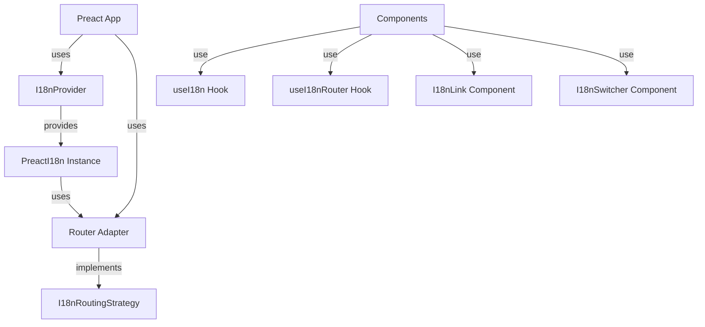

# Preact Package (`@i18n-micro/preact`)

The `@i18n-micro/preact` package provides a lightweight, high-performance internationalization solution for **Pure Preact** applications. It shares the same core logic as Nuxt I18n Micro, offering reactive translations, route-specific support, and full TypeScript support.

## Overview

`@i18n-micro/preact` is designed for Pure Preact applications (without React compatibility layer) that need internationalization. It provides:

- **Lightweight** - Uses shared core logic from `@i18n-micro/core`
- **Reactive** - Automatic component updates when translations change using `useState` + `useEffect` (Pure Preact approach)
- **Pure Preact** - Uses Preact's native JSX runtime (`h`) for minimal bundle size (~3KB)
- **Router-agnostic** - Works with any router (wouter, preact-router, or custom) or without a router
- **Route-specific translations** - Support for page-level translations
- **Pluralization** - Built-in plural form support
- **Formatting** - Number, date, and relative time formatting
- **Type-safe** - Full TypeScript support
- **DevTools Integration** - Vite plugin for managing translations during development

**Note:** The built-in router adapter (`createPreactRouterAdapter` / `createBrowserHistoryAdapter`) uses the native History API and works with any router that listens to `popstate` events (e.g., `wouter-preact`, `preact-router`). For custom routing needs, you can create your own adapter.

## Installation

Install the package using your preferred package manager:

::: code-group

```bash [npm]
npm install @i18n-micro/preact
```

```bash [yarn]
yarn add @i18n-micro/preact
```

```bash [pnpm]
pnpm add @i18n-micro/preact
```

```bash [bun]
bun add @i18n-micro/preact
```

:::

### Peer Dependencies

The package requires Preact:

```json
{
  "peerDependencies": {
    "preact": "^10.0.0"
  }
}
```

## Quick Start

### Basic Setup (Without Router)

For applications that don't need routing features:

```typescript
import { render, h } from 'preact'
import { createI18n, I18nProvider } from '@i18n-micro/preact'
import App from './App'

const i18n = createI18n({
  locale: 'en',
  fallbackLocale: 'en',
  messages: {
    en: {
      greeting: 'Hello, {name}!',
      apples: 'no apples | one apple | {count} apples',
    },
    fr: {
      greeting: 'Bonjour, {name}!',
      apples: 'pas de pommes | une pomme | {count} pommes',
    },
  },
})

const localesConfig = [
  { code: 'en', displayName: 'English', iso: 'en-US' },
  { code: 'fr', displayName: 'Français', iso: 'fr-FR' },
]

const root = document.getElementById('app')!
render(
  h(I18nProvider, {
    i18n,
    locales: localesConfig,
    defaultLocale: 'en',
  }, h(App)),
  root
)
```

### Setup With Router Adapter (Wouter Example)

For applications with routing using `wouter-preact`:

```typescript
import { render, h } from 'preact'
import { Router } from 'wouter-preact'
import { useLocation } from 'wouter-preact'
import { createI18n, I18nProvider, createPreactRouterAdapter } from '@i18n-micro/preact'
import App from './App'
import type { Locale } from '@i18n-micro/types'

const localesConfig: Locale[] = [
  { code: 'en', displayName: 'English', iso: 'en-US' },
  { code: 'fr', displayName: 'Français', iso: 'fr-FR' },
  { code: 'de', displayName: 'Deutsch', iso: 'de-DE' },
]

const defaultLocale = 'en'

const i18n = createI18n({
  locale: defaultLocale,
  fallbackLocale: defaultLocale,
  messages: {
    en: {},
  },
})

// RouterRoot component that creates the adapter
function RouterRoot({ children }: { children?: any }) {
  const [location, navigate] = useLocation()
  
  // Create adapter using wouter hooks
  const routingStrategy = createWouterAdapter(localesConfig, defaultLocale, location, navigate)

  return h(I18nProvider, {
    i18n,
    locales: localesConfig,
    defaultLocale,
    routingStrategy,
  }, children)
}

// Helper function to create wouter adapter
function createWouterAdapter(
  locales: Locale[],
  defaultLocale: string,
  locationPath: string,
  navigate: (to: string, options?: { replace?: boolean }) => void,
) {
  const localeCodes = locales.map(loc => loc.code)
  
  const resolvePath = (to: string | { path?: string }, locale: string): string | { path?: string } => {
    const path = typeof to === 'string' ? to : (to.path || '/')
    const pathSegments = path.split('/').filter(Boolean)
    if (pathSegments.length > 0 && localeCodes.includes(pathSegments[0])) {
      pathSegments.shift()
    }
    const cleanPath = '/' + pathSegments.join('/')
    return locale === defaultLocale ? cleanPath : `/${locale}${cleanPath === '/' ? '' : cleanPath}`
  }

  return {
    getCurrentPath: () => locationPath,
    push: (target) => navigate(target.path),
    replace: (target) => navigate(target.path, { replace: true }),
    resolvePath: (to, locale) => resolvePath(to, locale),
    getRoute: () => ({
      fullPath: locationPath,
      query: Object.fromEntries(new URLSearchParams(window.location.search)),
    }),
  }
}

const root = document.getElementById('app')!
render(
  h(Router, null, h(RouterRoot, null, h(App))),
  root
)
```

**Note:** The `createPreactRouterAdapter` (aliased as `createBrowserHistoryAdapter`) is exported from the package and provides a basic History API-based adapter. For router-specific adapters (like wouter), you can create custom adapters as shown above.

### Usage in Components

```tsx
import { h } from 'preact'
import { useI18n } from '@i18n-micro/preact'

function MyComponent() {
  const { t, tc, tn, locale, setLocale } = useI18n()

  return h('div', null,
    h('p', null, t('greeting', { name: 'World' })),
    h('p', null, tc('apples', 5)),
    h('p', null, tn(1234.56)),
    h('button', { onClick: () => setLocale('fr') }, 'Switch to French')
  )
}
```

## Core Concepts

### Router Adapter Abstraction

The package uses a router adapter pattern to decouple i18n functionality from specific router implementations. This allows you to:

- Use any router library (wouter, preact-router, custom router, or no router)
- Implement routing logic in your application, not in the i18n package
- Keep the core package lightweight and router-agnostic

The `I18nRoutingStrategy` interface defines the contract between i18n and your router:

```typescript
interface I18nRoutingStrategy {
  getCurrentPath: () => string
  linkComponent?: string | React.ComponentType<{ /* ... */ }>
  push: (target: { path: string }) => void
  replace: (target: { path: string }) => void
  resolvePath?: (to: string | { path?: string }, locale: string) => string | { path?: string }
  getRoute?: () => { fullPath: string; query: Record<string, unknown> }
}
```

### Architecture



## Setup & Configuration

### Basic Setup Without Router

For applications that don't need routing features:

```typescript
import { render, h } from 'preact'
import { createI18n, I18nProvider } from '@i18n-micro/preact'
import App from './App'
import type { Locale } from '@i18n-micro/types'

const localesConfig: Locale[] = [
  { code: 'en', displayName: 'English', iso: 'en-US' },
  { code: 'fr', displayName: 'Français', iso: 'fr-FR' },
]

const i18n = createI18n({
  locale: 'en',
  fallbackLocale: 'en',
  messages: {
    en: { welcome: 'Welcome' },
    fr: { welcome: 'Bienvenue' },
  },
})

const root = document.getElementById('app')!
render(
  h(I18nProvider, {
    i18n,
    locales: localesConfig,
    defaultLocale: 'en',
  }, h(App)),
  root
)
```

### Setup With Built-in Router Adapter

The package exports `createPreactRouterAdapter` (also available as `createBrowserHistoryAdapter`) which uses the native History API:

```typescript
import { render, h } from 'preact'
import { createI18n, I18nProvider, createPreactRouterAdapter } from '@i18n-micro/preact'
import App from './App'
import type { Locale } from '@i18n-micro/types'

const localesConfig: Locale[] = [
  { code: 'en', displayName: 'English', iso: 'en-US' },
  { code: 'fr', displayName: 'Français', iso: 'fr-FR' },
  { code: 'de', displayName: 'Deutsch', iso: 'de-DE' },
]

const defaultLocale = 'en'

const i18n = createI18n({
  locale: defaultLocale,
  fallbackLocale: defaultLocale,
  messages: {
    en: {},
  },
})

// Create adapter using built-in History API adapter
const routingStrategy = createPreactRouterAdapter(localesConfig, defaultLocale)

const root = document.getElementById('app')!
render(
  h(I18nProvider, {
    i18n,
    locales: localesConfig,
    defaultLocale,
    routingStrategy,
  }, h(App)),
  root
)
```

## Core API

### `createI18n(options: PreactI18nOptions)`

Creates a new i18n instance for your Preact application.

**Parameters:**

| Property | Type | Required | Default | Description |
|----------|------|----------|---------|-------------|
| `locale` | `string` | ✅ | - | Current locale code (e.g., `'en'`) |
| `fallbackLocale` | `string` | ❌ | Same as `locale` | Fallback locale when translation is missing |
| `messages` | `Record<string, Translations>` | ❌ | `{}` | Initial translation messages |
| `plural` | `PluralFunc` | ❌ | `defaultPlural` | Custom pluralization function |
| `missingWarn` | `boolean` | ❌ | `false` | Show console warnings for missing translations |
| `missingHandler` | `(locale: string, key: string, routeName: string) => void` | ❌ | - | Custom handler for missing translations |

**Returns:** `PreactI18n`

**Example:**

```typescript
import { createI18n } from '@i18n-micro/preact'

const i18n = createI18n({
  locale: 'en',
  fallbackLocale: 'en',
  messages: {
    en: {
      welcome: 'Welcome',
      greeting: 'Hello, {name}!',
    },
    fr: {
      welcome: 'Bienvenue',
      greeting: 'Bonjour, {name}!',
    },
  },
  missingWarn: true,
  missingHandler: (locale, key, routeName) => {
    console.warn(`Missing translation: ${key} in ${locale} for route ${routeName}`)
  },
})
```

### `PreactI18n` Class

The core i18n instance class that handles all translation logic.

#### Properties

- `locale: string` - Current locale (getter/setter, triggers reactivity)
- `fallbackLocale: string` - Fallback locale (getter/setter)
- `currentRoute: string` - Current route name (getter)
- `cache: TranslationCache` - Translation cache object

#### Methods

##### `t(key: string, params?: Params, defaultValue?: string | null, routeName?: string): CleanTranslation`

Translates a key with optional parameters and fallback value.

```typescript
const i18n = createI18n({ /* ... */ })

// Basic translation
i18n.t('welcome') // "Welcome"

// With parameters
i18n.t('greeting', { name: 'John' }) // "Hello, John!"

// With default value
i18n.t('missing', {}, 'Default text') // "Default text"

// Route-specific translation
i18n.t('title', {}, null, 'home') // Uses 'home' route translations
```

##### `ts(key: string, params?: Params, defaultValue?: string, routeName?: string): string`

Same as `t()` but always returns a string.

##### `tc(key: string, count: number | Params, defaultValue?: string): string`

Pluralization-aware translation.

```typescript
// With count number
i18n.tc('apples', 0) // "no apples"
i18n.tc('apples', 1) // "one apple"
i18n.tc('apples', 5) // "5 apples"

// With params object
i18n.tc('items', { count: 3, type: 'books' })
```

##### `tn(value: number, options?: Intl.NumberFormatOptions): string`

Formats a number according to the current locale.

```typescript
i18n.tn(1234.56) // "1,234.56" (en) or "1 234,56" (fr)
i18n.tn(1234.56, { style: 'currency', currency: 'USD' }) // "$1,234.56"
```

##### `td(value: Date | number | string, options?: Intl.DateTimeFormatOptions): string`

Formats a date according to the current locale.

```typescript
i18n.td(new Date()) // "12/31/2023" (en) or "31/12/2023" (fr)
i18n.td(new Date(), { dateStyle: 'full' }) // "Sunday, December 31, 2023"
```

##### `tdr(value: Date | number | string, options?: Intl.RelativeTimeFormatOptions): string`

Formats a relative time (e.g., "2 hours ago").

```typescript
const yesterday = new Date()
yesterday.setDate(yesterday.getDate() - 1)
i18n.tdr(yesterday) // "yesterday"
i18n.tdr(Date.now() - 3600000) // "1 hour ago"
```

##### `has(key: string, routeName?: string): boolean`

Checks if a translation key exists.

```typescript
i18n.has('welcome') // true
i18n.has('missing') // false
```

##### `addTranslations(locale: string, translations: Translations, merge?: boolean): void`

Adds or merges translations for a locale.

```typescript
// Add new translations
i18n.addTranslations('en', {
  newKey: 'New translation',
})

// Replace existing (merge = false)
i18n.addTranslations('en', {
  welcome: 'New Welcome',
}, false)
```

##### `addRouteTranslations(locale: string, routeName: string, translations: Translations, merge?: boolean): void`

Adds route-specific translations.

```typescript
i18n.addRouteTranslations('en', 'home', {
  title: 'Home Page',
  description: 'Welcome to our home page',
})
```

##### `setRoute(routeName: string): void`

Sets the current route name for route-specific translations.

##### `getRoute(): string`

Gets the current route name.

##### `clearCache(): void`

Clears the translation cache.

## Hook: `useI18n`

The `useI18n` hook provides access to i18n functionality in Preact components. It uses `useState` + `useEffect` internally for reactivity (Pure Preact approach), ensuring components re-render when translations or locale change. The hook automatically uses the routing strategy from `I18nProvider` if available.

### Basic Usage

```tsx
import { h } from 'preact'
import { useI18n } from '@i18n-micro/preact'

function MyComponent() {
  const { t, locale, fallbackLocale } = useI18n()
  
  return h('div', null, t('welcome'))
}
```

### Using Router Methods

When a routing strategy is provided via `I18nProvider`, the hook exposes router-related methods:

```tsx
import { h } from 'preact'
import { useI18n } from '@i18n-micro/preact'

function Navigation() {
  const { t, locale, switchLocale, localeRoute, localePath } = useI18n()

  return h('nav', null,
    h('a', { href: localePath('/') }, t('nav.home')),
    h('a', { href: localePath('/about') }, t('nav.about')),
    h('button', { onClick: () => switchLocale('fr') }, 'Switch to French')
  )
}
```

### API Reference

#### Reactive Properties

##### `locale: string`

Current locale (read-only getter, use `setLocale` to change).

```typescript
const { locale, setLocale } = useI18n()

// Read
console.log(locale) // "en"

// Write
setLocale('fr')
```

##### `fallbackLocale: string`

Fallback locale (read-only).

##### `currentRoute: string`

Current route name (read-only).

#### Translation Methods

##### `t(key: string, params?: Params, defaultValue?: string | null, routeName?: string): CleanTranslation`

```typescript
const { t } = useI18n()

// Basic
t('welcome')

// With params
t('greeting', { name: 'John' })

// With default
t('missing', {}, 'Default')

// Route-specific
t('title', {}, null, 'home')
```

##### `ts(key: string, params?: Params, defaultValue?: string, routeName?: string): string`

Always returns a string.

##### `tc(key: string, count: number | Params, defaultValue?: string): string`

Pluralization.

```typescript
const { tc } = useI18n()
tc('apples', 5) // "5 apples"
```

##### `tn(value: number, options?: Intl.NumberFormatOptions): string`

Number formatting.

##### `td(value: Date | number | string, options?: Intl.DateTimeFormatOptions): string`

Date formatting.

##### `tdr(value: Date | number | string, options?: Intl.RelativeTimeFormatOptions): string`

Relative time formatting.

##### `has(key: string, routeName?: string): boolean`

Check if translation exists.

#### Locale Management

##### `setLocale(locale: string): void`

Change the current locale.

```typescript
const { setLocale, locale } = useI18n()

function handleLocaleChange(newLocale: string) {
  setLocale(newLocale)
}
```

#### Route Management

##### `setRoute(routeName: string): void`

Set current route.

##### `getRoute(): string`

Get current route.

#### Router Methods (when routing strategy is provided)

##### `switchLocale(locale: string): void`

Switch locale and navigate to the localized path. Uses the routing strategy if available.

```typescript
const { switchLocale } = useI18n()

// Switch to French and navigate to /fr/about
switchLocale('fr')
```

##### `localeRoute(to: string | { path?: string }, locale?: string): string | { path?: string }`

Resolve path for a specific locale. Returns localized path using the routing strategy.

```typescript
const { localeRoute } = useI18n()

// Get localized path for current locale
const path = localeRoute('/about') // "/fr/about" if current locale is 'fr'

// Get localized path for specific locale
const enPath = localeRoute('/about', 'en') // "/about"
const frPath = localeRoute('/about', 'fr') // "/fr/about"
```

##### `localePath(to: string | { path?: string }, locale?: string): string`

Same as `localeRoute` but always returns a string.

```typescript
const { localePath } = useI18n()

const path = localePath('/about', 'fr') // "/fr/about"
```

#### Translation Management

##### `addTranslations(locale: string, translations: Translations, merge?: boolean): void`

Add translations.

##### `addRouteTranslations(locale: string, routeName: string, translations: Translations, merge?: boolean): void`

Add route-specific translations.

##### `clearCache(): void`

Clear translation cache.

### Complete Example

```tsx
import { h } from 'preact'
import { useI18n } from '@i18n-micro/preact'

function HomePage() {
  const { t, tc, tn, td, tdr, locale, setLocale } = useI18n()

  return h('div', null,
    h('h1', null, t('home.title')),
    h('p', null, t('greeting', { name: 'World' })),
    h('p', null, tc('apples', 5)),
    h('p', null, t('number', { number: tn(1234.56) })),
    h('p', null, t('date', { date: td(new Date()) })),
    h('p', null, t('relativeDate', { relativeDate: tdr(Date.now() - 86400000) })),
    h('button', { onClick: () => setLocale('fr') }, 'Switch to French')
  )
}
```

## Components

### `<I18nProvider>`

Context provider component that makes the i18n instance available to all child components. It also provides locales configuration and routing strategy.

#### Props

| Prop | Type | Required | Description |
|------|------|----------|-------------|
| `i18n` | `PreactI18n` | ✅ | The i18n instance created with `createI18n` |
| `locales` | `Locale[]` | ❌ | Array of locale objects |
| `defaultLocale` | `string` | ❌ | Default locale code |
| `routingStrategy` | `I18nRoutingStrategy` | ❌ | Router adapter for routing features |
| `children` | `preact.ComponentChildren` | ✅ | Child components |

#### Example

**Without Router:**

```tsx
import { h } from 'preact'
import { createI18n, I18nProvider } from '@i18n-micro/preact'

const i18n = createI18n({
  locale: 'en',
  messages: { /* ... */ },
})

function App() {
  return h(I18nProvider, {
    i18n,
    locales: localesConfig,
    defaultLocale: 'en',
  }, h(YourApp))
}
```

**With Router Adapter:**

```tsx
import { h } from 'preact'
import { useLocation } from 'wouter-preact'
import { createI18n, I18nProvider, createPreactRouterAdapter } from '@i18n-micro/preact'

function RouterRoot({ children }: { children?: any }) {
  const [location] = useLocation()
  const routingStrategy = createPreactRouterAdapter(localesConfig, defaultLocale)

  return h(I18nProvider, {
    i18n,
    locales: localesConfig,
    defaultLocale,
    routingStrategy,
  }, children)
}
```

### DevTools Integration (Vite Plugin)

This package supports DevTools integration via the `@i18n-micro/devtools-ui` Vite plugin. See the [DevTools UI Package documentation](./devtools-ui-package.md) for details.

### `<I18nT>`

Translation component with support for pluralization, formatting, and HTML rendering. Automatically uses the routing strategy from `I18nProvider` if available.

#### Props

| Prop | Type | Required | Default | Description |
|------|------|----------|---------|-------------|
| `keypath` | `string` | ✅ | - | Translation key path |
| `params` | `Params` | ❌ | `{}` | Parameters for interpolation |
| `plural` | `number \| string` | ❌ | - | Count for pluralization |
| `defaultValue` | `string` | ❌ | `''` | Default value if key not found |
| `tag` | `string` | ❌ | `'span'` | HTML tag to wrap content |
| `html` | `boolean` | ❌ | `false` | Render as HTML |
| `number` | `number \| string` | ❌ | - | Number to format and interpolate |
| `date` | `Date \| string \| number` | ❌ | - | Date to format and interpolate |
| `relativeDate` | `Date \| string \| number` | ❌ | - | Relative date to format |

#### Examples

```tsx
import { h } from 'preact'
import { I18nT } from '@i18n-micro/preact'

// Basic usage
h(I18nT, { keypath: 'welcome' })

// With parameters
h(I18nT, { keypath: 'greeting', params: { name: 'John' } })

// Pluralization
h(I18nT, { keypath: 'apples', plural: 5 })

// Number formatting
h(I18nT, { keypath: 'price', number: 1234.56 })

// Date formatting
h(I18nT, { keypath: 'date', date: new Date() })

// HTML rendering
h(I18nT, { keypath: 'htmlContent', html: true })

// Custom tag
h(I18nT, { keypath: 'title', tag: 'h1' })
```

### `<I18nLink>`

Localized link component that automatically handles locale prefixes using the routing strategy from `I18nProvider` if available.

#### Props

| Prop | Type | Required | Default | Description |
|------|------|----------|---------|-------------|
| `to` | `string \| { path?: string }` | ✅ | - | Link destination |
| `activeStyle` | `JSX.CSSProperties` | ❌ | - | Styles to apply when link is active |
| `localeRoute` | `(to: string \| { path?: string }, locale?: string) => string \| { path?: string }` | ❌ | - | Custom locale route function (uses routing strategy if not provided) |
| `...restProps` | `JSX.AnchorHTMLAttributes<HTMLAnchorElement>` | ❌ | - | All standard anchor attributes |

#### Examples

```tsx
import { h } from 'preact'
import { I18nLink } from '@i18n-micro/preact'

// Basic usage
h(I18nLink, { to: '/about' }, 'About Us')

// With active style
h(I18nLink, {
  to: '/',
  activeStyle: { fontWeight: 'bold', backgroundColor: '#e8f5e9' },
}, 'Home')

// With custom locale route
h(I18nLink, {
  to: '/about',
  localeRoute: (to, locale) => `/${locale}${to}`,
}, 'About')
```

The component automatically:
- Uses the routing strategy's `linkComponent` if available (e.g., `Link` from `wouter-preact`)
- Falls back to a native `<a>` tag with `onClick` handler if no `linkComponent` is provided
- Handles active state detection using `getCurrentPath()` from the routing strategy
- Supports external links (detected automatically)

### `<I18nSwitcher>`

Language switcher component that generates links for all available locales. Uses the routing strategy from `I18nProvider` for path generation if available.

#### Props

| Prop | Type | Required | Default | Description |
|------|------|----------|---------|-------------|
| `locales` | `Locale[]` | ❌ | - | Array of locale objects (uses injected locales if not provided) |
| `currentLocale` | `string \| (() => string)` | ❌ | - | Current locale (uses injected locale if not provided) |
| `getLocaleName` | `() => string \| null` | ❌ | - | Function to get locale display name |
| `switchLocale` | `(locale: string) => void` | ❌ | - | Function to switch locale (uses routing strategy if not provided) |
| `localeRoute` | `(to: string \| { path?: string }, locale?: string) => string \| { path?: string }` | ❌ | - | Custom locale route function (uses routing strategy if not provided) |
| `customLabels` | `Record<string, string>` | ❌ | `{}` | Custom labels for locales |
| `...restProps` | `JSX.HTMLAttributes<HTMLDivElement>` | ❌ | - | All standard div attributes |

#### Examples

```tsx
import { h } from 'preact'
import { I18nSwitcher } from '@i18n-micro/preact'

// Basic usage (uses injected locales and routing strategy)
h(I18nSwitcher)

// With custom props
h(I18nSwitcher, {
  locales: localesConfig,
  currentLocale: locale,
  getLocaleName: () => getLocaleName(),
  switchLocale: switchLocale,
  localeRoute: localeRoute,
})
```

The component automatically:
- Filters out disabled locales
- Highlights the current locale
- Generates localized paths for each locale using the routing strategy
- Uses locale display names from configuration
- Provides a dropdown interface for locale selection

### `<I18nGroup>`

Component for grouping translations with a common prefix.

#### Props

| Prop | Type | Required | Default | Description |
|------|------|----------|---------|-------------|
| `prefix` | `string` | ✅ | - | Translation key prefix |
| `groupClass` | `string` | ❌ | `''` | CSS class for the wrapper div |
| `children` | `preact.ComponentChildren` | ✅ | - | Child components |

#### Examples

```tsx
import { h } from 'preact'
import { I18nGroup, I18nT } from '@i18n-micro/preact'

h(I18nGroup, { prefix: 'home' },
  h(I18nT, { keypath: 'title' }), // Uses "home.title"
  h(I18nT, { keypath: 'description' }) // Uses "home.description"
)
```

## Router Integration

### I18nRoutingStrategy Interface

The `I18nRoutingStrategy` interface defines how i18n interacts with your router:

```typescript
interface I18nRoutingStrategy {
  /**
   * Returns current path (without locale prefix if needed, or full path)
   * Used for determining active classes in links
   */
  getCurrentPath: () => string

  /**
   * Component to use for rendering links (e.g., Link from wouter-preact)
   */
  linkComponent?: string | React.ComponentType<{
    href: string
    children?: React.ReactNode
    style?: React.CSSProperties
    className?: string
    [key: string]: unknown
  }>

  /**
   * Function to navigate to another route/locale
   */
  push: (target: { path: string }) => void

  /**
   * Function to replace current route
   */
  replace: (target: { path: string }) => void

  /**
   * Generate path for specific locale
   */
  resolvePath?: (to: string | { path?: string }, locale: string) => string | { path?: string }

  /**
   * (Optional) Get current route object for SEO/Meta tags
   */
  getRoute?: () => {
    fullPath: string
    query: Record<string, unknown>
  }
}
```

### Using the Built-in Router Adapter

The package exports `createPreactRouterAdapter` (also available as `createBrowserHistoryAdapter`) for basic History API-based routing:

```typescript
import { createPreactRouterAdapter } from '@i18n-micro/preact'

const routingStrategy = createPreactRouterAdapter(localesConfig, defaultLocale)
```

This adapter works with any router that listens to `popstate` events (e.g., `wouter-preact`, `preact-router`).

### Setting Routing Strategy

You set the routing strategy by passing it to `I18nProvider`:

```typescript
function RouterRoot({ children }: { children?: any }) {
  const [location, navigate] = useLocation() // from wouter-preact
  const routingStrategy = createWouterAdapter(localesConfig, defaultLocale, location, navigate)

  return h(I18nProvider, {
    i18n,
    locales: localesConfig,
    defaultLocale,
    routingStrategy,
  }, children)
}
```

## Creating Custom Router Adapters

### Overview

A router adapter is an implementation of the `I18nRoutingStrategy` interface that defines how i18n interacts with your routing system. This allows you to:

- Support any routing strategy (wouter, preact-router, custom)
- Customize locale detection and path generation
- Integrate with third-party routing libraries
- Implement domain-based or subdomain-based locale routing

### Interface Reference

The `I18nRoutingStrategy` interface defines the following methods:

| Method | Required | Description |
|--------|----------|-------------|
| `getCurrentPath()` | ✅ | Returns the current path (used for active link detection) |
| `linkComponent` | ❌ | Component to use for rendering links (e.g., `Link` from wouter-preact) |
| `push(target)` | ❌ | Function to navigate to another route/locale |
| `replace(target)` | ❌ | Function to replace current route |
| `resolvePath(to, locale)` | ❌ | Generate path for specific locale |
| `getRoute()` | ❌ | Returns current route object with query params |

### Step-by-Step Guide

#### Step 1: Understand Your Routing Strategy

Before creating an adapter, understand how your routing works:

- **Where is the locale in the URL?** (prefix, suffix, subdomain, query param)
- **How are routes named?** (file-based, programmatic, custom)
- **What is the default locale behavior?** (include prefix, hide prefix)

#### Step 2: Implement Required Methods

At minimum, you must implement `getCurrentPath()`. All other methods are optional but recommended for full functionality.

#### Step 3: Handle Edge Cases

Consider:
- Empty paths (`/`)
- Root locale (default locale - should it be in URL?)
- Invalid locales
- Query parameters and hash fragments

### Example 1: Wouter Adapter

This example shows how to create an adapter for `wouter-preact`:

```typescript
// src/router-adapter.tsx
import { Link } from 'wouter-preact'
import type { I18nRoutingStrategy } from '@i18n-micro/preact'
import type { Locale } from '@i18n-micro/types'
import type React from 'react'

export function createWouterAdapter(
  locales: Locale[],
  defaultLocale: string,
  locationPath: string, // from useLocation()[0]
  navigate: (to: string, options?: { replace?: boolean }) => void, // from useLocation()[1]
): I18nRoutingStrategy {
  const localeCodes = locales.map(loc => loc.code)

  const resolvePath = (to: string | { path?: string }, locale: string): string | { path?: string } => {
    const path = typeof to === 'string' ? to : (to.path || '/')
    const pathSegments = path.split('/').filter(Boolean)
    if (pathSegments.length > 0 && localeCodes.includes(pathSegments[0])) {
      pathSegments.shift()
    }
    const cleanPath = '/' + pathSegments.join('/')
    return locale === defaultLocale ? cleanPath : `/${locale}${cleanPath === '/' ? '' : cleanPath}`
  }

  return {
    // Pass Wouter's Link component
    linkComponent: Link as unknown as React.ComponentType<{
      href: string
      children?: React.ReactNode
      style?: React.CSSProperties
      className?: string
      [key: string]: unknown
    }>,

    getCurrentPath: () => locationPath,

    push: target => navigate(target.path),

    replace: target => navigate(target.path, { replace: true }),

    resolvePath: (to, locale) => resolvePath(to, locale),

    getRoute: () => ({
      fullPath: locationPath,
      query: Object.fromEntries(new URLSearchParams(window.location.search)),
    }),
  }
}
```

**Usage:**

```typescript
// In your App component
import { Router, useLocation } from 'wouter-preact'
import { createI18n, I18nProvider } from '@i18n-micro/preact'
import { createWouterAdapter } from './router-adapter'

function RouterRoot({ children }: { children?: any }) {
  const [location, navigate] = useLocation()
  const routingStrategy = createWouterAdapter(localesConfig, defaultLocale, location, navigate)

  return h(I18nProvider, {
    i18n,
    locales: localesConfig,
    defaultLocale,
    routingStrategy,
  }, children)
}

function App() {
  return h(Router, null, h(RouterRoot, null, h(YourRoutes)))
}
```

### Example 2: Preact Router Adapter

This example shows how to create an adapter for `preact-router`:

```typescript
// src/router-adapter-preact-router.tsx
import type { I18nRoutingStrategy } from '@i18n-micro/preact'
import type { Locale } from '@i18n-micro/types'

export function createPreactRouterAdapter(
  locales: Locale[],
  defaultLocale: string,
  router: any, // preact-router instance
): I18nRoutingStrategy {
  const localeCodes = locales.map(loc => loc.code)

  const resolvePath = (to: string | { path?: string }, locale: string): string | { path?: string } => {
    const path = typeof to === 'string' ? to : (to.path || '/')
    const pathSegments = path.split('/').filter(Boolean)
    if (pathSegments.length > 0 && localeCodes.includes(pathSegments[0])) {
      pathSegments.shift()
    }
    const cleanPath = '/' + pathSegments.join('/')
    return locale === defaultLocale ? cleanPath : `/${locale}${cleanPath === '/' ? '' : cleanPath}`
  }

  return {
    getCurrentPath: () => router.getCurrentUrl()?.pathname || '/',
    push: (target) => router.routeTo(target.path),
    replace: (target) => router.replace(target.path),
    resolvePath: (to, locale) => resolvePath(to, locale),
    getRoute: () => {
      const url = router.getCurrentUrl()
      return {
        fullPath: url?.pathname || '/',
        query: Object.fromEntries(new URLSearchParams(url?.search || '')),
      }
    },
  }
}
```

### Example 3: Query Parameter-Based Locale Routing

This example uses query parameters for locale (e.g., `/?locale=fr`):

```typescript
// src/router-adapter-query.tsx
import type { I18nRoutingStrategy } from '@i18n-micro/preact'
import type { Locale } from '@i18n-micro/types'

export function createQueryParamRouterAdapter(
  locales: Locale[],
  defaultLocale: string,
  paramName: string = 'locale',
): I18nRoutingStrategy {
  const localeCodes = locales.map(loc => loc.code)

  const getCurrentPath = (): string => {
    if (typeof window !== 'undefined') {
      return window.location.pathname
    }
    return '/'
  }

  const resolvePath = (to: string | { path?: string }, locale: string): string | { path?: string } => {
    const path = typeof to === 'string' ? to : (to.path || '/')
    const url = new URL(path, 'http://localhost')
    
    if (locale !== defaultLocale) {
      url.searchParams.set(paramName, locale)
    } else {
      url.searchParams.delete(paramName)
    }
    
    return url.pathname + url.search
  }

  return {
    getCurrentPath,
    push: (target) => {
      if (typeof window !== 'undefined') {
        window.history.pushState({}, '', target.path)
        window.dispatchEvent(new Event('popstate'))
      }
    },
    replace: (target) => {
      if (typeof window !== 'undefined') {
        window.history.replaceState({}, '', target.path)
        window.dispatchEvent(new Event('popstate'))
      }
    },
    resolvePath: (to, locale) => resolvePath(to, locale),
    getRoute: () => {
      if (typeof window !== 'undefined') {
        const url = new URL(window.location.href)
        return {
          fullPath: url.pathname + url.search,
          query: Object.fromEntries(url.searchParams),
        }
      }
      return {
        fullPath: '/',
        query: {},
      }
    },
  }
}
```

### Best Practices

1. **Always handle the default locale**: Decide whether the default locale should appear in URLs or be hidden.

2. **Preserve query parameters and hash**: When switching locales, maintain query params and hash fragments:

```typescript
const resolvePath = (to: string | { path?: string }, locale: string): string | { path?: string } => {
  const path = typeof to === 'string' ? to : (to.path || '/')
  const url = new URL(path, 'http://localhost')
  // ... locale switching logic ...
  return url.pathname + url.search + url.hash
}
```

3. **Handle edge cases**: Consider empty paths, root paths, and invalid locales:

```typescript
const getCurrentPath = (): string => {
  if (typeof window !== 'undefined') {
    const path = window.location.pathname
    return path || '/' // Handle empty path
  }
  return '/'
}
```

4. **Support both SSR and client-side**: Use `window` checks for client-side code:

```typescript
const getCurrentPath = (): string => {
  if (typeof window !== 'undefined') {
    return window.location.pathname // Client-side
  }
  return '/' // SSR fallback
}
```

5. **Test with all locales**: Ensure your adapter works correctly with all configured locales, including edge cases like:
   - Very short locale codes (`en`, `fr`)
   - Long locale codes (`zh-Hans`, `pt-BR`)
   - Locale codes that might conflict with route segments

### Common Patterns

#### Pattern 1: Minimal Adapter (Only Required Methods)

If you only need basic functionality:

```typescript
export function createMinimalAdapter(): I18nRoutingStrategy {
  return {
    getCurrentPath: () => {
      return typeof window !== 'undefined' ? window.location.pathname : '/'
    },
  }
}
```

#### Pattern 2: Extending Built-in Adapter

You can extend the built-in adapter and override specific methods:

```typescript
import { createPreactRouterAdapter } from '@i18n-micro/preact'

export function createExtendedAdapter(locales: Locale[], defaultLocale: string) {
  const baseAdapter = createPreactRouterAdapter(locales, defaultLocale)
  
  return {
    ...baseAdapter,
    // Override specific method
    resolvePath: (to: string | { path?: string }, locale: string) => {
      const basePath = baseAdapter.resolvePath?.(to, locale)
      // Custom logic
      return typeof basePath === 'string' ? `/custom${basePath}` : basePath
    },
  }
}
```

### Troubleshooting

**Problem**: Locale not detected correctly
- **Solution**: Check that your `getCurrentPath` correctly returns the current path, and `resolvePath` properly handles locale prefixes

**Problem**: Links don't switch locale
- **Solution**: Ensure `push` and `replace` methods correctly update the URL and dispatch events for your router

**Problem**: Active state detection doesn't work
- **Solution**: Verify `getCurrentPath` returns the correct path format that matches your routing strategy

## Async Translation Loading

### Loading from JSON Files

Load translations dynamically from JSON files:

```typescript
import { createI18n, I18nProvider } from '@i18n-micro/preact'

const i18n = createI18n({
  locale: 'en',
  fallbackLocale: 'en',
  messages: {
    en: {}, // Start with empty, load async
  },
})

// Async load translations
async function loadTranslations(locale: string) {
  try {
    const messages = await import(`./locales/${locale}.json`)
    return messages.default
  } catch (error) {
    console.error(`Failed to load translations for locale: ${locale}`, error)
    return {}
  }
}

// Initialize app
async function initApp() {
  // Detect initial locale from URL
  const path = window.location.pathname
  const firstSegment = path.split('/')[1]
  const initialLocale = ['en', 'fr', 'de'].includes(firstSegment) ? firstSegment : 'en'

  // Load initial locale
  const translations = await loadTranslations(initialLocale)
  i18n.addTranslations(initialLocale, translations, false)
  if (initialLocale !== 'en') {
    i18n.locale = initialLocale
  }

  // Preload other locales in background
  const otherLocales = ['en', 'fr', 'de'].filter(c => c !== initialLocale)
  Promise.all(
    otherLocales.map(code => 
      loadTranslations(code).then(msgs => ({ code, msgs }))
    )
  ).then((results) => {
    results.forEach(({ code, msgs }) => {
      i18n.addTranslations(code, msgs, false)
    })
  }).catch(() => {
    // Ignore errors for preloading
  })
}

// Start loading translations
initApp()

function App() {
  return h(I18nProvider, { i18n }, h(YourApp))
}
```

### Loading from API

Load translations from an API endpoint:

```typescript
async function loadTranslationsFromAPI(locale: string) {
  try {
    const response = await fetch(`/api/translations/${locale}`)
    const translations = await response.json()
    i18n.addTranslations(locale, translations, false)
  } catch (error) {
    console.error(`Failed to load translations: ${error}`)
  }
}

// Load on demand
function MyComponent() {
  const { locale, setLocale } = useI18n()
  const { useEffect } = require('preact/hooks')

  useEffect(() => {
    loadTranslationsFromAPI(locale)
  }, [locale])
}
```

### Lazy Loading Strategy

Load translations only when needed:

```typescript
const loadedLocales = new Set<string>()

async function ensureLocaleLoaded(locale: string) {
  if (loadedLocales.has(locale)) {
    return
  }
  
  await loadTranslations(locale)
  loadedLocales.add(locale)
}

// Use in component
function LocaleSwitcher() {
  const { locale, setLocale } = useI18n()

  async function handleLocaleSwitch(newLocale: string) {
    await ensureLocaleLoaded(newLocale)
    setLocale(newLocale)
  }

  return h('select', {
    value: locale,
    onChange: (e: any) => handleLocaleSwitch(e.target.value),
  },
    h('option', { value: 'en' }, 'English'),
    h('option', { value: 'fr' }, 'Français')
  )
}
```

### Error Handling

Handle loading errors gracefully:

```typescript
async function loadTranslationsWithFallback(locale: string) {
  try {
    const messages = await import(`./locales/${locale}.json`)
    i18n.addTranslations(locale, messages.default, false)
  } catch (error) {
    console.warn(`Failed to load ${locale}, using fallback`)
    // Load fallback locale
    if (locale !== 'en') {
      await loadTranslationsWithFallback('en')
    }
  }
}
```

## DevTools Integration

This package supports DevTools integration via the `@i18n-micro/devtools-ui` Vite plugin. See the [DevTools UI Package documentation](./devtools-ui-package.md) for details.

## Advanced Features

### Custom Pluralization

Define custom pluralization rules:

```typescript
import { createI18n, defaultPlural } from '@i18n-micro/preact'

const i18n = createI18n({
  locale: 'en',
  plural: (key, count, params, locale, getTranslation) => {
    // Custom logic for specific keys
    if (key === 'special') {
      return count === 0 ? 'none' : count === 1 ? 'one' : 'many'
    }
    
    // Use default for others
    return defaultPlural(key, count, params, locale, getTranslation)
  },
  messages: {
    en: {
      special: 'none | one | many',
    },
  },
})
```

### Missing Translation Handler

Handle missing translations with custom logic:

```typescript
const i18n = createI18n({
  locale: 'en',
  missingHandler: (locale, key, routeName) => {
    // Send to error tracking service
    console.error(`Missing translation: ${key} in ${locale} for route ${routeName}`)
    
    // Or send to Sentry
    // Sentry.captureMessage(`Missing translation: ${key}`, {
    //   extra: { locale, routeName }
    // })
  },
})
```

### Translation Caching

The package uses an intelligent caching system:

```typescript
const { clearCache } = useI18n()

// Clear cache when needed
clearCache()
```

### Route-Specific vs Global Translations

Translations are resolved in this priority order:

1. Route-specific translations (if route is set)
2. Global translations
3. Fallback locale translations

```typescript
// Global translation
i18n.addTranslations('en', {
  title: 'Global Title',
})

// Route-specific translation (higher priority)
i18n.addRouteTranslations('en', 'home', {
  title: 'Home Page Title',
})

i18n.setRoute('home')
i18n.t('title') // "Home Page Title" (route-specific)

i18n.setRoute('about')
i18n.t('title') // "Global Title" (global)
```

## TypeScript Support

### Type Definitions

All types are exported from the package:

```typescript
import type {
  PreactI18nOptions,
  PreactI18n,
  Translations,
  Params,
  PluralFunc,
  CleanTranslation,
  Locale,
  LocaleCode,
  TranslationKey,
  I18nProviderProps,
  UseI18nReturn,
  UseI18nOptions,
  I18nRoutingStrategy,
  I18nTProps,
  I18nLinkProps,
  I18nSwitcherProps,
  I18nGroupProps,
} from '@i18n-micro/preact'
```

### Type-Safe Translations

You can create type-safe translation keys:

```typescript
type TranslationKeys = 
  | 'welcome'
  | 'greeting'
  | 'apples'

function t(key: TranslationKeys, params?: Params): string {
  const { t } = useI18n()
  return t(key, params) as string
}
```

### Custom Types

Extend types for your use case:

```typescript
interface MyTranslations extends Translations {
  welcome: string
  greeting: {
    morning: string
    evening: string
  }
}

const messages: Record<string, MyTranslations> = {
  en: {
    welcome: 'Welcome',
    greeting: {
      morning: 'Good morning',
      evening: 'Good evening',
    },
  },
}
```

## Complete Examples

### Full Application Setup with Wouter

**`main.tsx`:**

```typescript
import { render, h } from 'preact'
import { Router } from 'wouter-preact'
import { createI18n, I18nProvider } from '@i18n-micro/preact'
import type { Locale } from '@i18n-micro/types'
import App from './App'

const localesConfig: Locale[] = [
  { code: 'en', displayName: 'English', iso: 'en-US' },
  { code: 'fr', displayName: 'Français', iso: 'fr-FR' },
  { code: 'de', displayName: 'Deutsch', iso: 'de-DE' },
]

const defaultLocale = 'en'

// Async load translations
async function loadTranslations(locale: string) {
  try {
    const messages = await import(`./locales/${locale}.json`)
    return messages.default
  } catch (error) {
    console.error(`Failed to load translations for locale: ${locale}`, error)
    return {}
  }
}

// Create i18n instance
const i18n = createI18n({
  locale: defaultLocale,
  fallbackLocale: defaultLocale,
  messages: {
    en: {},
  },
})

// Initialize app
async function initApp() {
  // Detect initial locale from URL
  const path = window.location.pathname
  const firstSegment = path.split('/')[1]
  const initialLocale = localesConfig.some(l => l.code === firstSegment) ? firstSegment : defaultLocale

  // Load initial locale
  const translations = await loadTranslations(initialLocale)
  i18n.addTranslations(initialLocale, translations, false)
  if (initialLocale !== defaultLocale) {
    i18n.locale = initialLocale
  }

  // Preload other locales in background
  const otherLocales = localesConfig.map(l => l.code).filter(c => c !== initialLocale)
  Promise.all(
    otherLocales.map(code => loadTranslations(code).then(msgs => ({ code, msgs })))
  ).then((results) => {
    results.forEach(({ code, msgs }) => {
      i18n.addTranslations(code, msgs, false)
    })
  }).catch(() => {})

  const appElement = document.getElementById('app')
  if (appElement) {
    render(
      h(Router, null, h(App)),
      appElement
    )
  }
}

// Start the app
initApp()
```

**`router-adapter.tsx`:**

```typescript
import { Link } from 'wouter-preact'
import type { I18nRoutingStrategy } from '@i18n-micro/preact'
import type { Locale } from '@i18n-micro/types'
import type React from 'react'

export function createWouterAdapter(
  locales: Locale[],
  defaultLocale: string,
  locationPath: string,
  navigate: (to: string, options?: { replace?: boolean }) => void,
): I18nRoutingStrategy {
  const localeCodes = locales.map(loc => loc.code)

  const resolvePath = (to: string | { path?: string }, locale: string): string | { path?: string } => {
    const path = typeof to === 'string' ? to : (to.path || '/')
    const pathSegments = path.split('/').filter(Boolean)
    if (pathSegments.length > 0 && localeCodes.includes(pathSegments[0])) {
      pathSegments.shift()
    }
    const cleanPath = '/' + pathSegments.join('/')
    return locale === defaultLocale ? cleanPath : `/${locale}${cleanPath === '/' ? '' : cleanPath}`
  }

  return {
    linkComponent: Link as unknown as React.ComponentType<{
      href: string
      children?: React.ReactNode
      style?: React.CSSProperties
      className?: string
      [key: string]: unknown
    }>,
    getCurrentPath: () => locationPath,
    push: target => navigate(target.path),
    replace: target => navigate(target.path, { replace: true }),
    resolvePath: (to, locale) => resolvePath(to, locale),
    getRoute: () => ({
      fullPath: locationPath,
      query: Object.fromEntries(new URLSearchParams(window.location.search)),
    }),
  }
}
```

**`App.tsx`:**

```tsx
import { h } from 'preact'
import { useEffect } from 'preact/hooks'
import { Router, Route, Switch, useLocation, useRoute } from 'wouter-preact'
import { createI18n, I18nProvider, useI18n, I18nLink, I18nSwitcher } from '@i18n-micro/preact'
import { createWouterAdapter } from './router-adapter'
import { Home } from './pages/Home'
import { About } from './pages/About'
import { Components } from './pages/Components'
import type { Locale } from '@i18n-micro/types'

const localesConfig: Locale[] = [
  { code: 'en', displayName: 'English', iso: 'en-US' },
  { code: 'fr', displayName: 'Français', iso: 'fr-FR' },
  { code: 'de', displayName: 'Deutsch', iso: 'de-DE' },
]

const defaultLocale = 'en'

// Create i18n instance
const i18n = createI18n({
  locale: defaultLocale,
  fallbackLocale: defaultLocale,
  messages: {
    en: {},
  },
})

// RouterRoot component that creates the adapter
function RouterRoot({ children }: { children?: any }) {
  const [location, navigate] = useLocation()
  const routingStrategy = createWouterAdapter(localesConfig, defaultLocale, location, navigate)

  return h(I18nProvider, {
    i18n,
    locales: localesConfig,
    defaultLocale,
    routingStrategy,
  }, children)
}

// Component to handle locale synchronization from URL
function LocaleHandler({ children }: { children?: any }) {
  const [match, params] = useRoute('/:locale')
  const { setLocale, locale: currentLocale } = useI18n({ locales: localesConfig, defaultLocale: 'en' })
  const localeParam = params?.locale

  useEffect(() => {
    const targetLocale = localeParam || defaultLocale
    if (currentLocale !== targetLocale) {
      setLocale(targetLocale)
    }
  }, [localeParam, currentLocale, setLocale])

  return children
}

// Navigation component
function Navigation() {
  const { t, getLocales, locale, getLocaleName, switchLocale, localeRoute } = useI18n({ locales: localesConfig, defaultLocale })

  return h('nav', { style: { marginBottom: '20px', display: 'flex', gap: '15px', alignItems: 'center' } },
    h(I18nLink, { to: '/', localeRoute, activeStyle: { fontWeight: 'bold', backgroundColor: '#e8f5e9' } }, t('nav.home')),
    h(I18nLink, { to: '/about', localeRoute, activeStyle: { fontWeight: 'bold', backgroundColor: '#e8f5e9' } }, t('nav.about')),
    h(I18nLink, { to: '/components', localeRoute, activeStyle: { fontWeight: 'bold', backgroundColor: '#e8f5e9' } }, t('nav.components')),
    h('div', { style: { marginLeft: 'auto' } },
      h(I18nSwitcher, {
        locales: getLocales(),
        currentLocale: locale,
        getLocaleName: () => getLocaleName(),
        switchLocale: switchLocale,
        localeRoute: localeRoute,
      })
    )
  )
}

function Layout({ children }: { children?: any }) {
  return h('div', { style: { padding: '20px', fontFamily: 'Arial, sans-serif' } },
    h(Navigation),
    h('div', { style: { padding: '20px', backgroundColor: '#f9f9f9', borderRadius: '8px' } }, children)
  )
}

function AppRoutes() {
  return h(Switch, null,
    h(Route, { path: '/', component: () => h(LocaleHandler, null, h(Home)) }),
    h(Route, { path: '/about', component: () => h(LocaleHandler, null, h(About)) }),
    h(Route, { path: '/components', component: () => h(LocaleHandler, null, h(Components)) }),
    h(Route, { path: '/:locale', component: () => h(LocaleHandler, null, h(Home)) }),
    h(Route, { path: '/:locale/about', component: () => h(LocaleHandler, null, h(About)) }),
    h(Route, { path: '/:locale/components', component: () => h(LocaleHandler, null, h(Components)) })
  )
}

export default function App() {
  return h(Router, null,
    h(RouterRoot, null,
      h(Layout, null, h(AppRoutes))
    )
  )
}
```

### Component Example

```tsx
// pages/Home.tsx
import { h } from 'preact'
import { useI18n } from '@i18n-micro/preact'

export function Home() {
  const { t, tc, tn, td, tdr, locale } = useI18n()

  return h('div', null,
    h('h1', null, t('home.title')),
    h('p', null, t('home.description')),
    h('p', null, t('welcome')),
    h('p', null, t('greeting', { name: 'World' })),
    h('p', null, tc('apples', 0)),
    h('p', null, tc('apples', 1)),
    h('p', null, tc('apples', 5)),
    h('p', null, t('number', { number: tn(1234.56) })),
    h('p', null, t('date', { date: td(new Date()) })),
    h('p', null, t('relativeDate', { relativeDate: tdr(Date.now() - 86400000) })),
    h('p', null, `Current locale: ${locale}`)
  )
}
```

## Best Practices

1. **Use Router Adapter**: Always create and provide a router adapter for proper locale path handling
2. **Create Adapter in RouterRoot**: Create the router adapter inside a component that has access to router hooks (`useLocation`, `navigate`)
3. **Lazy Load Translations**: Load translations on demand to reduce initial bundle size
4. **Use Route-Specific Translations**: Organize translations by route for better maintainability
5. **Handle Missing Translations**: Set up a missing handler for production error tracking
6. **Preload Common Locales**: Preload frequently used locales in the background
7. **Use TypeScript**: Leverage type definitions for better IDE support
8. **Cache Management**: Clear cache when needed, especially after updates
9. **Error Handling**: Always handle translation loading errors gracefully
10. **Use Components**: Prefer `I18nLink` and `I18nSwitcher` components over manual link generation
11. **Router Adapter Reusability**: Create the router adapter once in `RouterRoot` and reuse it throughout the app
12. **URL-based Locale Detection**: Use URL-based locale detection for better SEO and user experience

## Resources

- **Repository**: [https://github.com/s00d/nuxt-i18n-micro](https://github.com/s00d/nuxt-i18n-micro)
- **Documentation**: [https://s00d.github.io/nuxt-i18n-micro/](https://s00d.github.io/nuxt-i18n-micro/)

## License

MIT
