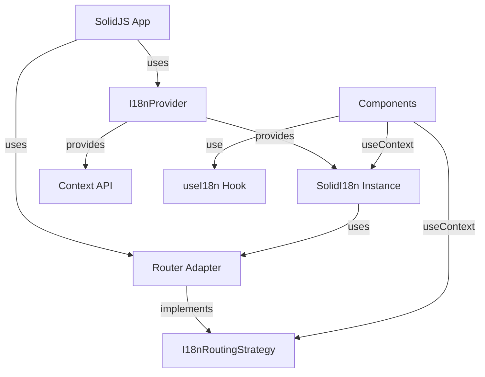

# Solid Package (`@i18n-micro/solid`)

The `@i18n-micro/solid` package provides a lightweight, high-performance internationalization solution for SolidJS applications. It shares the same core logic as Nuxt I18n Micro, offering reactive translations, route-specific support, and full TypeScript support.

## Overview

`@i18n-micro/solid` is designed for SolidJS applications that need internationalization without the Nuxt framework. It provides:

- **Lightweight** - Uses shared core logic from `@i18n-micro/core`
- **Reactive** - Automatic component updates when translations change using SolidJS signals
- **Route-specific translations** - Support for page-level translations
- **Pluralization** - Built-in plural form support
- **Formatting** - Number, date, and relative time formatting
- **Type-safe** - Full TypeScript support
- **Router-agnostic** - Works with any router or without a router via `I18nRoutingStrategy` interface
- **DevTools Integration** - Built-in DevTools support for managing translations

## Installation

Install the package using your preferred package manager:

::: code-group

```bash [npm]
npm install @i18n-micro/solid
```

```bash [yarn]
yarn add @i18n-micro/solid
```

```bash [pnpm]
pnpm add @i18n-micro/solid
```

```bash [bun]
bun add @i18n-micro/solid
```

:::

### Peer Dependencies

The package requires SolidJS:

```json
{
  "peerDependencies": {
    "solid-js": "^1.8.0"
  }
}
```

## Quick Start

### Basic Setup (Without Router)

```typescript
import { render } from 'solid-js/web'
import { createI18n, I18nProvider, useI18n } from '@i18n-micro/solid'
import type { Component } from 'solid-js'

const i18n = createI18n({
  locale: 'en',
  fallbackLocale: 'en',
  messages: {
    en: {
      greeting: 'Hello, {name}!',
      apples: 'no apples | one apple | {count} apples',
    },
    fr: {
      greeting: 'Bonjour, {name}!',
      apples: 'pas de pommes | une pomme | {count} pommes',
    },
  },
})

const App: Component = () => {
  const { t, tc } = useI18n()

  return (
    <div>
      <p>{t('greeting', { name: 'World' })}</p>
      <p>{tc('apples', 5)}</p>
    </div>
  )
}

const root = document.getElementById('root')!
if (root) {
  render(() => (
    <I18nProvider
      i18n={i18n}
      locales={[
        { code: 'en', displayName: 'English', iso: 'en-US' },
        { code: 'fr', displayName: 'Français', iso: 'fr-FR' },
      ]}
      defaultLocale="en"
    >
      <App />
    </I18nProvider>
  ), root)
}
```

### Usage in Components

```tsx
import { useI18n } from '@i18n-micro/solid'
import type { Component } from 'solid-js'

const MyComponent: Component = () => {
  const { t, tc, locale, switchLocale } = useI18n()

  return (
    <div>
      <p>{t('greeting', { name: 'World' })}</p>
      <p>{tc('apples', 5)}</p>
      <button onClick={() => switchLocale('fr')}>Switch to French</button>
    </div>
  )
}
```

## Core Concepts

### Router Adapter Abstraction

The package uses a router adapter pattern to decouple i18n functionality from specific router implementations. This allows you to:

- Use any router library (@solidjs/router, custom router, or no router)
- Implement routing logic in your application, not in the i18n package
- Keep the core package lightweight and router-agnostic

The `I18nRoutingStrategy` interface defines the contract between i18n and your router:

```typescript
interface I18nRoutingStrategy {
  getCurrentPath: () => string
  getCurrentPathAccessor?: () => Accessor<string> // For reactive path tracking
  linkComponent?: string | Component
  push: (target: { path: string }) => void
  replace: (target: { path: string }) => void
  resolvePath?: (to: string | { path?: string }, locale: string) => string | { path?: string }
  getRoute?: () => { fullPath: string; query: Record<string, unknown> }
}
```

### Architecture



## Setup & Configuration

### Basic Setup Without Router

For applications that don't need routing features:

```typescript
import { render } from 'solid-js/web'
import { createI18n, I18nProvider, useI18n } from '@i18n-micro/solid'
import type { Component } from 'solid-js'
import type { Locale } from '@i18n-micro/types'

const locales: Locale[] = [
  { code: 'en', displayName: 'English', iso: 'en-US' },
  { code: 'fr', displayName: 'Français', iso: 'fr-FR' },
]

const i18n = createI18n({
  locale: 'en',
  fallbackLocale: 'en',
  messages: {
    en: { welcome: 'Welcome' },
    fr: { welcome: 'Bienvenue' },
  },
})

const App: Component = () => {
  const { t } = useI18n()
  return <div>{t('welcome')}</div>
}

render(() => (
  <I18nProvider
    i18n={i18n}
    locales={locales}
    defaultLocale="en"
  >
    <App />
  </I18nProvider>
), document.getElementById('root'))
```

### Setup With Router Adapter

For applications with routing (using @solidjs/router):

```typescript
import { render } from 'solid-js/web'
import { Router, Route, useNavigate, useLocation } from '@solidjs/router'
import { createI18n, I18nProvider, createSolidRouterAdapter } from '@i18n-micro/solid'
import type { Component } from 'solid-js'
import type { Locale } from '@i18n-micro/types'

const locales: Locale[] = [
  { code: 'en', displayName: 'English' },
  { code: 'fr', displayName: 'Français' },
]
const defaultLocale = 'en'

const i18n = createI18n({
  locale: defaultLocale,
  fallbackLocale: defaultLocale,
  messages: { [defaultLocale]: {} },
})

// Router root component with adapter setup
const RouterRoot: Component<{ children?: unknown }> = (props) => {
  const navigate = useNavigate()
  const location = useLocation()
  const routingStrategy = createSolidRouterAdapter(
    locales,
    defaultLocale,
    navigate,
    location,
  )

  return (
    <I18nProvider
      i18n={i18n}
      locales={locales}
      defaultLocale={defaultLocale}
      routingStrategy={routingStrategy}
    >
      {props.children as unknown}
    </I18nProvider>
  )
}

const root = document.getElementById('root')!
render(() => (
  <Router root={RouterRoot}>
    <Route path="/" component={Home} />
    <Route path="/about" component={About} />
  </Router>
), root)
```

### Providing Locales Configuration

The `useI18n` hook requires locales configuration to be provided via `I18nProvider`. You must provide both `locales` and `defaultLocale`:

```typescript
import { I18nProvider } from '@i18n-micro/solid'
import type { Locale } from '@i18n-micro/types'

const locales: Locale[] = [
  { code: 'en', displayName: 'English', iso: 'en-US' },
  { code: 'fr', displayName: 'Français', iso: 'fr-FR' },
  { code: 'de', displayName: 'Deutsch', iso: 'de-DE' },
]

<I18nProvider
  i18n={i18n}
  locales={locales}
  defaultLocale="en"
>
  {/* Your app */}
</I18nProvider>
```

## Router Integration

### I18nRoutingStrategy Interface

The `I18nRoutingStrategy` interface defines how i18n interacts with your router:

```typescript
interface I18nRoutingStrategy {
  /**
   * Returns current path (without locale prefix if needed, or full path)
   * Used for determining active classes in links
   */
  getCurrentPath: () => string

  /**
   * (Optional) Returns reactive accessor for current path
   * Used for reactive path tracking in components
   */
  getCurrentPathAccessor?: () => Accessor<string>

  /**
   * Component to use for rendering links (e.g., A from @solidjs/router)
   */
  linkComponent?: string | Component

  /**
   * Function to navigate to another route/locale
   */
  push: (target: { path: string }) => void

  /**
   * Function to replace current route
   */
  replace: (target: { path: string }) => void

  /**
   * Generate path for specific locale
   */
  resolvePath?: (to: string | { path?: string }, locale: string) => string | { path?: string }

  /**
   * (Optional) Get current route object for SEO/Meta tags
   */
  getRoute?: () => {
    fullPath: string
    query: Record<string, unknown>
  }
}
```

### Using the Built-in Router Adapter

The package exports `createSolidRouterAdapter` for @solidjs/router integration:

```typescript
import { createSolidRouterAdapter } from '@i18n-micro/solid'

// In your RouterRoot component
function RouterRoot({ children }: { children?: unknown }) {
  const navigate = useNavigate()
  const location = useLocation()
  const routingStrategy = createSolidRouterAdapter(localesConfig, defaultLocale, navigate, location)
  
  // ... rest of your code
}
```

**Important Notes:**

1. **Must be called inside a component**: `createSolidRouterAdapter` uses `createSignal` and `createEffect`, which require a reactive context. **Always call it inside a component function**, not at module level.

2. **Exported from package**: The `createSolidRouterAdapter` is now exported directly from `@i18n-micro/solid`, so you don't need to create a separate router adapter file for basic use cases. However, you can still create custom adapters if needed (see "Creating Custom Router Adapters" section below).

3. **Reactivity**: The built-in adapter automatically provides `getCurrentPathAccessor()` for proper reactivity in SolidJS components.

### Setting Routing Strategy

You set the routing strategy via `I18nProvider`:

```typescript
const routingStrategy = createSolidRouterAdapter(locales, defaultLocale, navigate, location)

<I18nProvider
  i18n={i18n}
  locales={locales}
  defaultLocale={defaultLocale}
  routingStrategy={routingStrategy}
>
  {/* Your app */}
</I18nProvider>
```

## Creating Custom Router Adapters

### Overview

A router adapter is an implementation of the `I18nRoutingStrategy` interface that defines how i18n interacts with your routing system. This allows you to:

- Support any routing strategy (@solidjs/router, custom router, or no router)
- Customize locale detection and path generation
- Integrate with third-party routing libraries
- Implement domain-based or subdomain-based locale routing

### Interface Reference

The `I18nRoutingStrategy` interface defines the following methods:

| Method | Required | Description |
|--------|----------|-------------|
| `getCurrentPath()` | ✅ | Returns the current path (used for active link detection) |
| `getCurrentPathAccessor()` | ⚠️ **Highly Recommended** | Returns reactive accessor for current path (SolidJS-specific). **Required for proper reactivity** - without this, active link states and path-dependent UI won't update reactively. |
| `linkComponent` | ❌ | Component to use for rendering links (e.g., `A` from @solidjs/router) |
| `push(target)` | ❌ | Function to navigate to another route/locale |
| `replace(target)` | ❌ | Function to replace current route |
| `resolvePath(to, locale)` | ❌ | Generate path for specific locale |
| `getRoute()` | ❌ | Returns current route object with query params |

### Step-by-Step Guide

#### Step 1: Understand Your Routing Strategy

Before creating an adapter, understand how your routing works:

- **Where is the locale in the URL?** (prefix, suffix, subdomain, query param)
- **How are routes named?** (file-based, programmatic, custom)
- **What is the default locale behavior?** (include prefix, hide prefix)

#### Step 2: Implement Required Methods

At minimum, you must implement `getCurrentPath()`. 

**For SolidJS, you MUST also implement `getCurrentPathAccessor()`** - this is critical for proper reactivity. Without it, active link states and any UI that depends on the current path won't update when navigation occurs. The accessor should return a signal that tracks pathname changes.

#### Step 3: Handle Edge Cases

Consider:
- Empty paths (`/`)
- Root locale (default locale - should it be in URL?)
- Invalid locales
- Query parameters and hash fragments

### Example 1: Custom Router with Signals

This example shows how to create an adapter for a custom router that uses signals:

```typescript
// src/router-adapter-custom.tsx
import { createSignal, type Accessor, type Component, type JSX } from 'solid-js'
import type { I18nRoutingStrategy } from '@i18n-micro/solid'
import type { Locale } from '@i18n-micro/types'

// Example: Custom router interface
interface CustomRouter {
  getCurrentPath(): string
  navigate(path: string): void
  replace(path: string): void
  subscribe(callback: () => void): () => void
}

export function createCustomRouterAdapter(
  customRouter: CustomRouter,
  locales: Locale[],
  defaultLocale: string,
): I18nRoutingStrategy & { getCurrentPathAccessor: Accessor<string> } {
  const localeCodes = locales.map(loc => loc.code)

  // Create signal to track pathname changes
  const [pathname, setPathname] = createSignal(customRouter.getCurrentPath())

  // Subscribe to router changes
  customRouter.subscribe(() => {
    setPathname(customRouter.getCurrentPath())
  })

  const resolvePath = (to: string | { path?: string }, locale: string): string | { path?: string } => {
    const path = typeof to === 'string' ? to : (to.path || '/')
    const pathSegments = path.split('/').filter(Boolean)
    
    if (pathSegments.length > 0 && localeCodes.includes(pathSegments[0])) {
      pathSegments.shift()
    }

    const cleanPath = '/' + pathSegments.join('/')
    return locale === defaultLocale ? cleanPath : `/${locale}${cleanPath === '/' ? '' : cleanPath}`
  }

  return {
    getCurrentPath: () => pathname(),
    getCurrentPathAccessor: pathname, // Reactive accessor for SolidJS

    push: (target: { path: string }) => {
      customRouter.navigate(target.path)
    },

    replace: (target: { path: string }) => {
      customRouter.replace(target.path)
    },

    resolvePath: (to: string | { path?: string }, locale: string) => resolvePath(to, locale),

    getRoute: () => {
      const path = pathname()
      const url = new URL(path, 'http://localhost')
      return {
        fullPath: path + url.search,
        query: Object.fromEntries(url.searchParams),
      }
    },
  }
}
```

### Example 2: Query Parameter-Based Locale Routing

This example uses query parameters for locale (e.g., `/?locale=fr`):

```typescript
// src/router-adapter-query.tsx
import { createSignal, createEffect, type Accessor, type Component, type JSX } from 'solid-js'
import type { I18nRoutingStrategy } from '@i18n-micro/solid'
import type { Locale } from '@i18n-micro/types'

export function createQueryParamRouterAdapter(
  locales: Locale[],
  defaultLocale: string,
  paramName: string = 'locale',
): I18nRoutingStrategy & { getCurrentPathAccessor: Accessor<string> } {
  const localeCodes = locales.map(loc => loc.code)

  const getCurrentPath = (): string => {
    if (typeof window !== 'undefined') {
      return window.location.pathname
    }
    return '/'
  }

  const [pathname, setPathname] = createSignal(getCurrentPath())

  // Track pathname changes
  if (typeof window !== 'undefined') {
    createEffect(() => {
      const updatePath = () => setPathname(window.location.pathname)
      window.addEventListener('popstate', updatePath)
      return () => window.removeEventListener('popstate', updatePath)
    })
  }

  const resolvePath = (to: string | { path?: string }, locale: string): string | { path?: string } => {
    const path = typeof to === 'string' ? to : (to.path || '/')
    const url = new URL(path, 'http://localhost')
    
    if (locale !== defaultLocale) {
      url.searchParams.set(paramName, locale)
    } else {
      url.searchParams.delete(paramName)
    }
    
    return url.pathname + url.search
  }

  return {
    getCurrentPath,
    getCurrentPathAccessor: pathname,
    push: (target) => {
      if (typeof window !== 'undefined') {
        window.history.pushState({}, '', target.path)
        window.dispatchEvent(new Event('popstate'))
      }
    },
    replace: (target) => {
      if (typeof window !== 'undefined') {
        window.history.replaceState({}, '', target.path)
        window.dispatchEvent(new Event('popstate'))
      }
    },
    resolvePath: (to, locale) => resolvePath(to, locale),
    getRoute: () => {
      if (typeof window !== 'undefined') {
        const url = new URL(window.location.href)
        return {
          fullPath: url.pathname + url.search,
          query: Object.fromEntries(url.searchParams),
        }
      }
      return {
        fullPath: '/',
        query: {},
      }
    },
  }
}
```

### Best Practices

1. **Always provide `getCurrentPathAccessor` for SolidJS** (REQUIRED for reactivity): This ensures proper reactivity in components. Without it, active link states and path-dependent UI won't update:

```typescript
return {
  getCurrentPath: () => pathname(), // For compatibility
  getCurrentPathAccessor: pathname, // For reactivity in SolidJS components
  // ... other methods
}
```

2. **Use signals for reactive path tracking**: Create signals inside the adapter to track pathname changes:

```typescript
const [pathname, setPathname] = createSignal(location.pathname)

createEffect(() => {
  setPathname(location.pathname) // Track changes
})
```

3. **Preserve query parameters and hash**: When switching locales, maintain query params and hash fragments:

```typescript
const resolvePath = (to: string | { path?: string }, locale: string): string | { path?: string } => {
  const path = typeof to === 'string' ? to : (to.path || '/')
  const url = new URL(path, 'http://localhost')
  // ... locale switching logic ...
  return url.pathname + url.search + url.hash
}
```

4. **Handle edge cases**: Consider empty paths, root paths, and invalid locales:

```typescript
const getCurrentPath = (): string => {
  if (typeof window !== 'undefined') {
    const path = window.location.pathname
    return path || '/' // Handle empty path
  }
  return '/'
}
```

### Common Patterns

#### Pattern 1: Minimal Adapter (Only Required Methods)

If you only need basic functionality:

```typescript
export function createMinimalAdapter(): I18nRoutingStrategy {
  return {
    getCurrentPath: () => {
      return typeof window !== 'undefined' ? window.location.pathname : '/'
    },
  }
}
```

#### Pattern 2: Extending Built-in Adapter

You can extend the built-in adapter and override specific methods:

```typescript
import { createSolidRouterAdapter } from '@i18n-micro/solid'

export function createExtendedAdapter(
  locales: Locale[],
  defaultLocale: string,
  navigate: NavigateFunction,
  location: Location,
) {
  const baseAdapter = createSolidRouterAdapter(locales, defaultLocale, navigate, location)
  
  return {
    ...baseAdapter,
    // Override specific method
    resolvePath: (to: string | { path?: string }, locale: string) => {
      const basePath = baseAdapter.resolvePath?.(to, locale)
      // Custom logic
      return typeof basePath === 'string' ? `/custom${basePath}` : basePath
    },
  }
}
```

### Troubleshooting

**Problem**: Locale not detected correctly
- **Solution**: Check that `getCurrentPath` correctly returns the current path, and `resolvePath` properly handles locale prefixes

**Problem**: Links don't switch locale
- **Solution**: Ensure `push` and `replace` methods correctly update the URL and dispatch events for your router

**Problem**: Active state detection doesn't work
- **Solution**: **You MUST provide `getCurrentPathAccessor`** in your router adapter. Verify it's implemented and returns a signal accessor. The accessor should be called inside `createMemo` for proper reactivity. Without `getCurrentPathAccessor`, active states won't update reactively.

**Problem**: Components don't update when path changes
- **Solution**: **You MUST implement `getCurrentPathAccessor`** in your router adapter. It must return a signal accessor that tracks pathname changes. Components should call it inside reactive contexts (`createMemo`, `createEffect`, JSX). If you're using `createSolidRouterAdapter`, ensure it's called inside a component (not at module level) so `createSignal` and `createEffect` work correctly.

## Core API

### `createI18n(options: SolidI18nOptions)`

Creates a SolidJS i18n instance.

**Parameters:**

| Property | Type | Required | Default | Description |
|----------|------|----------|---------|-------------|
| `locale` | `string` | ✅ | - | Current locale code (e.g., `'en'`) |
| `fallbackLocale` | `string` | ❌ | Same as `locale` | Fallback locale when translation is missing |
| `messages` | `Record<string, Translations>` | ❌ | `{}` | Initial translation messages |
| `plural` | `PluralFunc` | ❌ | `defaultPlural` | Custom pluralization function |
| `messageCompiler` | `MessageCompilerFunc` | ❌ | - | Custom function for compiling messages (ICU MessageFormat support) |
| `missingWarn` | `boolean` | ❌ | `false` | Show console warnings for missing translations |
| `missingHandler` | `(locale: string, key: string, routeName: string) => void` | ❌ | - | Custom handler for missing translations |

**Returns:** `SolidI18n`

**Example:**

```typescript
import { createI18n } from '@i18n-micro/solid'

const i18n = createI18n({
  locale: 'en',
  fallbackLocale: 'en',
  messages: {
    en: {
      welcome: 'Welcome',
      greeting: 'Hello, {name}!',
    },
    fr: {
      welcome: 'Bienvenue',
      greeting: 'Bonjour, {name}!',
    },
  },
  missingWarn: true,
  missingHandler: (locale, key, routeName) => {
    console.warn(`Missing translation: ${key} in ${locale} for route ${routeName}`)
  },
})
```

### `SolidI18n` Class

The core i18n instance class that handles all translation logic.

#### Properties

- `locale: string` - Current locale (getter/setter, reactive via `localeAccessor()`)
- `localeAccessor: Accessor<string>` - Reactive accessor for current locale
- `fallbackLocale: string` - Fallback locale (getter)
- `currentRoute: string` - Current route name (getter)
- `routeAccessor: Accessor<string>` - Reactive accessor for current route
- `cacheStore: { general: Record<string, Translations>, route: Record<string, Translations> }` - Translation cache (reactive store)

#### Methods

##### `t(key: TranslationKey, params?: Params, defaultValue?: string | null, routeName?: string): CleanTranslation`

Translates a key with optional parameters and fallback value.

```typescript
const i18n = createI18n({ /* ... */ })

// Basic translation
i18n.t('welcome') // "Welcome"

// With parameters
i18n.t('greeting', { name: 'John' }) // "Hello, John!"

// With default value
i18n.t('missing', {}, 'Default text') // "Default text"

// Route-specific translation
i18n.t('title', {}, null, 'home') // Uses 'home' route translations
```

##### `ts(key: TranslationKey, params?: Params, defaultValue?: string, routeName?: string): string`

Same as `t()` but always returns a string.

##### `tc(key: TranslationKey, count: number | Params, defaultValue?: string): string`

Pluralization-aware translation.

```typescript
// With count number
i18n.tc('apples', 0) // "no apples"
i18n.tc('apples', 1) // "one apple"
i18n.tc('apples', 5) // "5 apples"

// With params object
i18n.tc('items', { count: 3, type: 'books' })
```

##### `tn(value: number, options?: Intl.NumberFormatOptions): string`

Formats a number according to the current locale.

```typescript
i18n.tn(1234.56) // "1,234.56" (en) or "1 234,56" (fr)
i18n.tn(1234.56, { style: 'currency', currency: 'USD' }) // "$1,234.56"
```

##### `td(value: Date | number | string, options?: Intl.DateTimeFormatOptions): string`

Formats a date according to the current locale.

```typescript
i18n.td(new Date()) // "12/31/2023" (en) or "31/12/2023" (fr)
i18n.td(new Date(), { dateStyle: 'full' }) // "Sunday, December 31, 2023"
```

##### `tdr(value: Date | number | string, options?: Intl.RelativeTimeFormatOptions): string`

Formats a relative time (e.g., "2 hours ago").

```typescript
const yesterday = new Date()
yesterday.setDate(yesterday.getDate() - 1)
i18n.tdr(yesterday) // "yesterday"
i18n.tdr(Date.now() - 3600000) // "1 hour ago"
```

##### `has(key: TranslationKey, routeName?: string): boolean`

Checks if a translation key exists.

```typescript
i18n.has('welcome') // true
i18n.has('missing') // false
```

##### `addTranslations(locale: string, translations: Translations, merge?: boolean): void`

Adds or merges translations for a locale.

```typescript
// Add new translations
i18n.addTranslations('en', {
  newKey: 'New translation',
})

// Replace existing (merge = false)
i18n.addTranslations('en', {
  welcome: 'New Welcome',
}, false)
```

##### `addRouteTranslations(locale: string, routeName: string, translations: Translations, merge?: boolean): void`

Adds route-specific translations.

```typescript
i18n.addRouteTranslations('en', 'home', {
  title: 'Home Page',
  description: 'Welcome to our home page',
})
```

##### `clearCache(): void`

Clears the translation cache.

##### `setRoute(routeName: string): void`

Sets the current route name for route-specific translations.

##### `getRoute(): string`

Gets the current route name.

##### `getLocale(): string`

Gets the current locale.

##### `getFallbackLocale(): string`

Gets the fallback locale.

##### `destroy(): void`

Destroys the reactive root (useful for cleanup in tests).

## Composables

### `useI18n(options?: UseI18nOptions)`

The `useI18n` hook provides access to i18n functionality in SolidJS components.

**Options:**

```typescript
interface UseI18nOptions {
  locales?: Locale[]
  defaultLocale?: string
}
```

**Returns:**

```typescript
{
  // Direct access to instance
  instance: SolidI18n

  // Locale (reactive via createMemo)
  locale: Accessor<string>

  // Locale helpers
  getLocales: () => Locale[]
  defaultLocale: () => string
  getLocaleName: () => string | null

  // Routing helpers
  localeRoute: (to: string | { path?: string }, localeCode?: string) => string | { path?: string }
  localePath: (to: string | { path?: string }, locale?: string) => string
  switchLocale: (newLocale: string) => void

  // Translation methods
  t: (key: TranslationKey, params?: Params, defaultValue?: string | null, routeName?: string) => CleanTranslation
  ts: (key: TranslationKey, params?: Params, defaultValue?: string, routeName?: string) => string
  tc: (key: TranslationKey, count: number | Params, defaultValue?: string) => string
  tn: (value: number, options?: Intl.NumberFormatOptions) => string
  td: (value: Date | number | string, options?: Intl.DateTimeFormatOptions) => string
  tdr: (value: Date | number | string, options?: Intl.RelativeTimeFormatOptions) => string
  has: (key: TranslationKey, routeName?: string) => boolean

  // Route management
  setRoute: (routeName: string) => void
  getRoute: () => string
  getLocale: () => string

  // Translation management
  addTranslations: (locale: string, translations: Translations, merge?: boolean) => void
  addRouteTranslations: (locale: string, routeName: string, translations: Translations, merge?: boolean) => void
  clearCache: () => void
}
```

**Example:**

```tsx
import { useI18n } from '@i18n-micro/solid'
import type { Component } from 'solid-js'

const MyComponent: Component = () => {
  const { t, tc, locale, switchLocale } = useI18n()

  return (
    <div>
      <p>{t('greeting', { name: 'World' })}</p>
      <p>{tc('apples', 5)}</p>
      <button onClick={() => switchLocale('fr')}>Switch to French</button>
    </div>
  )
}
```

## Components

### `I18nT`

Translation component for rendering translated text.

**Props:**

| Prop | Type | Required | Default | Description |
|------|------|----------|---------|-------------|
| `keypath` | `TranslationKey` | ✅ | - | Translation key |
| `plural` | `number \| string` | ❌ | - | Count for pluralization |
| `tag` | `string` | ❌ | `'span'` | HTML tag to render |
| `params` | `Record<string, string \| number \| boolean>` | ❌ | `{}` | Parameters for interpolation |
| `defaultValue` | `string` | ❌ | `''` | Default value if translation is missing |
| `html` | `boolean` | ❌ | `false` | Render as HTML |
| `hideIfEmpty` | `boolean` | ❌ | `false` | Hide component if translation is empty |
| `customPluralRule` | `PluralFunc` | ❌ | - | Custom pluralization function |
| `number` | `number \| string` | ❌ | - | Number to format and interpolate |
| `date` | `Date \| string \| number` | ❌ | - | Date to format and interpolate |
| `relativeDate` | `Date \| string \| number` | ❌ | - | Date for relative time formatting |

**Examples:**

```tsx
import { I18nT } from '@i18n-micro/solid'
import { createMemo } from 'solid-js'

// Basic translation
<I18nT keypath="welcome" />

// With parameters
<I18nT
  keypath="greeting"
  params={{ name: 'SolidJS' }}
/>

// Pluralization
<I18nT keypath="apples" plural={0} />
<I18nT keypath="apples" plural={1} />
<I18nT keypath="apples" plural={5} />

// Number formatting
<I18nT
  keypath="number"
  number={1234.56}
/>

// Date formatting
<I18nT
  keypath="date"
  date={new Date()}
/>

// Relative date formatting
const oneHourAgo = createMemo(() => new Date(Date.now() - 3600000))
<I18nT
  keypath="relativeDate"
  relativeDate={oneHourAgo()}
/>

// HTML rendering
<I18nT
  keypath="htmlContent"
  html
  tag="div"
/>

// Custom tag
<I18nT
  keypath="title"
  tag="h1"
/>
```

### `I18nLink`

Localized link component that works with or without a router adapter.

**Props:**

| Prop | Type | Required | Default | Description |
|------|------|----------|---------|-------------|
| `to` | `string \| { path?: string }` | ✅ | - | Target path or route object |
| `activeStyle` | `JSX.CSSProperties` | ❌ | `{}` | Styles to apply when link is active |
| `localeRoute` | `(to: string \| { path?: string }, locale?: string) => string \| { path?: string }` | ❌ | - | Custom locale route resolver |

**Examples:**

```tsx
import { I18nLink, useI18n } from '@i18n-micro/solid'

const MyComponent = () => {
  const { localeRoute } = useI18n()

  return (
    <>
      {/* Basic link */}
      <I18nLink to="/">
        Home
      </I18nLink>

      {/* With active style */}
      <I18nLink
        to="/about"
        activeStyle={{ color: 'red', fontWeight: 'bold' }}
      >
        About
      </I18nLink>

      {/* External link (automatically detected) */}
      <I18nLink to="https://example.com">
        External Link
      </I18nLink>

      {/* With custom locale route */}
      <I18nLink
        to="/products"
        localeRoute={localeRoute}
      >
        Products
      </I18nLink>
    </>
  )
}
```

### `I18nSwitcher`

Locale switcher component with dropdown interface.

**Props:**

| Prop | Type | Required | Default | Description |
|------|------|----------|---------|-------------|
| `locales` | `Locale[]` | ❌ | - | Locales list (uses injected if not provided) |
| `currentLocale` | `string \| (() => string)` | ❌ | - | Current locale (uses i18n instance if not provided) |
| `getLocaleName` | `() => string \| null` | ❌ | - | Function to get current locale name |
| `switchLocale` | `(locale: string) => void` | ❌ | - | Function to switch locale |
| `localeRoute` | `(to: string \| { path?: string }, locale?: string) => string \| { path?: string }` | ❌ | - | Function to resolve locale route |
| `customLabels` | `Record<string, string>` | ❌ | `{}` | Custom labels for locales |
| `customWrapperStyle` | `JSX.CSSProperties` | ❌ | `{}` | Custom wrapper styles |
| `customButtonStyle` | `JSX.CSSProperties` | ❌ | `{}` | Custom button styles |
| `customDropdownStyle` | `JSX.CSSProperties` | ❌ | `{}` | Custom dropdown styles |
| `customItemStyle` | `JSX.CSSProperties` | ❌ | `{}` | Custom item styles |
| `customLinkStyle` | `JSX.CSSProperties` | ❌ | `{}` | Custom link styles |
| `customActiveLinkStyle` | `JSX.CSSProperties` | ❌ | `{}` | Custom active link styles |
| `customDisabledLinkStyle` | `JSX.CSSProperties` | ❌ | `{}` | Custom disabled link styles |
| `customIconStyle` | `JSX.CSSProperties` | ❌ | `{}` | Custom icon styles |

**Examples:**

```tsx
import { I18nSwitcher, useI18n } from '@i18n-micro/solid'

const MyComponent = () => {
  const { locale, getLocales, getLocaleName, switchLocale, localeRoute } = useI18n()
  const locales = getLocales()

  return (
    <>
      {/* Basic switcher */}
      <I18nSwitcher />

      {/* With custom props */}
      <I18nSwitcher
        locales={locales}
        currentLocale={locale}
        getLocaleName={getLocaleName}
        switchLocale={switchLocale}
        localeRoute={localeRoute}
      />

      {/* With custom styling */}
      <I18nSwitcher
        customButtonStyle={{ backgroundColor: '#007bff', color: 'white' }}
        customDropdownStyle={{ borderRadius: '8px' }}
      />

      {/* With custom labels */}
      <I18nSwitcher
        customLabels={{ en: 'English', fr: 'Français', de: 'Deutsch' }}
      />
    </>
  )
}
```

### `I18nGroup`

Component for grouping translations with a common prefix.

**Props:**

| Prop | Type | Required | Default | Description |
|------|------|----------|---------|-------------|
| `prefix` | `string` | ✅ | - | Translation key prefix |
| `groupClass` | `string` | ❌ | `''` | CSS class for the wrapper div |

**Slots:**

- `default` - Function as children with: `{ prefix: string, t: (key: string, params?: Params) => string }`

**Examples:**

```tsx
import { I18nGroup } from '@i18n-micro/solid'

<I18nGroup prefix="home">
  {({ t: groupT }) => (
    <>
      <h1>{groupT('title')}</h1>
      <p>{groupT('description')}</p>
      <p>{groupT('greeting', { name: 'User' })}</p>
    </>
  )}
</I18nGroup>

{/* With custom class */}
<I18nGroup prefix="about" groupClass="about-section">
  {({ t }) => (
    <div>{t('content')}</div>
  )}
</I18nGroup>
```


## Advanced Usage

### Route-Specific Translations

You can define translations specific to routes:

```typescript
// Add route-specific translations
i18n.addRouteTranslations('en', 'home', {
  title: 'Home Page',
  description: 'Welcome to our home page',
})

i18n.addRouteTranslations('en', 'about', {
  title: 'About Us',
  description: 'Learn more about us',
})

// Set current route
i18n.setRoute('home')

// Use route-specific translation
i18n.t('title') // "Home Page"
i18n.t('title', {}, null, 'about') // "About Us"
```

### Dynamic Translation Loading

Load translations dynamically:

```typescript
async function loadLocaleTranslations(locale: string) {
  const messages = await import(`./locales/${locale}.json`)
  i18n.addTranslations(locale, messages.default, false)
}

// Load on demand
await loadLocaleTranslations('fr')

// Preload in background
Promise.all([
  loadLocaleTranslations('de'),
  loadLocaleTranslations('es'),
]).catch(() => {
  // Handle errors
})
```

### Pluralization

Pluralization is handled automatically based on the count:

```typescript
// Translation key with plural forms
const messages = {
  en: {
    apples: 'no apples | one apple | {count} apples',
    items: 'no items | one item | {count} items',
  },
}

// Usage
i18n.tc('apples', 0) // "no apples"
i18n.tc('apples', 1) // "one apple"
i18n.tc('apples', 5) // "5 apples"

// With parameters
i18n.tc('items', { count: 3, type: 'books' })
```

### Custom Plural Function

You can provide a custom pluralization function:

```typescript
import { createI18n } from '@i18n-micro/solid'

const i18n = createI18n({
  locale: 'ru',
  plural: (key, count, params, locale, t) => {
    // Russian plural rules
    const forms = key.split(' | ')
    if (count % 10 === 1 && count % 100 !== 11) {
      return forms[0] || key
    }
    if (count % 10 >= 2 && count % 10 <= 4 && (count % 100 < 10 || count % 100 >= 20)) {
      return forms[1] || key
    }
    return forms[2] || key
  },
})
```

### Number Formatting

Format numbers according to locale:

```typescript
// Basic formatting
i18n.tn(1234.56) // "1,234.56" (en) or "1 234,56" (fr)

// Currency
i18n.tn(1234.56, { style: 'currency', currency: 'USD' }) // "$1,234.56"

// Percentage
i18n.tn(0.15, { style: 'percent' }) // "15%"
```

### Date Formatting

Format dates according to locale:

```typescript
const date = new Date('2023-12-31')

// Basic formatting
i18n.td(date) // "12/31/2023" (en) or "31/12/2023" (fr)

// Full date style
i18n.td(date, { dateStyle: 'full' }) // "Sunday, December 31, 2023"

// Custom format
i18n.td(date, { year: 'numeric', month: 'long', day: 'numeric' })
```

### Relative Time Formatting

Format relative time:

```typescript
const oneHourAgo = new Date(Date.now() - 3600000)

i18n.tdr(oneHourAgo) // "1 hour ago"

// With options
i18n.tdr(oneHourAgo, { numeric: 'auto' }) // "an hour ago"
```

### Missing Translation Handling

Handle missing translations:

```typescript
const i18n = createI18n({
  locale: 'en',
  missingWarn: true, // Show console warnings
  missingHandler: (locale, key, routeName) => {
    // Custom handler
    console.error(`Missing: ${key} in ${locale} for route ${routeName}`)
    // Send to error tracking service
  },
})
```

## DevTools Integration

This package supports DevTools integration via the `@i18n-micro/devtools-ui` Vite plugin. See the [DevTools UI Package documentation](./devtools-ui-package.md) for details.

## TypeScript Support

### Type Exports

The package exports all necessary types:

```typescript
import type {
  SolidI18n,
  SolidI18nOptions,
  I18nProviderProps,
  I18nRoutingStrategy,
  UseI18nOptions,
  Locale,
  Translations,
  TranslationKey,
  Params,
  CleanTranslation,
} from '@i18n-micro/solid'
```

### Type Safety

All translation methods are type-safe:

```typescript
// Translation keys are typed
const key: TranslationKey = 'welcome' // ✅
const invalid: TranslationKey = 'missing' // ⚠️ Type error if key doesn't exist

// Parameters are typed
i18n.t('greeting', { name: 'John' }) // ✅
i18n.t('greeting', { invalid: 'value' }) // ⚠️ Type error
```

## Examples & Recipes

### Complete SPA Example

See the playground implementation in `packages/solid/playground/src/` for a complete working example.

### Router Integration Example

```typescript
// router-adapter.tsx
import { createSignal, createEffect, type Accessor, type Component, type JSX } from 'solid-js'
import { A, type NavigateFunction, type Location } from '@solidjs/router'
import type { I18nRoutingStrategy } from '@i18n-micro/solid'
import type { Locale } from '@i18n-micro/types'

export function createSolidRouterAdapter(
  locales: Locale[],
  defaultLocale: string,
  navigate: NavigateFunction,
  location: Location,
): I18nRoutingStrategy & { getCurrentPathAccessor: Accessor<string> } {
  const localeCodes = locales.map(loc => loc.code)
  const [pathname, setPathname] = createSignal(location.pathname)

  createEffect(() => {
    setPathname(location.pathname)
  })

  const resolvePath = (to: string | { path?: string }, locale: string): string | { path?: string } => {
    const path = typeof to === 'string' ? to : (to.path || '/')
    const pathSegments = path.split('/').filter(Boolean)

    if (pathSegments.length > 0 && localeCodes.includes(pathSegments[0])) {
      pathSegments.shift()
    }

    const cleanPath = '/' + pathSegments.join('/')
    return locale === defaultLocale ? cleanPath : `/${locale}${cleanPath === '/' ? '' : cleanPath}`
  }

  return {
    getCurrentPath: () => pathname(),
    getCurrentPathAccessor: pathname,
    push: (target) => navigate(target.path),
    replace: (target) => navigate(target.path, { replace: true }),
    resolvePath: (to, locale) => resolvePath(to, locale),
    getRoute: () => ({
      fullPath: pathname(),
      query: Object.fromEntries(new URLSearchParams(location.search)),
    }),
    linkComponent: ((props) => {
      const { href, children, class: className, style, ...restProps } = props
      return (
        <A href={href} class={className} style={style} {...restProps}>
          {children}
        </A>
      )
    }) as Component<{
      href: string
      children?: JSX.Element
      style?: JSX.CSSProperties
      class?: string
      [key: string]: unknown
    }>,
  }
}
```

### Component Usage Example

```tsx
import { useI18n, I18nLink, I18nSwitcher, I18nT } from '@i18n-micro/solid'
import type { Component } from 'solid-js'

const App: Component = () => {
  const { t, getLocales, locale, getLocaleName, localeRoute, switchLocale } = useI18n()
  const locales = getLocales()

  return (
    <div id="app">
      <nav>
        <I18nLink to="/" localeRoute={localeRoute} activeStyle={{ fontWeight: 'bold' }}>
          <I18nT keypath="nav.home" />
        </I18nLink>
        <I18nLink to="/about" localeRoute={localeRoute} activeStyle={{ fontWeight: 'bold' }}>
          <I18nT keypath="nav.about" />
        </I18nLink>
      </nav>

      <div class="locale-switcher">
        <I18nSwitcher
          locales={locales}
          currentLocale={locale}
          getLocaleName={getLocaleName}
          switchLocale={switchLocale}
          localeRoute={localeRoute}
        />
      </div>

      <main>
        {/* Your routes */}
      </main>
    </div>
  )
}
```

### Locale Synchronization with Router

```tsx
import { createEffect } from 'solid-js'
import { useParams } from '@solidjs/router'
import { useI18n } from '@i18n-micro/solid'

const LocaleHandler: Component<{ params: { locale?: string }, children?: unknown }> = (props) => {
  const { instance: i18n } = useI18n()
  const localeCodes = ['en', 'fr', 'de']
  const currentLocale = props.params.locale && localeCodes.includes(props.params.locale)
    ? props.params.locale
    : 'en'

  // Sync locale with i18n instance
  if (currentLocale !== i18n.getLocale()) {
    i18n.locale = currentLocale
  }

  return props.children as unknown
}
```

## Resources

- **Repository**: [https://github.com/s00d/nuxt-i18n-micro](https://github.com/s00d/nuxt-i18n-micro)
- **Documentation**: [https://s00d.github.io/nuxt-i18n-micro/](https://s00d.github.io/nuxt-i18n-micro/)

## License

MIT

