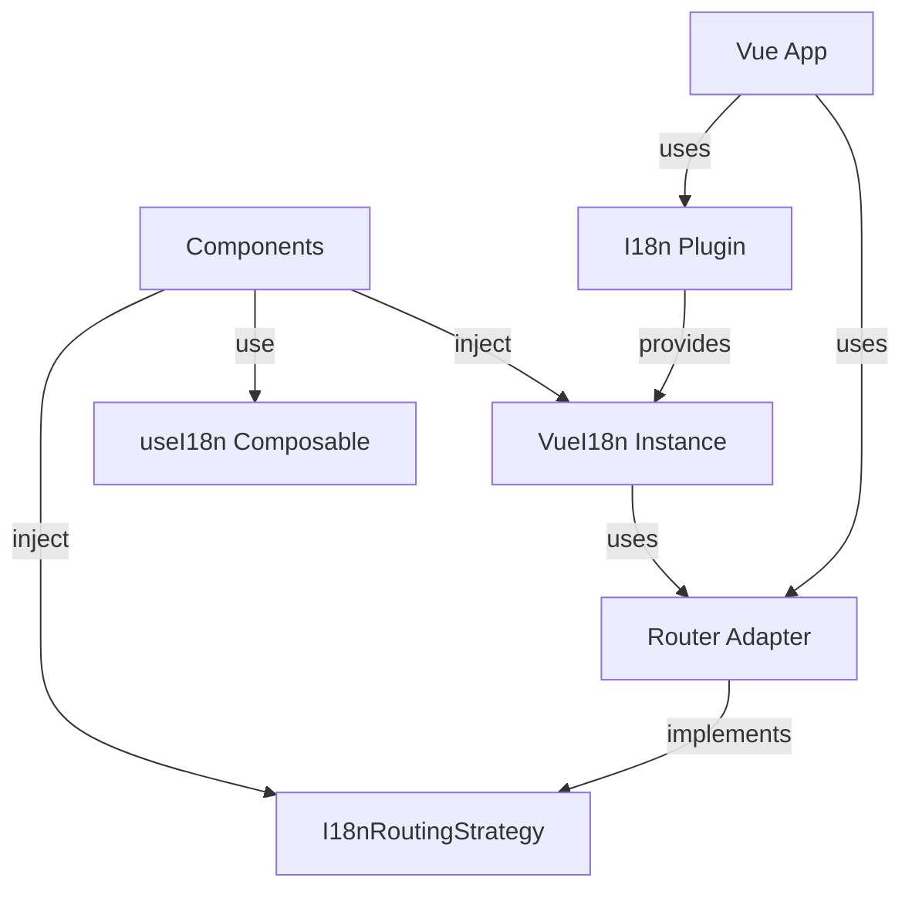

# Vue Package (`@i18n-micro/vue`)

The `@i18n-micro/vue` package provides a lightweight, high-performance internationalization solution for Vue 3 applications. It shares the same core logic as Nuxt I18n Micro, offering reactive translations, route-specific support, and full TypeScript support.

## Overview

`@i18n-micro/vue` is designed for Vue 3 applications that need internationalization without the Nuxt framework. It provides:

- **Lightweight** - Uses shared core logic from `@i18n-micro/core`
- **Reactive** - Automatic component updates when translations change
- **Route-specific translations** - Support for page-level translations
- **Pluralization** - Built-in plural form support
- **Formatting** - Number, date, and relative time formatting
- **Type-safe** - Full TypeScript support
- **Router-agnostic** - Works with any router or without a router
- **DevTools Integration** - Built-in Vue DevTools support for managing translations

## Installation

Install the package using your preferred package manager:

::: code-group

```bash [npm]
npm install @i18n-micro/vue
```

```bash [yarn]
yarn add @i18n-micro/vue
```

```bash [pnpm]
pnpm add @i18n-micro/vue
```

```bash [bun]
bun add @i18n-micro/vue
```

:::

### Peer Dependencies

The package requires Vue 3 and optionally Vue Router:

```json
{
  "peerDependencies": {
    "vue": "^3.3.0",
    "vue-router": "^4.0.0"
  }
}
```

## Quick Start

### Basic Setup (Without Router)

```typescript
import { createApp } from 'vue'
import { createI18n } from '@i18n-micro/vue'
import App from './App.vue'

const app = createApp(App)

const i18n = createI18n({
  locale: 'en',
  fallbackLocale: 'en',
  // Automatically provided to the app - no need for manual provide calls
  locales: [
    { code: 'en', displayName: 'English', iso: 'en-US' },
    { code: 'fr', displayName: 'Français', iso: 'fr-FR' },
  ],
  defaultLocale: 'en',
  messages: {
    en: {
      greeting: 'Hello, {name}!',
      apples: 'no apples | one apple | {count} apples',
    },
    fr: {
      greeting: 'Bonjour, {name}!',
      apples: 'pas de pommes | une pomme | {count} pommes',
    },
  },
})

app.use(i18n)
app.mount('#app')
```

### Usage in Components

```vue
<template>
  <div>
    <p>{{ t('greeting', { name: 'World' }) }}</p>
    <p>{{ tc('apples', 5) }}</p>
  </div>
</template>

<script setup lang="ts">
import { useI18n } from '@i18n-micro/vue'

const { t, tc, locale } = useI18n()

// Change locale reactively
locale.value = 'fr'
</script>
```

## Core Concepts

### Router Adapter Abstraction

The package uses a router adapter pattern to decouple i18n functionality from specific router implementations. This allows you to:

- Use any router library (Vue Router, custom router, or no router)
- Implement routing logic in your application, not in the i18n package
- Keep the core package lightweight and router-agnostic

The `I18nRoutingStrategy` interface defines the contract between i18n and your router:

```typescript
interface I18nRoutingStrategy {
  getCurrentPath: () => string
  linkComponent?: string | Component
  push: (target: { path: string }) => void
  replace: (target: { path: string }) => void
  resolvePath?: (to: string | { path?: string }, locale: string) => string | { path?: string }
  getRoute?: () => { fullPath: string; query: Record<string, unknown> }
}
```

### Architecture



## Setup & Configuration

### Basic Setup Without Router

For applications that don't need routing features:

```typescript
import { createApp } from 'vue'
import { createI18n, I18nLocalesKey, I18nDefaultLocaleKey } from '@i18n-micro/vue'
import App from './App.vue'

const app = createApp(App)

const i18n = createI18n({
  locale: 'en',
  fallbackLocale: 'en',
  // Automatically provided to the app
  locales: [
    { code: 'en', displayName: 'English', iso: 'en-US' },
    { code: 'fr', displayName: 'Français', iso: 'fr-FR' },
  ],
  defaultLocale: 'en',
  messages: {
    en: { welcome: 'Welcome' },
    fr: { welcome: 'Bienvenue' },
  },
})

app.use(i18n)
app.mount('#app')
```

### Setup With Router Adapter

For applications with routing:

```typescript
import { createApp } from 'vue'
import { createRouter, createWebHistory } from 'vue-router'
import { createI18n } from '@i18n-micro/vue'
import { createVueRouterAdapter } from '@i18n-micro/vue'
import App from './App.vue'
import { routes, localesConfig, defaultLocale } from './app-config'

const router = createRouter({
  history: createWebHistory(),
  routes,
})

// Create router adapter
const routingStrategy = createVueRouterAdapter(router, localesConfig, defaultLocale)

// Create i18n with routing strategy
const i18n = createI18n({
  locale: defaultLocale,
  fallbackLocale: defaultLocale,
  messages: { [defaultLocale]: {} },
  routingStrategy, // Pass adapter here
  // Automatically provided to the app - no need for manual provide calls
  locales: localesConfig,
  defaultLocale,
})

const app = createApp(App)
app.use(router)
app.use(i18n)

app.mount('#app')
```

### Providing Locales Configuration

The `useI18n` composable requires locales configuration to be provided via Vue's dependency injection system. 

**Recommended approach**: Pass `locales` and `defaultLocale` directly to `createI18n` - they will be automatically provided:

```typescript
import { createI18n } from '@i18n-micro/vue'
import type { Locale } from '@i18n-micro/types'

const locales: Locale[] = [
  { code: 'en', displayName: 'English', iso: 'en-US' },
  { code: 'fr', displayName: 'Français', iso: 'fr-FR' },
  { code: 'de', displayName: 'Deutsch', iso: 'de-DE' },
]

const i18n = createI18n({
  locale: 'en',
  fallbackLocale: 'en',
  locales, // Automatically provided
  defaultLocale: 'en', // Automatically provided
  messages: { /* ... */ },
})

app.use(i18n)
```

**Alternative approach**: If you need to provide locales manually (e.g., dynamically), you can use the injection keys:

```typescript
import { I18nLocalesKey, I18nDefaultLocaleKey } from '@i18n-micro/vue'

app.provide(I18nLocalesKey, locales)
app.provide(I18nDefaultLocaleKey, 'en')
```

## Router Integration

### I18nRoutingStrategy Interface

The `I18nRoutingStrategy` interface defines how i18n interacts with your router:

```typescript
interface I18nRoutingStrategy {
  /**
   * Returns current path (without locale prefix if needed, or full path)
   * Used for determining active classes in links
   */
  getCurrentPath: () => string

  /**
   * Component to use for rendering links (e.g., RouterLink)
   */
  linkComponent?: string | Component

  /**
   * Function to navigate to another route/locale
   */
  push: (target: { path: string }) => void

  /**
   * Function to replace current route
   */
  replace: (target: { path: string }) => void

  /**
   * Generate path for specific locale
   */
  resolvePath?: (to: string | { path?: string }, locale: string) => string | { path?: string }

  /**
   * (Optional) Get current route object for SEO/Meta tags
   */
  getRoute?: () => {
    fullPath: string
    query: Record<string, unknown>
  }
}
```

### Creating a Router Adapter

Here's a complete example of creating a Vue Router adapter:

```typescript
import { RouterLink, type Router } from 'vue-router'
import type { I18nRoutingStrategy } from '@i18n-micro/vue'
import type { Locale } from '@i18n-micro/types'

export function createVueRouterAdapter(
  router: Router,
  locales: Locale[],
  defaultLocale: string,
): I18nRoutingStrategy {
  const localeCodes = locales.map(loc => loc.code)

  /**
   * Path resolution logic (add prefix or not)
   */
  const resolvePath = (to: string | { path?: string }, locale: string): string => {
    const path = typeof to === 'string' ? to : (to.path || '/')
    const pathSegments = path.split('/').filter(Boolean)

    // If path already starts with a locale, remove it
    if (pathSegments.length > 0 && localeCodes.includes(pathSegments[0])) {
      pathSegments.shift()
    }

    const cleanPath = '/' + pathSegments.join('/')

    // If default locale - return clean path
    if (locale === defaultLocale) {
      return cleanPath
    }

    // Otherwise add prefix
    return `/${locale}${cleanPath === '/' ? '' : cleanPath}`
  }

  return {
    linkComponent: RouterLink,

    getCurrentPath: () => {
      return router.currentRoute.value.path
    },

    push: (target: { path: string }) => {
      router.push(target.path).catch(() => {})
    },

    replace: (target: { path: string }) => {
      router.replace(target.path).catch(() => {})
    },

    resolvePath: (to: string | { path?: string }, locale: string) => resolvePath(to, locale),

    getRoute: () => ({
      fullPath: router.currentRoute.value.fullPath,
      query: router.currentRoute.value.query,
    }),
  }
}
```

### Setting Routing Strategy

You can set the routing strategy in two ways:

**1. During plugin creation:**

```typescript
const routingStrategy = createVueRouterAdapter(router, locales, defaultLocale)

const i18n = createI18n({
  locale: 'en',
  routingStrategy, // Set here
})
```

**2. After plugin creation:**

```typescript
const i18n = createI18n({
  locale: 'en',
})

// Later, when router is ready
i18n.setRoutingStrategy(createVueRouterAdapter(router, locales, defaultLocale))
```

### Custom Router Adapter

You can create adapters for any router library. Here's an example for a custom router:

```typescript
import type { I18nRoutingStrategy } from '@i18n-micro/vue'

function createCustomRouterAdapter(customRouter: CustomRouter): I18nRoutingStrategy {
  return {
    getCurrentPath: () => customRouter.getCurrentPath(),
    push: (target) => customRouter.navigate(target.path),
    replace: (target) => customRouter.replace(target.path),
    resolvePath: (to, locale) => {
      const path = typeof to === 'string' ? to : (to.path || '/')
      return locale === 'en' ? path : `/${locale}${path}`
    },
  }
}
```

## Core API

### `createI18n(options: CreateI18nOptions)`

Creates and installs the i18n plugin for your Vue application.

**Parameters:**

| Property | Type | Required | Default | Description |
|----------|------|----------|---------|-------------|
| `locale` | `string` | ✅ | - | Current locale code (e.g., `'en'`) |
| `fallbackLocale` | `string` | ❌ | Same as `locale` | Fallback locale when translation is missing |
| `messages` | `Record<string, Translations>` | ❌ | `{}` | Initial translation messages |
| `plural` | `PluralFunc` | ❌ | `defaultPlural` | Custom pluralization function |
| `missingWarn` | `boolean` | ❌ | `false` | Show console warnings for missing translations |
| `missingHandler` | `(locale: string, key: string, routeName: string) => void` | ❌ | - | Custom handler for missing translations |
| `routingStrategy` | `I18nRoutingStrategy` | ❌ | - | Router adapter for routing features |

**Returns:** `I18nPlugin`

The returned object contains:
- `global`: The `VueI18n` instance for direct access
- `install`: Vue plugin install function
- `setRoutingStrategy`: Method to set routing strategy after creation

**Example:**

```typescript
import { createApp } from 'vue'
import { createI18n } from '@i18n-micro/vue'

const i18n = createI18n({
  locale: 'en',
  fallbackLocale: 'en',
  messages: {
    en: {
      welcome: 'Welcome',
      greeting: 'Hello, {name}!',
    },
    fr: {
      welcome: 'Bienvenue',
      greeting: 'Bonjour, {name}!',
    },
  },
  missingWarn: true,
  missingHandler: (locale, key, routeName) => {
    console.warn(`Missing translation: ${key} in ${locale} for route ${routeName}`)
  },
})

const app = createApp(App)
app.use(i18n)
```

### `VueI18n` Class

The core i18n instance class that handles all translation logic.

#### Properties

- `locale: Ref<string>` - Current locale (reactive)
- `fallbackLocale: Ref<string>` - Fallback locale (reactive)
- `currentRoute: Ref<string>` - Current route name (reactive)
- `cache: TranslationCache` - Translation cache (readonly)

#### Methods

##### `t(key: TranslationKey, params?: Params, defaultValue?: string | null, routeName?: string): CleanTranslation`

Translates a key with optional parameters and fallback value.

```typescript
const i18n = createI18n({ /* ... */ })

// Basic translation
i18n.global.t('welcome') // "Welcome"

// With parameters
i18n.global.t('greeting', { name: 'John' }) // "Hello, John!"

// With default value
i18n.global.t('missing', {}, 'Default text') // "Default text"

// Route-specific translation
i18n.global.t('title', {}, null, 'home') // Uses 'home' route translations
```

##### `ts(key: TranslationKey, params?: Params, defaultValue?: string, routeName?: string): string`

Same as `t()` but always returns a string.

##### `tc(key: TranslationKey, count: number | Params, defaultValue?: string): string`

Pluralization-aware translation.

```typescript
// With count number
i18n.global.tc('apples', 0) // "no apples"
i18n.global.tc('apples', 1) // "one apple"
i18n.global.tc('apples', 5) // "5 apples"

// With params object
i18n.global.tc('items', { count: 3, type: 'books' })
```

##### `tn(value: number, options?: Intl.NumberFormatOptions): string`

Formats a number according to the current locale.

```typescript
i18n.global.tn(1234.56) // "1,234.56" (en) or "1 234,56" (fr)
i18n.global.tn(1234.56, { style: 'currency', currency: 'USD' }) // "$1,234.56"
```

##### `td(value: Date | number | string, options?: Intl.DateTimeFormatOptions): string`

Formats a date according to the current locale.

```typescript
i18n.global.td(new Date()) // "12/31/2023" (en) or "31/12/2023" (fr)
i18n.global.td(new Date(), { dateStyle: 'full' }) // "Sunday, December 31, 2023"
```

##### `tdr(value: Date | number | string, options?: Intl.RelativeTimeFormatOptions): string`

Formats a relative time (e.g., "2 hours ago").

```typescript
const yesterday = new Date()
yesterday.setDate(yesterday.getDate() - 1)
i18n.global.tdr(yesterday) // "yesterday"
i18n.global.tdr(Date.now() - 3600000) // "1 hour ago"
```

##### `has(key: TranslationKey, routeName?: string): boolean`

Checks if a translation key exists.

```typescript
i18n.global.has('welcome') // true
i18n.global.has('missing') // false
```

##### `addTranslations(locale: string, translations: Translations, merge?: boolean): void`

Adds or merges translations for a locale.

```typescript
// Add new translations
i18n.global.addTranslations('en', {
  newKey: 'New translation',
})

// Replace existing (merge = false)
i18n.global.addTranslations('en', {
  welcome: 'New Welcome',
}, false)
```

##### `addRouteTranslations(locale: string, routeName: string, translations: Translations, merge?: boolean): void`

Adds route-specific translations.

```typescript
i18n.global.addRouteTranslations('en', 'home', {
  title: 'Home Page',
  description: 'Welcome to our home page',
})
```

##### `mergeTranslations(locale: string, routeName: string, translations: Translations): void`

Merges translations into existing route translations.

##### `clearCache(): void`

Clears the translation cache.

##### `setRoute(routeName: string): void`

Sets the current route name for route-specific translations.

##### `getRoute(): string`

Gets the current route name.

## Composables

### `useI18n(options?: UseI18nOptions)`

The `useI18n` composable provides access to i18n functionality in Vue components.

**Options:**

```typescript
interface UseI18nOptions {
  locales?: Locale[]
  defaultLocale?: string
}
```

**Returns:**

```typescript
{
  // Direct access to instance
  instance: VueI18n

  // Locale (reactive)
  locale: ComputedRef<string>

  // Locale helpers
  getLocales: () => Locale[]
  defaultLocale: () => string
  getLocaleName: () => string | null

  // Routing helpers
  localeRoute: (to: string | { path?: string }, localeCode?: string) => string | { path?: string }
  localePath: (to: string | { path?: string }, locale?: string) => string
  switchLocale: (newLocale: string) => void

  // Translation methods
  t: (key: TranslationKey, params?: Params, defaultValue?: string | null, routeName?: string) => CleanTranslation
  ts: (key: TranslationKey, params?: Params, defaultValue?: string, routeName?: string) => string
  tc: (key: TranslationKey, count: number | Params, defaultValue?: string) => string
  tn: (value: number, options?: Intl.NumberFormatOptions) => string
  td: (value: Date | number | string, options?: Intl.DateTimeFormatOptions) => string
  tdr: (value: Date | number | string, options?: Intl.RelativeTimeFormatOptions) => string
  has: (key: TranslationKey, routeName?: string) => boolean

  // Route management
  setRoute: (routeName: string) => void
  getRoute: () => string
  getLocale: () => string

  // Translation management
  addTranslations: (locale: string, translations: Translations, merge?: boolean) => void
  addRouteTranslations: (locale: string, routeName: string, translations: Translations, merge?: boolean) => void
  mergeTranslations: (locale: string, routeName: string, translations: Translations) => void
  clearCache: () => void
}
```

**Example:**

```vue
<template>
  <div>
    <p>{{ t('greeting', { name: 'World' }) }}</p>
    <p>{{ tc('apples', count) }}</p>
    <button @click="switchLocale('fr')">Switch to French</button>
  </div>
</template>

<script setup lang="ts">
import { ref } from 'vue'
import { useI18n } from '@i18n-micro/vue'

const { t, tc, locale, switchLocale } = useI18n()
const count = ref(5)

// Change locale
locale.value = 'fr'

// Or use switchLocale (handles routing if adapter is provided)
switchLocale('fr')
</script>
```

### `useLocaleHead(options?: UseLocaleHeadOptions)`

Generates SEO meta tags and links for locale switching. Includes canonical URL, `hreflang` alternate links for all locales, `hreflang="x-default"` link pointing to the default locale URL, and Open Graph locale meta tags.

**Options:**

```typescript
interface UseLocaleHeadOptions {
  addDirAttribute?: boolean
  identifierAttribute?: string
  addSeoAttributes?: boolean
  baseUrl?: string | (() => string)
}
```

**Returns:**

```typescript
{
  metaObject: Ref<MetaObject>
  updateMeta: (canonicalQueryWhitelist?: string[]) => void
}
```

**Example:**

```vue
<template>
  <div>
    <Head>
      <Html :lang="metaObject.htmlAttrs.lang" :dir="metaObject.htmlAttrs.dir" />
      <Link
        v-for="link in metaObject.link"
        :key="link.rel"
        :rel="link.rel"
        :href="link.href"
        :hreflang="link.hreflang"
      />
      <Meta
        v-for="meta in metaObject.meta"
        :key="meta.property"
        :property="meta.property"
        :content="meta.content"
      />
    </Head>
  </div>
</template>

<script setup lang="ts">
import { onMounted, watch } from 'vue'
import { useLocaleHead } from '@i18n-micro/vue'
import { useRoute } from 'vue-router'

const { metaObject, updateMeta } = useLocaleHead({
  baseUrl: 'https://example.com',
})

const route = useRoute()

// Update meta when route changes
watch(() => route.path, () => {
  updateMeta()
})

onMounted(() => {
  updateMeta()
})
</script>
```

## Components

### `I18nT`

Translation component for rendering translated text.

**Props:**

| Prop | Type | Required | Default | Description |
|------|------|----------|---------|-------------|
| `keypath` | `TranslationKey` | ✅ | - | Translation key |
| `plural` | `number \| string` | ❌ | - | Count for pluralization |
| `tag` | `string` | ❌ | `'span'` | HTML tag to render |
| `params` | `Record<string, string \| number \| boolean>` | ❌ | `{}` | Parameters for interpolation |
| `defaultValue` | `string` | ❌ | `''` | Default value if translation is missing |
| `html` | `boolean` | ❌ | `false` | Render as HTML |
| `hideIfEmpty` | `boolean` | ❌ | `false` | Hide component if translation is empty |
| `customPluralRule` | `PluralFunc` | ❌ | - | Custom pluralization function |
| `number` | `number \| string` | ❌ | - | Number to format and interpolate |
| `date` | `Date \| string \| number` | ❌ | - | Date to format and interpolate |
| `relativeDate` | `Date \| string \| number` | ❌ | - | Date for relative time formatting |

**Slots:**

- `default` - Slot with translation text: `{ translation: string }`

**Examples:**

```vue
<template>
  <!-- Basic translation -->
  <I18nT keypath="welcome" />

  <!-- With parameters -->
  <I18nT
    keypath="greeting"
    :params="{ name: 'Vue' }"
  />

  <!-- Pluralization -->
  <I18nT keypath="apples" :plural="0" />
  <I18nT keypath="apples" :plural="1" />
  <I18nT keypath="apples" :plural="5" />

  <!-- Number formatting -->
  <I18nT
    keypath="number"
    :number="1234.56"
  />

  <!-- Date formatting -->
  <I18nT
    keypath="date"
    :date="new Date()"
  />

  <!-- Relative date formatting -->
  <I18nT
    keypath="relativeDate"
    :relative-date="oneHourAgo"
  />

  <!-- HTML rendering -->
  <I18nT
    keypath="htmlContent"
    html
    tag="div"
  />

  <!-- Custom tag -->
  <I18nT
    keypath="title"
    tag="h1"
  />

  <!-- With slot -->
  <I18nT keypath="message">
    <template #default="{ translation }">
      <strong>{{ translation }}</strong>
    </template>
  </I18nT>
</template>

<script setup lang="ts">
import { computed } from 'vue'
import { I18nT } from '@i18n-micro/vue'

const oneHourAgo = computed(() => new Date(Date.now() - 3600000))
</script>
```

### `I18nLink`

Localized link component that works with or without a router adapter.

**Props:**

| Prop | Type | Required | Default | Description |
|------|------|----------|---------|-------------|
| `to` | `string \| { path?: string }` | ✅ | - | Target path or route object |
| `activeStyle` | `CSSProperties` | ❌ | `{}` | Styles to apply when link is active |
| `localeRoute` | `(to: string \| { path?: string }, locale?: string) => string \| { path?: string }` | ❌ | - | Custom locale route resolver |

**Slots:**

- `default` - Link content

**Examples:**

```vue
<template>
  <!-- Basic link -->
  <I18nLink to="/">
    Home
  </I18nLink>

  <!-- With active style -->
  <I18nLink
    to="/about"
    :active-style="{ color: 'red', fontWeight: 'bold' }"
  >
    About
  </I18nLink>

  <!-- External link (automatically detected) -->
  <I18nLink to="https://example.com">
    External Link
  </I18nLink>

  <!-- With custom locale route -->
  <I18nLink
    to="/products"
    :locale-route="(to) => localeRoute(to, locale)"
  >
    Products
  </I18nLink>
</template>

<script setup lang="ts">
import { computed } from 'vue'
import { I18nLink, useI18n } from '@i18n-micro/vue'

const { locale, localeRoute } = useI18n()
</script>
```

### `I18nSwitcher`

Locale switcher component with dropdown interface.

**Props:**

| Prop | Type | Required | Default | Description |
|------|------|----------|---------|-------------|
| `locales` | `Locale[]` | ❌ | - | Locales list (uses injected if not provided) |
| `currentLocale` | `string \| (() => string)` | ❌ | - | Current locale (uses i18n instance if not provided) |
| `getLocaleName` | `() => string \| null` | ❌ | - | Function to get current locale name |
| `switchLocale` | `(locale: string) => void` | ❌ | - | Function to switch locale |
| `localeRoute` | `(to: string \| { path?: string }, locale?: string) => string \| { path?: string }` | ❌ | - | Function to resolve locale route |
| `customLabels` | `Record<string, string>` | ❌ | `{}` | Custom labels for locales |
| `customWrapperStyle` | `CSSProperties` | ❌ | `{}` | Custom wrapper styles |
| `customButtonStyle` | `CSSProperties` | ❌ | `{}` | Custom button styles |
| `customDropdownStyle` | `CSSProperties` | ❌ | `{}` | Custom dropdown styles |
| `customItemStyle` | `CSSProperties` | ❌ | `{}` | Custom item styles |
| `customLinkStyle` | `CSSProperties` | ❌ | `{}` | Custom link styles |
| `customActiveLinkStyle` | `CSSProperties` | ❌ | `{}` | Custom active link styles |
| `customDisabledLinkStyle` | `CSSProperties` | ❌ | `{}` | Custom disabled link styles |
| `customIconStyle` | `CSSProperties` | ❌ | `{}` | Custom icon styles |

**Slots:**

- `before-button` - Content before the button
- `before-selected-locale` - Content before selected locale in button
- `after-selected-locale` - Content after selected locale in button
- `before-dropdown` - Content before dropdown
- `before-dropdown-items` - Content before dropdown items
- `before-item` - Content before each locale item: `{ locale: Locale }`
- `before-link-content` - Content before link content: `{ locale: Locale }`
- `after-link-content` - Content after link content: `{ locale: Locale }`
- `after-item` - Content after each locale item: `{ locale: Locale }`
- `after-dropdown-items` - Content after dropdown items
- `after-dropdown` - Content after dropdown

**Examples:**

```vue
<template>
  <!-- Basic switcher -->
  <I18nSwitcher />

  <!-- With custom props -->
  <I18nSwitcher
    :locales="locales"
    :current-locale="locale"
    :get-locale-name="() => getLocaleName()"
    :switch-locale="switchLocale"
    :locale-route="localeRoute"
  />

  <!-- With custom styling -->
  <I18nSwitcher
    :custom-button-style="{ backgroundColor: '#007bff', color: 'white' }"
    :custom-dropdown-style="{ borderRadius: '8px' }"
  />

  <!-- With custom labels -->
  <I18nSwitcher
    :custom-labels="{ en: 'English', fr: 'Français', de: 'Deutsch' }"
  />

  <!-- With slots -->
  <I18nSwitcher>
    <template #before-button>
      <span>Language: </span>
    </template>
    <template #after-item="{ locale }">
      <span class="flag">{{ getFlag(locale.code) }}</span>
    </template>
  </I18nSwitcher>
</template>

<script setup lang="ts">
import { I18nSwitcher, useI18n } from '@i18n-micro/vue'

const { locale, getLocales, getLocaleName, switchLocale, localeRoute } = useI18n()
const locales = getLocales()
</script>
```

### `I18nGroup`

Component for grouping translations with a common prefix.

**Props:**

| Prop | Type | Required | Default | Description |
|------|------|----------|---------|-------------|
| `prefix` | `string` | ✅ | - | Translation key prefix |
| `groupClass` | `string` | ❌ | `''` | CSS class for the wrapper div |

**Slots:**

- `default` - Scoped slot with: `{ prefix: string, t: (key: string, params?: Params) => string }`

**Examples:**

```vue
<template>
  <I18nGroup prefix="home">
    <template #default="{ t: groupT }">
      <h1>{{ groupT('title') }}</h1>
      <p>{{ groupT('description') }}</p>
      <p>{{ groupT('greeting', { name: 'User' }) }}</p>
    </template>
  </I18nGroup>

  <!-- With custom class -->
  <I18nGroup prefix="about" group-class="about-section">
    <template #default="{ t }">
      <div>{{ t('content') }}</div>
    </template>
  </I18nGroup>
</template>

<script setup lang="ts">
import { I18nGroup } from '@i18n-micro/vue'
</script>
```

## Advanced Usage

### Route-Specific Translations

You can define translations specific to routes:

```typescript
// Add route-specific translations
i18n.global.addRouteTranslations('en', 'home', {
  title: 'Home Page',
  description: 'Welcome to our home page',
})

i18n.global.addRouteTranslations('en', 'about', {
  title: 'About Us',
  description: 'Learn more about us',
})

// Set current route
i18n.global.setRoute('home')

// Use route-specific translation
i18n.global.t('title') // "Home Page"
i18n.global.t('title', {}, null, 'about') // "About Us"
```

### Dynamic Translation Loading

Load translations dynamically:

```typescript
async function loadLocaleTranslations(locale: string) {
  const messages = await import(`./locales/${locale}.json`)
  i18n.global.addTranslations(locale, messages.default, false)
}

// Load on demand
await loadLocaleTranslations('fr')

// Preload in background
Promise.all([
  loadLocaleTranslations('de'),
  loadLocaleTranslations('es'),
]).catch(() => {
  // Handle errors
})
```

### Pluralization

Pluralization is handled automatically based on the count:

```typescript
// Translation key with plural forms
const messages = {
  en: {
    apples: 'no apples | one apple | {count} apples',
    items: 'no items | one item | {count} items',
  },
}

// Usage
i18n.global.tc('apples', 0) // "no apples"
i18n.global.tc('apples', 1) // "one apple"
i18n.global.tc('apples', 5) // "5 apples"

// With parameters
i18n.global.tc('items', { count: 3, type: 'books' })
```

### Custom Plural Function

You can provide a custom pluralization function:

```typescript
import { createI18n } from '@i18n-micro/vue'

const i18n = createI18n({
  locale: 'ru',
  plural: (key, count, params, locale, t) => {
    // Russian plural rules
    const forms = key.split(' | ')
    if (count % 10 === 1 && count % 100 !== 11) {
      return forms[0] || key
    }
    if (count % 10 >= 2 && count % 10 <= 4 && (count % 100 < 10 || count % 100 >= 20)) {
      return forms[1] || key
    }
    return forms[2] || key
  },
})
```

### Number Formatting

Format numbers according to locale:

```typescript
// Basic formatting
i18n.global.tn(1234.56) // "1,234.56" (en) or "1 234,56" (fr)

// Currency
i18n.global.tn(1234.56, { style: 'currency', currency: 'USD' }) // "$1,234.56"

// Percentage
i18n.global.tn(0.15, { style: 'percent' }) // "15%"

// With locale override
i18n.global.tn(1234.56, { style: 'currency', currency: 'EUR' }) // "€1,234.56"
```

### Date Formatting

Format dates according to locale:

```typescript
const date = new Date('2023-12-31')

// Basic formatting
i18n.global.td(date) // "12/31/2023" (en) or "31/12/2023" (fr)

// Full date style
i18n.global.td(date, { dateStyle: 'full' }) // "Sunday, December 31, 2023"

// Custom format
i18n.global.td(date, { year: 'numeric', month: 'long', day: 'numeric' })
```

### Relative Time Formatting

Format relative time:

```typescript
const oneHourAgo = new Date(Date.now() - 3600000)

i18n.global.tdr(oneHourAgo) // "1 hour ago"

// With options
i18n.global.tdr(oneHourAgo, { numeric: 'auto' }) // "an hour ago"
```

### Missing Translation Handling

Handle missing translations:

```typescript
const i18n = createI18n({
  locale: 'en',
  missingWarn: true, // Show console warnings
  missingHandler: (locale, key, routeName) => {
    // Custom handler
    console.error(`Missing: ${key} in ${locale} for route ${routeName}`)
    // Send to error tracking service
  },
})
```

## SSR Support

### Server-Side Setup

```typescript
// entry-server.ts
import { renderToString } from 'vue/server-renderer'
import { createSSRApp } from 'vue'
import { createMemoryHistory, createRouter } from 'vue-router'
import { createI18n } from '@i18n-micro/vue'
import { createVueRouterAdapter } from '@i18n-micro/vue'
import App from './App.vue'
import { routes, localesConfig, defaultLocale } from './app-config'

export async function render(url: string) {
  // Create router with memory history for SSR
  const router = createRouter({
    history: createMemoryHistory(),
    routes,
  })

  router.push(url)
  await router.isReady()

  // Determine current locale from URL
  const route = router.currentRoute.value
  const localeParam = route.params.locale as string | undefined
  const localeCodes = localesConfig.map(locale => locale.code)
  const currentLocale = localeParam && localeCodes.includes(localeParam) 
    ? localeParam 
    : defaultLocale

  // Create router adapter
  const routingStrategy = createVueRouterAdapter(
    router,
    localesConfig,
    defaultLocale,
  )

  // Create i18n instance
  const i18n = createI18n({
    locale: currentLocale,
    fallbackLocale: defaultLocale,
    messages: { [currentLocale]: {} },
    routingStrategy,
    // Automatically provided to the app
    locales: localesConfig,
    defaultLocale,
  })

  // Load translations
  await loadTranslations(i18n.global, currentLocale)

  // Create app
  const app = createSSRApp(App)
  app.use(router)
  app.use(i18n)
  // locales and defaultLocale are automatically provided by the plugin

  // Render to string
  const html = await renderToString(app)

  // Return HTML and state
  return {
    html,
    state: {
      locale: i18n.global.locale.value,
      route: route.path,
    },
  }
}
```

### Client-Side Hydration

```typescript
// entry-client.ts
import { createApp } from 'vue'
import { createRouter, createWebHistory } from 'vue-router'
import { createI18n, I18nLocalesKey, I18nDefaultLocaleKey } from '@i18n-micro/vue'
import { createVueRouterAdapter } from '@i18n-micro/vue'
import App from './App.vue'
import { routes, localesConfig, defaultLocale } from './app-config'

const router = createRouter({
  history: createWebHistory(),
  routes,
})

async function initApp() {
  // Get initial state from SSR
  const initialState = (window as { __INITIAL_STATE__?: { locale?: string } }).__INITIAL_STATE__
  const initialLocale = typeof initialState?.locale === 'string'
    ? initialState.locale
    : defaultLocale

  // Create router adapter
  const routingStrategy = createVueRouterAdapter(
    router,
    localesConfig,
    defaultLocale,
  )

  // Create i18n instance
  const i18n = createI18n({
    locale: initialLocale,
    fallbackLocale: defaultLocale,
    messages: { [initialLocale]: {} },
    routingStrategy,
    // Automatically provided to the app
    locales: localesConfig,
    defaultLocale,
  })

  // Load translations
  await loadTranslations(i18n.global, initialLocale)

  // Preload other locales
  await preloadTranslations(i18n.global, initialLocale)

  // Create app
  const app = createApp(App)
  app.use(router)
  app.use(i18n)
  // locales and defaultLocale are automatically provided by the plugin

  await router.isReady()
  app.mount('#app')
}

initApp().catch(console.error)
```

### State Serialization

In your server template:

```html
<!DOCTYPE html>
<html>
<head>
  <title>My App</title>
</head>
<body>
  <div id="app"><!--ssr-outlet--></div>
  <script>
    window.__INITIAL_STATE__ = <!--ssr-state-->;
  </script>
  <script type="module" src="/src/entry-client.ts"></script>
</body>
</html>
```

## DevTools Integration

This package supports DevTools integration via the `@i18n-micro/devtools-ui` Vite plugin. See the [DevTools UI Package documentation](./devtools-ui-package.md) for details.

## TypeScript Support

### Type Exports

The package exports all necessary types:

```typescript
import type {
  VueI18n,
  VueI18nOptions,
  I18nPlugin,
  I18nRoutingStrategy,
  UseI18nOptions,
  UseLocaleHeadOptions,
  Locale,
  Translations,
  TranslationKey,
  Params,
  CleanTranslation,
} from '@i18n-micro/vue'
```

### Type Safety

All translation methods are type-safe:

```typescript
// Translation keys are typed
const key: TranslationKey = 'welcome' // ✅
const invalid: TranslationKey = 'missing' // ⚠️ Type error if key doesn't exist

// Parameters are typed
i18n.t('greeting', { name: 'John' }) // ✅
i18n.t('greeting', { invalid: 'value' }) // ⚠️ Type error
```

## Examples & Recipes

### Complete SPA Example

See the playground implementation in `packages/vue/playground/src/` for a complete working example.

### Router Integration Example

```typescript
// router-adapter.ts
import { RouterLink, type Router } from 'vue-router'
import type { I18nRoutingStrategy } from '@i18n-micro/vue'
import type { Locale } from '@i18n-micro/types'

export function createVueRouterAdapter(
  router: Router,
  locales: Locale[],
  defaultLocale: string,
): I18nRoutingStrategy {
  const localeCodes = locales.map(loc => loc.code)

  const resolvePath = (to: string | { path?: string }, locale: string): string => {
    const path = typeof to === 'string' ? to : (to.path || '/')
    const pathSegments = path.split('/').filter(Boolean)

    if (pathSegments.length > 0 && localeCodes.includes(pathSegments[0])) {
      pathSegments.shift()
    }

    const cleanPath = '/' + pathSegments.join('/')
    return locale === defaultLocale ? cleanPath : `/${locale}${cleanPath === '/' ? '' : cleanPath}`
  }

  return {
    linkComponent: RouterLink,
    getCurrentPath: () => router.currentRoute.value.path,
    push: (target) => router.push(target.path).catch(() => {}),
    replace: (target) => router.replace(target.path).catch(() => {}),
    resolvePath: (to, locale) => resolvePath(to, locale),
    getRoute: () => ({
      fullPath: router.currentRoute.value.fullPath,
      query: router.currentRoute.value.query,
    }),
  }
}
```

### Component Usage Example

```vue
<template>
  <div id="app">
    <nav>
      <I18nLink to="/">
        {{ t('nav.home') }}
      </I18nLink>
      <I18nLink to="/about">
        {{ t('nav.about') }}
      </I18nLink>
    </nav>

    <div class="locale-switcher">
      <I18nSwitcher
        :locales="getLocales()"
        :current-locale="locale"
        :get-locale-name="() => getLocaleName()"
        :switch-locale="switchLocale"
        :locale-route="localeRoute"
      />
    </div>

    <main>
      <router-view />
    </main>
  </div>
</template>

<script setup lang="ts">
import { watch, computed } from 'vue'
import { useRoute } from 'vue-router'
import { I18nLink, I18nSwitcher, useI18n } from '@i18n-micro/vue'
import { defaultLocale } from './app-config'

const route = useRoute()
const { t, getLocales, locale, getLocaleName, localeRoute: baseLocaleRoute, switchLocale: baseSwitchLocale } = useI18n()

const localeRoute = computed(() => {
  return (to: string | { path?: string }) => {
    return baseLocaleRoute(to, locale.value)
  }
})

const switchLocale = (newLocale: string) => {
  baseSwitchLocale(newLocale)
}

// Sync locale from URL
watch(
  () => route.params.locale,
  (newLocale) => {
    const targetLocale = (typeof newLocale === 'string' ? newLocale : defaultLocale) || defaultLocale
    if (locale.value !== targetLocale) {
      locale.value = targetLocale
    }
  },
  { immediate: true },
)
</script>
```

## Resources

- **Repository**: [https://github.com/s00d/nuxt-i18n-micro](https://github.com/s00d/nuxt-i18n-micro)
- **Documentation**: [https://s00d.github.io/nuxt-i18n-micro/](https://s00d.github.io/nuxt-i18n-micro/)

## License

MIT
