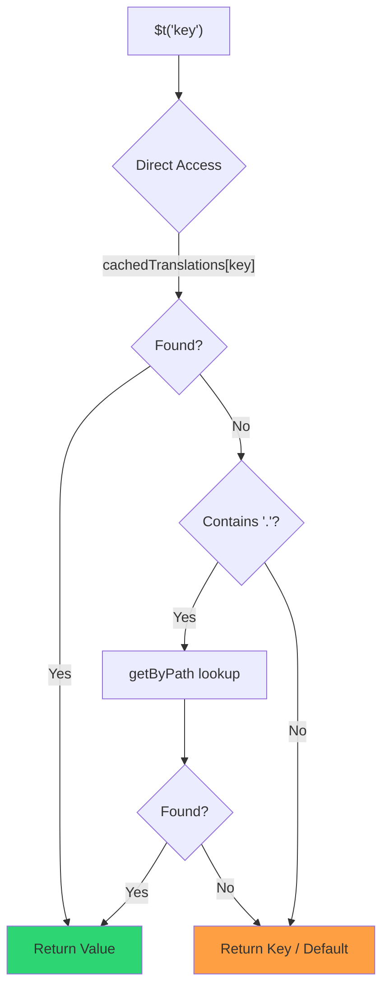

# 🚀 Performance Guide

## 📖 Introduction

`Nuxt I18n Micro` is designed with performance in mind, offering a significant improvement over traditional internationalization (i18n) modules like `nuxt-i18n`. This guide provides an in-depth look at the performance benefits of using `Nuxt I18n Micro`, and how it compares to other solutions.

## 🤔 Why Focus on Performance?

In large-scale projects and high-traffic environments, performance bottlenecks can lead to slow build times, increased memory usage, and poor server response times. These issues become more pronounced with complex i18n setups involving large translation files. `Nuxt I18n Micro` was built to address these challenges head-on by optimizing for speed, memory efficiency, and minimal impact on your application's bundle size.

## 📊 Performance Comparison

We conducted a series of tests on identical fixtures via `pnpm test:performance` (`pnpm -C scripts cli performance`) against **`@nuxtjs/i18n@10.6.0`**. Full methodology and charts: [Performance Test Results](/guide/performance-results).

Default CLI profile: **4 locales** × **2 pages** (`index`, `page`) × ~10k index leaf keys. Raise `--locales` / `--keys` for a heavier regression-radar load. The report splits **code**, **translations** (including `@nuxtjs/i18n` `chunks/raw/*`), and **total** deployable output.

```bash
pnpm test:performance
pnpm -C scripts cli performance --only micro --skip-stress
pnpm -C scripts cli performance --locales 12 --keys 100000 --runs 3
```

### ⏱️ Build Time and Resource Consumption

::: details **@nuxtjs/i18n v10.6**

* **Code Bundle**: 2.16 MB
* **Translations**: 7.21 MB (message chunks + locale payloads)
* **Total deployable**: 9.37 MB
* **Max Memory Usage**: 1,821 MB
* **Elapsed Time**: 8.34s (mean of 3)
  :::

::: tip **Nuxt I18n Micro**

* **Code Bundle**: 1.74 MB — **~19% smaller code than `@nuxtjs/i18n` v10.6**
* **Translations**: 6.8 MB (lazy-loaded JSON)
* **Total deployable**: 8.54 MB
* **Max Memory Usage**: 1,065 MB — **~41% less memory than `@nuxtjs/i18n` v10.6**
* **Elapsed Time**: 5.34s — **~36% faster than `@nuxtjs/i18n` v10.6** (≈ plain-nuxt baseline)
  :::

> Older docs that showed `@nuxtjs/i18n` “code ≈ 15 MB / translations 0 B” counted `chunks/raw` message files as app code. The current classifier separates them; the gap on **code** is smaller, and micro still leads on build time, peak RSS, and load tests.

See the [full benchmark report](/guide/performance-results) for charts, Autocannon results, and fixture details.

### 🌐 Server Performance Under Load

Artillery (6s@6 + 60s@60) and Autocannon (10c / 10s), mean of 3 consecutive runs per fixture.

::: details **@nuxtjs/i18n v10.6**

* **Requests per Second (Artillery)**: 143 \[#/sec]
* **Average Response Time**: 956 ms
* **Autocannon RPS / avg latency**: 72 / 139 ms
  :::

::: tip **Nuxt I18n Micro**

* **Requests per Second (Artillery)**: 275 \[#/sec] — **~93% more than `@nuxtjs/i18n` v10.6**
* **Average Response Time**: 483 ms — **~49% faster than `@nuxtjs/i18n` v10.6**
* **Autocannon RPS / avg latency**: 162 / 62 ms
  :::

### 📈 Visual Comparison

```chart
type: doughnut
data:
  labels: ["@nuxtjs/i18n v10.6 (1,821 MB)", "i18n-micro (1,065 MB)"]
  datasets:
    - data: [1821, 1065]
      backgroundColor: ["rgba(255, 99, 132, 0.8)", "rgba(46, 204, 113, 0.8)"]
      borderColor: ["rgb(255, 99, 132)", "rgb(46, 204, 113)"]
      borderWidth: 2
options:
  plugins:
    title:
      display: true
      text: Peak RSS During Build (MB)
      font:
        size: 16
    legend:
      position: bottom
```

```chart
type: bar
data:
  labels: ["Build Time (s)", "Peak RSS (GB)", "Code Bundle (MB)", "Artillery RPS"]
  datasets:
    - label: "@nuxtjs/i18n v10.6"
      data: [8.3, 1.8, 2.2, 143]
      backgroundColor: "rgba(255, 99, 132, 0.8)"
      borderColor: "rgb(255, 99, 132)"
      borderWidth: 2
    - label: i18n-micro
      data: [5.3, 1.1, 1.7, 275]
      backgroundColor: "rgba(46, 204, 113, 0.8)"
      borderColor: "rgb(46, 204, 113)"
      borderWidth: 2
options:
  plugins:
    title:
      display: true
      text: Performance Metrics Comparison
      font:
        size: 16
    legend:
      position: bottom
  scales:
    y:
      beginAtZero: true
```

| Metric          | @nuxtjs/i18n v10.6 | i18n-micro | Improvement        |
| --------------- | ------------------ | ---------- | ------------------ |
| Build Time      | 8.34s              | 5.34s      | **~36% faster**    |
| Memory (build)  | 1,821 MB           | 1,065 MB   | **~41% less**      |
| Code Bundle     | 2.16 MB            | 1.74 MB    | **~19% smaller**   |
| Response Time   | 956 ms             | 483 ms     | **~49% faster**    |
| RPS (Artillery) | 143                | 275        | **~93% more**      |

### 🔍 Interpretation of Results

Against current `@nuxtjs/i18n` **v10.6** (default CLI profile, mean of 3):

* 🗜️ **Smaller code graph**: ~1.74 MB vs ~2.16 MB once message chunks are not mis-labeled as “code”.
* 🧠 **Lower build RSS**: ~1.1 GB peak vs ~1.8 GB.
* 🕒 **Faster builds**: ~5.3s vs ~8.3s (micro matches the plain-Nuxt baseline on this profile).
* ⚡ **Much better under load**: ~275 vs ~143 Artillery RPS, ~162 vs ~72 Autocannon RPS, lower average latency.

Absolute numbers differ from older published tables (smaller dictionaries, older Nuxt, and an unfair “0 B translations” split for `@nuxtjs/i18n`). Directionally the same: micro stays ahead on build cost and request throughput.

## ⚙️ Key Optimizations

### 🛠️ Minimalist Design

`Nuxt I18n Micro` is built around a minimalist architecture with a small core and dedicated strategy packages. This reduces overhead and simplifies the internal logic, leading to improved performance.

### 🚦 Efficient Routing

In v3, route generation and runtime path logic are split into dedicated packages for optimal tree-shaking:

* **`@i18n-micro/route-strategy`** — Build-time route generation: extends Nuxt pages with localized routes. Only the selected strategy (`no_prefix`, `prefix`, `prefix_except_default`, `prefix_and_default`) is included.
* **`@i18n-micro/path-strategy`** — Runtime path resolution, redirects, and link generation. Uses pure functions and pre-computed context flags to minimize allocations on hot paths. Subpath exports (`/prefix`, `/no-prefix`, etc.) ensure only the chosen implementation is bundled.

This approach keeps the routing configuration lightweight and ensures fast route resolution regardless of the number of locales.

### 📂 Streamlined Translation Loading

The module supports only JSON files for translations, with a clear separation between global and page-specific files. This ensures that only the necessary translation data is loaded at any given time, further enhancing performance.

### 🔒 GlobalThis Singleton Cache

Starting from v3.0.0, the module uses a `globalThis` singleton pattern with `Symbol.for` to guarantee a single cache instance across the entire Node.js process. This prevents:

* Cache duplication when the same module is bundled multiple times
* Per-request object recreation that causes garbage collection pressure
* Memory leaks from orphaned cache instances

```mermaid
flowchart LR
    subgraph Process["Node.js Process"]
        G["globalThis[Symbol.for('CACHE')]"]

        subgraph R1["SSR Request 1"]
            P1[Plugin Instance] --> G
        end

        subgraph R2["SSR Request 2"]
            P2[Plugin Instance] --> G
        end

        subgraph R3["SSR Request 3"]
            P3[Plugin Instance] --> G
        end
    end

    G --> Cache["Single Map Instance"]
    Cache --> D1["en:index → translations"]
    Cache --> D2["en:about → translations"
```

```typescript
// Internal implementation pattern
const CACHE_KEY = Symbol.for('__NUXT_I18N_STORAGE_CACHE__')
if (!globalThis[CACHE_KEY]) {
  globalThis[CACHE_KEY] = new Map()
}
```

### ⚡ Optimized Translation Function (tFast)

The `$t()` function uses a direct lookup strategy optimized for speed:

1. **Pre-computed context**: Locale and route name are calculated once during navigation, not on every `$t()` call
2. **Single-source lookup**: All translations (root + page-specific + fallback) are pre-merged at build time into a single file per page — no layered search needed
3. **Cumulative deep merge on navigation**: When navigating within the same locale, new page translations are deep-merged (2-level depth) into the active dictionary, so keys from the previous page remain visible during transition animations — even when pages share overlapping nested prefixes (e.g., both pages have keys under `common.*`)
4. **Garbage collection via `page:transition:finish`**: After the transition animation is fully complete, the merged dictionary is replaced with the clean translations for the new page only, freeing memory from old-page keys
5. **Direct property access**: Uses `obj[key]` instead of Map lookups for hot paths



```typescript
// Simplified lookup logic — single active dictionary
let val = cachedTranslations[key]
if (val === undefined && key.includes('.')) {
  val = getByPath(cachedTranslations, key)
}
```

### 💉 Server-side load (no HTML embed)

Translations loaded during SSR stay in **server memory** for `$t` during render. They are **not** copied into `nuxtApp.payload` / the HTML document (same idea as `@nuxtjs/i18n` with `experimental.preload: false`).

On the client, `01.plugin.ts` `await`s `switchContext`, which loads `/{apiBaseUrl}/:page/:locale/data.json` before the app continues — one request, not an 8 MB inline blob.

`NuxtI18n` still keeps the active merged dictionary (`cachedTranslations`) for `$t()` / `$has()`. Same-locale navigations deep-merge page chunks until `page:transition:finish` cleans up stale keys.

#### Where it stands today

The numbers below are read from the budget file `pnpm run budget:payload` measures and enforces.

Measured on `playground` across `/`, `/de`:

| Measurement | Size |
| --- | --- |
| Translation sources on disk | 15.2 MB |
| Served as separate payload files | 76.3 MB |
| Largest inline `__NUXT_DATA__` | 6.9 MB |
| Client assets | 449.5 KB |

The playground carries a deliberately oversized dictionary, so these are not figures to expect from a real
application — they are a fixed point to measure against. The budget fails when they grow unexpectedly,
which is how an accidental change to what the payload carries gets noticed.

### 💾 Caching and Pre-rendering

Translations pass through several caches, and knowing which one answered a request is the
difference between a five-minute and a five-hour debugging session. There are four, in the
order a request meets them:

| Layer | Where | Lifetime | Cleared by |
| --- | --- | --- | --- |
| Browser / CDN | `Cache-Control` on `/{apiBaseUrl}/**` | `httpCacheDuration`, `immutable` | a new `?v=` — i.e. a deploy that changed translations |
| Nitro route cache | `routeRules['/{apiBaseUrl}/**'].cache` | 60 s, stale-while-revalidate | server restart |
| Server loader | in-process `CacheControl`, keyed `locale:routeName` | process lifetime, or `cacheTtl` | server restart, HMR in dev |
| Client store | `translationStorage` + the active chunk in `NuxtI18n` | page lifetime | reload |

Two rules keep them from contradicting each other:

* **The Nitro route cache exists only when `?v=` does.** With a cache-buster each URL is
  unique to its content, so caching it server-side is free of staleness. Set
  `dateBuild: 0` and that layer is switched off, because the URL is then stable and the
  response says `must-revalidate` — a server-side cache would answer from a stale entry
  for up to a minute and quietly defeat it.
* **`immutable` also requires `?v=`.** Without a buster the header is
  `public, max-age=0, must-revalidate`, whatever `httpCacheDuration` says: a long
  `max-age` on a URL that never changes pins the first response a browser ever saw.

::: warning Static hosting bypasses the first two layers
With `translationPayloads.publicAssets` (default in premerged mode) payloads are copied to
`public/<apiBaseUrl>/{page}/{locale}/data.json`. A platform that serves that directory itself
(Cloudflare Pages, Firebase Hosting, `npx serve`) applies its own headers — the Nitro
`routeRules` header only reaches responses that go through the server. Set cache policy for
those static files in the platform's own configuration.
:::

🏁 **Pre-rendering**: in premerged mode, `publicAssets` already writes the client URL tree into
`public/`. Opt into `prerenderRoutes` only if you need Nitro to materialize handler routes when
that copy is disabled.

### 🗜️ Compressed Public Payloads

When `nitro.compressPublicAssets` is enabled, the translation payloads copied into the public
directory get `.gz` and `.br` siblings too:

```ts
export default defineNuxtConfig({
  nitro: { compressPublicAssets: true },
})
```

Nitro compresses public assets before the hook that copies the payloads, so without this they would
be the one uncompressed part of a static build. The module does not turn compression on by itself —
it only applies the setting you chose. Per-encoding selection (`{ gzip: true, brotli: false }`) is
respected.

Playground index payload: 6 651 984 B raw, 1 012 831 B gzip, 821 617 B brotli.

### ☁️ Serverless Payload Output

On **Node**, SSR reads translation JSON from `public/<apiBaseUrl>` (`readFile`, no Nitro `serverAssets` / Rollup `raw:`). On **Edge**, Nitro `serverAssets` embeds the same tree (prefer `mode: 'source'` for large catalogs).

```typescript
export default defineNuxtConfig({
  i18n: {
    translationPayloads: {
      serverAssets: true, // default — Node → public copy; Edge → serverAssets embed
      publicAssets: true, // default in premerged mode
    },
  },
})
```

Use `translationPayloads.mode: 'source'` for compact Edge embeds (and optional compact public copies):

```typescript
export default defineNuxtConfig({
  i18n: {
    translationPayloads: {
      mode: 'source',
    },
  },
})
```

`mode: 'source'` keeps layer-merged source files compact and merges root/page/fallback at runtime through the built-in `/_locales` route (or Edge `assets:i18n`). By default it disables public asset copies and prerendered payload routes.

::: warning Static hosting / pure SSG
`prerenderRoutes` defaults to `false`. With `mode: 'source'`, `publicAssets` also defaults to `false`. Pure static hosting without a Nitro/edge runtime therefore cannot load translations on the client unless you enable one of these outputs, keep `serverHandler` available at runtime, or host payloads externally.

Default premerged + `publicAssets` already places `/{apiBaseUrl}/{page}/{locale}/data.json` under `public/`, so static hosts can serve client fetches without Nitro.
:::

::: warning External CDN hosts
Setting `apiBaseServerHost` or `apiBaseClientHost` moves payload serving to that origin, which comes with its own requirements — see [Configuration → External CDN hosts](/guide/configuration#external-cdn-hosts).
:::

Or disable individual HTTP/public outputs and host payloads externally:

```typescript
export default defineNuxtConfig({
  i18n: {
    apiBaseClientHost: 'https://cdn.example.com',
    apiBaseServerHost: 'https://cdn.example.com',
    translationPayloads: {
      serverHandler: false,
      publicAssets: false,
      prerenderRoutes: false,
    },
  },
})
```

Keep `serverHandler` enabled when you rely on the built-in local `/{apiBaseUrl}/:page/:locale/data.json` route. Disable it when payloads are hosted externally and `apiBaseServerHost` points at that external origin. Enable `prerenderRoutes` only when you need Nitro to materialize static payload routes and `publicAssets` did not already write them.

During build, the module warns when generated payload output exceeds `translationPayloads.warnFileCount` (default 500) or `translationPayloads.warnSizeBytes` (default 10 MB). It also warns when all local outputs are disabled without external payload hosts configured.

## 📝 Tips for Maximizing Performance

Here are a few tips to ensure you get the best performance out of `Nuxt I18n Micro`:

* 📉 **Limit Locale Data**: Only include the locales you need in your project to keep the bundle size small.
* 🗂️ **Use Page-Specific Translations**: Organize your translation files by page to avoid loading unnecessary data.
* 💾 **Enable Caching**: Make use of the caching features to reduce server load and improve response times.
* 🏁 **Leverage Pre-rendering**: Pre-render your translations to speed up page loads and reduce runtime overhead.

For detailed results of the performance tests, please refer to the [Performance Test Results](/guide/performance-results).
