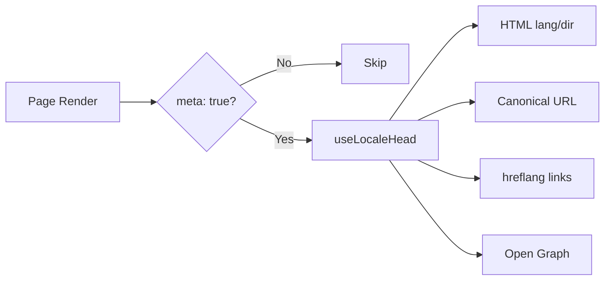

# 🌐 SEO Guide for Nuxt I18n Micro

## 📖 Introduction

Effective SEO (Search Engine Optimization) is essential for ensuring that your multilingual site is accessible and visible to users worldwide through search engines. `Nuxt I18n Micro` simplifies the process of managing SEO for multilingual sites by automatically generating essential meta tags and attributes that inform search engines about the structure and content of your site.

This guide explains how `Nuxt I18n Micro` handles SEO to enhance your site's visibility and user experience without requiring additional configuration.

## ⚙️ Automatic SEO Handling

### SEO Meta Generation Flow



**Generated tags:**

| Tag             | Example                                                  |
| --------------- | -------------------------------------------------------- |
| HTML attributes | `<html lang="en" dir="ltr">`                             |
| Canonical       | `<link rel="canonical" href="...">`                      |
| hreflang        | `<link rel="alternate" hreflang="en" href="...">`        |
| x-default       | `<link rel="alternate" hreflang="x-default" href="...">` |
| Open Graph      | `<meta property="og:locale" content="en_US">`            |

#### `og` per locale (`og:locale` vs BCP 47)

`<html lang>` and `hreflang` use **BCP 47** via `locale.iso` (e.g. `ar-AE`).\
Open Graph requires **`language_TERRITORY`** with an **underscore** (`ar_AE`), per the [OG protocol](https://ogp.me/).

By default, `og:locale` is derived from `iso` when the mapping is unambiguous (`en-US` → `en_US`).\
Set an explicit **`og`** string when you need a custom value (e.g. `zh-Hans` → `zh_CN`).\
If neither `og` nor a convertible `iso` is available, `og:locale` tags are not generated — in development you get a console warning (respects `missingWarn`).

```typescript
i18n: {
  meta: true,
  locales: [
    { code: 'ar', iso: 'ar-AE', og: 'ar_AE', dir: 'rtl' },
    { code: 'en', iso: 'en-US' }, // og:locale → en_US
    { code: 'zh', iso: 'zh-Hans', og: 'zh_CN' }, // script tags need explicit og
  ],
}
```

### 🔑 Key SEO Features

When the `meta` option is enabled in `Nuxt I18n Micro`, the module automatically manages the following SEO aspects:

1. **🌍 Language and Direction Attributes**:
   * The module sets the `lang` and `dir` attributes on the `<html>` tag according to the current locale and text direction (e.g., `ltr` for English or `rtl` for Arabic).

2. **🔗 Canonical URLs**:
   * The module generates a canonical link (`<link rel="canonical">`) for each page, ensuring that search engines recognize the primary version of the content.

3. **🌐 Alternate Language Links (`hreflang`)**:
   * The module automatically generates `<link rel="alternate" hreflang="">` tags for all available locales. This helps search engines understand which language versions of your content are available, improving the user experience for global audiences.
   * Each locale emits **one** tag: `hreflang = iso || code`. When `iso` is set, routing `code` is never used as `hreflang` (so market keys like `mx` do not become invalid language tags).
   * Optional `hreflangBaseLanguage: true` also emits a bare-language tag derived from `iso` (e.g. `es-ES` → `es`), claimed by the first regional locale in `locales`.

4. **🌏 `x-default` Hreflang**:
   * The module automatically generates a `<link rel="alternate" hreflang="x-default">` tag pointing to the default locale's URL. This tells search engines which URL to show users whose language doesn't match any of the defined locales. No additional configuration is required — it works automatically when `meta: true` is set.

5. **🔖 Open Graph Metadata**:
   * The module generates Open Graph meta tags (`og:locale`, `og:url`, etc.) for each locale, which is particularly useful for social media sharing and search engine indexing.

### 🛠️ Configuration

To enable these SEO features, ensure the `meta` option is set to `true` in your `nuxt.config.ts` file:

```typescript
export default defineNuxtConfig({
  modules: ['nuxt-i18n-micro'],
  i18n: {
    locales: [
      { code: 'en', iso: 'en-US', dir: 'ltr' },
      { code: 'fr', iso: 'fr-FR', dir: 'ltr' },
      { code: 'ar', iso: 'ar-SA', dir: 'rtl' },
    ],
    defaultLocale: 'en',
    translationDir: 'locales',
    meta: true, // Enables automatic SEO management
  },
})
```

### 🌍 Dynamic `metaBaseUrl` for Multi-Domain Deployments

When `metaBaseUrl` is unset, absolute SEO URLs resolve in this order (#240):

1. `site.url` from [`nuxt-site-config`](https://nuxtseo.com/docs/site-config) (if that module is present — e.g. via `@nuxtjs/seo`)
2. Otherwise the hostname from the current request (`useRequestURL()` / `window.location.origin`)

The request-origin fallback respects reverse-proxy headers (`X-Forwarded-Host`, `X-Forwarded-Proto`), so it works correctly behind nginx, Cloudflare, AWS ALB, and similar proxies.

That means apps already setting `site.url` for sitemap / robots / schema.org do **not** need a second `metaBaseUrl` declaration:

```typescript
export default defineNuxtConfig({
  site: {
    url: process.env.NUXT_SITE_URL, // also used by micro for canonical / og:url / hreflang
  },
  i18n: {
    meta: true,
    // metaBaseUrl omitted — picks up site.url, then request origin
  },
})
```

Without `site.url`, a single application instance can still serve **multiple domains** with correct SEO tags for each via the request origin:

```typescript
export default defineNuxtConfig({
  i18n: {
    meta: true,
    // metaBaseUrl is undefined by default — resolved dynamically from the request
  },
})
```

For example, a request to `https://site-a.com/en/about` will produce:

```html
<link rel="canonical" href="https://site-a.com/en/about" /> <meta property="og:url" content="https://site-a.com/en/about" />
```

While the same app serving `https://site-b.com/en/about` will produce:

```html
<link rel="canonical" href="https://site-b.com/en/about" /> <meta property="og:url" content="https://site-b.com/en/about" />
```

If you need a fixed base URL that always wins over `site.url`, pass a static string:

```typescript
metaBaseUrl: 'https://example.com'
```

### 🔍 Canonical Query Whitelist

By default, query parameters are stripped from canonical and `og:url` to avoid duplicate content. You can whitelist specific query parameters that should be preserved:

```typescript
i18n: {
  canonicalQueryWhitelist: ['page', 'sort', 'filter', 'search', 'q', 'query', 'tag']
}
```

Only parameters listed in `canonicalQueryWhitelist` will appear in canonical URLs. All other query parameters (e.g. tracking, session IDs) are removed.

### 🚫 Disabling Meta Tags Per Page

You can disable SEO meta tag generation for specific pages using `defineI18nRoute()`:

```vue
<script setup>
// Disable all SEO meta tags for this page
defineI18nRoute({
  disableMeta: true,
})
</script>
```

You can also disable meta only for specific locales:

```vue
<script setup>
// Disable meta tags only for English locale on this page
defineI18nRoute({
  disableMeta: ['en'],
})
</script>
```

When `disableMeta` is active, no `hreflang`, `canonical`, `og:locale`, `og:url`, or `x-default` tags are generated for the affected page/locale.

### 🔇 Disabled Locales

Locales with `disabled: true` are automatically excluded from all SEO tag generation — no `hreflang`, `og:locale:alternate`, or alternate links are created for them:

```typescript
i18n: {
  locales: [
    { code: 'en', iso: 'en-US' },
    { code: 'fr', iso: 'fr-FR', disabled: true }, // excluded from SEO tags
  ]
}
```

### 🙈 Opt-out locales (`seo: false`)

For locales that should remain routable and translated but should not appear in cross-locale discovery tags, set `seo: false`. Those locales are omitted from `hreflang` alternates and `og:locale:alternate`. If your configured **default** locale has `seo: false`, the `x-default` link is not emitted either.

```typescript
i18n: {
  locales: [
    { code: 'en', iso: 'en-US' },
    { code: 'ru', iso: 'ru-RU', seo: false }, // internal / non-indexed locale
  ]
}
```

### 📌 Strategy-Specific Behavior

| Strategy                | hreflang links   | x-default             | canonical      | og:url |
| ----------------------- | ---------------- | --------------------- | -------------- | ------ |
| `prefix`                | ✅ All locales   | ✅ Default locale URL | ✅ Current URL | ✅     |
| `prefix_except_default` | ✅ All locales   | ✅ Unprefixed URL     | ✅ Current URL | ✅     |
| `prefix_and_default`    | ✅ All locales   | ✅ Default locale URL | ✅ Current URL | ✅     |
| `no_prefix`             | ❌ Not generated | ❌ Not generated      | ✅ Current URL | ✅     |

For the `no_prefix` strategy, only `canonical`, `og:url`, `og:locale`, and `html` attributes (`lang`, `dir`) are generated. Alternate language links (`hreflang`) and `x-default` are not generated because there are no distinct URLs per locale.

## Page-level overrides (`useI18nHead`)

For **articles, guides, or any CMS content** where not every locale exists or URLs come from an API, use [`useI18nHead`](/composables/useI18nHead) on the page instead of a custom i18n head plugin.

### Article with partial translations

```vue
<script setup lang="ts">
const article = await loadArticle()
// article.locales = { en: '...', de: '...' } — only translated locales

useI18nHead({
  meta: [{ property: 'og:title', content: article.title }],
  replace: {
    hreflang: Object.entries(article.locales).map(([locale, href]) => ({
      rel: 'alternate',
      hreflang: locale,
      href,
    })),
    ogAlternates: Object.keys(article.locales),
  },
})
</script>
```

### Per-locale slugs with `$setI18nRouteParams`

When slugs differ per language, set route params first, then override alternates with real URLs:

```vue
<script setup lang="ts">
const { $defineI18nRoute, $setI18nRouteParams } = useNuxtApp()
const { data: article } = await useFetch(`/api/articles/${slug}`)

$defineI18nRoute({
  localeRoutes: { en: '/blog/[slug]', de: '/de/blog/[slug]' },
})

$setI18nRouteParams({
  en: { slug: article.value.slugEn },
  de: { slug: article.value.slugDe },
})

useI18nHead({
  replace: {
    hreflang: ['en', 'de'].map((locale) => ({
      rel: 'alternate',
      hreflang: locale,
      href: article.value.urls[locale],
    })),
    ogAlternates: ['en', 'de'],
  },
})
</script>
```

### HTTPS origin behind a proxy

For correct absolute URLs on SSR without a custom origin composable:

```ts
i18n: {
  meta: true,
  metaBaseUrl: undefined,
  metaTrustForwardedHost: true,
  metaTrustForwardedProto: true,
}
```

More examples (canonical override, `x-default`, reactive fetch, shared helpers): [useI18nHead composable](/composables/useI18nHead).

### ⚠️ Trailing Slash

The module generates canonical and `hreflang` URLs based on the actual path from `useRoute().fullPath`. If your application uses trailing slashes (e.g., via Nuxt's `router.options`), the generated URLs will reflect this. However, `$switchLocalePath` may normalize paths and remove trailing slashes. If trailing slash consistency is critical for your SEO, verify the generated URLs match your application's URL structure.

### 🎯 Benefits

By enabling the `meta` option, you benefit from:

* **📈 Improved Search Engine Rankings**: Search engines can better index your site, understanding the relationships between different language versions.
* **👥 Better User Experience**: Users are served the correct language version based on their preferences, leading to a more personalized experience.
* **🔧 Reduced Manual Configuration**: The module handles SEO tasks automatically, freeing you from the need to manually add SEO-related meta tags and attributes.

## 🔗 Nuxt SEO (`@nuxtjs/seo`)

[`@nuxtjs/seo`](https://nuxtseo.com/) bundles sitemap, robots, schema.org, OG images, and related modules. It integrates with **nuxt-i18n-micro** through [`nuxt-site-config`](https://nuxtseo.com/docs/site-config/guides/i18n) (v4+).

### Requirements

* **`@nuxtjs/seo` 3+** (current releases use `nuxt-site-config` 4+, which registers the `nuxt-site-config:i18n` plugin for micro)
* **`i18n.meta: true`** (recommended — micro supplies locale-aware head tags; Nuxt SEO adds sitemap, schema.org, etc.)

### Module order

List **nuxt-i18n-micro before `@nuxtjs/seo`** so site config can read your locale setup:

```typescript
export default defineNuxtConfig({
  modules: ['nuxt-i18n-micro', '@nuxtjs/seo'],
  site: {
    url: 'https://example.com',
    name: 'My Site',
  },
  i18n: {
    meta: true,
    defaultLocale: 'en',
    locales: [
      { code: 'en', iso: 'en-US' },
      { code: 'de', iso: 'de-DE' },
    ],
  },
})
```

### Translated site name & description

Nuxt Site Config reads optional translation keys from your locale files:

```json
{
  "nuxtSiteConfig": {
    "name": "My Site",
    "description": "My site description"
  }
}
```

Per-locale values in `locales/en.json`, `locales/de.json`, etc. are picked up automatically.

### Troubleshooting

If you see `Plugin nuxt-seo:defaults depends on nuxt-site-config:i18n but they are not registered`, upgrade **`@nuxtjs/seo` to 3+** (see [issue #133](https://github.com/s00d/nuxt-i18n-micro/issues/133)). Older `nuxt-site-config` 3.x only wired i18n for `@nuxtjs/i18n`, not micro.

More: [Sitemap i18n guide](https://nuxtseo.com/docs/sitemap/guides/i18n), [Site Config i18n guide](https://nuxtseo.com/docs/site-config/guides/i18n).
